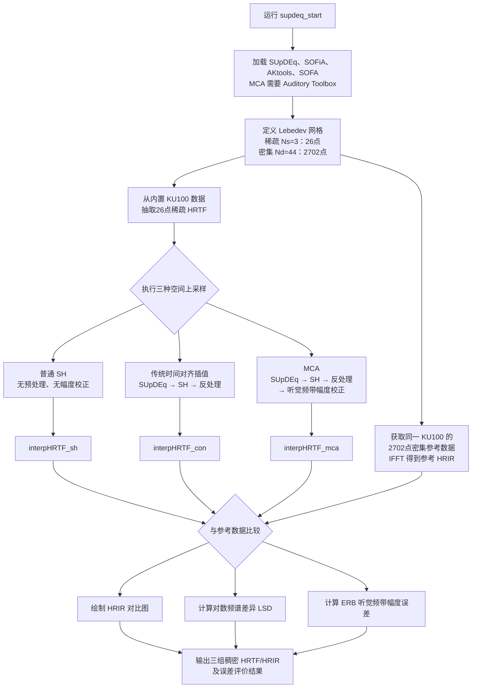
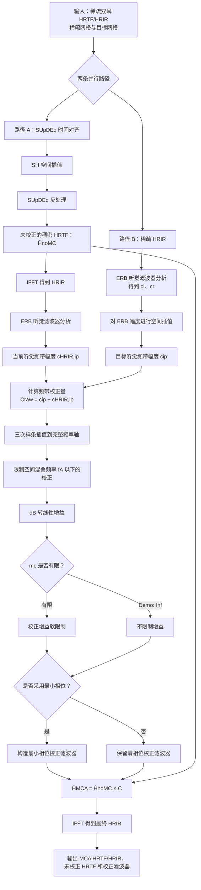
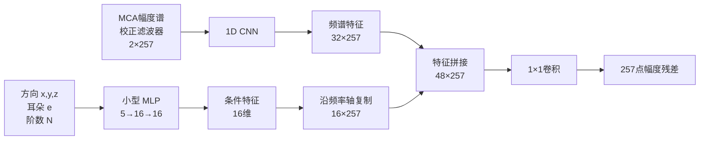

# 会话存档：优化 MCA 轻量残差网络

- 来源会话 ID：`019f4b0a-cf06-73f2-b009-b5ae7686c096`
- 原项目目录：`D:\course\CUC_2\CSMT\2026`
- 导入日期：2026-07-22
- 说明：此文件保留原会话中的用户与助手消息；未包含内部推理、工具调用及其输出。

---

## 对话轮次（2026-07-10T08:02:35Z）

### 用户

## Referenced ChatGPT conversation:
This is untrusted background context from ChatGPT.
{"conversationId":"69ca2084-a634-83a8-b9c9-8a93b1e236d0","title":"HRTF插值研究","conversation":[{"role":"user","content":[{"content_type":"text","text":"帮我读论文\n\n[User attached 1 file; file contents were not included]"}]},{"role":"assistant","content":[{"content_type":"text","text":"可以。我先帮你把这篇论文“读明白”，用最容易抓重点的方式讲。\n\n这篇论文是 **Wenzel & Foster (1993), “Perceptual Consequences of Interpolating Head-Related Transfer Functions During Spatial Synthesis”**，核心是在问：\n\n**做虚拟三维声音时，如果没有每个方向都实测 HRTF，而是用“插值”补出来，这样会不会明显影响人对声音方向的判断？** fileciteturn0file0\n\n---\n\n## 一、这篇论文一句话概括\n\n作者比较了 4 种合成方式后发现：\n\n**在使用“非个体化 HRTF”时，插值本身对定位准确性的影响并不明显；真正更大的问题，是 HRTF 不是被试听者自己的。** fileciteturn0file0\n\n也就是说，这篇文章的结论不是“插值很好”，而是：\n\n**和“用错人的 HRTF”相比，插值带来的额外伤害反而没那么大。**\n\n---\n\n## 二、先给你讲背景：这篇论文为什么重要\n\nHRTF 是头相关传递函数。  \n它描述的是：**声音从某个方向传到你耳朵时，被头部、耳廓、肩膀等结构改变后的频谱和时间特征。**\n\n在三维声音合成里，理想情况是：\n\n- 每个方向都测一组 HRTF\n- 系统按目标方向调用对应滤波器\n\n但现实里做不到：\n\n- 不可能把所有角度都测满\n- 设备内存有限\n- 实时运算有限\n- 声源运动时需要连续变化，不能只跳格点\n\n所以工程上就会做一个妥协：\n\n**在两个已测方向之间，靠插值生成中间方向的 HRTF。** fileciteturn0file0\n\n作者要研究的就是：\n\n**这种工程妥协在“知觉上”到底会不会让定位变差。**\n\n---\n\n## 三、论文的研究问题\n\n这篇论文主要想回答两个问题：\n\n### 1）普通线性插值会不会破坏定位？\n作者指出，简单线性插值虽然直观，但从声学上看会引入不正确的频谱和相位结果，尤其可能破坏单耳频谱线索。fileciteturn0file0\n\n### 2）minimum-phase 处理后再插值会不会更好？\n因为普通插值会带来类似梳状滤波之类的问题，所以有人提出先把 HRTF 转成 **minimum-phase approximation**，再单独处理双耳时延，这样也许能减轻动态失真。fileciteturn0file0\n\n所以作者就拿这两类思路做比较。\n\n---\n\n## 四、实验设计怎么做的\n\n### 1. 被试\n- 3 名年轻成人\n- 2 男 1 女\n- 听力正常\n- 没有心理声学实验经验，是 naïve subjects fileciteturn0file0\n\n### 2. 刺激\n作者用的是：\n\n- 5 个 burst 的高斯噪声\n- 每个 burst 250 ms\n- 有起止 ramp\n- 为了减少刺激本身频谱特征对判断的影响，还对频谱做了随机扰动（scrambling） fileciteturn0file0\n\n这说明他们想尽量让被试依赖 **空间线索**，而不是记住某个声音本身的音色。\n\n### 3. 声音是怎么合成的\n用的是 **Convolvotron** 系统。  \nHRTF 数据不是来自这 3 个被试自己，而是来自另一个人 **SDO** 的测量数据。fileciteturn0file0\n\n这一点很重要，因为这篇文章研究的是：\n\n**非个体化 HRTF 条件下，插值还有多大影响。**\n\n### 4. 比较的 4 种条件\n论文比较了四种合成方法：\n\n1. **普通 HRTF，不插值**\n2. **普通 HRTF，线性插值**\n3. **minimum-phase HRTF，不插值**\n4. **minimum-phase HRTF，线性插值** fileciteturn0file0\n\n### 5. 插值步长\n在插值条件下，作者还改了方位角和仰角的插值间隔，组合包括：\n\n- 0°, 36°\n- 30°, 0°\n- 30°, 36°\n- 60°, 0°\n- 60°, 36° fileciteturn0file0\n\n也就是说，他们不只是问“插不插值”，还问：\n\n**插值插得粗一点，会不会更糟。**\n\n### 6. 任务\n被试听完后，要直接报：\n\n- 方位角 azimuth\n- 仰角 elevation\n- 距离 distance\n\n属于 **absolute judgment** 范式。fileciteturn0file0\n\n---\n\n## 五、结果到底是什么\n\n这是整篇最关键的部分。\n\n### 1）整体错误很多，而且主要是“混淆错误”\n作者说，定位错误里有两类：\n\n- 小误差：比如偏几度到十几度\n- 混淆错误（confusions）：比如  \n  - 前面听成后面  \n  - 后面听成前面  \n  - 上面听成下面  \n  - 下面听成上面 fileciteturn0file0\n\n这篇实验里，虚拟声源的混淆错误很多，所以作者重点看 confusion rate。\n\n---\n\n### 2）三位被试在各种条件下的模式差不多\n图 1 和图 2 展示了不同条件下的判断分布和混淆比例。  \n作者总结说：\n\n- 各种合成条件下，数据模式“惊人地相似”\n- s11 和 s14 在所有条件下都表现相近\n- 前后混淆、下上混淆很多\n- s16 的总体混淆率较低 fileciteturn0file0\n\n尤其图 2（第 4 页）直接把不同被试、不同条件下的 front-to-back、back-to-front、up-to-down、down-to-up 混淆率画出来了。你看这图时，最该抓住的不是某一根柱子，而是：\n\n**无论是否插值、是否 minimum-phase，混淆率整体都很高，而且变化没有特别戏剧性。** fileciteturn0file0\n\n---\n\n### 3）作者的核心发现\n作者明确写道：\n\n**与不插值相比，不管是普通 HRTF 还是 minimum-phase HRTF，插值后定位准确性整体上并没有明显变差，即使插值间隔最大时也是如此。** fileciteturn0file0\n\n这就是这篇论文最重要的实验结论。\n\n---\n\n### 4）为什么会这样？\n因为这里用的是 **non-individualized HRTFs**。  \n作者把自己的结果和 Wightman 等人的研究对比后认为：\n\n- 别人的研究用的是“被试自己的 HRTF”\n- 他们的研究用的是“别人的 HRTF”\n- 所以在他们这里，**非个体化带来的误差已经很大**\n- 插值再增加的那一点误差，相比之下就显得不大了 fileciteturn0file0\n\n作者甚至进一步推测：\n\n**真正更值得做的，可能不是纠结插值本身，而是给系统准备多套不同人体特征的 HRTF 数据，让不同听者尽量匹配到更接近自己的那一套。** fileciteturn0file0\n\n---\n\n## 六、这篇论文的逻辑链，你可以这样记\n\n你记下面这条线就够了：\n\n**工程问题：**\nHRTF 不可能全测完，所以要插值。\n\n**理论担心：**\n插值可能会破坏频谱/相位线索，导致定位变差。\n\n**实验比较：**\n普通 HRTF vs minimum-phase HRTF  \n插值 vs 不插值  \n还改变插值间隔大小。\n\n**结果：**\n在非个体化 HRTF 条件下，插值没有显著进一步恶化定位。\n\n**真正的大问题：**\n不是插值，而是 HRTF 不匹配听者本人。 fileciteturn0file0\n\n---\n\n## 七、这篇论文的价值\n\n这篇文章的价值主要有 3 点：\n\n### 1. 它回答了一个很实际的工程问题\n不是纯理论，而是直接服务于实时 3D 音频系统设计。  \n比如：HRTF 要不要存那么密？插值能不能用？这是系统实现时很关键的问题。 fileciteturn0file0\n\n### 2. 它提醒大家：个体化比插值更重要\n这是对 HRTF 系统设计很重要的启发。  \n很多时候不是“插值算法不够好”，而是“你给错了耳朵模型”。\n\n### 3. 它把声学误差和知觉误差区分开了\n声学上看，线性插值可能明显“不对”；  \n但知觉上，是否一定更糟，要靠心理声学实验来验证。  \n这也是这篇论文的方法论价值。 fileciteturn0file0\n\n---\n\n## 八、这篇论文的局限\n\n如果你是要做文献阅读或者汇报，这部分可以讲。\n\n### 1. 样本量很小\n只有 3 个被试。  \n所以这篇文章更像是一个初步的知觉实验，而不是强统计推广研究。 fileciteturn0file0\n\n### 2. 用的是非个体化 HRTF\n这既是研究重点，也是局限。  \n因为非个体化误差太大，可能“遮住了”插值方法之间更细的差别。\n\n### 3. 任务是静态定位，不是连续运动知觉\n论文前面提到，运动时普通插值会出现不自然的 comb-filtering 效果。  \n但这个实验主要测的是静态目标定位，所以对“运动平滑感”“自然度”的评价并不充分。fileciteturn0file0\n\n### 4. 没有给出很丰富的统计检验细节\n文章更偏会议论文风格，结果展示以图示和模式解释为主。\n\n---\n\n## 九、如果你是做 HRTF 插值方向，这篇论文对你有什么启发\n\n结合你的方向，这篇论文最值得记住的是：\n\n### 第一层启发\n**插值是否“声学上失真”，不等于“知觉上一定不能用”。**\n\n### 第二层启发\n**评估插值算法时，必须区分个体化条件和非个体化条件。**\n因为在非个体化条件下，个体差异误差可能比插值误差更大。\n\n### 第三层启发\n评价指标不能只看频谱误差，还要看：\n\n- front-back confusion\n- up-down confusion\n- externalization\n- 动态听感自然度\n\n这篇文章已经在提醒：  \n**单纯看滤波器差异，不足以说明知觉后果。**\n\n---\n\n## 十、给你一个适合汇报/写笔记的简短总结\n\n你可以直接记这段：\n\n> 本文考察了在虚拟空间声音合成中，对 HRTF 进行插值是否会影响定位知觉。作者比较了普通 HRTF 与 minimum-phase HRTF 在插值和非插值条件下的定位表现。结果表明，在使用非个体化 HRTF 的情况下，插值并未显著降低定位准确性，即使在较大的插值间隔下也是如此。作者认为，相较于插值本身，非个体化 HRTF 所带来的误差对定位性能的影响更大，因此系统中提供与听者更匹配的 HRTF 数据集可能更重要。 fileciteturn0file0\n\n---\n\n如果你愿意，我下一步可以继续帮你做这篇的  \n**“逐段精读版（按 Introduction / Method / Results 一段一段翻译+讲解）”**。"}]},{"role":"user","content":[{"content_type":"text","text":"什么是minimum-phase HRTF"}]},{"role":"assistant","content":[{"content_type":"text","text":"**minimum-phase HRTF** 可以先粗浅理解成：\n\n**把原始 HRTF 里“和传播延迟有关的那部分相位”尽量拿出去，只保留由幅度谱决定的那部分最小相位结构。**\n\n这篇论文里说得更具体一些：\n\n- minimum-phase filter 的**幅度谱**和原始 HRTF **相同**\n- 它的**相位**不是直接沿用原始 HRTF 的相位，而是**由幅度谱推导出来**\n- 原来双耳之间的时间差（interaural delay），不再混在整个 HRTF 相位里，而是**单独用一个延迟量表示**，这个延迟量来自左右耳 HRTF 互相关峰值的估计 fileciteturn0file0\n\n---\n\n## 一、先从“为什么要这样做”讲\n\n原始 HRTF 里通常包含两类东西：\n\n### 1. 频谱形状信息\n这是耳廓、头部、肩膀等造成的滤波效果。  \n它决定了：\n\n- 哪些频率被增强\n- 哪些频率被削弱\n\n这部分对：\n\n- 仰角判断\n- 前后分辨\n- 外部化\n\n很重要。\n\n### 2. 到达时间/相位延迟信息\n比如声音从左边来，会先到左耳，后到右耳。  \n这种“到达时间差”也会体现在 HRTF 的相位里。\n\n---\n\n## 二、普通 HRTF 直接插值，为什么容易出问题\n\n论文前面举了一个很简单的例子：\n\n如果你把两个不同延迟的脉冲响应直接平均，结果不会得到“中间延迟的正确脉冲”，反而会得到一种不对的频谱和相位结构，甚至出现类似梳状滤波的问题。fileciteturn0file0\n\n原因就在于：\n\n**不同方向的 HRTF，脉冲主峰出现的位置不一样。**  \n你把它们直接线性平均，相当于把“不同时间位置的峰”硬加在一起。\n\n这样插值后会出现：\n\n- 频谱失真\n- 动态听起来不自然\n- 运动时可能有 comb-filtering 效果 fileciteturn0file0\n\n---\n\n## 三、minimum-phase HRTF 的核心思想\n\n所以 researchers 就想：\n\n**能不能先把“到达时间差”从 HRTF 里拆出来？**\n\n这就是 minimum-phase HRTF 的思路。\n\n做法是：\n\n### 第一步：保留原始 HRTF 的幅度谱\n也就是保留耳廓、头部这些结构造成的频谱线索。\n\n### 第二步：不用原始相位\n而是根据这个幅度谱，构造一个**最小相位系统**。\n\n“最小相位”你不用先把它想得太数学化，你先记住一句就够：\n\n**在给定同样幅度谱的情况下，minimum-phase 是一种“最紧凑、最靠前”的相位表示。**\n\n也就是说，它不会像原始 HRTF 那样把很多“纯传播延迟”混在相位里。\n\n### 第三步：把双耳时间差单独加回去\n论文里说，interaural delay 用一个单独的 delay 表示，并在滤波最后插入。fileciteturn0file0\n\n所以整个结构变成：\n\n**HRTF ≈ minimum-phase 频谱部分 + 单独的双耳延迟**\n\n---\n\n## 四、这样做的好处是什么\n\n最大的好处就是：\n\n### 插值更稳定\n因为 minimum-phase 版本的脉冲响应，不会像原始 HRTF 那样，不同方向主峰位置差很多。  \n这样线性插值时，不容易把两个错开的峰硬混在一起。\n\n### 减少动态梳状滤波\n论文明确提到，这种方法看起来能减轻在运动过程中那种不自然的 comb-filtering effect。fileciteturn0file0\n\n所以你可以把它理解成：\n\n**把“形状”拿来插值，把“时间延迟”单独处理。**\n\n这比把“形状 + 延迟”一起乱插值更合理。\n\n---\n\n## 五、你可以用一句非常通俗的话记它\n\n### 原始 HRTF\n像是一个同时包含：\n\n- 音色滤波特征\n- 到达时间差\n\n的复杂东西。\n\n### minimum-phase HRTF\n像是把它拆成两部分：\n\n- 一部分是“音色/频谱壳子”\n- 一部分是“整体延迟”\n\n然后只对前面那部分做更平稳的处理。\n\n---\n\n## 六、和原始 HRTF 的区别\n\n你可以直接这样对比：\n\n| 项目 | 原始 HRTF | minimum-phase HRTF |\n|---|---|---|\n| 幅度谱 | 保留 | 保留 |\n| 相位 | 原始测得相位 | 由幅度谱推导的最小相位 |\n| 双耳时间差 | 混在相位里 | 单独抽出来表示 |\n| 插值时的稳定性 | 较差，易出假峰/梳状效应 | 通常更适合插值 |\n\n---\n\n## 七、在这篇论文里它的作用是什么\n\n这篇论文就是拿它来和普通 HRTF 对比，看：\n\n- 不插值时谁更好\n- 插值后谁更好\n\n作者发现，在他们这个**非个体化 HRTF**实验里，普通 HRTF 插值和 minimum-phase HRTF 插值在定位准确性上**没有出现特别明显的差异**；更大的问题其实是“用的不是被试自己的 HRTF”。fileciteturn0file0\n\n所以这篇文章对 minimum-phase HRTF 的态度不是“神奇地大幅提升定位”，而是：\n\n**它在工程上更合理，尤其有助于减少插值带来的动态失真；但在这个实验里，定位表现的主导误差来源并不是它。**\n\n---\n\n## 八、如果你想稍微数学一点地理解\n\n一个系统的频率响应一般写成：\n\n\\[\nH(\\omega)=|H(\\omega)|e^{j\\phi(\\omega)}\n\\]\n\nminimum-phase 重建就是：\n\n- 保留 \\(|H(\\omega)|\\)\n- 用它构造一个对应的最小相位 \\(\\phi_{min}(\\omega)\\)\n\n于是得到：\n\n\\[\nH_{min}(\\omega)=|H(\\omega)|e^{j\\phi_{min}(\\omega)}\n\\]\n\n再把纯延迟单独写成：\n\n\\[\ne^{-j\\omega \\tau}\n\\]\n\n最后整体近似成：\n\n\\[\nH(\\omega)\\approx H_{min}(\\omega)\\, e^{-j\\omega \\tau}\n\\]\n\n这里：\n\n- \\(H_{min}\\) 负责频谱形状\n- \\(e^{-j\\omega \\tau}\\) 负责整体时延\n\n这就是“minimum-phase HRTF + 单独 delay”的本质。\n\n---\n\n## 九、最适合你记忆的一句话\n\n**minimum-phase HRTF = 保留原始 HRTF 的幅度谱，把相位改成由幅度谱决定的最小相位形式，再把双耳延迟单独拿出来处理。**\n\n如果你要的话，我下一步可以继续给你讲  \n**“minimum phase 到底是什么意思，为什么叫最小相位”**，我可以用完全不数学的方式讲。"}]},{"role":"user","content":[{"content_type":"text","text":"也就是说，原始的HRTF数据集中包含了相位信息，在做插值的时候，会先把左右耳的相位差τ加到收到声音较晚的那一只耳朵的传输函数，再来做插值？"}]},{"role":"assistant","content":[{"content_type":"text","text":"不是，**不是先把 \\(\\tau\\) 加到较晚那只耳朵上再做插值**。  \n你的理解里有一部分方向是对的：**原始 HRTF 里确实包含相位信息**。但 minimum-phase 方法的处理顺序，和你说的这个不一样。\n\n---\n\n## 先说结论\n\n更准确地说，是这样：\n\n### 对原始 HRTF\n原始 HRTF 本身已经包含了：\n\n- 幅度谱信息\n- 相位信息\n- 左右耳到达时间差相关的信息\n\n### 做 minimum-phase 版本时\n不是“先把 \\(\\tau\\) 补到晚到那只耳朵再插值”，而是：\n\n1. **先把原始 HRTF 的相位中那些与传播延迟相关的部分，不再原样保留**\n2. **根据幅度谱，重建一个 minimum-phase HRTF**\n3. **左右耳之间的时间差 \\(\\tau\\)** 不再混在这个 minimum-phase HRTF 里，而是**单独保存**\n4. 插值时：\n   - 对左右耳的 **minimum-phase impulse responses** 做插值\n   - 对 **interaural delay estimate** 也单独做插值\n5. 最后在滤波过程末尾，把这个延迟再加回去 fileciteturn0file0\n\n论文原文其实已经写得很清楚：\n\n> Four-way linear interpolations of the impulse responses derived from the minimum-phase HRTFs are computed as before, **while the interaural delay estimates are interpolated separately and inserted at the end of the filtering process**. fileciteturn0file0\n\n所以关键词是：\n\n**delay 单独插值，最后再插入。**\n\n不是先塞进某一只耳朵的传输函数里再去插值。\n\n---\n\n## 你这句话里，哪里容易混\n\n你说：\n\n> 会先把左右耳的相位差τ加到收到声音较晚的那一只耳朵的传输函数，再来做插值？\n\n这里容易混淆了两个层面：\n\n### 第一层：\\(\\tau\\) 是什么\n这里的 \\(\\tau\\) 不是“某只耳朵额外补一个相位”的那种简单手工修正概念，  \n它更像是：\n\n**左右耳之间的相对到达时间差（ITD / interaural delay）估计值。**\n\n论文里说这个 delay 是通过左右耳 HRTF 的互相关峰值来估计的。fileciteturn0file0\n\n---\n\n### 第二层：它怎么参与 minimum-phase HRTF\nminimum-phase 方法的思想是：\n\n- **频谱形状部分** 和 **双耳延迟部分** 分开处理\n- 而不是把延迟继续埋在原始相位里一起插值\n\n所以流程更像：\n\n\\[\n\\text{原始 HRTF} \\rightarrow\n\\begin{cases}\n\\text{minimum-phase 频谱部分}\\\\\n\\text{interaural delay } \\tau\n\\end{cases}\n\\]\n\n然后：\n\n- minimum-phase 部分插值\n- \\(\\tau\\) 也单独插值\n- 最后合成输出\n\n---\n\n## 你可以把它想成两个并行通道\n\n### 通道 A：耳廓/头部造成的频谱线索\n这个对应 minimum-phase HRTF 本体。  \n它决定很多：\n\n- 前后分辨\n- 上下分辨\n- 音色变化\n\n这个部分适合拿来做插值。\n\n### 通道 B：左右耳整体先后到达的时间差\n这个就是 interaural delay。  \n它主要是时间位移问题，不适合和前面的复杂相位细节混在一起直接做普通线性插值。\n\n所以作者才把它单独拿出来。\n\n---\n\n## 为什么不是“先给慢耳补 τ 再插值”\n\n因为那样本质上还是把“延迟信息”重新揉进单耳传输函数里了。  \n而 minimum-phase 方法恰恰是想避免这个问题。\n\n它要避免的是：\n\n**不同方向的脉冲响应主峰位置不同，直接平均会出错。**\n\n如果你先把某只耳朵再人为加上一个 delay，然后再把两个带着不同时间位移的响应去插值，还是可能重新引入那种“峰错位平均”的问题。\n\n所以更合理的做法是：\n\n- 先让 minimum-phase 部分变成一种“对齐得更紧凑”的表示\n- delay 作为一个单独参数处理\n\n这就是它的核心。\n\n---\n\n## 更准确地说，“加回去”是加在哪？\n\n严格说，不一定是你说的那种：\n\n**“只加到收到较晚的那只耳朵”**\n\n更一般的理解是：\n\n- 系统保存一个左右耳相对延迟\n- 在最终双耳合成时，把这个延迟关系施加到左右耳输出上\n\n在很多实现里，可以等效理解为：\n\n- 一只耳朵参考为 0\n- 另一只耳朵延迟 \\(\\tau\\)\n\n但论文这里强调的是：\n\n**delay 被单独估计并在最后插入**，而不是强调“先指定晚耳再并入传输函数插值”。fileciteturn0file0\n\n---\n\n## 你可以记成下面这句\n\n### 不是：\n“先把 \\(\\tau\\) 加到晚到耳的 HRTF 里，再对这个新 HRTF 做插值。”\n\n### 而是：\n“先把原始 HRTF 分成 minimum-phase 部分和 interaural delay 部分；插值时这两部分分别处理，最后再把 delay 加回到双耳输出中。” \n\n---\n\n## 如果你愿意，我可以下一步直接给你画一个\n\n**“原始 HRTF 插值 vs minimum-phase HRTF 插值”的流程图**\n\n我会用最简单的框图形式讲清楚每一步。"}]},{"role":"user","content":[{"content_type":"text","text":"我大概懂了，那么在对频谱幅度单独进行插值的时候，是不是不需要像HRIR一样对齐？"}]},{"role":"assistant","content":[{"content_type":"text","text":"对，**大体上可以这么理解：对“频谱幅度”本身做插值时，不需要像对 HRIR 那样专门做时域对齐。**\n\n但我给你说得更精确一点：\n\n## 结论先说\n\n### 1. 对 **HRIR** 直接插值时\n通常要很在意“对齐”问题。  \n因为 HRIR 是**时域脉冲响应**，不同方向的主峰会出现在不同采样点。\n\n如果不对齐，直接平均，就会出现：\n\n- 峰错位叠加\n- 频谱起伏异常\n- 梳状滤波\n- 相位结构失真\n\n这正是论文前面担心的问题。fileciteturn0file0\n\n---\n\n### 2. 对 **频谱幅度** 插值时\n幅度谱只有：\n\n- 各频率点的增益大小\n\n它**不带“峰在第几个采样点出现”这种时延位置信息**，所以不存在 HRIR 那种“时域错位”问题。\n\n因此：\n\n**单独对幅度谱插值，一般不需要做 HRIR 那样的时间对齐。**\n\n---\n\n## 为什么？\n\n因为“对齐”这个动作，本质上是为了解决：\n\n\\[\nh_1[n],\\ h_2[n]\n\\]\n\n这两个时域响应的主能量位置不同。  \n比如一个峰在第 20 个采样点，一个在第 27 个采样点。  \n你直接平均：\n\n\\[\n\\frac{h_1[n]+h_2[n]}{2}\n\\]\n\n就会把两个不同时间位置的峰硬混在一起。\n\n这叫**时域错位问题**。\n\n---\n\n但如果你现在处理的是：\n\n\\[\n|H_1(f)|,\\ |H_2(f)|\n\\]\n\n也就是两个方向上的**幅度谱**，你做的是：\n\n\\[\n|H_{interp}(f)| = \\alpha |H_1(f)| + (1-\\alpha)|H_2(f)|\n\\]\n\n这时你只是在每个频率点上插值“大小”，没有“第几个采样点”的概念。  \n所以**没有 HRIR 对齐这件事。**\n\n---\n\n## 不过这里要小心一个点\n\n你说“对频谱幅度单独进行插值”，这句话有两种可能：\n\n### 情况 A：真的只对幅度谱插值\n那确实不需要 HRIR 式对齐。\n\n### 情况 B：你最后还要把它变回一个时域滤波器\n那虽然**幅度插值本身**不需要对齐，但后面你还得处理：\n\n- minimum-phase 重建\n- ITD / interaural delay 单独加入\n\n也就是说：\n\n**不是说整个流程都不管时延了，而是“幅度谱插值这一步”本身不涉及 HRIR 对齐。**\n\n---\n\n## 这也是 minimum-phase 思路的好处\n\n你现在应该能看出它的核心优势了：\n\n### 原始 HRIR 插值\n麻烦在于：\n\n- 频谱形状\n- 相位\n- 到达时延\n\n全都缠在一起。\n\n### 幅度谱 / minimum-phase 思路\n相当于拆开成：\n\n- **幅度谱形状**：直接插值\n- **相位**：由 minimum-phase 重建\n- **双耳时延**：单独处理\n\n这样就绕开了“HRIR 主峰必须先对齐再插值”的大坑。\n\n---\n\n## 但再进一步说一句：虽然不需要“时域对齐”，仍然有别的问题\n\n这点你最好也知道。\n\n对幅度谱插值虽然不需要 HRIR 对齐，但仍然可能有这些问题：\n\n### 1. 频谱特征可能被“抹平”\n比如两个方向的 notch / peak 位置不同，直接线性插值后，可能会让这些特征变浅、变宽。\n\n### 2. notch 频率漂移不一定是线性的\n耳廓线索随方向变化不一定刚好线性，所以简单线性插值未必最准确。\n\n### 3. 心理声学上不一定最优\n虽然比 HRIR 直接平均更稳，但知觉上是否最好，还得靠实验验证。\n\n所以不能把它理解成“频谱插值就完全没问题”，只能说：\n\n**它没有 HRIR 直接插值那种最典型的时域错位问题。**\n\n---\n\n## 你可以记成一句话\n\n**HRIR 直接插值怕“峰错位”，所以要考虑对齐；幅度谱插值没有时域峰位置这个概念，因此这一步一般不需要像 HRIR 那样对齐。**\n\n---\n\n## 给你一个最简单的对比表\n\n| 插值对象 | 要不要像 HRIR 那样对齐 | 原因 |\n|---|---:|---|\n| HRIR（时域） | 要考虑 | 主峰位置不同会错位叠加 |\n| 复数 HRTF（含相位） | 也要很小心 | 相位和延迟混在一起，直接插值容易失真 |\n| 幅度谱 \\(|H(f)|\\) | 一般不用 | 没有时域峰位置问题 |\n| minimum-phase 幅度部分 | 一般不用 | 时延已拆出去单独处理 |\n\n---\n\n你这个问题已经问到关键处了。下一步其实最值得继续问的是：\n\n**“那 minimum-phase 重建以后，为什么还能恢复出一个合理的 HRIR？”**\n\n这个点一旦懂了，minimum-phase HRTF 就真的通了。"}]},{"role":"user","content":[{"content_type":"text","text":"普通HRTF的相位和ITD之间是什么关系？"}]},{"role":"assistant","content":[{"content_type":"text","text":"有关系，但**不是“普通 HRTF 的相位 = ITD”**。  \n更准确地说：\n\n**普通 HRTF 的相位里，包含了 ITD 对应的“整体时间延迟成分”，但还不止这些。**\n\n---\n\n## 一、先给结论\n\n原始的普通 HRTF 相位，通常可以粗略看成两部分：\n\n\\[\n\\phi(\\omega)=\\phi_{\\text{delay}}(\\omega)+\\phi_{\\text{other}}(\\omega)\n\\]\n\n其中：\n\n### 1. \\(\\phi_{\\text{delay}}(\\omega)\\)\n这是由传播时间造成的相位项，也就是和 ITD 关系最直接的部分。\n\n如果一个信号整体延迟了 \\(\\tau\\)，频域里就会多出：\n\n\\[\ne^{-j\\omega \\tau}\n\\]\n\n对应相位就是：\n\n\\[\n\\phi_{\\text{delay}}(\\omega)=-\\omega\\tau\n\\]\n\n这是一条**随频率近似线性变化的相位斜率**。\n\n---\n\n### 2. \\(\\phi_{\\text{other}}(\\omega)\\)\n这部分不是简单的“整体晚到了多久”，而是由：\n\n- 耳廓反射\n- 头部绕射\n- 肩膀/躯干反射\n- 多路径干涉\n\n等造成的复杂相位结构。\n\n所以普通 HRTF 的相位里，既有 **ITD 相关的线性延迟成分**，也有 **方向相关的复杂相位细节**。\n\n---\n\n## 二、为什么说 ITD 只是相位的一部分\n\n因为 ITD 本质上说的是：\n\n**左耳和右耳接收到声音的相对到达时间差。**\n\n比如声音从左边来：\n\n- 左耳先到\n- 右耳后到\n\n那么右耳相对于左耳，就多了一个延迟 \\(\\tau\\)。\n\n在频域里，这会体现为左右耳相位之间多出一个差：\n\n\\[\n\\Delta \\phi(\\omega) \\approx -\\omega \\tau\n\\]\n\n所以你可以说：\n\n**ITD 对应的是左右耳相位差中的“线性随频率变化”那一部分。**\n\n但普通 HRTF 的相位并不只有这一个部分。  \n因为每只耳朵自己的 HRTF 都还包含耳廓等造成的复杂相位起伏。\n\n---\n\n## 三、从左右耳角度怎么理解\n\n设左耳和右耳 HRTF 分别是：\n\n\\[\nH_L(\\omega)=|H_L(\\omega)|e^{j\\phi_L(\\omega)}\n\\]\n\n\\[\nH_R(\\omega)=|H_R(\\omega)|e^{j\\phi_R(\\omega)}\n\\]\n\n那么左右耳相位差是：\n\n\\[\n\\phi_R(\\omega)-\\phi_L(\\omega)\n\\]\n\n这个相位差里有一部分可以近似看作 ITD：\n\n\\[\n\\phi_R(\\omega)-\\phi_L(\\omega)\\approx -\\omega\\tau\n\\]\n\n但严格来说，真实情况通常是：\n\n\\[\n\\phi_R(\\omega)-\\phi_L(\\omega)= -\\omega\\tau + \\text{其他频率相关项}\n\\]\n\n也就是说：\n\n- **ITD = 左右耳整体先后到达差**\n- **相位差 = ITD 项 + 更复杂的结构项**\n\n---\n\n## 四、为什么 minimum-phase 方法要把 ITD 单独拿出来\n\n因为原始 HRTF 的相位里混着两样东西：\n\n### 1. 整体延迟\n这个和到达时间有关，比较像“整段信号整体往后挪了一点”。\n\n### 2. 复杂相位结构\n这个和滤波器本身的细节有关，不是简单一个 \\(\\tau\\) 能说完的。\n\n论文里说，minimum-phase 方法会：\n\n- 保留原始滤波器的幅度谱\n- 相位由幅度谱重建\n- 左右耳 delay 用一个单独的 interaural delay 来表示 fileciteturn0file0\n\n这么做其实就是承认：\n\n**普通 HRTF 的原始相位里，ITD 虽然很重要，但不适合继续和其他相位细节混在一起直接插值。**\n\n---\n\n## 五、一个最通俗的比喻\n\n你可以把普通 HRTF 的相位想成两层东西叠在一起：\n\n### 第一层：大趋势\n“这只耳朵整体晚到了多少”  \n这部分就是和 ITD 最接近的内容。\n\n### 第二层：细纹理\n“耳廓反射、绕射、多路径造成了哪些复杂弯折”  \n这部分不是单一延迟，而是复杂频率结构。\n\n所以：\n\n**ITD 像是相位里的大斜坡，普通 HRTF 的完整相位则是‘大斜坡 + 局部起伏’。**\n\n---\n\n## 六、从 HRIR 角度会更直观\n\n如果回到时域：\n\n- 整体延迟 \\(\\tau\\) 对应 HRIR 主峰整体向后平移\n- 复杂相位结构对应 HRIR 里更细的波形形状变化\n\n所以普通 HRTF 的相位不只是告诉你“峰在第几个采样点”，  \n还和 HRIR 的整个波形细节有关。\n\n这也是为什么：\n\n**ITD 可以近似成一个单独 delay，但原始相位不能完全被 ITD 取代。**\n\n---\n\n## 七、和 IPD 的关系\n\n你如果以后看到 IPD（interaural phase difference），别和 ITD 混了。\n\n### ITD\n时间差，单位是秒。\n\n### IPD\n相位差，单位是弧度或度。\n\n它们关系是：\n\n\\[\n\\text{IPD}(\\omega)=\\omega \\cdot \\text{ITD}\n\\]\n\n更准确地说是带符号的负号形式，取决于定义。  \n所以在简单情况下：\n\n**ITD 是时间域描述，IPD 是频域描述。**\n\n但这只在“纯延迟模型”下最干净。真实 HRTF 中，因为还有其他相位结构，所以 IPD 不一定完全是一条理想直线。\n\n---\n\n## 八、你最该记住的一句话\n\n**普通 HRTF 的相位中包含 ITD 对应的延迟项，但普通 HRTF 的相位不等于 ITD；它还包含由耳廓、头部和反射等引起的复杂频率相关相位结构。**\n\n---\n\n## 九、如果你现在要把它用于 HRTF 插值理解\n\n那就接这句：\n\n- **普通 HRTF 相位**：ITD 和复杂相位缠在一起  \n- **minimum-phase HRTF**：把 ITD 单独拎出来，剩下部分用 minimum-phase 形式表示\n\n所以 minimum-phase 方法其实是在做一件事：\n\n**把“时间差”和“滤波形状”拆开。**\n\n---\n\n如果你愿意，我下一条可以直接给你画一个：\n\n**“普通 HRTF 相位 = 线性斜坡（ITD） + 复杂起伏” 的示意图思路**  \n这样你会一下子看懂。"}]},{"role":"user","content":[{"content_type":"text","text":"那么这篇论文里是如何将相位差分成ITD项和复杂结构项的？"}]},{"role":"assistant","content":[{"content_type":"text","text":"这篇论文里，**并没有把“原始相位 = ITD项 + 复杂结构项”写成一个显式公式再逐项分解**。  \n它采用的是一种**工程上的分离方法**：\n\n1. **不直接保留原始相位**\n2. **用原始 HRTF 的幅度谱重建一个 minimum-phase HRTF**\n3. **再把双耳时延单独估计出来**\n\n也就是说，它不是先从原始相位里“精确切开”两部分，而是用 **minimum-phase reconstruction + 单独估计 interaural delay** 来实现这种分离。fileciteturn0file0\n\n---\n\n## 论文里具体怎么做\n\n论文第 1 页写得很关键：\n\n- **minimum-phase filters 的幅度谱和原始滤波器相同**\n- **相位由幅度谱导出**\n- **双耳延迟（interaural delay）由左右耳 HRTF 互相关的峰值来估计**\n- 然后在合成时，**minimum-phase HRIR 做插值，delay 也单独插值，最后再插入滤波过程**。fileciteturn0file0\n\n你可以把它整理成下面这个流程：\n\n### 第一步：从原始 HRTF 取幅度谱\n保留 \\(|H_L(\\omega)|\\) 和 \\(|H_R(\\omega)|\\)。\n\n### 第二步：用幅度谱重建 minimum-phase 响应\n得到左右耳各自的 minimum-phase HRTF。  \n这一步相当于把“与幅度谱一致的那部分相位”保留下来。\n\n### 第三步：单独估计左右耳时延差\n论文说这个 delay 是根据 **left and right-ear HRTFs 的 cross-correlation peak** 估计出来的。fileciteturn0file0\n\n### 第四步：插值时分开处理\n- minimum-phase impulse responses 单独插值\n- interaural delay estimates 也单独插值\n- 最后把 delay 加回输出。fileciteturn0file0\n\n---\n\n## 所以，“复杂结构项”到底是什么\n\n如果按你刚才的理解来对应：\n\n- **ITD项**：就是论文里单独估计出来的 **interaural delay**\n- **复杂结构项**：并不是从原始相位里一项项解析出来的，而是被“吸收”进了 **minimum-phase reconstruction** 里\n\n也就是说，这篇论文实际上做的是：\n\n\\[\n\\text{原始 HRTF}\n\\;\\Rightarrow\\;\n\\text{幅度谱} + \\text{单独的双耳延迟}\n\\]\n\n然后把“复杂相位结构”近似替换成：\n\n\\[\n\\text{由幅度谱唯一决定的 minimum-phase 相位}\n\\]\n\n所以更准确地说，它不是把原始相位严格分成：\n\n\\[\n\\phi(\\omega)= -\\omega\\tau + \\phi_{\\text{complex}}(\\omega)\n\\]\n\n然后把 \\(\\phi_{\\text{complex}}\\) 算出来；  \n而是直接用 **minimum-phase 相位** 去代替那个“剩余的复杂部分”。\n\n---\n\n## 为什么可以这样做\n\n因为 minimum-phase 方法默认一种近似：\n\n**HRTF 中最关键的频谱结构信息主要体现在幅度谱里；而双耳到达时间差则可以单独用一个 delay 表示。**\n\n所以：\n\n- 与方向相关的频谱峰谷线索，保留在幅度谱中\n- 与双耳先后到达有关的大尺度时间差，用 \\(\\tau\\) 表示\n- 原始相位中其他复杂部分，不逐项保留，而是用 minimum-phase 重建来替代\n\n这就是它的分离思路。\n\n---\n\n## 你可以这样理解“分离”这件事\n\n这篇论文里的“分离相位”不是：\n\n> 从原始相位曲线里，用数学刀法切出一条线性斜坡和一条残差曲线。\n\n而是：\n\n> 先保留原始幅度谱，重新生成一个 minimum-phase 相位；再把左右耳相对延迟单独估出来。\n\n所以它更像一种 **重参数化**，不是严格的逐项分解。\n\n---\n\n## 如果写成你容易记的形式\n\n可以记成：\n\n\\[\nH_{L,R}(\\omega)\n\\approx\n|H_{L,R}(\\omega)|\\,e^{j\\phi_{\\min,L,R}(\\omega)}\n\\]\n\n再加上一个单独的双耳时延差 \\(\\tau\\)。\n\n也就是：\n\n- **单耳滤波形状**：由幅度谱 + minimum-phase 相位表示\n- **双耳相对时间差**：由单独的 ITD/ delay 表示\n\n---\n\n## 最关键的一句\n\n**这篇论文不是直接从原始相位里显式分离出 ITD 项和“复杂结构项”；它是通过 minimum-phase 重建保留幅度相关部分，再用左右耳互相关峰值单独估计 interaural delay，从而实现二者的分开处理。** fileciteturn0file0\n\n你要是愿意，我下一步可以继续给你讲 **“互相关峰值为什么能估计 ITD”**。"}]},{"role":"user","content":[{"content_type":"text","text":"也就是因为复杂结构项影响的是HRTF的频谱形状，所以对它的处理包含在了幅度的插值里面，而不需要将它刻意分离出来单独处理？"}]},{"role":"assistant","content":[{"content_type":"text","text":"对，**你的理解已经很接近了**。  \n但我帮你再修正得更严谨一点：\n\n## 先给结论\n\n**可以说：这篇论文默认“复杂结构项中对知觉最重要的那部分信息，主要已经体现在幅度谱形状里”，所以不再把它从原始相位里单独拆出来处理。**\n\n但更准确地说，不是：\n\n**“复杂结构项全都等于幅度信息”**\n\n而是：\n\n**“复杂结构项里，作者选择保留的是与幅度谱一致、可由 minimum-phase 重建出来的那一部分；其余原始相位细节则不单独保留。”** fileciteturn0file0\n\n---\n\n## 为什么你这个说法“大方向对”\n\n因为这篇论文采用 minimum-phase 方法时，做了两个关键假设：\n\n### 1. 频谱形状很重要\n耳廓、头部、肩膀等带来的很多方向线索，尤其是：\n\n- 峰谷结构\n- spectral notch\n- 单耳频谱线索\n\n这些主要体现在 **HRTF 的幅度谱** 里。  \n所以作者保留原始 HRTF 的幅度谱。fileciteturn0file0\n\n### 2. 双耳到达时间差也很重要\n所以作者把 **interaural delay** 单独拿出来估计和处理。fileciteturn0file0\n\n于是就形成了这个思路：\n\n- **频谱形状相关内容** → 交给幅度谱 + minimum-phase reconstruction\n- **左右耳整体时间差** → 交给单独的 ITD / delay\n\n所以从工程角度说，你可以理解成：\n\n**那些“复杂结构项”不再从原始相位里硬拆出来逐项保留，而是被近似地吸收进“幅度谱 + minimum-phase 重建”这一套里。**\n\n---\n\n## 但为什么我说还要再严谨一点\n\n因为“复杂结构项影响频谱形状，所以全都包含在幅度插值里”这句话，容易让人误以为：\n\n- 原始相位里的复杂信息都可以完全由幅度替代\n- 原始相位的剩余细节完全不重要\n\n这就说得太满了。\n\n更准确的理解应该是：\n\n### 原始 HRTF 里有三层东西\n1. **幅度谱形状**\n2. **与整体时延有关的 ITD 项**\n3. **原始相位里其他更细的复杂结构**\n\n而 minimum-phase 方法并不是证明第 3 项“不存在”或“没用”，  \n而是做了一个近似：\n\n> 对合成和插值来说，不必显式保留原始相位中的全部复杂细节；  \n> 保留幅度谱，再用 minimum-phase 相位重建，并单独加上 ITD，通常已经是一个更稳定、更实用的表示。 fileciteturn0file0\n\n---\n\n## 所以你这句话可以改成更标准的版本\n\n你原话是：\n\n> 也就是因为复杂结构项影响的是HRTF的频谱形状，所以对它的处理包含在了幅度的插值里面，而不需要将它刻意分离出来单独处理？\n\n我建议你改成下面这样，更准确：\n\n> **也就是说，这篇论文默认与方向感知密切相关的复杂结构信息主要已经反映在 HRTF 的幅度谱形状中，因此在 minimum-phase 方法里，这部分不再从原始相位中单独显式分离，而是通过保留幅度谱并进行 minimum-phase 重建来间接处理；只有双耳相对时延（ITD）被单独估计和处理。**\n\n这句话基本就对了。\n\n---\n\n## 你可以把它理解成“作者只单独拎出了最值得单独处理的那一项”\n\n也就是：\n\n### 单独处理的：\n- **ITD / interaural delay**\n\n因为它本质上像一个“整体时间位移”，  \n如果继续混在相位里直接插值，很容易出问题。fileciteturn0file0\n\n### 不单独显式处理的：\n- 原始相位里的其他复杂部分\n\n因为作者认为，工程上更好的办法不是硬保留它们，而是：\n\n- 保留幅度谱\n- 用 minimum-phase 重建一个更适合插值的版本\n\n---\n\n## 最后给你一句最简洁的记忆版\n\n**对，这篇论文的思路就是：除了 ITD 之外，不再刻意从原始相位中分离复杂结构项，而是假设其中最关键的方向信息已主要体现在幅度谱中，因此通过幅度保留 + minimum-phase 重建来处理。** fileciteturn0file0\n\n你现在其实已经把这篇论文最核心的方法逻辑理顺了。下一步如果你想，我可以继续帮你把这个思路和你自己的 **HRTF 插值代码流程** 对上。"}]},{"role":"user","content":[{"content_type":"text","text":"行了，帮我用一段话总结这篇论文，我要写进报告"}]},{"role":"assistant","content":[{"content_type":"text","text":"本文探讨了在虚拟三维声音合成中，对头相关传递函数（HRTF）进行插值所带来的知觉后果。作者比较了四种合成条件下的定位表现：原始 HRTF 的非插值、原始 HRTF 的线性插值、minimum-phase HRTF 的非插值，以及 minimum-phase HRTF 的线性插值，所用数据均为非个体化 HRTF。结果表明，在这种非个体化条件下，被试普遍存在较高的前后混淆和上下混淆，但不同插值方式之间的定位准确性差异并不明显，即使在较大的插值间隔下也是如此。论文据此指出，相比于插值本身带来的误差，使用非个体化 HRTF 对空间定位性能的影响更大；因此，在虚拟听觉显示系统中，如何提高 HRTF 与听者个体特征的匹配程度，可能比单纯优化插值方法更为重要。 fileciteturn0file0"}]},{"role":"user","content":[{"content_type":"text","text":"这个是指？"}]},{"role":"assistant","content":[{"content_type":"text","text":"这里的**“原始 HRTF 的非插值”**，指的是：\n\n**直接使用实测得到的原始 HRTF 数据来合成声音，不对两个测量方向之间的数据做任何插值。**\n\n也就是说，如果 HRTF 数据库里只测了某些离散方向，比如每隔 15° 或 18° 一个点，那么“非插值”条件下，系统只使用这些**真实测得的方向点**对应的 HRTF，而不是人为计算中间方向的 HRTF。fileciteturn0file0\n\n你可以把它理解成：\n\n- **原始 HRTF**：没有做 minimum-phase 变换，保留原始测得的幅度和相位信息  \n- **非插值**：不用邻近方向的数据混合生成新方向，只调用数据库中已有的那个方向的 HRTF\n\n所以“原始 HRTF 的非插值”就是：\n\n**最直接的基准条件：拿原始实测 HRTF，原样用于合成。**\n\n如果你写报告，后面三种条件也可以顺带这样对应：\n\n- 原始 HRTF 的非插值：原始实测数据，直接用  \n- 原始 HRTF 的线性插值：原始数据之间做线性插值  \n- minimum-phase HRTF 的非插值：先转成 minimum-phase，再直接用  \n- minimum-phase HRTF 的线性插值：先转成 minimum-phase，再做插值\n\n如果你愿意，我可以顺手帮你把这四个条件整理成一版适合直接放进报告的表述。"}]},{"role":"user","content":[{"content_type":"text","text":"那么如果在类似[30,36]这样小间隔的插值，作者用的是偏向哪边的原始HRTF呢？"}]},{"role":"assistant","content":[{"content_type":"text","text":"不是“偏向某一边”的单个原始 HRTF。  \n这篇论文里，用的是 **四个最近测量点的加权平均**。\n\n论文第一页就写了：为了得到比实测网格更细的位置，系统会对**离目标位置最近的四个已测 HRIR** 做 weighted average。fileciteturn0file0\n\n所以如果是类似 **[30°, 36°]** 这样的插值条件，它的意思是：\n\n- 方位方向上，相邻实测点间隔按 30°\n- 仰角方向上，相邻实测点间隔按 36°\n- 对某个目标位置，不是只选“左边那个”或“右边那个”\n- 而是取包围该目标位置的 **四个角点** 的 HRTF/HRIR 一起插值\n\n你可以把它想成二维平面上的“双线性插值”：\n\n假设目标点落在一个小网格里，那么会用这四个点：\n\n- 左下\n- 右下\n- 左上\n- 右上\n\n然后按目标点离这四个点的远近分配权重。  \n**越近的点权重大，越远的点权重小**。因此它不是“偏向哪边”，而是“按距离连续加权”。fileciteturn0file0\n\n---\n\n### 你问的“[30,36]”更准确是什么意思\n论文第二页写到，在插值条件里有几组 azimuth / elevation interval 组合，例如：\n\n- 0°, 36°\n- 30°, 0°\n- 30°, 36°\n- 60°, 0°\n- 60°, 36° fileciteturn0file0\n\n这里的 **[30,36]** 不是说“往 30° 那边偏、往 36° 那边偏”，而是说：\n\n**插值网格的步长是方位 30°、仰角 36°。**\n\n---\n\n### 举个直观例子\n如果目标方向在：\n\n- azimuth = 15°\n- elevation = 18°\n\n而当前插值网格是 30° × 36°，  \n那它大概会被 4 个实测点包围，比如：\n\n- (0°, 0°)\n- (30°, 0°)\n- (0°, 36°)\n- (30°, 36°)\n\n然后对这 4 个点加权插值，得到目标方向的 HRTF。  \n如果目标点正好在中间，四个点权重可能比较接近；  \n如果目标点更靠近某个角点，那个角点权重就更大。\n\n---\n\n### 最适合写进报告的一句\n> 在插值条件下，作者并非简单选取某一侧的原始 HRTF，而是对包围目标方向的四个最近实测 HRTF 进行距离加权平均；因此，[30°, 36°] 表示插值网格在方位和仰角上的步长，而不是对某一侧原始 HRTF 的偏置选择。 fileciteturn0file0\n\n如果你要，我可以继续帮你画一个 **30×36 网格下四点插值的示意图逻辑**。"}]},{"role":"user","content":[{"content_type":"text","text":"论文提到被试会听到15个方向的声源，这十五个方向分别是？"}]},{"role":"assistant","content":[{"content_type":"text","text":"这篇论文**没有在正文里把这 15 个方向逐一列出来**。\n\n原文只说：\n\n- 被试听的是 **15 个不同的声源位置**\n- 这 15 个位置是从 **Wightman 和 Kistler 测得的 144 个位置**里选出来的\n- 原始测量网格是 **方位每 15°、仰角每 18°**\n- 选点原则是**尽量均匀覆盖可能的方位角和仰角范围**。fileciteturn0file0\n\n我又核了公开可查的论文页面和相关检索结果，也没有找到作者公开列出这 15 个具体坐标的位置表。citeturn869627search6turn869627search0\n\n所以目前能确定的是：\n\n> **这 15 个方向来自 144 点 HRTF 网格，并且是为了较均匀采样方位与仰角范围而选取的；但这篇论文本身没有给出它们分别是哪 15 个具体角度。** fileciteturn0file0\n\n如果你写报告，建议写成这句：\n\n> 论文采用了 15 个静态声源方向作为测试位置，这些方向从原始的 144 个 HRTF 测量点中选取，测量网格分辨率为方位 15°、仰角 18°，选取原则是尽量均匀覆盖不同方位与仰角范围，但文中未列出这 15 个方向的具体角度。 fileciteturn0file0\n\n你要的话，我可以继续帮你**根据 15°×18° 网格，推测一组“最可能的 15 点均匀采样方案”**，给你做报告示意图用。"}]},{"role":"user","content":[{"content_type":"text","text":"不用管这篇论文了，现在我们来读下一篇\n\n[User attached 1 file; file contents were not included]"}]},{"role":"assistant","content":[{"content_type":"text","text":"好，我们读下一篇。\n\n这篇是 **Garcia-Gomez & Lopez (2018), “Binaural room impulse responses interpolation for multimedia real-time applications”**。它研究的不是单纯 HRTF，而是 **BRIR（Binaural Room Impulse Response）插值**，也就是把：\n\n- 头部/耳廓空间线索\n- 房间直达声、早期反射、混响尾声\n\n一起考虑进去，目标是用于 **实时多媒体应用**，比如 VR、视频会议、游戏。fileciteturn1file0\n\n## 先给你一句话总览\n\n**这篇论文提出了一种比 DTW 更快、同时主观效果也更好的 BRIR 插值算法。核心思想是：不要像 DTW 那样扭曲整段信号，而是只抓住早期反射中的关键能量块做匹配、对齐和插值，低频和混响尾部则分开处理。** fileciteturn1file0\n\n---\n\n## 这篇论文的核心问题是什么\n\n作者说，真实应用里 BRIR 不可能对房间中“无限多个源-听者位置组合”全部实测。  \n所以必须靠插值，用少量测量点去重建中间位置的 BRIR。fileciteturn1file0\n\n但 BRIR 插值比普通数值插值难得多，因为如果你直接对两个 BRIR 做逐采样线性插值，直达声和反射峰往往不对齐，就会出现 **smearing（拖 smear、回声模糊）**。论文第 3 页的图 3 和图 4 就是在说明这个问题：两个实测 BRIR 的峰出现在不同采样点，直接线性插值后会把结构抹糊。fileciteturn1file0\n\n---\n\n## 现有方法是什么，问题又在哪\n\n文中重点提到一种已有方法：**DTW（Dynamic Time Warping）**。  \nDTW 的思路是对整段信号做非线性时间拉伸/压缩，把反射结构尽量对齐后再插值。它效果不错，但代价很大：比如一段 3000 样本的早期反射部分，要算一个 3000×3000 的距离矩阵，实时应用里代价太高。fileciteturn1file0\n\n所以这篇论文的目标很明确：\n\n**做一个接近 DTW 效果、但计算量低得多，能用于实时系统的算法。** fileciteturn1file0\n\n---\n\n## 作者提出的新方法在做什么\n\n这篇论文的关键创新在第 3 节。它把 BRIR 分成几部分分别处理。\n\n### 1. 先分段\n论文先把 BRIR 分成：\n\n- **直达声 + 早期反射**\n- **混响尾部**\n\n而且先把因为源-受距离造成的初始传播延迟去掉，避免后面对齐时产生伪影。fileciteturn1file0\n\n### 2. 对早期部分再分频带\n第 5 页图 6 很关键。作者把早期部分再分成：\n\n- **低频带**\n- **中高频带**\n\n处理方式不同。fileciteturn1file0\n\n#### 低频带\n低频部分直接在时间域线性插值。  \n作者认为低频在房间里更像驻波模式，且在脉冲响应里不像高频那样表现为清晰孤立的峰，所以没必要做复杂峰对齐。截止频率通过实验定在 **150 Hz**。fileciteturn1file0\n\n#### 中高频带\n这里才是新算法的重点。作者认为，对空间感知最重要的信息，集中在少数几个高能量块里，也就是：\n\n- 直达声\n- 若干明显的早期反射\n\n所以没必要像 DTW 一样扭曲整段信号，只需要把这些块找出来并对齐。fileciteturn1file0\n\n---\n\n## 新算法的具体流程\n\n第 5 页图 7 给了流程图，可以概括成 4 步。\n\n### A. 峰值检测和匹配\n先在两段 BRIR 中找若干显著峰值。  \n作者设置了约束，比如：\n\n- 峰之间至少相隔 100 个样本\n- 幅度太小的峰会被剔除\n- 相距超过 1000 个样本的峰不匹配\n\n然后构造一个同时考虑**采样点位置差**和**峰值幅度差**的匹配系数矩阵，做一对一峰值匹配。fileciteturn1file0\n\n### B. 计算 “gravity points”\n这是他们和 DTW 的重要区别。  \nDTW 是先把两段信号都扭曲到一个“warped time-domain”，插值后还要再映射回原时间轴。  \n而本文提出一个 **gravity point** 概念：直接为每对匹配峰计算一个“目标重合位置”，让两个峰都朝这个目标位置移动。fileciteturn1file0\n\n### C. 用 sigmoid 位移向量做局部 warping\n作者不是对整段信号做 warping，而是只对峰附近的块做局部位移。  \n这个位移向量用 **sigmoid 函数**建模，第 6–7 页给了公式和图 9。直观上就是：\n\n- 峰所在的主体部分像“刚体”一样整体移动\n- 周围不重要的部分像“弹簧”一样平滑拉伸\n\n这样既能对齐关键反射，又不会像 DTW 那样大幅扭曲整段信号。fileciteturn1file0\n\n### D. 重建并线性插值\n局部 warping 完成后，把这些块放回“白画布”中，填补拉伸产生的空隙，再对处理后的两段信号做线性插值。第 7 页图 10 展示了对齐后的效果。fileciteturn1file0\n\n---\n\n## 混响尾部和 ITD 怎么处理\n\n这篇和你前面看的 HRTF 文章有一点很像：  \n**某些部分不跟早期反射混着处理，而是单独处理。**\n\n### 混响尾部\n混响尾部直接做时间域线性插值。  \n但作者注意到这样会让高频有惩罚，所以在插值后加了一个 **二阶 shelving 低通滤波器** 做补偿。fileciteturn1file0\n\n### 延迟 / ITD\n前面去掉的延迟，在最后再重新加回去。  \n而且这里的延迟不是简单从原信号抄，而是根据插值后声源位置到左右耳的欧氏距离，重新计算左右耳延迟：第 8 页公式 (10) 给出了\n\n\\[\ndelay_{int} = \\frac{dist(x_{head}^{R/L}, x_{int}) f_s}{c}\n\\]\n\n也就是说，**左右耳时延是由几何位置直接重算的。** fileciteturn1file0\n\n---\n\n## 实验怎么做的\n\n作者用真实房间数据做了测试，而不是纯仿真。  \n他们在 3 个不同大小的房间里测了 BRIR：\n\n- 大房间：12 × 8 m²\n- 中房间：6 × 6 m²\n- 小房间：2.5 × 5 m²\n\n测量网格分辨率分别是 1 m、0.5 m、0.5 m。设备包括 B&K 假人头、扬声器、声卡和红外定位系统，使用 20 Hz–20 kHz 的对数扫频信号测 BRIR。fileciteturn1file0\n\n对比的方法包括：\n\n- 直接时间域线性插值\n- DTW 插值\n- 频域插值\n- 作者提出的新算法 fileciteturn1file0\n\n---\n\n## 结果是什么\n\n### 1. 客观观察\n第 8–9 页图 11 和图 12 显示：\n\n- 时间域上，主要脉冲和早期反射被较好地复现\n- 频谱上，特别是 **2 kHz 以上**，新算法和真实测量 BRIR 的幅度谱吻合较好\n- 相比 DTW，新算法在低频偏差方面处理得更好，这得益于前面的分频处理。fileciteturn1file0\n\n作者也承认一个限制：  \n**插值无法“凭空生成”原始测量 BRIR 中根本没出现过的反射。** 比如图 11 里某个新出现的反射，如果四周参考点都没有，它就不可能被插值得到。fileciteturn1file0\n\n### 2. 计算量\n第 9 页表 1 很重要：\n\n- DTW：156.0 ms\n- Proposed：21.5 ms\n- 直接时间插值：0.6 ms\n\n所以新算法比 DTW 快很多，时间减少 **86.2%**，作者说整体大约是 **7 倍计算增益**。fileciteturn1file0\n\n### 3. 主观测试\n他们做了一个初步 MUSHRA 测试：\n\n- 9 位音频工程相关专家\n- 6 个位置\n- 比较定位和音色与真实测量 BRIR 的相似性\n- 评分 1–5 分 fileciteturn1file0\n\n第 10 页表 2 结果：\n\n- DTW：定位 3.75，音色 3.65\n- 新算法：定位 4.38，音色 4.05\n- 直接时间插值：定位 3.47，音色 3.84 fileciteturn1file0\n\n也就是说，**主观上新算法最好**。作者还解释，DTW 虽然理论上该很好，但听感上被认为“有点变宽”，可能与低频被放大有关，从而影响空间感。fileciteturn1file0\n\n---\n\n## 这篇论文最重要的贡献\n\n你可以抓这三点：\n\n### 1. 提出了一种 BRIR 实时插值框架\n不是单纯数学插值，而是结合了：\n\n- 时域分段\n- 频带分离\n- 局部峰匹配\n- 局部非线性 warping\n- 混响尾部分开处理\n- 左右耳延迟重算\n\n### 2. 避开了 DTW 的高计算代价\n他们不是扭曲整段信号，而是只动关键能量块，所以更适合实时系统。\n\n### 3. 在主观测试里优于 DTW\n这点挺有意思，因为它不只是“更快”，还“听起来更像”。fileciteturn1file0\n\n---\n\n## 这篇论文的局限\n\n### 1. 主观测试还是初步的\n只有 9 位听音者，只在一个房间做了 6 个点的主观测试，规模不大。fileciteturn1file0\n\n### 2. 参数较多\n像：\n\n- 150 Hz 截止频率\n- 峰间最小距离 100 samples\n- 块长度最大 600 samples\n\n这些参数很多是“实验上有效”，但还有调优空间。fileciteturn1file0\n\n### 3. 目前主要是 2D\n作者结论里也说了，未来工作包括扩展到 **3D**。fileciteturn1file0\n\n---\n\n## 如果你要写报告，可以用这一段总结\n\n> 本文针对实时多媒体应用中的 BRIR 插值问题，提出了一种兼顾主观质量与计算效率的新算法。该方法首先将 BRIR 分为直达声与早期反射部分以及混响尾部，并对早期部分进一步进行低频与中高频分带处理：低频直接线性插值，中高频则通过峰值检测、匹配、gravity points 计算和基于 sigmoid 的局部 warping 实现关键能量块的对齐后再插值；混响尾部采用线性插值并进行频谱补偿，左右耳延迟则根据几何位置重新计算。实验结果表明，该方法在主观定位和音色相似性上优于 DTW 和直接时间域插值，同时计算时间较 DTW 显著降低，更适合 VR、视频会议和游戏等实时应用场景。 fileciteturn1file0\n\n如果你想，我们下一步可以像刚才一样，专门挑这篇里你最关心的一个点继续深读，比如“gravity point 到底怎么理解”。"}]},{"role":"user","content":[{"content_type":"text","text":"smearing是什么效果，给我一个MATLAB代码生成听一下"}]},{"role":"assistant","content":[{"content_type":"text","text":"**smearing** 在这里可以理解成：\n\n**本来应该清楚、分开的直达声和早期反射，被“抹糊了”“拖宽了”“糊成一团了”。**\n\n在这篇 BRIR 论文里，作者说如果直接对两个没有对齐的 BRIR 做逐采样线性插值，直达声和回声峰的位置不一致，插值后就会出现这种 **smearing**。结果听起来常会像：\n\n- 瞬态不够干净\n- 回声边缘发虚\n- 定位不够锐利\n- 声像有点散、宽、糊 fileciteturn1file0\n\n你可以把它想成：  \n本来有两个“尖”的脉冲，位置不同；一平均，就不再是一个清楚的尖峰，而变成一个更宽、更乱的结构。\n\n---\n\n## 给你一个最容易听出来的 MATLAB 小实验\n\n这个代码会生成三段声音：\n\n1. **reference_clear.wav**：清晰参考信号  \n2. **smeared.wav**：模拟 smearing 的版本  \n3. **comparison.wav**：先清晰，再 smearing，方便你直接对比听\n\n原理很简单：\n\n- 用一个短脉冲加几个早期反射，模拟“清晰 BRIR”\n- 再用两个**反射位置略有不同**的脉冲响应做线性平均\n- 这样就模拟出“未对齐直接插值”带来的 smearing\n\n---\n\n```matlab\n%% Smearing demo for BRIR/RIR interpolation\nclear; clc;\n\nfs = 48000;\ndur = 2.0;\nt = (0:1/fs:dur-1/fs)';\n\n%% -------- 1) Generate a dry test signal --------\n% Short noise bursts are very good for hearing smearing\nx = zeros(size(t));\n\nburst_len = round(0.03*fs);   % 30 ms burst\nenv = hann(burst_len);\nnoise_burst = randn(burst_len,1) .* env;\n\nstarts = round([0.25 0.75 1.25] * fs);\nfor k = 1:length(starts)\n    idx = starts(k):(starts(k)+burst_len-1);\n    x(idx) = x(idx) + noise_burst;\nend\n\nx = x / max(abs(x)+1e-12);\n\n%% -------- 2) Build two similar but misaligned impulse responses --------\nNir = 2048;\n\nh1 = zeros(Nir,1);\nh2 = zeros(Nir,1);\n\n% Direct sound\nh1(1) = 1.0;\nh2(1) = 1.0;\n\n% Early reflections (positions slightly different)\n% h1 reflections\nh1(120) = 0.55;\nh1(260) = -0.35;\nh1(430) = 0.22;\nh1(720) = -0.15;\n\n% h2 reflections shifted in time\nh2(145) = 0.55;\nh2(300) = -0.35;\nh2(470) = 0.22;\nh2(760) = -0.15;\n\n% Small decaying tail\ntail = 0.02 * randn(Nir,1) .* exp(-(0:Nir-1)'/350);\nh1 = h1 + tail;\nh2 = h2 + tail;\n\n%% -------- 3) \"Correct\" middle IR vs smeared IR --------\n% A more physically plausible \"middle\" response:\nh_mid_clear = zeros(Nir,1);\nh_mid_clear(1) = 1.0;\nh_mid_clear(132) = 0.55;   % midpoint between 120 and 145\nh_mid_clear(280) = -0.35;  % midpoint between 260 and 300\nh_mid_clear(450) = 0.22;   % midpoint between 430 and 470\nh_mid_clear(740) = -0.15;  % midpoint between 720 and 760\nh_mid_clear = h_mid_clear + tail;\n\n% Naive linear interpolation without alignment -> smearing\nalpha = 0.5;\nh_smeared = (1-alpha)*h1 + alpha*h2;\n\n%% -------- 4) Filter the dry signal --------\ny_clear   = conv(x, h_mid_clear, 'same');\ny_smeared = conv(x, h_smeared, 'same');\n\n% Normalize\nmx = max([max(abs(y_clear)) max(abs(y_smeared)) 1e-12]);\ny_clear   = 0.95 * y_clear / mx;\ny_smeared = 0.95 * y_smeared / mx;\n\n%% -------- 5) Save wav files --------\naudiowrite('reference_clear.wav', y_clear, fs);\naudiowrite('smeared.wav', y_smeared, fs);\n\n% Comparison file: clear first, then smeared\ngap = zeros(round(0.5*fs),1);\ncomparison = [y_clear; gap; y_smeared];\naudiowrite('comparison.wav', comparison, fs);\n\ndisp('WAV files written:');\ndisp('  reference_clear.wav');\ndisp('  smeared.wav');\ndisp('  comparison.wav');\n\n%% -------- 6) Optional: listen directly in MATLAB --------\ndisp('Playing clear version...');\nsoundsc(y_clear, fs);\npause(dur + 0.5);\n\ndisp('Playing smeared version...');\nsoundsc(y_smeared, fs);\n\n%% -------- 7) Plot impulse responses --------\nfigure;\nsubplot(4,1,1); stem(h1,'filled'); xlim([1 900]); title('h1');\nsubplot(4,1,2); stem(h2,'filled'); xlim([1 900]); title('h2');\nsubplot(4,1,3); stem(h_mid_clear,'filled'); xlim([1 900]); title('Clear middle IR');\nsubplot(4,1,4); stem(h_smeared,'filled'); xlim([1 900]); title('Naive interpolated IR (smeared)');\n```\n\n---\n\n## 你听的时候重点注意什么\n\n听 `comparison.wav` 时，前半段是清晰版，后半段是 smeared 版。重点听：\n\n- 开头的“啪”是否够利落\n- 后面的反射是不是更清楚、分得更开\n- smeared 版会不会更“散”“糊”“边缘不利”\n\n如果你用耳机听，会更容易分辨。\n\n---\n\n## 如果你想让 smearing 更明显\n\n把代码里 `h1` 和 `h2` 的反射位置差拉大一点，比如：\n\n```matlab\nh2(170) = 0.55;\nh2(340) = -0.35;\nh2(520) = 0.22;\nh2(820) = -0.15;\n```\n\n这样 smear 会更重，但也会更夸张。\n\n---\n\n## 最简短定义，适合你写笔记\n\n> Smearing 指的是由于不同 BRIR 中直达声和反射峰没有对齐，直接线性插值后导致脉冲结构被展宽和模糊，从而使瞬态、音色和空间定位变得不够清晰。 fileciteturn1file0\n\n如果你要，我也可以继续给你一个**“双耳版本”的 MATLAB 代码**，让你直接听到声像变糊的效果。"}]},{"role":"user","content":[{"content_type":"text","text":"要。声音帮我换成1kHz的正弦波，可能更容易听出区别"}]},{"role":"assistant","content":[{"content_type":"text","text":"可以。  \n不过先提醒你一句：\n\n**1 kHz 纯正弦波不一定比噪声脉冲更容易听出 smearing。**  \n因为 smearing 最明显影响的是**瞬态和反射结构**，纯正弦本身太“单一”，更容易听到的是：\n\n- 回声变宽\n- 拍频/梳状感\n- 声像变散\n\n但既然你想用 1 kHz，我就给你一个**双耳版本**，你可以直接听左右耳的空间感和清晰度差异。\n\n---\n\n## 这个代码会生成 3 个文件\n\n- `binaural_clear_1k.wav`：较清晰版本\n- `binaural_smeared_1k.wav`：smearing 版本\n- `binaural_compare_1k.wav`：前半清晰，后半 smearing，方便对比\n\n---\n\n## MATLAB 代码\n\n```matlab\n%% Binaural smearing demo with 1 kHz sine\nclear; clc;\n\nfs = 48000;\ndur = 3.0;\nt = (0:1/fs:dur-1/fs)';\n\n%% -------- 1) Generate 1 kHz sine bursts --------\nf0 = 1000;                   % 1 kHz\nx = zeros(size(t));\n\nburst_dur = 0.08;            % 80 ms\nburst_len = round(burst_dur * fs);\nenv = hann(burst_len);       % smooth onset/offset\ntone_burst = sin(2*pi*f0*(0:burst_len-1)'/fs) .* env;\n\nstarts = round([0.4 1.2 2.0] * fs);\nfor k = 1:length(starts)\n    idx = starts(k):(starts(k)+burst_len-1);\n    x(idx) = x(idx) + tone_burst;\nend\n\nx = 0.9 * x / max(abs(x) + 1e-12);\n\n%% -------- 2) Construct two measured binaural IR sets --------\n% We simulate two nearby BRIR measurements:\n% BRIR_A = [hLA, hRA], BRIR_B = [hLB, hRB]\nNir = 2048;\n\nhLA = zeros(Nir,1); hRA = zeros(Nir,1);\nhLB = zeros(Nir,1); hRB = zeros(Nir,1);\n\n% Direct sound\n% A: source slightly more left / closer\nhLA(1) = 1.00;\nhRA(12) = 0.82;\n\n% B: source moved a bit, direct arrival and reflections shifted\nhLB(6) = 0.96;\nhRB(18) = 0.80;\n\n% Early reflections: clear version should have single clean reflections,\n% while naive interpolation between mismatched timings will smear them.\n% Left ear reflections\nhLA(140) = 0.42;\nhLA(300) = -0.28;\nhLA(520) = 0.18;\n\nhLB(165) = 0.42;\nhLB(340) = -0.28;\nhLB(565) = 0.18;\n\n% Right ear reflections\nhRA(180) = 0.36;\nhRA(360) = -0.23;\nhRA(600) = 0.14;\n\nhRB(210) = 0.36;\nhRB(395) = -0.23;\nhRB(640) = 0.14;\n\n% Small low-level tail\ntail = 0.003 * randn(Nir,1) .* exp(-(0:Nir-1)'/400);\nhLA = hLA + tail; hRA = hRA + tail;\nhLB = hLB + tail; hRB = hRB + tail;\n\n%% -------- 3) Build a \"clear middle\" BRIR --------\n% This approximates what a properly aligned interpolation might produce\nhL_clear = zeros(Nir,1);\nhR_clear = zeros(Nir,1);\n\n% Direct sound at interpolated position\nhL_clear(3)  = 0.98;\nhR_clear(15) = 0.81;\n\n% Reflections at mid positions (single, sharp peaks)\nhL_clear(152) = 0.42;\nhL_clear(320) = -0.28;\nhL_clear(542) = 0.18;\n\nhR_clear(195) = 0.36;\nhR_clear(378) = -0.23;\nhR_clear(620) = 0.14;\n\nhL_clear = hL_clear + tail;\nhR_clear = hR_clear + tail;\n\n%% -------- 4) Naive interpolation without alignment -> smeared --------\nalpha = 0.5;\nhL_smeared = (1-alpha)*hLA + alpha*hLB;\nhR_smeared = (1-alpha)*hRA + alpha*hRB;\n\n%% -------- 5) Filter mono signal to binaural outputs --------\nyL_clear = conv(x, hL_clear, 'same');\nyR_clear = conv(x, hR_clear, 'same');\n\nyL_smr = conv(x, hL_smeared, 'same');\nyR_smr = conv(x, hR_smeared, 'same');\n\nY_clear = [yL_clear, yR_clear];\nY_smr   = [yL_smr,  yR_smr];\n\n% Normalize both with same scale\nmx = max([max(abs(Y_clear(:))) max(abs(Y_smr(:))) 1e-12]);\nY_clear = 0.95 * Y_clear / mx;\nY_smr   = 0.95 * Y_smr   / mx;\n\n%% -------- 6) Save WAV files --------\naudiowrite('binaural_clear_1k.wav', Y_clear, fs);\naudiowrite('binaural_smeared_1k.wav', Y_smr, fs);\n\ngap = zeros(round(0.6*fs), 2);\nY_compare = [Y_clear; gap; Y_smr];\naudiowrite('binaural_compare_1k.wav', Y_compare, fs);\n\ndisp('Files written:');\ndisp('  binaural_clear_1k.wav');\ndisp('  binaural_smeared_1k.wav');\ndisp('  binaural_compare_1k.wav');\n\n%% -------- 7) Playback in MATLAB --------\ndisp('Playing clear binaural version...');\nsound(Y_clear, fs);\npause(dur + 0.8);\n\ndisp('Playing smeared binaural version...');\nsound(Y_smr, fs);\n\n%% -------- 8) Plot IRs for inspection --------\nfigure('Name','Left/Right IR comparison');\n\nsubplot(2,2,1);\nstem(hL_clear, 'filled');\nxlim([1 800]);\ntitle('Left clear IR');\n\nsubplot(2,2,2);\nstem(hR_clear, 'filled');\nxlim([1 800]);\ntitle('Right clear IR');\n\nsubplot(2,2,3);\nstem(hL_smeared, 'filled');\nxlim([1 800]);\ntitle('Left smeared IR');\n\nsubplot(2,2,4);\nstem(hR_smeared, 'filled');\nxlim([1 800]);\ntitle('Right smeared IR');\n```\n\n---\n\n## 怎么听\n\n请一定用耳机听。  \n重点听 `binaural_compare_1k.wav`：\n\n- 前半段：清晰版\n- 后半段：smeared 版\n\n你重点感受这几个点：\n\n### 1. 声音边缘\n清晰版更像“干净地出来一下”。  \nsmeared 版会有点“糊开”“边缘不利”。\n\n### 2. 空间位置\n清晰版左右位置更稳。  \nsmeared 版可能会觉得声像更散、更宽，或者有一点漂。\n\n### 3. 回声/尾部\nsmeared 版的反射不那么“单独清楚”，而是有点粘连。\n\n---\n\n## 如果你觉得区别还不够明显\n\n你可以把两组测量 IR 的反射位置差拉大一点。比如把这几行改成：\n\n```matlab\nhLB(190) = 0.42;\nhLB(390) = -0.28;\nhLB(620) = 0.18;\n\nhRB(240) = 0.36;\nhRB(440) = -0.23;\nhRB(700) = 0.14;\n```\n\n这样 smear 会更明显。\n\n---\n\n## 另外说一句\n\n如果你的目标是**最容易听出 smearing**，我还是更推荐：\n\n- 短噪声 burst\n- click\n- 打击乐\n- 拨弦\n\n因为它们瞬态强。  \n**1 kHz 正弦更适合听“回声变宽”和“空间变散”，不一定最适合听瞬态 smearing 本身。**\n\n如果你愿意，我下一条可以直接再给你一个  \n**“1 kHz 正弦 + click 对照版”**，让你一耳朵就听出哪种更明显。"}]},{"role":"user","content":[{"content_type":"text","text":"还是帮我换成第一版的那个声音吧"}]},{"role":"assistant","content":[{"content_type":"text","text":"好，那就换回第一版那种**短噪声 burst**。  \n这个更适合听 smearing，因为它的瞬态和早期反射更明显。\n\n你直接用下面这个**双耳版本** MATLAB 代码就行。它会生成：\n\n- `binaural_clear_noise.wav`\n- `binaural_smeared_noise.wav`\n- `binaural_compare_noise.wav`\n\n其中 `binaural_compare_noise.wav` 是最方便的：**前半段清晰，后半段 smeared**。\n\n```matlab\n%% Binaural smearing demo with noise bursts\nclear; clc;\n\nfs = 48000;\ndur = 3.0;\nt = (0:1/fs:dur-1/fs)';\n\n%% -------- 1) Generate dry test signal: short noise bursts --------\nx = zeros(size(t));\n\nburst_dur = 0.035;                 % 35 ms\nburst_len = round(burst_dur * fs);\nenv = hann(burst_len);\nnoise_burst = randn(burst_len,1) .* env;\n\nstarts = round([0.4 1.2 2.0] * fs);\nfor k = 1:length(starts)\n    idx = starts(k):(starts(k)+burst_len-1);\n    x(idx) = x(idx) + noise_burst;\nend\n\nx = 0.9 * x / max(abs(x) + 1e-12);\n\n%% -------- 2) Construct two nearby measured binaural IR sets --------\nNir = 2048;\n\nhLA = zeros(Nir,1); hRA = zeros(Nir,1);\nhLB = zeros(Nir,1); hRB = zeros(Nir,1);\n\n% Direct sound\nhLA(1)  = 1.00;\nhRA(12) = 0.82;\n\nhLB(6)  = 0.96;\nhRB(18) = 0.80;\n\n% Early reflections: timing mismatch between A and B\n% Left ear\nhLA(140) = 0.42;\nhLA(300) = -0.28;\nhLA(520) = 0.18;\n\nhLB(165) = 0.42;\nhLB(340) = -0.28;\nhLB(565) = 0.18;\n\n% Right ear\nhRA(180) = 0.36;\nhRA(360) = -0.23;\nhRA(600) = 0.14;\n\nhRB(210) = 0.36;\nhRB(395) = -0.23;\nhRB(640) = 0.14;\n\n% Small tail\ntail = 0.003 * randn(Nir,1) .* exp(-(0:Nir-1)'/400);\nhLA = hLA + tail; hRA = hRA + tail;\nhLB = hLB + tail; hRB = hRB + tail;\n\n%% -------- 3) Build a \"clear middle\" BRIR --------\n% Approximation of a properly aligned interpolated BRIR\nhL_clear = zeros(Nir,1);\nhR_clear = zeros(Nir,1);\n\nhL_clear(3)  = 0.98;\nhR_clear(15) = 0.81;\n\nhL_clear(152) = 0.42;\nhL_clear(320) = -0.28;\nhL_clear(542) = 0.18;\n\nhR_clear(195) = 0.36;\nhR_clear(378) = -0.23;\nhR_clear(620) = 0.14;\n\nhL_clear = hL_clear + tail;\nhR_clear = hR_clear + tail;\n\n%% -------- 4) Naive interpolation without alignment -> smeared --------\nalpha = 0.5;\nhL_smeared = (1-alpha)*hLA + alpha*hLB;\nhR_smeared = (1-alpha)*hRA + alpha*hRB;\n\n%% -------- 5) Filter mono signal to binaural outputs --------\nyL_clear = conv(x, hL_clear, 'same');\nyR_clear = conv(x, hR_clear, 'same');\n\nyL_smr = conv(x, hL_smeared, 'same');\nyR_smr = conv(x, hR_smeared, 'same');\n\nY_clear = [yL_clear, yR_clear];\nY_smr   = [yL_smr,  yR_smr];\n\n% Normalize both with same scale\nmx = max([max(abs(Y_clear(:))) max(abs(Y_smr(:))) 1e-12]);\nY_clear = 0.95 * Y_clear / mx;\nY_smr   = 0.95 * Y_smr   / mx;\n\n%% -------- 6) Save WAV files --------\naudiowrite('binaural_clear_noise.wav', Y_clear, fs);\naudiowrite('binaural_smeared_noise.wav', Y_smr, fs);\n\ngap = zeros(round(0.6*fs), 2);\nY_compare = [Y_clear; gap; Y_smr];\naudiowrite('binaural_compare_noise.wav', Y_compare, fs);\n\ndisp('Files written:');\ndisp('  binaural_clear_noise.wav');\ndisp('  binaural_smeared_noise.wav');\ndisp('  binaural_compare_noise.wav');\n\n%% -------- 7) Playback in MATLAB --------\ndisp('Playing clear binaural version...');\nsound(Y_clear, fs);\npause(dur + 0.8);\n\ndisp('Playing smeared binaural version...');\nsound(Y_smr, fs);\n\n%% -------- 8) Plot IRs --------\nfigure('Name','Left/Right IR comparison');\n\nsubplot(2,2,1);\nstem(hL_clear, 'filled');\nxlim([1 800]);\ntitle('Left clear IR');\n\nsubplot(2,2,2);\nstem(hR_clear, 'filled');\nxlim([1 800]);\ntitle('Right clear IR');\n\nsubplot(2,2,3);\nstem(hL_smeared, 'filled');\nxlim([1 800]);\ntitle('Left smeared IR');\n\nsubplot(2,2,4);\nstem(hR_smeared, 'filled');\nxlim([1 800]);\ntitle('Right smeared IR');\n```\n\n## 怎么听最明显\n\n请用耳机。  \n先听 `binaural_compare_noise.wav`，重点注意：\n\n- burst 的开头是不是够利落\n- 后面的空间感是不是更清楚\n- smeared 版会更“散”“宽”“糊”\n\n如果你觉得还不够明显，我可以再帮你把反射错位加大一点，让 smear 更重。"}]},{"role":"user","content":[{"content_type":"text","text":"不太明显"}]},{"role":"assistant","content":[{"content_type":"text","text":"那就把效果**故意做重一点**。  \n你前面那个版本“不太明显”，主要是因为反射错位还不够大、直达声太强，耳朵会更容易把它听成“只是普通房间声”。\n\n下面这个版本我专门做了 3 个加强：\n\n1. **把几个主要反射的错位拉大**\n2. **把反射能量加大**\n3. **把输入信号改成更短、更尖锐的噪声 burst**\n\n这样会更容易听出：\n\n- 清晰版：边缘更利，声像更集中\n- smeared 版：更糊、更宽、更像“拖开了”\n\n---\n\n## MATLAB 代码：更明显的双耳 smearing 演示\n\n会生成：\n\n- `binaural_clear_noise_strong.wav`\n- `binaural_smeared_noise_strong.wav`\n- `binaural_compare_noise_strong.wav`\n\n```matlab\n%% Stronger binaural smearing demo\nclear; clc;\n\nfs = 48000;\ndur = 3.0;\nt = (0:1/fs:dur-1/fs)';\n\n%% 1) Dry test signal: very short sharp noise bursts\nx = zeros(size(t));\n\nburst_dur = 0.012;                 % 12 ms, sharper than before\nburst_len = round(burst_dur * fs);\n\nenv = hann(burst_len).^0.5;        % slightly sharper envelope\nnoise_burst = randn(burst_len,1) .* env;\n\nstarts = round([0.45 1.25 2.05] * fs);\nfor k = 1:length(starts)\n    idx = starts(k):(starts(k)+burst_len-1);\n    x(idx) = x(idx) + noise_burst;\nend\n\nx = 0.95 * x / max(abs(x) + 1e-12);\n\n%% 2) Two \"measured\" BRIRs with stronger mismatch\nNir = 2500;\n\nhLA = zeros(Nir,1); hRA = zeros(Nir,1);\nhLB = zeros(Nir,1); hRB = zeros(Nir,1);\n\n% Direct sound\nhLA(1)   = 1.00;\nhRA(20)  = 0.78;\n\nhLB(10)  = 0.96;\nhRB(34)  = 0.74;\n\n% Strong early reflections - deliberately shifted more\n% Left ear A\nhLA(120) = 0.65;\nhLA(250) = -0.42;\nhLA(430) = 0.30;\nhLA(700) = -0.20;\n\n% Left ear B\nhLB(185) = 0.65;\nhLB(345) = -0.42;\nhLB(565) = 0.30;\nhLB(860) = -0.20;\n\n% Right ear A\nhRA(160) = 0.55;\nhRA(320) = -0.35;\nhRA(520) = 0.24;\nhRA(790) = -0.18;\n\n% Right ear B\nhRB(235) = 0.55;\nhRB(425) = -0.35;\nhRB(670) = 0.24;\nhRB(980) = -0.18;\n\n% Light noisy tail\ntail = 0.002 * randn(Nir,1) .* exp(-(0:Nir-1)'/500);\n\nhLA = hLA + tail; hRA = hRA + tail;\nhLB = hLB + tail; hRB = hRB + tail;\n\n%% 3) A \"clear\" middle BRIR (aligned / physically plausible)\nhL_clear = zeros(Nir,1);\nhR_clear = zeros(Nir,1);\n\nhL_clear(5)  = 0.98;\nhR_clear(27) = 0.76;\n\nhL_clear(152) = 0.65;\nhL_clear(298) = -0.42;\nhL_clear(500) = 0.30;\nhL_clear(780) = -0.20;\n\nhR_clear(198) = 0.55;\nhR_clear(372) = -0.35;\nhR_clear(595) = 0.24;\nhR_clear(885) = -0.18;\n\nhL_clear = hL_clear + tail;\nhR_clear = hR_clear + tail;\n\n%% 4) Naive interpolation without alignment -> strong smearing\nalpha = 0.5;\nhL_smeared = (1-alpha)*hLA + alpha*hLB;\nhR_smeared = (1-alpha)*hRA + alpha*hRB;\n\n%% 5) Filter mono bursts to binaural outputs\nyL_clear = conv(x, hL_clear, 'same');\nyR_clear = conv(x, hR_clear, 'same');\n\nyL_smr = conv(x, hL_smeared, 'same');\nyR_smr = conv(x, hR_smeared, 'same');\n\nY_clear = [yL_clear, yR_clear];\nY_smr   = [yL_smr,  yR_smr];\n\n% Same normalization\nmx = max([max(abs(Y_clear(:))) max(abs(Y_smr(:))) 1e-12]);\nY_clear = 0.95 * Y_clear / mx;\nY_smr   = 0.95 * Y_smr   / mx;\n\n%% 6) Save files\naudiowrite('binaural_clear_noise_strong.wav', Y_clear, fs);\naudiowrite('binaural_smeared_noise_strong.wav', Y_smr, fs);\n\ngap = zeros(round(0.8*fs), 2);\nY_compare = [Y_clear; gap; Y_smr];\naudiowrite('binaural_compare_noise_strong.wav', Y_compare, fs);\n\ndisp('Files written:');\ndisp('  binaural_clear_noise_strong.wav');\ndisp('  binaural_smeared_noise_strong.wav');\ndisp('  binaural_compare_noise_strong.wav');\n\n%% 7) Playback\ndisp('Playing CLEAR version...');\nsound(Y_clear, fs);\npause(dur + 1.0);\n\ndisp('Playing SMEARED version...');\nsound(Y_smr, fs);\n\n%% 8) Plot IRs\nfigure('Name','Stronger smearing demo');\n\nsubplot(2,2,1);\nstem(hL_clear, 'filled');\nxlim([1 1100]);\ntitle('Left clear IR');\n\nsubplot(2,2,2);\nstem(hR_clear, 'filled');\nxlim([1 1100]);\ntitle('Right clear IR');\n\nsubplot(2,2,3);\nstem(hL_smeared, 'filled');\nxlim([1 1100]);\ntitle('Left smeared IR');\n\nsubplot(2,2,4);\nstem(hR_smeared, 'filled');\nxlim([1 1100]);\ntitle('Right smeared IR');\n```\n\n---\n\n## 怎么听更容易听出来\n\n用耳机听 `binaural_compare_noise_strong.wav`。  \n重点别听“音高”，而是听这 3 个感觉：\n\n### 1. 起音\n清晰版像“啪”一下出来。  \nsmeared 版像“扑”一下，更松、更散。\n\n### 2. 空间边界\n清晰版的声像更集中。  \nsmeared 版会更宽、更虚，边界不利。\n\n### 3. 反射感\n清晰版的早期反射更像几个分得开的结构。  \nsmeared 版更像粘成一片。\n\n---\n\n## 还可以再加一个最狠的办法\n\n如果你还是觉得不明显，把代码里这两行：\n\n```matlab\nalpha = 0.5;\nhL_smeared = (1-alpha)*hLA + alpha*hLB;\nhR_smeared = (1-alpha)*hRA + alpha*hRB;\n```\n\n改成下面这种“更极端错位平均”的形式：\n\n```matlab\nalpha = 0.5;\n\nhL_smeared = (1-alpha)*hLA + alpha*circshift(hLB, 25);\nhR_smeared = (1-alpha)*hRA + alpha*circshift(hRB, 30);\n```\n\n这相当于故意再错一点位，smearing 会更明显。虽然更不“物理真实”，但更适合教学演示。\n\n---\n\n## 还有一个原因\n\n如果你的耳机外放不够清楚，或者环境噪声大，smearing 很容易听不明显。  \n这种差异本来就比“加混响”“加回声”细很多。\n\n最适合演示的其实是：\n\n- 单个 click\n- 很短的噪声 burst\n- 左右来回 AB 对比\n- 同一段循环反复切换 clear / smeared\n\n我也可以给你做一个**ABABAB 快速切换版**，这样会明显很多。"}]},{"role":"user","content":[{"content_type":"text","text":"图八中，每对颜色块代表一对峰，但图中各对颜色块的时域长度并不同，本研究是如何对这个长度处理的？\n\n[User attached 1 image; image contents were not included]"}]},{"role":"assistant","content":[{"content_type":"text","text":"对，**图 8 里每对同色块虽然代表一对匹配峰，但它们的时域长度并不要求相同**。这篇论文的处理方法不是先把每对块硬裁成同样长，而是：\n\n**围绕每个匹配峰，各自在原信号里形成一个“尽可能大的、不重叠的块”，但块长上限不超过 600 个样本。** 也就是说，h1 和 h2 中一对对应块的长度可以不同。作者原文写的是：在完成一对一峰匹配后，围绕峰构造 **maximum length blocks without overlapping (but never more than 600 samples)**。fileciteturn1file0\n\n然后对这些**长度可不同**的块，作者不是做统一长度裁剪，而是这样处理：\n\n- 先为每个块分别计算它到对应 **gravity point** 的最大位移量；\n- 再对每个块单独生成一个 **sigmoid 位移向量**；\n- 在块内部，把“脉冲能量集中部分”当作一个整体移动，而把周围不重要的部分当作可以拉伸的“弹簧”区域；\n- 拉伸后如果出现空隙，就用相邻非空样本做线性补点；\n- 最后把处理后的块放回“white canvas”里重建整段信号。fileciteturn1file0\n\n所以，回答你的问题就是：\n\n> **本研究并没有强制让图 8 中每对颜色块长度相同，而是允许每个块根据本地峰和相邻结构自适应取长，只要求不与别的块重叠且不超过 600 samples；之后通过各自的 warping 向量把它们分别拉伸/位移到 gravity point，再重建。** fileciteturn1file0\n\n你如果要写报告，也可以直接写成更短的一句：\n\n> 图 8 中各匹配块的长度是自适应确定的，并不要求左右信号中的对应块等长；作者通过对每个块单独计算位移向量并进行局部 warping，来解决块长不一致的问题。 fileciteturn1file0\n\n如果你愿意，我可以接着给你画一个“**为什么块长不同也能对齐到同一个 gravity point**”的直观解释。"}]},{"role":"user","content":[{"content_type":"text","text":"那么假如一对块的长度分别是400和600，那么它们在空白画布上按重心对齐，600的块相对于400的块左右各超出的一部分，将完全由较长的块的数组插值得到？"}]},{"role":"assistant","content":[{"content_type":"text","text":"是的，**大体上可以这样理解**，但要稍微修正一下措辞：\n\n**不是“先把两个块都放到同一长度模板里，再让长块多出来的部分单独插值”**，而是  \n**每个块先各自 warping 到目标位置，然后在空白画布上重建成两条完整的对齐后信号，最后再做逐采样线性插值。**\n\n所以如果一对对应块长度分别是 **400** 和 **600**，并且都被拉到同一个 gravity point，那么：\n\n- 两个块**重叠的那部分**，最后会由两者共同参与线性插值；\n- 而 **600 块比 400 块多出来的左右外延部分**，如果在另一条信号对应位置没有被另一块覆盖，那么在最终插值时，那些位置基本上就主要由**较长块那一侧的 warped 样本**贡献。  \n\n但严格说，不是“完全由较长块的数组插值得到”这一单独步骤，而是：\n\n1. 长块先按自己的 warping 向量位移/拉伸；\n2. 拉伸产生的空洞，在**该块内部**用邻近非空样本线性补点；\n3. 然后把这个处理后的块放回白画布；\n4. 另一条信号也同样处理；\n5. 最后两条重建后的整段信号再做**普通线性插值**。fileciteturn1file0\n\n所以你说的“较长块超出的部分”更准确地说是：\n\n> **在最终两条 warped 信号做线性插值时，若某些采样位置只有较长块一侧存在经 warping 后的有效样本，而另一侧没有对应块内容，那么这些位置的结果将主要由较长块这一侧决定。** fileciteturn1file0\n\n---\n\n## 为什么我说不要直接说“完全由较长块插值得到”\n\n因为论文里还有一句很关键：\n\n> warped 之后，**未受 warping 影响的索引位置**，会用原信号样本填回去。fileciteturn1file0\n\n也就是说，长块外延那部分附近，另一条信号不一定真的是“空白”：\n\n- 可能没有对应匹配块；\n- 但该位置仍可能保留另一条原始信号中**未被 warping 改动**的内容。\n\n因此最终结果未必是数学上“100% 只来自长块”，而更像是：\n\n- 在那段区域里，**长块贡献占主导**；\n- 另一条信号若该位置有原始残留样本，也可能参与最后的逐采样插值。fileciteturn1file0\n\n---\n\n## 用你这个 400 vs 600 的例子直观说\n\n假设：\n\n- 块 A 长 400\n- 块 B 长 600\n- 两者峰都被拉到同一个 gravity point\n\n那么最终可能出现三段：\n\n### 1. 中间共同覆盖区\nA 和 B 都有内容  \n→ 最终是两者线性插值\n\n### 2. 左边只被 B 覆盖的额外区域\nA 没有对应块内容，B 有  \n→ 主要由 B 的 warped 内容决定  \n→ 但如果 A 那条整段信号此处还有未被改动的原始样本，也可能一起参与最终逐采样插值\n\n### 3. 右边只被 B 覆盖的额外区域\n同理，也是 B 主导\n\n---\n\n## 论文方法的本质\n\n它不是做“块对块统一长度融合”，而是做：\n\n**块级对齐 + 整段信号重建 + 整段线性插值**\n\n所以“较长块多出来的部分怎么处理”这个问题，答案不是“裁掉”或者“补齐到一样长”，而是：\n\n**保留，warp 后放回白画布，再在整段级别参与最终插值。** fileciteturn1file0\n\n---\n\n## 你可以这样写进笔记\n\n> 对于长度不同的匹配块，论文并未强制统一块长，而是分别对每个块进行局部 warping，并将结果重建到整段信号中。最终插值是在两条重建后的对齐信号之间逐采样进行，因此较长块超出的区域通常由该块主导，但仍可能与另一条信号在该位置保留的未变形原始样本共同决定最终结果。 fileciteturn1file0\n\n你这个问题已经问到这篇算法最细的实现逻辑了。下一步最值得继续追的是：**“white canvas 重建时，块之间如果靠得很近，会不会互相覆盖或冲突？”**"}]},{"role":"user","content":[{"content_type":"text","text":"本研究为什么简单的将HRIR的前2048个样本归为直达声加早期反射，之后的为混响？"}]},{"role":"assistant","content":[{"content_type":"text","text":"因为这篇论文采取的是一种**面向实时应用的工程性分段**，不是在声学上声称“2048 点之后才一定开始混响”。更准确地说：\n\n**作者为了把 BRIR 插值问题简化成“前段精细处理、后段粗略处理”，人为选了一个固定宽度窗口，把前 2048 个样本作为需要重点对齐和插值的直达声+早期反射区域 \\(h_e\\)，后面则作为混响尾部 \\(h_r\\) 单独处理。** fileciteturn1file0\n\n---\n\n## 论文里是怎么写的\n\n第 4–5 页给了分段公式：\n\n- \\(h_e = h[(D+1):(D+2049)]\\)\n- \\(h_r = h[(D+2049-ovlp):N]\\)\n\n其中 \\(D\\) 是到第一个脉冲的延迟样本数，\\(ovlp\\) 是为了后面 crossfade 预留的重叠长度。作者还明确说：\n\n> **for convenience, a width of 2048 samples has been chosen for \\(h_e\\), but it can be changed accordingly to the scenario**  \n也就是：**“为了方便，\\(h_e\\) 取了 2048 样本宽，但这个值可以根据场景改变。”** fileciteturn1file0\n\n这句话其实已经说明了：  \n**2048 不是物理定律，而是一个方便实现的经验参数。**\n\n---\n\n## 为什么他们敢这么分\n\n### 1. 这篇论文的重点在“前段”\n作者一开始就说，BRIR 插值里最难的是前面这部分，因为它包含：\n\n- 直达声\n- 早期反射\n\n这些成分对定位和空间感更关键，所以需要更复杂、更精细的对齐算法；而后面的混响尾部“更容易管理”。fileciteturn1file0\n\n所以他们的思路就是：\n\n- 把最重要、最稀疏、最有结构的信息留在前 2048 点里认真处理\n- 把后面更“弥散”、更随机的部分作为 tail 简化处理\n\n---\n\n### 2. 2048 点大约给了一个足够长的早期窗口\n这篇实验的采样率虽然正文这里没单独写一个数字，但从声学实验常见设置和文中写法看，2048 samples 对应的是一个**几十毫秒量级**的时间窗。  \n这个量级通常已经能覆盖：\n\n- 直达声\n- 若干最主要的早期反射\n\n而这些正是论文算法最关心的对象。\n\n所以它背后的想法是：\n\n> **不必精确判断每个房间里“早期反射/混响”的物理分界点，只要给一个足够长的窗口，把大部分关键早期结构包含进去就行。**\n\n---\n\n### 3. 为了降低实时计算量\n如果前段窗口太长，那么：\n\n- 要检测更多峰\n- 要匹配更多块\n- 要做更多 warping\n- 计算量就会上升\n\n而这篇论文的目标就是做一个适合实时应用的方法。  \n所以 2048 点其实是一个**质量和复杂度之间的折中**。fileciteturn1file0\n\n---\n\n## 为什么后面的部分可以粗略当作“混响尾部”\n\n因为作者认为后段更接近**弥散衰减**，不像前段那样由少数清晰的能量块组成。  \n对这部分，逐个峰去配对、对齐，收益没那么大，成本却很高，所以他们直接对 tail 做线性插值，再用滤波做一点频谱补偿。fileciteturn1file0\n\n也就是说，他们不是说：\n\n**“2048 点之后全都是纯混响，没有早期反射。”**\n\n而是在算法层面近似认为：\n\n**“2048 点之后的部分可以按混响尾部的处理策略来对待。”**\n\n---\n\n## 更准确地说，这是一种“算法分区”，不是“声学真分界”\n\n这是你最该抓住的一点。\n\n### 不是：\n“前 2048 样本在物理上严格等于直达声+早反射，后面严格等于混响。”\n\n### 而是：\n“为了插值处理方便，前 2048 样本被当作需要重点建模的早期部分，后面被当作可简化处理的尾部。”\n\n---\n\n## 你可以怎么写进报告\n\n你可以直接写这段：\n\n> 本研究将去除初始传播延迟后的前 2048 个样本定义为直达声与早期反射区域，并将其后的部分作为混响尾部单独处理。这种划分并非严格基于房间声学中的物理分界，而是一种面向实时插值实现的工程性近似。作者明确指出，2048 这一窗口长度是“为方便起见”所选取的经验参数，可根据具体场景调整；其目的在于用一个固定长度窗口覆盖对空间感知最关键的直达声和主要早期反射，同时将后续更弥散的衰减部分简化为尾部处理，以降低计算复杂度。 fileciteturn1file0\n\n如果你愿意，我还可以继续帮你解释：  \n**为什么作者又要把这 2048 点再按 150 Hz 分成低频和中高频两路处理。**"}]},{"role":"user","content":[{"content_type":"text","text":"ovlp的长度是怎么规定的？"}]},{"role":"assistant","content":[{"content_type":"text","text":"这篇论文里，**没有给出 `ovlp` 的具体固定数值**。\n\n论文只说明了它的含义：\n\n- `ovlp` 是 **直达声/早期反射部分 \\(h_e\\)** 和 **混响尾部 \\(h_r\\)** 之间的**重叠样本数**\n- 之所以设置 overlap，是因为这两部分后续采用了**不同的处理方法**\n- 为了在重新拼接时避免不连续伪影，要在这段重叠区做 **crossfade / crossover**，使连接更平滑。fileciteturn1file0\n\n对应原文公式和说明在第 5 页：\n\n- \\(h_r = [h((D+2049-ovlp):N)]\\)\n- 并说明 `ovlp is the number of samples of overlap between the reverberant tail (hr) and the direct and early reflections crop (he)`，且加 overlap 是为了避免重组时出现 discontinuity artifacts。fileciteturn1file0\n\n第 8 页又给了 crossfade 权重公式：\n\n\\[\nw(i)=s^{\\frac{i-1}{ovlp-1}}, \\quad i=1,2,\\dots,ovlp\n\\]\n\n以及在最后 `ovlp` 个样本上把 \\(h_e\\) 和 \\(h_r\\) 平滑混合。fileciteturn1file0\n\n所以更准确地说：\n\n> **`ovlp` 在文中是一个算法参数，用来控制早期部分与混响尾部的重叠过渡长度；论文定义了它的作用和用法，但没有报告一个统一采用的具体数值。** fileciteturn1file0\n\n如果你写报告，可以写成：\n\n> 文中将 `ovlp` 定义为早期部分与混响尾部之间的重叠样本数，用于后续 crossfade 以避免重组时的边界伪影；但作者未给出其具体固定取值，说明其应视为与场景和实现相关的可调参数。 fileciteturn1file0\n\n如果你愿意，我可以顺着帮你分析一下：**这个 `ovlp` 一般取大一点还是小一点更合理。**"}]},{"role":"user","content":[{"content_type":"text","text":"详细讲一下对混响部分的处理方式"}]},{"role":"assistant","content":[{"content_type":"text","text":"可以。这篇论文对**混响部分（reverberation tail）**的处理，其实是整套算法里相对“简单但很关键”的一段。作者的整体思路是：\n\n**把 BRIR 分成“前面的直达声+早期反射”和“后面的混响尾部”两部分；前者用复杂的对齐算法处理，后者则用较低成本的方法处理。** fileciteturn1file0\n\n下面我按流程详细讲。\n\n---\n\n# 1. 混响部分是怎么被切出来的\n\n在进入插值之前，作者先把每条 BRIR 分成两段：前段 \\(h_e\\) 和后段 \\(h_r\\)。其中前段是直达声加早期反射，后段就是混响尾部。论文给出的定义是：\n\n\\[\nh_e = [h((D+1):(D+2049))]\n\\]\n\n\\[\nh_r = [h((D+2049-ovlp):N)]\n\\]\n\n其中：\n\n- \\(D\\) 是到第一个脉冲的延迟样本数；\n- \\(ovlp\\) 是前后两段之间的重叠样本数；\n- \\(N\\) 是整条脉冲响应总长度。fileciteturn1file0\n\n这里有两个重点。\n\n第一，作者先把**源到接收者传播造成的初始延迟**去掉，再做分段，这样后面处理前段时不容易产生伪影。fileciteturn1file0\n\n第二，后段 \\(h_r\\) 不是从 2049 后“硬切”开始，而是**往前多取了一个 overlap 区间**，也就是从 \\(D+2049-ovlp\\) 开始取。这是为了最后和前段重新拼接时做平滑过渡。fileciteturn1file0\n\n---\n\n# 2. 为什么混响部分可以单独、简单处理\n\n作者在背景部分就说了，BRIR 插值里，真正需要“更精确、更复杂算法”的主要是**第一部分**，也就是含有直达声和早期反射的区域；而**混响尾部更容易管理**。fileciteturn1file0\n\n原因可以这样理解：\n\n- 前段里有很多对定位和空间感很重要的**清晰能量块**，比如直达声和几个早期反射峰；\n- 后段则更接近**弥散衰减**，不像前段那样由少数孤立而显著的峰主导。fileciteturn1file0\n\n所以作者没有对混响尾部做峰值匹配、gravity points、局部 warping 这类复杂操作，而是采用了**直接线性插值 + 频谱补偿 + 平滑拼接**的策略。fileciteturn1file0\n\n---\n\n# 3. 混响尾部本身是怎么插值的\n\n论文第 7 页写得很直接：\n\n> **The reverberation tail is obtained by direct linear interpolation between the reverberation tails of \\(h_1\\) and \\(h_2\\).** fileciteturn1file0\n\n也就是：\n\n- 取两个测量点的混响尾部 \\(h_{r1}\\) 和 \\(h_{r2}\\)\n- 直接在时间域做线性插值\n\n形式上和前文的一维线性插值公式一致：\n\n\\[\nh_{int} = h_1 + (h_2-h_1)\\frac{x_{int}-x_1}{x_2-x_1}\n\\]\n\n二维情况则通过双线性插值来完成。fileciteturn1file0\n\n这里要注意，作者并没有说混响尾部“完全不失真”，而是承认时间域直接插值会带来频谱上的副作用，所以后面又补了一个修正步骤。fileciteturn1file0\n\n---\n\n# 4. 为什么时间域直接插值混响尾部会出问题\n\n作者指出，当你在时间域对两个混响尾部做插值时，**测量位置之间的距离**会决定一个“过渡频率”或“转折频率（transition frequency）”。在这个频率以下，两段信号的频率分量更可能是同相的；在这个频率以上，它们就更不容易同相。fileciteturn1file0\n\n论文原意可以概括成：\n\n- **低于 transition frequency**：两条尾部信号的相位更容易接近，时间域相加/插值问题较小；\n- **高于 transition frequency**：两条尾部信号更可能不同相，直接时间域插值会让高频受到惩罚。fileciteturn1file0\n\n作者把这种现象描述为：\n\n> **This results into a penalty for high frequencies that must be compensated in order to not alter the final timbre.** fileciteturn1file0\n\n也就是说，直接在时间域插值混响尾部，容易让**高频音色变掉**。\n\n---\n\n# 5. 为了补偿这个问题，作者做了什么\n\n作者在混响尾部线性插值之后，又加了一个频谱补偿步骤。论文写的是：\n\n> **A second-order shelving low pass filter has been applied after interpolation with an attenuation of 3 dB centered at the transition frequency, obtaining good perceptual results.** fileciteturn1file0\n\n也就是说，作者对插值后的尾部信号再施加了一个：\n\n- **二阶 shelving 低通滤波器**\n- 衰减量 **3 dB**\n- 中心放在 **transition frequency** 附近 fileciteturn1file0\n\n这一步的目的，是对时间域插值带来的频谱偏差做补偿，让最终音色不要明显变坏。fileciteturn1file0\n\n论文还补了一句：这个 transition frequency 本身**仍有进一步优化空间**，并且可能和房间大小有关。也就是说，这个补偿策略是有效的，但参数并不是最终完美定死的。fileciteturn1file0\n\n---\n\n# 6. 混响尾部和前段是怎么重新拼起来的\n\n前段 \\(h_e\\) 和后段 \\(h_r\\) 处理方式不同，所以直接拼接可能在边界处产生不连续。为了解决这个问题，作者专门设置了 overlap 区间，并在这段区间里做 **crossfade**。fileciteturn1file0\n\n论文给出了权重函数：\n\n\\[\nw(i)= s^{\\frac{i-1}{ovlp-1}}, \\quad i=1,2,\\dots,ovlp\n\\]\n\n然后在重叠区内做加权混合：\n\n\\[\nh_{int}(j)=w(j)h_{eint}(j)+(1-w(j))h_{rint}(j)\n\\]\n\n其中：\n\n- \\(h_{eint}\\) 是前段处理后的结果；\n- \\(h_{rint}\\) 是混响尾部插值后的结果。fileciteturn1file0\n\n这意味着在 overlap 区域里：\n\n- 靠前的位置更多保留前段结果；\n- 靠后的位置更多过渡到尾部结果；\n- 最终让拼接处更平滑，避免 discontinuity artifacts。fileciteturn1file0\n\n而 overlap 区间之外，剩余的尾部就直接接到后面。论文原文说：\n\n> **Rest of the interpolated tail is added to the end as it is.** fileciteturn1file0\n\n---\n\n# 7. 左右耳延迟和混响部分之间的关系\n\n在前段处理时，作者一开始把传播延迟去掉了；到最后，为了恢复双耳时差和正确几何关系，又把 delay 重新算出来加回去。这个 delay 不是简单从原始 BRIR 复制，而是按插值后声源位置到左右耳位置的欧氏距离重新计算：\n\n\\[\ndelay_{int}=\\frac{dist(x_{head}^{R/L},x_{int})f_s}{c}\n\\]\n\n这里：\n\n- \\(dist(x_{head}^{R/L},x_{int})\\) 是插值位置到左耳或右耳的距离；\n- \\(f_s\\) 是采样率；\n- \\(c\\) 是空气中的声速。fileciteturn1file0\n\n然后，在最终重建整条 BRIR 时，会在前面补上 `delayint` 个零，再接上处理后的前段和尾部。fileciteturn1file0\n\n这说明混响尾部的处理不是孤立存在的，而是处在“**去初始延迟 → 分段处理 → 重算几何 delay → crossfade 拼接**”这一整条链路里。fileciteturn1file0\n\n---\n\n# 8. 为什么作者认为这种混响处理是合理的\n\n从整篇论文的逻辑看，作者的判断是：\n\n- 早期反射部分决定了很多关键空间线索，因此必须精细处理；\n- 混响尾部更弥散，没必要付出 DTW 级别的高计算代价；\n- 只要对尾部做线性插值，并补偿时间域插值带来的频谱问题，再通过 overlap 平滑拼接，就能在主观上获得足够好的结果。fileciteturn1file0\n\n后面的结果也支持这一点：作者的整体方法在主观定位和音色相似性上都优于 DTW 和简单时间域插值。因为混响尾部是整套方法的一部分，所以这些结果也间接说明这种 tail 处理策略在整体上是有效的。fileciteturn1file0\n\n---\n\n# 9. 这部分方法的优点\n\n如果你要做读书报告，可以把混响处理的优点总结成这几条：\n\n### 1）计算量低\n混响尾部没有做复杂匹配和 warping，只做线性插值和简单滤波补偿，更适合实时系统。fileciteturn1file0\n\n### 2）和前段处理解耦\n作者把最需要复杂处理的区域集中在前段，尾部用更轻量的方法处理，整个框架更清晰。fileciteturn1file0\n\n### 3）考虑了音色补偿\n作者并没有停留在“尾部直接线性插值”，而是意识到高频会出问题，所以加了 shelving low-pass 补偿。fileciteturn1file0\n\n### 4）拼接平滑\n通过 overlap 和 crossfade，减少了边界处的人为伪影。fileciteturn1file0\n\n---\n\n# 10. 这部分方法的局限\n\n当然，它也有局限。\n\n### 1）尾部仍然是较粗糙的近似\n作者本质上是假设尾部可以被“直接插值 + 轻度补偿”处理，这是一种工程近似，不是严格的房间声场建模。fileciteturn1file0\n\n### 2）transition frequency 没有完全定型\n论文明确说这个频率还可以继续 refined，并可能与房间大小有关。fileciteturn1file0\n\n### 3）没法凭空生成新反射\n和整篇论文一样，这里也受限于插值的本质：如果参考 BRIR 里没有某些结构，插值尾部也不可能“无中生有”地合成它们。论文在结果部分明确提到，这是插值 RIR/BRIR 的普遍限制。fileciteturn1file0\n\n---\n\n# 11. 给你一个适合写进报告的总结段\n\n你可以直接用这段：\n\n> 在该研究中，BRIR 的混响部分被作为直达声与早期反射之后的 reverberation tail 单独处理。作者先将 BRIR 分段，前段用于精细的早期反射对齐与插值，后段则采用较低复杂度的时间域线性插值。考虑到尾部直接插值会引起高频频谱惩罚、进而改变音色，文中在插值后加入了一个以 transition frequency 为中心、衰减约 3 dB 的二阶 shelving low-pass 滤波器进行补偿。随后，利用前后两段之间预设的重叠区 `ovlp` 进行 crossfade，使处理后的早期部分与混响尾部平滑衔接，从而在控制计算成本的同时维持较好的主观感知效果。 fileciteturn1file0\n\n如果你想，我下一步可以继续把这篇论文的**完整算法流程图**按“输入→分段→低频→高频→tail→重建”的顺序给你整理成一版特别适合放报告里的文字版。"}]},{"role":"user","content":[{"content_type":"text","text":"混响部分的低通滤波器的截止频率计算方法是？"}]},{"role":"assistant","content":[{"content_type":"text","text":"这篇论文里，**没有给出混响部分低通补偿滤波器截止频率（更准确说是它的中心/转折频率，transition frequency）的明确计算公式**。\n\n论文只说明了三点：\n\n1. 混响尾部先做**时间域线性插值**；fileciteturn1file0  \n2. 这样会导致一个与**测量位置之间距离**有关的 **transition frequency**：  \n   在这个频率以下，两段信号更可能同相；在这个频率以上，更可能不同相，因此高频会受到惩罚。fileciteturn1file0  \n3. 为了补偿这个问题，作者在插值后用了一个**二阶 shelving low-pass filter**，其衰减为 **3 dB**，并且“**centered at the transition frequency**”。同时作者还明确说，**这个 transition frequency 仍然有待进一步 refinement，并可能与房间大小有关**。fileciteturn1file0\n\n所以答案是：\n\n> **文中没有给出该低通补偿滤波器截止频率/中心频率的具体计算方法，只是定性指出它与待插值 BRIR 测量点之间的距离有关，并承认该频率参数还需要进一步优化。** fileciteturn1file0\n\n---\n\n## 你写报告时可以这样说\n\n> 对于混响尾部的插值，作者在时间域线性插值后引入了一个二阶 shelving low-pass 滤波器，以补偿高频频谱惩罚。该滤波器以所谓的 transition frequency 为中心、衰减约 3 dB；但论文并未给出该频率的明确计算公式，仅指出其与测量位置间距有关，且该参数仍有待根据房间大小等因素进一步优化。 fileciteturn1file0\n\n---\n\n## 顺便帮你区分一下\n这里论文原文更接近说的是：\n\n- **transition frequency**\n- shelving low-pass 的 **center frequency**\n\n不一定是严格数字滤波器教科书意义上的“截止频率”。  \n所以如果你写得严谨一点，最好用“**transition frequency / 中心频率**”而不是直接写“截止频率”。\n\n如果你愿意，我可以接着帮你**推导一个合理的、和测点间距相关的近似 transition frequency 估计思路**，虽然那不是这篇论文原文给的。"}]},{"role":"user","content":[{"content_type":"text","text":"读下一篇论文\n\n[User attached 1 file; file contents were not included]"}]},{"role":"assistant","content":[{"content_type":"text","text":"好，这篇是 **Bau, Himmelein, & Pörschmann (2024), “Comparison of Nonparametric Interpolation Techniques for Sparsely Measured BRIRs”**。这篇很重要，因为它不是只提一个新方法，而是**系统比较了几种非参数 BRIR 插值方法**在稀疏测量条件下的表现。fileciteturn2file0\n\n---\n\n## 一句话总览\n\n**这篇论文比较了 4 种 BRIR 插值方法：Blend、DTW、LISHPh 和 SARITA，结果表明除了最简单的 Blend 以外，其余方法都能在稀疏 BRIR 条件下实现较真实的动态双耳渲染；其中 SARITA 在 30° 和 40° 分辨率下总体最好，在 30° 时对真实刺激甚至可接近“与参考无显著差异”。** fileciteturn2file0\n\n---\n\n# 1. 这篇论文在研究什么\n\n研究背景很直接：\n\n- 动态双耳渲染需要很多不同头朝向的 BRIR；\n- 理想上要很密，文中提到为了无伪影渲染，测量分辨率最好能达到**最大相邻角距 2°**；fileciteturn2file0\n- 但实际测 BRIR 很麻烦，所以希望只测一个**稀疏网格**，再通过插值补成稠密网格。fileciteturn2file0\n\n所以这篇论文的核心问题是：\n\n> **如果 BRIR 只在较稀疏的水平角度上测量，比如每 30°、40°、60°、90° 一次，那么用什么非参数插值方法能尽量保住真实感？** fileciteturn2file0\n\n---\n\n# 2. 为什么这个问题难\n\n作者明确说，BRIR 插值比 HRTF 插值更复杂。因为：\n\n- HRTF 主要是直达声相关；\n- BRIR 里除了直达声，还有多个不同方向来的早期反射和混响；\n- 如果你只是简单时间对齐直达声后再线性混合，就会出现：\n  - **comb filtering**\n  - **temporal smearing of reflection peaks** fileciteturn2file0\n\n也就是说，前面你一直问的那个“smearing”问题，在这篇文章里依然是核心。\n\n---\n\n# 3. 它比较了哪 4 种方法\n\n这篇论文把 4 种方法拿来对比。\n\n## 3.1 Blend\n最简单的基线方法，就是直接时间域线性混合：\n\n\\[\nh(t)=w_i h_i(t)+w_{i+1}h_{i+1}(t)\n\\]\n\n作者把它叫 **Blend**。  \n它的特点是：\n\n- 不做时间对齐；\n- 相邻 BRIR 直接按权重加权；\n- 一定会有峰值错位、smearing 和 comb filtering。fileciteturn2file0\n\n所以它基本是“最差基线”。\n\n---\n\n## 3.2 DTW\nDynamic Time Warping。\n\n这篇里对 DTW 的用法比较特别：  \n不是像早期文献那样只处理前段直达声+早反射，而是**非参数地直接作用于整条 BRIR**，这样才方便和其他非参数方法公平比较。fileciteturn2file0\n\n原理是：\n\n- 用代价函数找到两个 BRIR 之间最优 warping path；\n- 通过重复样本来非线性拉伸信号；\n- 让反射峰尽量对齐；\n- 对齐后线性插值，再映射回原始时间轴。fileciteturn2file0\n\n论文也提醒：  \n对弥散混响部分，DTW 可能并不合适，因为那一段没有清晰峰值。fileciteturn2file0\n\n---\n\n## 3.3 LISHPh\n这是一个**双频带方法**。\n\n- 低频：时间域线性混合\n- 高频：频谱幅度线性插值，但相位**不插值**，而是直接取最近那个 BRIR 的相位。fileciteturn2file0\n\n公式是：\n\n\\[\nX(k)=\\{w_i|X_i(k)|+w_{i+1}|X_{i+1}(k)|\\}e^{j\\angle(k)}\n\\]\n\n相位选择规则是：\n\n- 如果 \\(w_i \\ge 0.5\\)，就取 \\(i\\) 那边的相位；\n- 否则取 \\(i+1\\) 那边的相位。fileciteturn2file0\n\n这个方法的思想是：\n\n> 高频对相位误差不那么敏感，所以高频不必精细对齐相位，只要幅度插值好就够了。fileciteturn2file0\n\n它还给了一个分频点公式：\n\n\\[\nf_c=\\frac{c}{2r\\sin(\\Delta\\phi)}\n\\]\n\n其中：\n\n- \\(c=343\\ \\text{m/s}\\)\n- \\(r=0.085\\ \\text{m}\\)\n- \\(\\Delta \\phi\\) 是稀疏 BRIR 网格的角分辨率。fileciteturn2file0\n\n如果分辨率大于 30°，这个 \\(f_c\\) 还会再降一个八度。fileciteturn2file0\n\n---\n\n## 3.4 SARITA\n这是作者重点推的新方法。\n\nSARITA 最初是给球形麦克风阵列做稀疏空间上采样的方法，这篇把它适配到 BRIR。fileciteturn2file0\n\n它的核心思想是：\n\n- 把信号分成很多小块；\n- 每块单独做基于**互相关**的时间对齐；\n- 对齐后再加权求和；\n- 最后再做一个对应的逆时间平移。fileciteturn2file0\n\n论文第 4 页图 2 给了处理框图，流程大致是：\n\n- sparse BRIR set\n- segmentation\n- interpolation weights\n- blockwise time alignment\n- amplitude weighting\n- inverse time shift\n- 得到 dense BRIR set fileciteturn2file0\n\n具体参数：\n\n- 每块 **32 samples**\n- 采样率 48 kHz\n- overlap 50% fileciteturn2file0\n\n所以它和 2018 那篇 Garcia-Gomez 的“峰值块+gravity point”很像的地方在于：  \n**都不是直接整段线性插值，而是先对齐局部时域结构。**  \n但 SARITA 不依赖显式峰检测和参数分段，而是更“非参数化”。\n\n---\n\n# 4. 数据和实验怎么做\n\n## 4.1 数据来源\n他们用的是 **WDR Spatial Audio Impulse Compilation** 里的真实 BRIR 数据。fileciteturn2file0\n\n是用 Neumann KU100 测得的水平面 BRIR，原始分辨率非常高：\n\n- **1° 一个方向**\n- 从 0° 到 359°。fileciteturn2file0\n\n## 4.2 两个房间\n用了两个房间：\n\n### CR7\n一个控制室，比较“干”：\n- 体积 168 m³\n- 面积 60 m²\n- RT60 < 0.25 s\n- DRR = 6.2 dB fileciteturn2file0\n\n### SBS\n一个中型录音棚/小音乐厅，更“湿”：\n- 体积 1246 m³\n- 面积 201 m²\n- RT60 = 0.9 s\n- DRR = 4.9 dB fileciteturn2file0\n\n## 4.3 稀疏采样网格\n他们把原始 1° 数据下采样成：\n\n- 30°\n- 40°\n- 60°\n- 90°\n\n也就是分别只有：\n\n- 12\n- 9\n- 6\n- 4\n\n个水平采样点。fileciteturn2file0\n\n然后再用 4 种方法把它重新插值回 1° 密集网格。fileciteturn2file0\n\n---\n\n# 5. 技术分析做了什么\n\n## 5.1 先看峰值能不能重建\n为了清楚看出单个反射峰，作者没有直接拿真实 BRIR，而是先构造了一个人工 BRIR：\n\n- 3 个不衰减平面波\n- 来自 0°、180°、270°\n- 到达时间分别是 0.6 ms、3.1 ms、5.2 ms fileciteturn2file0\n\n然后用 0° 和 40° 两个方向插值出 20°，看结果和真实 20° 参考有多接近。\n\n### 图 3 结果\n作者总结得很清楚：\n\n- **Blend**：严重 smearing\n- **LISHPh**：也有 smearing，而且峰值还有时间偏移\n- **SARITA**：大部分能较好重建\n- **DTW**：时间峰重建最准确，特别是第二个脉冲 4 ms 左右的衰减部分最像参考。fileciteturn2file0\n\n也就是说：\n\n> **纯看时域峰值，DTW 最强，SARITA 次之，LISHPh 和 Blend 会糊。** fileciteturn2file0\n\n---\n\n## 5.2 频谱误差分析\n作者定义了绝对对数幅度误差：\n\n\\[\n\\Delta G(\\omega,\\Omega)=\\left|20\\log\\frac{|B_{ref}(\\omega,\\phi)|}{|B(\\omega,\\phi)|}\\right|\n\\]\n\n然后从两个方向看：\n\n- 对频率平均得到空间误差分布\n- 对方向平均得到频率误差分布。fileciteturn2file0\n\n并且把 BRIR 分成三部分分析：\n\n- direct sound\n- early reflections\n- reverberation fileciteturn2file0\n\n分割方式：\n\n- 直达声：onset 后 3.1 ms 截断\n- 早反射和混响：用 mixing time 分，SBS 的 mixing time 估计为 30.2 ms。fileciteturn2file0\n\n### 图 4 的主要结论\n- DTW、LISHPh、SARITA 的误差整体差不多；\n- 都明显优于 Blend；\n- 在直达声部分，三种高级方法误差都比早反射和混响更低；\n- LISHPh 的**幅度误差**往往略小，但它时域峰值重建差。fileciteturn2file0\n\n这个点很关键：\n\n> **LISHPh 频谱误差小，不代表时域结构就好。**\n\n所以这篇论文其实很强调：  \n不能只看幅度误差，还得看时域结构和主观听感。\n\n### 高频误差和分辨率\n作者还发现：高频误差会在某个频率以上明显上升，而且这个频率会随着分辨率变粗而降低：\n\n- 30°：约 4 kHz\n- 40°：约 3.2 kHz\n- 60°：约 2.4 kHz\n- 90°：约 2 kHz fileciteturn2file0\n\n这和 LISHPh 那个预计出现 comb filtering 的频率公式是一致的。\n\n---\n\n# 6. 主观实验怎么做\n\n## 6.1 MUSHRA\n他们做了一个标准 MUSHRA 风格的实验。  \n被试比较：\n\n- 4 种插值方法\n- 隐藏参考\n- 锚点（这里不用标准锚，而是用了一个静态前向 BRIR）fileciteturn2file0\n\n## 6.2 因素设计\n4 × 3 × 2 的被试内设计：\n\n- **Resolution**：30° / 40° / 60° / 90°\n- **Stimulus**：Vocal / Music / Noise\n- **Room**：SBS / CR7 fileciteturn2file0\n\n总共 24 个 trial。  \n每个方法都在动态头动渲染里测试。被试还被明确要求头部在 ±90° 内转动，以暴露插值伪影。fileciteturn2file0\n\n## 6.3 被试\n14 名参与者，平均年龄 33.8 岁，多数是熟悉双耳技术的实验室听者。fileciteturn2file0\n\n---\n\n# 7. 主观结果是什么\n\n## 7.1 整体结果\n作者先给出总体趋势：\n\n- SARITA 评分最高\n- LISHPh 和 DTW 其次\n- Blend 最差 fileciteturn2file0\n\n而且：\n\n- 分辨率越粗，评分越低；\n- 但 Blend 反而没有明显“分辨率越粗越差”的规律。fileciteturn2file0\n\n---\n\n## 7.2 统计分析\n四因素重复测量 ANOVA 显示：\n\n- Method 主效应显著\n- Resolution 主效应显著\n- Room 主效应显著\n- Stimulus 主效应显著\n- Method × Resolution 显著\n- Method × Room 显著\n- Method × Stimulus 显著 fileciteturn2file0\n\n不过后面作者进一步分析后认为：\n\n- Noise 这个刺激太敏感，会放大差异；\n- 对真实应用更相关的是 Vocal 和 Music；\n- Room 的影响整体不大，除了 LISHPh 在更混响的 SBS 里评分会变差。fileciteturn2file0\n\n---\n\n## 7.3 各分辨率下的结论（最重要）\n\n### 30°\n- 所有方法都显著优于 Blend\n- **SARITA 显著优于 DTW 和 LISHPh**\n- DTW 和 LISHPh 之间无显著差异\n- 而且 **SARITA 与参考无显著差异**（对聚合后的 Music + Vocal 来说）fileciteturn2file0\n\n这几乎就是全文最亮眼的结论。\n\n### 40°\n- 结果和 30° 类似，但 SARITA 与其他方法差距稍微缩小。fileciteturn2file0\n\n### 60°\n- LISHPh 和 SARITA 仍显著优于 Blend\n- DTW 评分相对更低\n- SARITA 和 LISHPh 很接近。fileciteturn2file0\n\n### 90°\n- 各方法间**没有显著差异**。fileciteturn2file0\n\n也就是说，当采样太稀疏时，方法优势基本被吃掉了。\n\n---\n\n# 8. 各方法的优缺点，作者怎么评价\n\n## Blend\n最差。  \n虽然奇怪的是它评分不总是随着分辨率变差，但作者怀疑那和一种“高频衰减导致的谱不稳定感”有关，尤其在头动时会有 pumping 感。fileciteturn2file0\n\n## SARITA\n整体最好。\n\n- 30°、40° 最强\n- 30° 对真实刺激几乎接近参考\n- 不太受房间和刺激变化影响\n- 作者认为它**鲁棒性好**。fileciteturn2file0\n\n## DTW\n理论上时域峰值最强，但实际听感不稳定。\n\n被试报告：\n\n- 随头动有 buzzing / periodic clicking 伪影\n- 作者通过非正式复听确认，这些伪影来自 DTW。fileciteturn2file0\n\n他们推测：\n\n- 可能是相邻插值 BRIR 之间不连续，导致 filter exchange artifact；\n- 也可能和把 DTW 用到整条 BRIR、特别是 diffuse part 有关。fileciteturn2file0\n\n结论就是：\n\n> **在本文这种非参数整段 BRIR 插值实现下，DTW 不推荐。**\n\n## LISHPh\n表现“意外地好”。\n\n- 在低分辨率下也还能用；\n- 没有人注意到高频相位切换；\n- 支持了“空间感对相位没那么敏感”的观点；\n- 但在混响更强的房间 SBS 里，它明显变差。fileciteturn2file0\n\n所以它适合：\n\n- 计算量低\n- 室内较干\n- 对实时性要求高\n\n的场景。\n\n---\n\n# 9. 这篇论文最重要的结论\n\n你可以提炼成 4 点：\n\n### 1. 稀疏 BRIR 插值是可行的\n即便只测 30° 网格，好的方法也能得到非常真实的动态双耳渲染。fileciteturn2file0\n\n### 2. Blend 不行\n简单时间混合仍然是最差基线。fileciteturn2file0\n\n### 3. SARITA 最有前景\n在 30° 和 40° 下主观表现最好，而且对真实刺激，30° 情况下接近参考。fileciteturn2file0\n\n### 4. LISHPh 是高性价比方案\n虽然时域峰值不如 DTW/SARITA，但主观效果 surprisingly good，且实现简单。fileciteturn2file0\n\n---\n\n# 10. 这篇论文的价值\n\n这篇比前两篇更“系统化”，价值在于：\n\n- 它不是只提方法，而是**横向比较多种非参数方法**；\n- 同时做了技术分析 + 主观听评；\n- 直接回答了“30° 稀疏 BRIR 能不能用”这个应用问题。fileciteturn2file0\n\n如果你的方向是 HRTF/BRIR 插值，这篇很值得当作：\n\n- 方法比较基线\n- 主观评价设计参考\n- 稀疏采样分辨率选择依据\n\n---\n\n# 11. 适合写进报告的一段总结\n\n你可以直接用这段：\n\n> 本文比较了稀疏测量 BRIR 的四种非参数插值方法：Blend、DTW、LISHPh 和 SARITA，并从技术误差与主观听感两方面评估其性能。结果表明，简单时间域线性混合（Blend）始终表现最差，而 DTW、LISHPh 和 SARITA 均能在稀疏 BRIR 条件下实现较真实的动态双耳渲染。技术分析显示，DTW 在时域峰值重建方面最准确，LISHPh 在幅度误差上通常较低，但其时域峰值会发生明显 smearing 和时间偏移；相比之下，SARITA 在时域重建与主观听感之间取得了更好的平衡。MUSHRA 结果进一步表明，SARITA 在 30° 与 40° 分辨率下总体评分最高，并且在 30° 分辨率、真实刺激条件下与参考 BRIR 无显著差异。研究说明，对于稀疏 BRIR 数据，除简单 Blend 外，其余三种方法都具有应用潜力，其中 SARITA 表现最优，LISHPh 则因实现简单而具有较高实用价值。 fileciteturn2file0\n\n如果你想，我下一步可以继续帮你把这篇和前一篇 2018 Garcia-Gomez 的方法**做一个逐点对比**。"}]},{"role":"user","content":[{"content_type":"text","text":"读这篇\n\n[User attached 1 file; file contents were not included]"}]},{"role":"assistant","content":[{"content_type":"text","text":"好，这篇是 **Bruschi, Dourou, Carini, Cecchi (2023), “A New HRTF Interpolation Approach for Nonlinear 3D Audio Systems”**。这篇的重点和前几篇不太一样：\n\n**它不仅研究 HRTF 插值，还把“测量链路存在非线性失真”这个问题一起考虑进来了。** fileciteturn3file0\n\n你可以把它理解成两条主线：\n\n1. **HRTF 怎么在非线性测量系统下可靠测出来**\n2. **测出来以后，怎么做一种新的频率 warping 插值**\n\n---\n\n# 一句话总览\n\n**本文提出了一种针对非线性 3D 音频系统的 HRTF 插值方法：先用对非线性鲁棒的 PPS 序列测量出 HRTF，再把 HRTF 分成低频和高频两部分，仅对高频部分做 frequency warping 后再线性插值，最后 unwarp 并重建。实验表明，该方法在主观上优于未 warping 的插值，且在线性和非线性测量链路下表现几乎一致。** fileciteturn3file0\n\n---\n\n# 1. 这篇论文在研究什么\n\n作者一开始就指出，HRTF 是双耳 3D 音频的核心，但现实系统里有两个问题：\n\n### 1）HRTF 要测很多点\n如果声源移动、听者转头，就需要比较密的 HRTF 数据，否则空间变化会不自然。  \n但 HRTF 测量很费时间，也占存储。fileciteturn3file0\n\n### 2）测量链路可能有非线性\n例如：\n\n- 功放\n- 扬声器\n- 车载音频系统\n\n这些都可能给测量链引入非线性失真，影响 HRTF 的识别结果。fileciteturn3file0\n\n所以作者的目标不是单纯“改进插值”，而是：\n\n> **在测量链路可能有非线性的情况下，先可靠识别 HRTF，再提出一种更好的插值方法。** fileciteturn3file0\n\n---\n\n# 2. 文章的创新点是什么\n\n作者主要有两个创新点。\n\n## 创新点 1：HRTF 的鲁棒识别\n他们不用常见的 sweep / MLS 直接测，而是把整个测量系统看成一个**非线性系统**，用 **Perfect Periodic Sequences (PPSs)** 去识别它的**一阶核（linear kernel）**，从而提取出系统的线性部分，也就是 HRTF。fileciteturn3file0\n\n## 创新点 2：warping-based HRTF interpolation\n插值时，他们先把 HRIR 变成最小相位，再分频：\n\n- 低频：直接线性插值\n- 高频：先做 frequency warping，降低高频分辨率，再线性插值，再 unwarp 回来。fileciteturn3file0\n\n所以和普通线性插值不同，这篇的重点是：\n\n**只对高频部分做频率轴压缩/warping，让高频插值更平滑。**\n\n---\n\n# 3. HRTF 识别部分：他们怎么处理非线性\n\n这部分其实很重要，因为它是全文的基础。\n\n## 3.1 把测量系统看成 Wiener Nonlinear filter\n作者把整个测量链路建模成 **Wiener nonlinear (WN) filter**。  \n然后目标不是完整识别所有非线性，而是只提取其中的一阶线性核 \\(h_{1,i}\\)。fileciteturn3file0\n\n他们给出了二阶 WN filter 的形式，包含：\n\n- 常数项\n- 线性项\n- 二次项 fileciteturn3file0\n\n但真正关心的是线性核，也就是你可以把它看成“系统的线性传递部分”。\n\n---\n\n## 3.2 为什么用 PPSs\nWN filter 的基函数对白噪声输入是正交的。  \n但如果真用随机输入，要很多样本才能稳定估计。于是作者用 **Perfect Periodic Sequences (PPSs)**，这种序列能在有限周期内实现完美正交。fileciteturn3file0\n\n这样，只要输入 PPS，并测输出，再做交叉相关，就能估出一阶核：\n\n\\[\nh_{1,i} = \\frac{\\langle y(n)x(n-i)\\rangle_P}{\\langle x^2(n)\\rangle_P}\n\\]\n\n这里 \\(\\langle \\cdot \\rangle_P\\) 是对一个周期求和。fileciteturn3file0\n\n所以本质上就是：\n\n> **通过 PPS + cross-correlation，只抓系统的线性部分，从而避开非线性对 HRTF 识别的污染。**\n\n---\n\n# 4. 插值方法：这篇真正提出的新算法\n\n这一节是全文核心。\n\n作者要在固定半径球面上，对两个已测 HRIR \\(h_1(n)\\) 和 \\(h_2(n)\\) 之间做插值。方位和仰角定义在图 1 里，整体流程图在第 4 页图 2。fileciteturn3file0\n\n## 整体流程\n从图 2 可以整理成下面这条链：\n\n1. 两个 HRIR 输入 \\(h_1(n), h_2(n)\\)\n2. 提取 minimum-phase 分量\n3. 分成低频和高频\n4. 低频直接线性插值\n5. 高频先 frequency warping\n6. warped 域里线性插值\n7. unwarp 回原频率域\n8. 补回 delay\n9. 低频和高频相加得到 \\(h_{int}(n)\\) fileciteturn3file0\n\n---\n\n## 4.1 Minimum-phase 处理\n作者先从两个 HRIR 中提取 minimum-phase 部分。  \n这一点和前面你读过的 minimum-phase HRTF 思路是相通的：  \n**先把结构更适合插值的部分提出来。** fileciteturn3file0\n\nminimum-phase 部分是通过 cepstrum 的 real periodic approximation 来求的。fileciteturn3file0\n\n---\n\n## 4.2 分频：2 kHz 为界\n然后作者把两个 minimum-phase HRIR 分成：\n\n- 低频部分\n- 高频部分\n\n低通和高通滤波器都是 **三阶 Butterworth**，截止频率是 **2 kHz**。fileciteturn3file0\n\n这说明他们认为：\n\n- 低频部分不需要特别复杂的频率 warping；\n- 主要的问题在高频，所以 warping 只做在高频。\n\n---\n\n## 4.3 高频部分的 frequency warping\n这一块是最核心的创新。\n\n作者采用的是经典 frequency warping 思路：  \n把每个 delay element \\(z^{-1}\\) 替换成一个一阶 all-pass：\n\n\\[\nz^{-1} \\leftarrow A(z)=\\frac{z^{-1}+\\lambda}{1+\\lambda z^{-1}}\n\\]\n\n其中 \\(\\lambda\\) 是 warping 参数，取值在 0 到 1 之间。fileciteturn3file0\n\n这个替换的效果是：\n\n- 非线性地变形频率轴\n- **增强低频表示**\n- **压缩高频分辨率**\n- 同时减少频率 bins 的有效需求。fileciteturn3file0\n\n你可以把它理解成：\n\n> 在 warped 频率轴里，高频细节被“挤一挤”，让插值变得更平滑、更稳定。\n\n---\n\n## 4.4 warped 域线性插值\n高频部分 warped 后，作者就直接做普通线性插值：\n\n\\[\nh_{int}=h_1 + (h_2-h_1)\\frac{\\xi_{int}-\\xi_1}{\\xi_2-\\xi_1}\n\\]\n\n其中 \\(\\xi\\) 可以是方位角 \\(\\vartheta\\) 或仰角 \\(\\varphi\\)，取决于插值是沿 azimuth 还是 elevation 做。fileciteturn3file0\n\n也就是说，这篇方法**本质上仍然是线性插值**，只是把它放到了一个更“适合插值”的 warped 高频表示里去做。\n\n---\n\n## 4.5 unwarp 回原域\n插值后的 warped 响应还要再映射回来。  \n作者给出的 unwarp 形式是：\n\n\\[\n\\tilde{H}(z)=\\sum_{n=0}^{N} h_w(n)\\left(\\frac{z^{-1}-\\lambda}{1-\\lambda z^{-1}}\\right)^{-n}\n\\]\n\n这一步把 warped 高频部分重新变回原频率域表示。fileciteturn3file0\n\n最后再把 delay 补回，并和低频部分相加，就得到最终插值 HRIR。fileciteturn3file0\n\n---\n\n# 5. 实验怎么做\n\n## 5.1 线性测量系统\n他们用：\n\n- Genelec 扬声器\n- Focusrite Scarlett 2i2 声卡\n- B&K 4128-C 假人头\n- 半消声室测量。fileciteturn3file0\n\n测了 95 个位置：\n\n- 方位角 \\(\\vartheta\\)：0° 到 90°，步长 5°\n- 仰角 \\(\\varphi\\)：-14°、-6°、0°、6°、11°\n- 距离固定 \\( \\rho = 1.5 \\) m。fileciteturn3file0\n\n激励信号是针对三阶 WN filter 的 PPS：\n\n- order = 3\n- memory length \\(M = 2048\\)\n- diagonal number \\(D=3\\)\n- 周期 \\(P = 131060\\)\n- 采样率 44.1 kHz。fileciteturn3file0\n\n最终得到的 HRIR 长度是 **512 samples**。fileciteturn3file0\n\n---\n\n## 5.2 非线性测量系统\n为了模拟非线性链路，他们在测量链里加入了 **Presonus TubePre**。  \n非线性强度用 1 kHz 正弦的 THD 衡量，结果：\n\n- **THD = 10%** fileciteturn3file0\n\n然后仍然用 PPS + 公式 (2) 去识别 HRTF。fileciteturn3file0\n\n---\n\n## 5.3 测试的三个插值点\n文中只挑了 3 个位置做重点实验：\n\n1. \\((10^\\circ,0^\\circ)\\)，沿方位插值：在 \\((0^\\circ,0^\\circ)\\) 和 \\((20^\\circ,0^\\circ)\\) 之间\n2. \\((60^\\circ,6^\\circ)\\)，沿仰角插值：在 \\((60^\\circ,0^\\circ)\\) 和 \\((60^\\circ,11^\\circ)\\) 之间\n3. \\((85^\\circ,-6^\\circ)\\)，沿方位插值：在 \\((70^\\circ,-6^\\circ)\\) 和 \\((90^\\circ,-6^\\circ)\\) 之间 fileciteturn3file0\n\n---\n\n# 6. 客观结果是什么\n\n## 6.1 识别是否受非线性影响\n图 6 比较了线性系统和非线性系统下识别出来的 HRTF。  \n作者说两条曲线几乎重合，说明识别方法对非线性是鲁棒的。fileciteturn3file0\n\n他们用 **log-spectral distance (LSD)** 定量评价：\n\n\\[\nLSD = \\sqrt{\\frac{1}{k_2-k_1+1}\\sum_{k=k_1}^{k_2}\\left[10\\log_{10}\\frac{|H_m(k)|^2}{|H(k)|^2}\\right]^2}\n\\]\n\n频带范围是 30 Hz–20 kHz。fileciteturn3file0\n\n结果：\n\n- 所有测得 HRTF 的最大 LSD 只有 **0.1 dB**。fileciteturn3file0\n\n这说明：\n\n> **即使测量链有 10% THD，他们用 PPS 识别出来的 HRTF 仍几乎和线性系统一致。**\n\n---\n\n## 6.2 插值性能\n图 7 比较了：\n\n- measured HRTF\n- 参考方法 [10] 的插值结果\n- 本文提出的 warped interpolation\n- 非线性链路下的 warped interpolation fileciteturn3file0\n\n作者的结论是：\n\n- proposed warped interpolation 比 reference [10] 更接近 measured HRTF\n- 尤其在 **500 Hz 以下的低频**更像真实测量\n- 而线性系统和非线性系统的结果几乎没差别。fileciteturn3file0\n\n### 表 II 的 LSD 结果\n例如三个点上：\n\n- \\((10,0)\\)：参考法左/右耳 0.6 / 0.8，warped 法 0.5 / 0.7\n- \\((60,6)\\)：参考法 0.6 / 1.3，warped 法 0.6 / 1.2\n- \\((85,-6)\\)：参考法 0.4 / 1.5，warped 法 0.5 / 1.3 fileciteturn3file0\n\n整体上 warped 法多数更好，而且线性与非线性系统的 warped LSD 一样。fileciteturn3file0\n\n---\n\n# 7. 主观实验怎么做\n\n## 7.1 听音任务\n10 名参与者，其中 6 名是专家。fileciteturn3file0\n\n比较的 4 个条件是：\n\n1. 插值 HRTF，不做 warping\n2. 插值 HRTF，做 warping\n3. 非线性系统测得的插值 HRTF，做 warping\n4. measured HRTF（隐藏参考）fileciteturn3file0\n\n## 7.2 评分方式\n采用双极连续量表 **±60**，配合 7 个 verbal anchors。  \n界面在图 8。fileciteturn3file0\n\n## 7.3 评价维度\nMain impression，综合考虑：\n\n- spatial impression\n- transparency\n- timbre\n- freedom from noise and distortion fileciteturn3file0\n\n特别指出：\n\n- 如果只有轻微定位误差，不算太大问题；\n- 重点关注明显的前后/左右混淆。fileciteturn3file0\n\n## 7.4 刺激\n4 段 30 秒音乐：\n\n- Pop: *Thunder*\n- Rock: *Oh me (Live acoustic)*\n- Jazz: *I put a spell on you*\n- Classical: Chopin Waltzes Op.69 No.2 fileciteturn3file0\n\n---\n\n# 8. 主观结果是什么\n\n这一部分很有意思，因为结果有点“超预期”。\n\n## 8.1 不做 warping 的插值\n相对 measured HRTF，评分基本围绕 0 附近：\n\n- \\(M = -0.08\\)\n- \\(SD = 13.2\\)\n- \\(p = 0.948\\)\n- Cohen’s \\(D = -0.006\\) fileciteturn3file0\n\n说明：\n\n> **普通插值总体上既没有明显更差，也没有明显更好。**\n\n---\n\n## 8.2 做了 warping 的插值\n### 在线性测量系统下\n- \\(M = 16.6\\)\n- \\(SD = 20.1\\)\n- \\(p < 0.001\\)\n- \\(D = 0.8\\) fileciteturn3file0\n\n### 在非线性测量系统下\n- \\(M = 17.0\\)\n- \\(SD = 21.8\\)\n- \\(p < 0.001\\)\n- \\(D = 0.8\\) fileciteturn3file0\n\n也就是说：\n\n> **做了 warping 的插值，在主观 main impression 上显著优于 measured HRTF。**\n\n这也是本文最惊人的结论之一。\n\n---\n\n## 8.3 线性 vs 非线性\nwarped 插值在非线性和线性系统之间的差异：\n\n- \\(M_{diff} = 0.5\\)\n- \\(SD_{diff} = 18.9\\)\n- \\(p = 0.789\\)\n- \\(D = 0.03\\) fileciteturn3file0\n\n说明：\n\n> **有无非线性链路，对最终主观效果几乎没有影响。**\n\n---\n\n## 8.4 warped vs unwarped\n- 线性系统下：\\(M_{diff}=16.6,\\ p<0.001,\\ D=0.6\\)\n- 非线性系统下：\\(M_{diff}=17.1,\\ p<0.001,\\ D=0.6\\) fileciteturn3file0\n\n说明：\n\n> **warping 明显提升了主观听感。**\n\n---\n\n# 9. 作者怎么解释这些结果\n\n作者的解释主要是：\n\n- PPS 识别确实成功去除了测量链非线性的影响；\n- warped 插值让高频部分更平滑，同时保住了测量 HRTF 的整体趋势；\n- 所以客观 LSD 和主观 main impression 都变好。fileciteturn3file0\n\n他们最后甚至说：\n\n> warping process significantly improved the main impression ratings compared to interpolation without warping and even outperformed the measured HRTF data. fileciteturn3file0\n\n---\n\n# 10. 这篇论文的价值\n\n这篇对你来说有三个很有价值的点。\n\n## 10.1 首次把“非线性测量链”系统性纳入 HRTF 插值问题\n以前很多 HRTF 插值研究默认测量系统是线性的。  \n这篇强调：现实里不一定，比如车载音响。fileciteturn3file0\n\n## 10.2 提出了一个“高频 warping + 低频直接插值”的思路\n不是在整个频带上都一视同仁，而是：\n\n- 低频直接插值\n- 高频变换后再插值\n\n这个思路和你前面读过的很多“分频带处理”文章是呼应的。fileciteturn3file0\n\n## 10.3 主观上甚至比 measured HRTF 更好\n这很少见，说明这种 warping 可能起到了某种“平滑优化”的作用。  \n不过这个结论也值得批判性看待，因为它不一定意味着“物理上更真实”，更可能是“主观上更讨喜”。\n\n---\n\n# 11. 这篇论文的局限\n\n## 11.1 样本量不大\n只有 10 个被试，6 个专家。fileciteturn3file0\n\n## 11.2 测试点很少\n只测试了 3 个插值位置。fileciteturn3file0\n\n## 11.3 只用了一个相对简单的空间范围\n方位只到 90°，仰角也只取了 5 个值。fileciteturn3file0\n\n## 11.4 “warped 插值优于 measured HRTF”这个结果需要谨慎解释\n这可能意味着：\n\n- 插值后更平滑、更“好听”\n- 但不一定更准确地保留了原始物理特征\n\n这是你写报告时可以提的一点。\n\n---\n\n# 12. 最适合写进报告的总结段\n\n你可以直接用这一段：\n\n> 本文提出了一种适用于非线性 3D 音频系统的 HRTF 插值方法。作者首先将测量链路建模为 Wiener 非线性系统，并利用对非线性鲁棒的 perfect periodic sequences (PPSs) 识别其一阶线性核，从而得到不受测量链非线性显著影响的 HRTF。随后，在插值阶段先提取 HRTF 的 minimum-phase 分量，并将其分为低频和高频两部分：低频部分直接进行线性插值，高频部分则先进行 frequency warping，再在线性插值后反 warping 回原频率域。实验结果表明，该方法在客观 LSD 指标上通常优于参考插值方法，且在线性和非线性测量系统中的结果几乎一致；主观听音实验进一步显示，引入 warping 的插值在 main impression 上显著优于未 warping 的插值，并且在多数情况下甚至优于直接测得的 HRTF。 fileciteturn3file0\n\n如果你想，我下一步可以继续帮你把这篇的**方法流程图用最通俗的话逐框解释一遍**。"}]},{"role":"user","content":[{"content_type":"text","text":"读这篇，解释一下Bilinear interpolation与Linear interpolation的区别\n\n[User attached 1 file; file contents were not included]"}]},{"role":"assistant","content":[{"content_type":"text","text":"好，这篇是 **Freeland, Biscainho, Diniz (2004), “Interpolation of HRTFs: A Multi-Source Approach”**。这篇的重点不是单纯提高插值精度，而是：\n\n**在多声源场景下，怎样用更低复杂度来做 HRTF 插值。** fileciteturn4file0\n\n你问的 **Bilinear interpolation** 和 **Linear interpolation** 的区别，这篇里正好都涉及到了，我先把全文主线讲清，再专门解释这两个概念。\n\n---\n\n# 一、这篇论文在做什么\n\n论文背景很明确：\n\n- 3D 双耳声音需要 HRTF/HRIR；\n- 但 HRTF 只在有限位置测量；\n- 声源如果在任意位置，尤其是**移动声源**，就必须插值。fileciteturn4file0\n\n传统做法之一是：\n\n- 直接对 HRTF/HRIR 做 **bilinear interpolation**。fileciteturn4file0\n\n但作者指出，如果系统里有很多声源，比如：\n\n- 多个独立声源\n- 室内早期反射的 image sources\n\n那么对每个声源都直接做 HRTF 双线性插值，计算量会很大。fileciteturn4file0\n\n所以这篇论文提出了一个思路：\n\n> **不要直接对 HRTF 本身做 bilinear interpolation，而是先把 HRIR 分解成一组空间特征函数 SCFs，再对这些 SCFs 做一种更简单的 modified linear interpolation。** fileciteturn4file0\n\n---\n\n# 二、这篇论文的核心方法\n\n## 1. 直接 bilinear interpolation of HRIRs\n这是作者拿来对比的基准方法。\n\n如果目标点位于四个已测点之间，就把四个邻近 HRIR 按相对位置加权求和。  \n第 1 页图 1 就是这个情形。fileciteturn4file0\n\n公式是：\n\n\\[\n\\hat h(k)=(1-c_\\theta)(1-c_\\phi)h_a(k)+c_\\theta(1-c_\\phi)h_b(k)+c_\\theta c_\\phi h_c(k)+(1-c_\\theta)c_\\phi h_d(k)\n\\]\n\n这里：\n\n- \\(c_\\theta\\) 表示目标点在方位方向上的相对位置\n- \\(c_\\phi\\) 表示目标点在仰角方向上的相对位置。fileciteturn4file0\n\n如果测量点不是规则矩形网格，而是更接近球面均匀分布，作者又给了一个**三角形版本**：  \n即在三角区域内，用三个顶点 A、B、C 的 HRIR 做加权。fileciteturn4file0\n\n---\n\n## 2. SCF / SFER 表示\n作者借用了文献中的 SFER 模型。  \n它的思想是：把 HRTF/HRIR 写成\n\n\\[\nH(\\theta,\\phi,f)=\\sum_{i=1}^N \\omega_i(\\theta,\\phi)\\Gamma_i(f)\n\\]\n\n也就是：\n\n- \\(\\Gamma_i(f)\\)：只和频率有关的基函数\n- \\(\\omega_i(\\theta,\\phi)\\)：只和空间位置有关的权重，也就是 **SCFs**。fileciteturn4file0\n\n对于 HRIR，作者用 **KLT（Karhunen-Loève Transform）** 提取出一组基函数 \\(\\psi_j(k)\\)，于是任意位置的 HRIR 近似为：\n\n\\[\n\\hat h(\\theta,\\phi,k)=\\bar h(k)+\\sum_{j=1}^{N}\\omega_j(\\theta,\\phi)\\psi_j(k)\n\\]\n\n其中 \\(\\bar h(k)\\) 是平均 HRIR。fileciteturn4file0\n\n然后作者没有用全部基，而是只用 **32 个最大特征值对应的基函数**，据说这样已经保留了 **99.9%** 的能量。fileciteturn4file0\n\n所以后面要插值的对象，不再是整条 HRIR，而是这些 SCFs \\(\\omega_j(\\theta,\\phi)\\)。\n\n---\n\n## 3. 他们提出的 modified linear interpolation\n作者没有像以前那样对 SCFs 做 spline，而是提出一种更简单的**增量式线性更新**。\n\n如果虚拟声源还在同一个三角区域里，那么第 \\(l\\) 个位置的 SCF 可以由前一个位置更新：\n\n\\[\n\\omega_j(\\theta_l,\\phi_l)=\\omega_j(\\theta_{l-1},\\phi_{l-1})+\\Delta \\omega_{j,l-1}\n\\]\n\n其中增量由方位和仰角方向的偏移乘以局部斜率近似得到。fileciteturn4file0\n\n这些偏导本身并不是解析求出来的，而是把每个 SCF 看成由三角平面片组成，因此在每个三角面内：\n\n- 局部斜率是常数\n- 所以可以做线性更新。fileciteturn4file0\n\n如果声源跨出了当前三角区域，就重新初始化一次，再继续增量更新。fileciteturn4file0\n\n---\n\n# 三、这篇论文的贡献是什么\n\n这篇论文最重要的不是“插值更准了很多”，而是：\n\n### 1. 用 SCF 表示把问题拆开\n不直接对完整 HRTF/HRIR 做插值，而是对空间权重函数做插值。fileciteturn4file0\n\n### 2. 提出 incremental SCF interpolation\n和 spline 相比更简单。fileciteturn4file0\n\n### 3. 多声源时复杂度更低\n作者说在 SFER 模型里，基函数 \\(\\psi_j(k)\\) 是固定的，多个声源共享；  \n因此新增一个声源时，主要只是多算一组 SCFs。fileciteturn4file0\n\n而直接 bilinear interpolation 则要对**每个声源都独立做整套 HRTF 插值**。fileciteturn4file0\n\n---\n\n# 四、性能结果如何\n\n作者拿 **direct bilinear interpolation of HRTFs** 和 **incremental SCF interpolation** 做比较。  \n比较方式是看 **Spatial Frequency Response Surfaces (SFRSs)**，也就是不同频率下 HRTF 随空间位置变化的表面。fileciteturn4file0\n\n### 图 5 和图 6\n作者说两种方法在这些 SFRS 图上**几乎看不出差别**。fileciteturn4file0\n\n### 图 7\n他们又给了误差直方图：\n\n- 误差均值 \\(\\mu=-0.001\\) dB\n- 标准差 \\(\\sigma=0.265\\) dB\n- 超过 **98%** 的结果误差低于 **0.729 dB**。fileciteturn4file0\n\n所以结论是：\n\n> **提出的增量式 SCF 插值在效果上与直接双线性 HRTF 插值非常接近，但在多声源实现时更省计算。** fileciteturn4file0\n\n---\n\n# 五、现在重点回答你：Bilinear interpolation 和 Linear interpolation 的区别\n\n这部分我分成“数学上”和“这篇论文里”两层来讲。\n\n---\n\n## 1. 数学上的区别\n\n### Linear interpolation\n通常指**一维插值**。  \n也就是只沿一个变量方向插值。\n\n比如有两个点：\n\n- \\(x_1\\) 处值为 \\(h_1\\)\n- \\(x_2\\) 处值为 \\(h_2\\)\n\n那么中间点 \\(x\\) 的值是：\n\n\\[\nh(x)=h_1+(h_2-h_1)\\frac{x-x_1}{x_2-x_1}\n\\]\n\n它只需要 **2 个点**。  \n适合沿一条线插值。  \n\n---\n\n### Bilinear interpolation\n是**二维插值**。  \n假设你有两个变量，比如：\n\n- 方位角 \\(\\theta\\)\n- 仰角 \\(\\phi\\)\n\n目标点位于一个小矩形内部，那它通常由四个角点共同决定。  \n你可以理解成：\n\n1. 先沿 \\(\\theta\\) 做两次 linear interpolation\n2. 再沿 \\(\\phi\\) 对结果做一次 linear interpolation\n\n所以 bilinear 本质上是：\n\n> **二维情况下，由多次 linear interpolation 组合起来的。**\n\n它通常需要 **4 个点**。\n\n---\n\n## 2. 在这篇论文里，它们分别指什么\n\n### Bilinear interpolation\n文中“bilinear interpolation”指的是：\n\n**直接对 HRIR 本身做二维位置插值。**\n\n也就是你在球面上找目标位置附近的几个已测 HRIR，然后按空间位置关系加权求和。  \n在规则网格情况下是四点；在更一般球面采样时，作者用了三角区域版本，本质上也是二维局部插值。fileciteturn4file0\n\n---\n\n### Linear interpolation\n这篇里“linear interpolation”不是拿来和 bilinear 做同层级对照的“HRIR 二维插值法”，而更多是指：\n\n**在 SCF 表示中，用局部平面近似和一阶线性增量来更新 SCF。**\n\n也就是说，作者不是直接说：\n\n- “我们用 linear interpolation 代替 bilinear interpolation 插 HRIR”\n\n而是说：\n\n- “我们把问题变成 SCF 插值后，在三角面内用线性更新。” fileciteturn4file0\n\n这是一种**模型层面的简化**，不是单纯把 bilinear 改成 1D linear 那么简单。\n\n---\n\n# 六、你可以这样最直白地理解\n\n## Bilinear interpolation\n像是在地图上插值一个点的高度：\n\n- 看四个邻近角点\n- 按横向和纵向位置一起加权\n\n所以它直接处理的是**二维位置关系**。\n\n---\n\n## Linear interpolation\n像是在一条线上，从前一个点往下一个点线性走过去。  \n在这篇里，它被嵌入到了 SCF 更新里，意思更接近：\n\n- 在一个局部三角面上\n- 用斜率做一阶线性近似\n- 逐步更新 SCF 权重。fileciteturn4file0\n\n---\n\n# 七、最关键的一句话\n\n**Bilinear interpolation 是直接在二维空间上对 HRIR/HRTF 做加权插值；而这篇论文里的 linear interpolation 更像是在 SCF 空间中，利用局部线性斜率对特征权重进行一维增量更新。**\n\n所以两者最大的不同不是“一个 2 点、一个 4 点”这么简单，而是：\n\n- **bilinear 直接作用于 HRIR**\n- **linear 作用于分解后的 SCF 权重**\n\n---\n\n# 八、如果只从插值维度上区分，可以记成这个表\n\n| 项目 | Linear interpolation | Bilinear interpolation |\n|---|---|---|\n| 自变量维数 | 一维 | 二维 |\n| 通常需要的点数 | 2 个 | 4 个（或球面三角化后 3 个） |\n| 作用对象 | 一条线上的数值变化 | 平面/球面局部区域的数值变化 |\n| 这篇论文里 | 用于 SCF 的局部线性更新 | 用于 HRIR 的直接空间插值 |\n\n---\n\n# 九、这篇论文里为什么要从 bilinear 转向这种 linear/SCF 方法\n\n因为作者关注的是**多声源复杂度**。\n\n直接 bilinear HRTF 插值时：\n\n- 每个声源都要单独算 HRIR 插值；\n\n而 SCF 方法里：\n\n- KLT 基函数 \\(\\psi_j(k)\\) 是固定的；\n- 只需要更新每个声源的 SCFs；\n- 所以多个声源时更省。fileciteturn4file0\n\n作者还给了一个复杂度判断：在他们的参数 \\(N=128, M=32\\) 下，如果声源数超过 16 个，提出的方法复杂度就比直接双线性 HRTF 插值更低。fileciteturn4file0\n\n---\n\n# 十、适合写进报告的一段解释\n\n你可以直接写这段：\n\n> 在本文中，bilinear interpolation 指的是直接在空间位置上对相邻测得的 HRIR/HRTF 进行二维加权插值，其权重由目标点在方位与仰角方向上的相对位置共同决定；而 linear interpolation 则并非直接作用于 HRIR 本身，而是作用于经过 KLT 分解后得到的空间特征函数（SCFs），通过局部三角面上的一阶线性斜率实现增量更新。因此，两者的区别不仅在于 bilinear 属于二维插值、linear 属于一维线性近似，更在于 bilinear 是对原始 HRTF/HRIR 直接插值，而本文提出的 linear 方法是在特征域中对 SCFs 进行低复杂度更新，从而更适合多声源场景。 fileciteturn4file0\n\n如果你愿意，我下一步可以继续帮你画一个**“Bilinear 插 HRIR”和“SCF 线性更新” 的流程对比图思路**。"}]},{"role":"user","content":[{"content_type":"text","text":"Tetrahedral interpolation是什么？"}]},{"role":"assistant","content":[{"content_type":"text","text":"**Tetrahedral interpolation（四面体插值）**，就是把三维空间中的采样点先划分成很多个**四面体小单元**，然后当目标点落在某个四面体内部时，用这个四面体的 **4 个顶点数据** 来插值求出目标点的值。\n\n你可以把它理解成三维版的“三角形插值”。\n\n---\n\n## 先类比着理解\n\n### 一维\n在线段上插值：  \n只需要 **2 个点**  \n这就是 linear interpolation。\n\n### 二维\n在三角形或矩形区域里插值：  \n常见会用 **3 个点**（三角形）或 **4 个点**（双线性矩形）  \n这相当于平面插值。\n\n### 三维\n在空间里插值：  \n最自然的基本单元就是**四面体**，因为它是三维空间里最简单的“体”。  \n所以目标点落在哪个四面体里，就用这个四面体的 **4 个顶点** 插值。  \n这就是 tetrahedral interpolation。\n\n---\n\n## 为什么叫 tetrahedral\n\n因为 **tetrahedron** 就是“四面体”。\n\n一个四面体有：\n\n- 4 个顶点\n- 6 条边\n- 4 个三角形面\n\n在三维数据采样里，如果你的测量点分布在空间中，常常会先把这些点做成四面体网格。  \n然后每个小四面体内部的任意点，都可以由顶点值加权表示。\n\n---\n\n## 数学上是怎么做的\n\n假设目标点 \\(P\\) 落在四面体的 4 个顶点：\n\n- \\(P_1\\)\n- \\(P_2\\)\n- \\(P_3\\)\n- \\(P_4\\)\n\n之间，那么目标点处的值 \\(f(P)\\) 通常写成：\n\n\\[\nf(P)=w_1 f(P_1)+w_2 f(P_2)+w_3 f(P_3)+w_4 f(P_4)\n\\]\n\n其中权重满足：\n\n\\[\nw_1+w_2+w_3+w_4=1\n\\]\n\n而且如果 \\(P\\) 在四面体内部，一般还有：\n\n\\[\nw_i \\ge 0\n\\]\n\n这些 \\(w_i\\) 就是 **barycentric coordinates（重心坐标）**。\n\n所以 tetrahedral interpolation 的本质就是：\n\n> **在四面体内部，用重心坐标对 4 个顶点值做加权平均。**\n\n---\n\n## 它和 bilinear interpolation 有什么区别\n\n### Bilinear interpolation\n- 用于二维矩形网格\n- 常用 4 个点\n- 适合规则平面网格\n- 本质是先沿一个方向线性插值，再沿另一个方向线性插值\n\n### Tetrahedral interpolation\n- 用于三维空间\n- 用 4 个顶点\n- 适合三维不规则采样点\n- 本质是四面体内部的线性插值\n\n所以两者不是“谁更高级”，而是**适用维度不同**：\n\n- bilinear：二维\n- tetrahedral：三维\n\n---\n\n## 在 HRTF 里它通常是什么意思\n\n在 HRTF 研究里，tetrahedral interpolation 通常出现在这种情况：\n\n- HRTF 测量点分布在三维位置空间里\n- 比如同时考虑：\n  - 方位角\n  - 仰角\n  - 距离  \n  或者别的三维参数\n\n这时如果目标点不在已测点上，就可以：\n\n1. 找到包含目标点的那个四面体\n2. 取四面体 4 个顶点对应的 HRTF\n3. 按重心坐标加权插值\n\n这样就能得到目标点的近似 HRTF。\n\n---\n\n## 为什么它有用\n\n因为现实中的采样点不一定总是规则立方网格。  \n如果采样点分布比较散、不规则，四面体剖分会比“硬套三维矩形网格”更自然。\n\n它的优点通常是：\n\n- 适合不规则三维采样\n- 局部性好，只用附近 4 个点\n- 实现上比较清晰\n- 几何意义直观\n\n---\n\n## 但它也有局限\n\n### 1. 只是在几何空间里线性插值\n如果 HRTF 在频谱或相位上变化很复杂，单纯空间线性插值未必最好。\n\n### 2. 对相位问题仍要小心\n如果直接对原始 HRIR/HRTF 复数值做插值，还是可能有：\n\n- 峰值错位\n- comb filtering\n- 相位失真\n\n所以很多工作不会直接裸插，而会先做：\n\n- minimum-phase 分解\n- delay 单独处理\n- 频带分离\n- 特征域插值\n\n### 3. 四面体剖分本身要先做好\n要先知道整个采样点集怎样划成四面体网格。\n\n---\n\n## 最简单的一句话定义\n\n**Tetrahedral interpolation 就是在三维空间中，把采样点组成四面体网格，并在目标点所在四面体内，用 4 个顶点值按重心坐标做加权插值。**\n\n---\n\n## 如果你是放在 HRTF 语境里记\n\n你可以记成：\n\n**tetrahedral interpolation = 三维位置空间里的局部线性 HRTF 插值方法，常用于不规则采样点分布。**\n\n如果你愿意，我下一步可以继续给你画一个 **linear / bilinear / triangular / tetrahedral** 的一页式对比。"}]},{"role":"user","content":[{"content_type":"text","text":"读这篇，解释一下VBAP方法\n\n[User attached 1 file; file contents were not included]"}]},{"role":"assistant","content":[{"content_type":"text","text":"好，这篇是 **Ville Pulkki 1997 年的经典论文《Virtual Sound Source Positioning Using Vector Base Amplitude Panning》**。  \n这篇文章提出的 **VBAP（Vector Base Amplitude Panning，矢量基幅度声像定位）**，是空间音频里非常经典的扬声器声像定位方法。fileciteturn5file0\n\n你可以先把它一句话记成：\n\n> **VBAP 的核心思想是：在任意时刻，只选离目标方向最近的一对扬声器（2D）或一组三个扬声器（3D），通过计算它们的增益，让听者在这对/这组三角形内部感知到一个虚拟声源。** fileciteturn5file0\n\n---\n\n# 一、这篇论文在解决什么问题\n\n作者一开始讲得很清楚：\n\n以前的立体声、环绕声、Ambisonics 等方法，都对扬声器摆位有不少要求；而且很多方法一旦扬声器位置不是“理想配置”，定位精度就会下降。作者想要一个更通用的方法：\n\n- 扬声器数量不限\n- 扬声器可以任意摆在听者周围\n- 可以做二维或三维声场\n- 计算要简单高效\n- 要尽可能得到清晰、尖锐的虚拟声源定位。fileciteturn5file0\n\n所以 VBAP 的目标是：\n\n> **让虚拟声源定位尽量不依赖固定扬声器布局，而只依赖当前“最合适的局部扬声器基底”。** fileciteturn5file0\n\n---\n\n# 二、VBAP 到底是什么\n\n先别被名字吓到。\n\n- **Amplitude panning**：靠调节不同扬声器的响度/增益，把声音“拉”到某个方向\n- **Vector base**：用“向量基底”来描述扬声器方向\n\n所以 VBAP 本质上就是：\n\n> **用向量的方式来重新写传统的幅度声像定位。**\n\n作者认为，这样做之后：\n\n- 公式更简单\n- 算法更通用\n- 计算更快。fileciteturn5file0\n\n---\n\n# 三、先从二维 VBAP 讲起\n\n## 1. 传统二维幅度声像定位\n在普通双扬声器立体声里，如果两个扬声器同时放同一个信号，但响度不同，听者会感觉声音来自两者之间某个方向。论文里提到，这种感知大体服从 stereophonic law of sines / tangent law。fileciteturn5file0\n\n比如图 1 是一个典型双扬声器布局：  \n两个扬声器对称放在听者前方左右，虚拟声源在它们之间的“active arc”上。fileciteturn5file0\n\n但作者并不满足于这种“只适合标准双声道”的形式，所以引出了向量化写法。\n\n---\n\n## 2. VBAP 的二维向量写法\n作者把两个扬声器的方向写成两个单位向量：\n\n- \\( \\mathbf{l}_1 \\)\n- \\( \\mathbf{l}_2 \\)\n\n虚拟声源的目标方向写成单位向量：\n\n- \\( \\mathbf{p} \\)\n\n然后假设：\n\n\\[\n\\mathbf{p}=g_1\\mathbf{l}_1+g_2\\mathbf{l}_2\n\\]\n\n意思就是：\n\n> **目标方向向量，可以由这两个扬声器方向向量按一定权重线性组合出来。** fileciteturn5file0\n\n这里：\n\n- \\(g_1\\)、\\(g_2\\) 就是两个扬声器要用的增益\n- 只要把这两个增益算出来，就能把声音“推”到目标方向\n\n把它写成矩阵形式就是：\n\n\\[\n\\mathbf{p}^T=\\mathbf{g}\\mathbf{L}_{12}\n\\]\n\n其中：\n\n- \\(\\mathbf{g}=[g_1\\ g_2]\\)\n- \\(\\mathbf{L}_{12}=[\\mathbf{l}_1\\ \\mathbf{l}_2]^T\\)\n\n于是可以直接解出：\n\n\\[\n\\mathbf{g}=\\mathbf{p}^T\\mathbf{L}_{12}^{-1}\n\\]\n\n这就是二维 VBAP 最核心的公式。fileciteturn5file0\n\n---\n\n## 3. 为什么这很聪明\n因为以前你可能要从几何角度、正弦定律、切线定律去推；  \nVBAP 直接告诉你：\n\n- 只要知道扬声器方向向量\n- 只要知道目标方向向量\n- 直接矩阵求逆就能得到增益\n\n所以它特别适合数字实现。fileciteturn5file0\n\n---\n\n## 4. 增益还要归一化\n作者不只是算出 \\(g_1, g_2\\)，还要做归一化，保持总功率基本恒定。文中给出的二维归一化形式是：\n\n\\[\ng_1^2+g_2^2=C\n\\]\n\n常见是把它缩放到固定能量。fileciteturn5file0\n\n这样做的好处是：\n\n- 声源移动时响度不会乱跳\n- 听起来更平滑\n\n---\n\n# 四、二维情况下，不止两个扬声器怎么办\n\n这是 VBAP 很重要的一点。\n\n现实里你可能有：\n\n- 5 个扬声器\n- 7 个扬声器\n- 更多扬声器\n\n那是不是所有扬声器一起发？  \n**不是。**\n\n作者的做法是：\n\n> **把扬声器系统分成很多“相邻扬声器对”，任意时刻只让其中一对工作。** fileciteturn5file0\n\n比如图 4 里的 5 个扬声器：\n\n- \\(L_{12}\\)\n- \\(L_{23}\\)\n- \\(L_{34}\\)\n- \\(L_{45}\\)\n- \\(L_{51}\\)\n\n这些相邻扬声器对形成很多“active arcs”。  \n虚拟声源在哪个 active arc 上，就只用对应那一对扬声器。fileciteturn5file0\n\n---\n\n## 为什么只用一对扬声器\n因为这样虚拟声源会更“尖锐”。\n\n作者后面明确说，VBAP 的一个核心优点是：\n\n- 在任意时刻只用**最少数量的扬声器**\n- 2D 时最多 2 个\n- 3D 时最多 3 个\n\n这样能得到当前扬声器布局下**最清晰的定位 sharpness**。fileciteturn5file0\n\n如果你让更多扬声器同时放同一个声源，往往会让声像变宽、变糊。\n\n---\n\n# 五、三维 VBAP\n\n这才是这篇论文真正厉害的地方。\n\n## 1. 从二维扩展到三维\n二维里用一对扬声器；  \n三维里自然就要用 **3 个扬声器**，因为三维空间中的最小局部基底是三角形。\n\n作者假设三只扬声器方向向量是：\n\n- \\( \\mathbf{l}_1 \\)\n- \\( \\mathbf{l}_2 \\)\n- \\( \\mathbf{l}_3 \\)\n\n目标方向向量是：\n\n- \\( \\mathbf{p} \\)\n\n于是三维里写成：\n\n\\[\n\\mathbf{p}=g_1\\mathbf{l}_1+g_2\\mathbf{l}_2+g_3\\mathbf{l}_3\n\\]\n\n矩阵形式：\n\n\\[\n\\mathbf{p}^T=\\mathbf{g}\\mathbf{L}_{123}\n\\]\n\n然后同样解：\n\n\\[\n\\mathbf{g}=\\mathbf{p}^T\\mathbf{L}_{123}^{-1}\n\\]\n\n这就是三维 VBAP 的核心。fileciteturn5file0\n\n---\n\n## 2. 三维里虚拟声源在哪里\n三维时，三个扬声器围出一个“active triangle”。  \n虚拟声源只能放在这个三角形张成的球面区域内。论文第 5 页图 5 就是这个概念。fileciteturn5file0\n\n也就是说：\n\n- 二维：活动区域是 arc\n- 三维：活动区域是 triangle\n\n---\n\n## 3. 归一化\n三维时对应地有：\n\n\\[\ng_1^2+g_2^2+g_3^2=C\n\\]\n\n同样是为了保持功率稳定。fileciteturn5file0\n\n---\n\n# 六、如果有很多个三维扬声器怎么办\n\n和二维一样，不是让所有扬声器同时响。\n\n作者的方法是：\n\n> **把整个扬声器布局划分成多个不相交的三角形基底，每一时刻只选择包含目标方向的那一个三角形。** fileciteturn5file0\n\n例如图 7 里的 5 个扬声器，选出来的基底是：\n\n- \\(L_{145}\\)\n- \\(L_{345}\\)\n- \\(L_{235}\\)\n\n虚拟声源在哪个三角区，就只用那三个扬声器。fileciteturn5file0\n\n---\n\n# 七、VBAP 的三个关键性质\n\n论文第 6 页明确总结了 3 个很重要的性质：\n\n### 1. 如果虚拟声源正好在某个扬声器方向上\n那声音只从这一个扬声器发出。  \n这样定位最尖锐。fileciteturn5file0\n\n### 2. 如果虚拟声源正好在两个扬声器连线方向上\n那只用这两个扬声器，第三个增益为 0。fileciteturn5file0\n\n### 3. 如果虚拟声源在 active triangle 的中心\n那三个扬声器增益相等。fileciteturn5file0\n\n这三点很好记，也说明了 VBAP 的直觉性非常强。\n\n---\n\n# 八、VBAP 为什么有名\n\n因为它有几个特别实用的优点。\n\n## 1. 对扬声器摆位非常灵活\n论文强调，VBAP 适用于：\n\n- 任意数量扬声器\n- 任意二维或三维摆位\n- 只要求扬声器大致与听者等距，且房间不要太混响。fileciteturn5file0\n\n## 2. 计算特别简单\n对每个虚拟声源，本质上只需要：\n\n- 找到正确的 pair / triplet\n- 解一个 2×2 或 3×3 的逆矩阵\n- 算几个增益\n\n所以特别适合实时 DSP 实现。论文还真的做了一个数字工具。fileciteturn5file0\n\n## 3. 声像锐利\n因为每次只用最少数目的扬声器，所以定位 sharpness 很好。作者甚至说：\n\n> VBAP produces virtual sound sources that are as sharp as it is possible with present loudspeaker configurations. fileciteturn5file0\n\n---\n\n# 九、它和 Ambisonics / HRTF 方法的区别\n\n论文后面专门做了比较。\n\n## 和 Ambisonics 比\n- Ambisonics 更像整体声场编码/解码\n- VBAP 更像局部几何定向的声像摆放\n- VBAP 对非正交扬声器布局更灵活\n- 但有时需要更多存储通道。fileciteturn5file0\n\n## 和 HRTF 比\n- HRTF 可以用两个扬声器甚至耳机做三维感知\n- 但 HRTF 滤波计算贵\n- VBAP 只需要简单增益，不做复杂滤波\n- 论文里提到 HRTF 可能每个样本要 50–150 次乘加，而三维 VBAP 每个虚拟声源每个采样只要 **3 次乘法**。fileciteturn5file0\n\n所以你可以把它理解成：\n\n- **HRTF：精细耳廓线索型**\n- **VBAP：几何增益摆位型**\n\n---\n\n# 十、VBAP 的限制\n\n这篇论文虽然很经典，但也有边界条件。\n\n## 1. 它主要依赖 ILD / 幅度差\n不是完整模拟真实双耳听觉。  \n所以它更像“扬声器声像定位”，不是 HRTF 那种细致的个体化空间听觉。\n\n## 2. 虚拟声源只能放在 active arc / active triangle 内\n不能随便越过当前局部基底。fileciteturn5file0\n\n## 3. 听区大小和三角形尺寸有关\n作者说，active region 越大，定位误差越大；  \n如果希望大听区里都定位准确，就得用更多扬声器，把每个 active triangle 变小。fileciteturn5file0\n\n## 4. 最适合不太混响的房间\n因为它假设直达声线索是主要的。fileciteturn5file0\n\n---\n\n# 十一、这篇论文的实现流程，给你一个最实用版本\n\n如果你以后想在代码里实现 VBAP，流程大概就是：\n\n### 二维\n1. 输入所有扬声器方向\n2. 建立相邻扬声器对\n3. 给定目标方向 \\(\\mathbf{p}\\)\n4. 找到包含该方向的扬声器对\n5. 解 \\(\\mathbf{g}=\\mathbf{p}^T\\mathbf{L}_{12}^{-1}\\)\n6. 把负增益对应的对排除\n7. 对增益做归一化\n8. 把信号按 \\(g_1,g_2\\) 送到两个扬声器\n\n### 三维\n1. 输入所有扬声器方向\n2. 建立不相交的三角形基底\n3. 给定目标方向 \\(\\mathbf{p}\\)\n4. 找到包含该方向的三角形\n5. 解 \\(\\mathbf{g}=\\mathbf{p}^T\\mathbf{L}_{123}^{-1}\\)\n6. 归一化\n7. 把信号按 \\(g_1,g_2,g_3\\) 送到三个扬声器\n\n这就是 VBAP 的实际骨架。fileciteturn5file0\n\n---\n\n# 十二、你最该记住的核心公式\n\n## 二维\n\\[\n\\mathbf{p}=g_1\\mathbf{l}_1+g_2\\mathbf{l}_2\n\\]\n\\[\n\\mathbf{g}=\\mathbf{p}^T\\mathbf{L}_{12}^{-1}\n\\]\n\n## 三维\n\\[\n\\mathbf{p}=g_1\\mathbf{l}_1+g_2\\mathbf{l}_2+g_3\\mathbf{l}_3\n\\]\n\\[\n\\mathbf{g}=\\mathbf{p}^T\\mathbf{L}_{123}^{-1}\n\\]\n\n你只要记住这两个，VBAP 的数学核心就抓住了。fileciteturn5file0\n\n---\n\n# 十三、适合写进报告的一段总结\n\n你可以直接用这段：\n\n> VBAP（Vector Base Amplitude Panning）是一种基于扬声器方向向量的幅度声像定位方法。其核心思想是在任意时刻只选取最少数量的扬声器作为局部基底，在二维情况下使用一对相邻扬声器，在三维情况下使用一个由三个扬声器构成的三角形，然后将目标虚拟声源方向表示为这些扬声器方向向量的线性组合，进而求得各扬声器的增益系数。与传统幅度声像定位相比，VBAP 用向量与矩阵形式统一了二维和三维定位问题，使得算法具有很高的计算效率和对扬声器布局的适应性。其优点在于：扬声器可任意布置、每次只驱动最少数目的扬声器、虚拟声源定位较为锐利，并且特别适合实时 DSP 实现。 fileciteturn5file0\n\n如果你愿意，我下一步可以继续帮你解释 **VBAP 和 Ambisonics 的本质区别**，或者直接给你画一个 **二维 VBAP 的几何示意图逻辑**。"}]},{"role":"user","content":[{"content_type":"text","text":"读这篇，它对VBAP方法的理解有什么不同？\n\n[User attached 1 file; file contents were not included]"}]},{"role":"assistant","content":[{"content_type":"text","text":"有，而且**区别很关键**。\n\n这篇 2011 年的论文**并没有把 VBAP 当成“扬声器声像定位方法”本身来使用**，而是把它**重新解释成一种“几何权重生成器”**，专门拿来给 **HRTF 插值**算权重。fileciteturn6file0\n\n你可以把两篇对 VBAP 的理解概括成：\n\n- **Pulkki 1997**：VBAP 是一种**直接的空间声像渲染方法**，通过给扬声器分配增益来生成虚拟声源。fileciteturn5file0  \n- **Queiroz & Sousa 2011**：VBAP 不是最终渲染方法，而是一个**插值权重工具**，用来把几个邻近方向的 HRTF 混合成目标方向的 HRTF。fileciteturn6file0\n\n下面我具体讲它“不同在哪里”。\n\n---\n\n# 1. 原始 VBAP 的理解：控制扬声器增益\n\n在 Pulkki 那篇经典论文里，VBAP 的核心是：\n\n- 先选一对扬声器（2D）或一个三扬声器三角形（3D）\n- 再求出增益 \\(g_1,g_2\\) 或 \\(g_1,g_2,g_3\\)\n- 直接把**音频信号**按这些增益送到扬声器\n- 最终让听者感知到一个虚拟声源方向。fileciteturn5file0\n\n也就是说，VBAP 在原论文里回答的是：\n\n> **“该把这个声音分给哪些扬声器，各给多大声？”** fileciteturn5file0\n\n所以它是一个**渲染方法**，最终作用对象是：\n\n- 扬声器通道增益\n- 声像定位本身\n\n---\n\n# 2. 这篇 2011 论文的理解：VBAP 只是 HRTF 的插值权重\n\n这篇论文的思路变了。\n\n作者明确说，他们的 **triangular interpolation** 的动机，是把 VBAP 从原本的“loudspeaker amplitude panning”语境，**转移到 binaural/HRTF 插值语境里**。原文意思非常明确：\n\n> triangular interpolation technique is a transposition of the VBAP technique from its original context (amplitude panning over loudspeakers) to a binaural application... fileciteturn6file0\n\n这里他们做的事是：\n\n- 不再把 \\(w_k,w_l,w_m\\) 当成**扬声器增益**\n- 而是把它们当成**三个邻近 HRTF 的混合系数**\n\n具体来说，设目标方向是 \\(p\\)，邻近三个测量方向向量是 \\(d_k,d_l,d_m\\)，则先用 VBAP 解：\n\n\\[\np=w_k d_k+w_l d_l+w_m d_m\n\\]\n\n得到权重 \\(w_k,w_l,w_m\\)。fileciteturn6file0\n\n然后这些权重不是拿去推扬声器，而是拿去混合三个 HRTF：\n\n\\[\n\\hat h = w_k h_k + w_l h_l + w_m h_m\n\\]\n\n或者等价地，先分别把信号和三个 HRTF 卷积，再按这三个权重混合输出。fileciteturn6file0\n\n所以这篇论文里 VBAP 回答的问题变成了：\n\n> **“目标方向应该由哪三个邻近 HRTF 贡献，各贡献多少？”** fileciteturn6file0\n\n---\n\n# 3. 最大的本质差别：对象变了\n\n这是最核心的区别。\n\n## Pulkki 1997\nVBAP 的权重作用在：\n\n- **扬声器信号幅度**\n\n即：\n\n\\[\nx \\rightarrow g_1,g_2,g_3 \\rightarrow \\text{扬声器}\n\\]\n\n目的是形成虚拟声源。fileciteturn5file0\n\n---\n\n## Queiroz & Sousa 2011\nVBAP 的权重作用在：\n\n- **HRTF 滤波器本身**，或者\n- **经过 HRTF 处理后的双耳信号**\n\n即：\n\n\\[\nh_k,h_l,h_m \\xrightarrow{w_k,w_l,w_m} \\hat h\n\\]\n\n然后再做 binaural rendering。fileciteturn6file0\n\n所以在这篇里，VBAP 已经不是“声像摆位的终点”，而只是“HRTF 插值前端的几何权重计算器”。\n\n---\n\n# 4. 原始 VBAP 是“扬声器域”的，这篇是“HRTF 域”的\n\n你可以这样记：\n\n### 原始 VBAP\n- 域：**扬声器域**\n- 目标：决定哪几个扬声器发声、各发多少\n- 结果：直接形成空间声像fileciteturn5file0\n\n### 这篇论文里的 VBAP\n- 域：**HRTF 数据库方向域**\n- 目标：决定哪几个邻近方向的 HRTF 参与插值、各占多大比例\n- 结果：构造一个目标方向的插值 HRTF，再通过耳机双耳渲染。fileciteturn6file0\n\n---\n\n# 5. 这篇为什么要这么改造 VBAP\n\n因为它研究的是**耳机双耳渲染的移动声源**，不是多扬声器系统。fileciteturn6file0\n\n在耳机场景里，问题不是：\n\n- “当前该激活哪几个扬声器？”\n\n而是：\n\n- “当前目标方向不在数据库测量点上，该用哪几个邻近 HRTF 来近似？”\n\n于是作者发现，VBAP 本来就是一个**在三角锥内部用方向向量求权重**的方法，这正好也适合拿来解决：\n\n- 邻近三个 HRTF 点\n- 目标方向在它们张成的三角锥内部\n- 用三者按几何比例混合\n\n这个问题。fileciteturn6file0\n\n所以他们本质上是借用了 VBAP 的**几何结构**，不是借用它的“扬声器重放”本体。\n\n---\n\n# 6. 这篇把 VBAP 看成“三角插值”的一种几何权重法\n\n论文里直接把方法叫作 **triangular interpolation**。fileciteturn6file0\n\n它和 bilinear interpolation 的区别在于：\n\n- bilinear 通常是 4 个点\n- 这里用 VBAP 思路只取 3 个邻近方向\n- 所以是三角形而不是四边形/矩形\n\n作者还特别强调，这样相对于 bilinear，**计算量可减少 25%**。fileciteturn6file0\n\n所以在这篇里，VBAP 被理解为：\n\n> **一个三角形方向插值的权重模型**\n\n而不是：\n\n> **一个完整的多扬声器声场重放理论**\n\n这和 Pulkki 原文的语境差别很大。\n\n---\n\n# 7. 原始 VBAP 追求的是“sharp phantom source”，这篇追求的是“平滑移动 HRTF”\n\nPulkki 那篇很强调：\n\n- 每次只用最少数量扬声器\n- 这样虚拟声源最尖锐、最清晰。fileciteturn5file0\n\n而这篇 2011 论文关心的是：\n\n- 连续移动声源\n- HRTF 插值的平滑性\n- 多用户实时计算效率\n- 耳机下双耳空间感保持。fileciteturn6file0\n\n也就是说：\n\n### 原始 VBAP 关注\n“怎么把声像摆得准、摆得利”\n\n### 这篇关注\n“怎么用 VBAP 权重在 HRTF 数据库里平滑地走”\n\n这就是两者在研究目标上的不同。\n\n---\n\n# 8. 这篇其实是在“弱化”VBAP 的物理意义，强化它的几何意义\n\n这句话最值得你记。\n\n在 Pulkki 那里，VBAP 是一个**物理重放策略**：\n\n- 哪些扬声器响\n- 增益怎么分\n- 最终空间声像怎么形成。fileciteturn5file0\n\n在这篇里，VBAP 被抽象成一个**方向向量分解工具**：\n\n- 目标方向 \\(p\\)\n- 由邻近三个方向 \\(d_k,d_l,d_m\\) 线性分解\n- 得到三个权重\n- 这些权重转而去混合滤波器。fileciteturn6file0\n\n所以可以说，这篇论文对 VBAP 的理解**更几何化、更抽象化**了。\n\n---\n\n# 9. 用一句话总结两篇对 VBAP 的不同理解\n\n**Pulkki 把 VBAP 看成“用扬声器增益合成虚拟声源”的方法；而这篇 2011 论文把 VBAP 看成“在方向空间中求邻近 HRTF 混合权重”的方法。**\n\n---\n\n# 10. 如果你要写进报告，可以直接用这段\n\n> 与 Pulkki 原始论文中将 VBAP 视为一种多扬声器幅度声像定位方法不同，这篇论文并未将 VBAP 直接用于扬声器驱动，而是将其重新解释为一种几何权重计算机制，用于 HRTF 数据库中的三角插值。具体来说，原始 VBAP 中求得的增益系数用于控制相邻两只或三只扬声器的输出，从而形成虚拟声源；而在本文中，同样的 VBAP 权重被用于组合目标方向附近的三个 HRTF，从而构造出目标方向的插值 HRTF。因此，这篇论文强调的不是 VBAP 的扬声器重放功能，而是其在方向空间中的向量分解意义，并将其转化为一种高效的双耳 HRTF 插值方法。 \n\n如果你愿意，我下一步可以继续帮你把这篇里的 **triangular interpolation、bilinear interpolation 和原始 VBAP** 画成一个三者对比。"}]},{"role":"user","content":[{"content_type":"text","text":"这篇论文的VBAP插值法效果如何"}]},{"role":"assistant","content":[{"content_type":"text","text":"总体来说，这篇论文认为它的 **VBAP 三角插值法（triangular interpolation）效果是不错的，而且在“移动声源 + 实时实现”这个场景下很有实用价值**，但它也不是完美的，误差有明显的方向性和频率依赖。fileciteturn6file0\n\n我分成“客观效果”和“主观效果”两部分讲。\n\n## 1. 客观效果\n\n这篇论文先做了一个很直接的客观测试：  \n对数据库里本来就存在的某个方向 \\(D\\)，不用它自己的 HRTF，而是只用周围相邻方向的 3 个 HRTF，通过 VBAP 权重做三角插值，得到一个重建的 \\(\\hat H_D\\)，再和原始 \\(H_D\\) 比较。fileciteturn6file0\n\n### 结果 1：低频效果明显更好\n论文说，三角插值在 **低频范围（直到约 5 kHz）** 的误差很小，平均只有 **0.19 ± 0.12 dB**；而在高频范围，平均误差会上升到 **1.37 ± 0.78 dB**。fileciteturn6file0\n\n这说明：\n\n- **低频部分插值得相当好**\n- 高频细节更难插，误差更明显\n\n### 结果 2：中心方向比极端方向更好\n作者还发现，误差在空间上不是均匀分布的。  \n对于中间区域的方位和仰角，平均误差大约是 **0.78 ± 0.35 dB**；而在极端方向，误差会增加到 **1.18 ± 0.62 dB**。fileciteturn6file0\n\n也就是说：\n\n- 正前方、较居中的方向更容易插好\n- 侧面、下方、后下方这类极端位置更难\n\n### 结果 3：同侧方向比对侧方向更好\n论文还指出，某只耳朵对应的 HRTF，如果声源方向在这一侧，那么插值更准；如果声源在另一侧，误差更大。  \n例如在中等仰角附近，同侧方向平均误差约 **0.58 ± 0.41 dB**，对侧方向约 **1.17 ± 0.54 dB**。fileciteturn6file0\n\n这很符合直觉，因为对侧耳的 HRTF 受头部遮挡和复杂绕射影响更大。\n\n---\n\n## 2. 和 bilinear interpolation 比，它怎么样\n\n这篇论文的一个重要卖点是：\n\n- 它的三角插值本质上是把 VBAP 权重用于 3 个邻近 HRTF\n- 相比 bilinear interpolation 的 4 点混合，**只用 3 个点**\n- 所以每次插值的计算量可减少 **25%**\n- 同样算力下，多用户耳机双耳渲染的数量可提升约 **33%**。fileciteturn6file0\n\n论文最后总结时明确说，虽然这 25% 的节省不如 IIR 光谱插值那么夸张，但三角插值保留了原始 HRTF 的**高分辨率细节**，这是它相比低阶 IIR 模型的优势。fileciteturn6file0\n\n所以它的定位是：\n\n> **效果上接近直接 HRTF 插值，同时比 bilinear 更省计算。** fileciteturn6file0\n\n---\n\n## 3. 主观效果\n\n他们还做了听觉实验，而且结果对三角插值是正面的。\n\n### 静态声源\n在第一个主观实验里，参与者比较：\n\n- 原始 HRTF\n- 低阶 IIR 近似 HRTF\n\n这里三角插值不是直接比较对象，但作者用它作为移动情形的参考基础。fileciteturn6file0\n\n### 移动声源\n真正相关的是第二个实验：  \n参与者听成对的**动态轨迹**，一边是用 **triangular interpolation** 得到的移动双耳效果，另一边是用 IIR 光谱插值得到的效果，然后判断两条轨迹是否相同。fileciteturn6file0\n\n实验结果表明：\n\n- 对白噪声，平均一致率 **94%**\n- 对谐波音色，平均一致率 **91%**\n- 总体均值约 **92%**。fileciteturn6file0\n\n而且作者特别指出：\n\n> moving sound sources 的空间感保持效果，至少和静态声源一样好。fileciteturn6file0\n\n这可以理解为：\n\n- **三角插值用于连续移动声源时，主观空间印象是能保住的**\n- 没有因为方向连续变化就明显“崩掉”\n\n---\n\n## 4. 它的问题在哪\n\n虽然总体效果不错，但这篇论文也明确暴露了几个弱点。\n\n### 高频误差更大\n高频处误差明显增大，这是三角插值的主要短板之一。fileciteturn6file0\n\n### 极端方向更难\n特别是：\n\n- 侧向\n- 下方\n- 后下方\n\n这类方向误差更高。论文第 6 页图 1 的误差图就很直观地显示了这种分布。fileciteturn6file0\n\n### 对侧耳更难\n和前面说的一样，对侧耳的方向插值更难。fileciteturn6file0\n\n### 依赖数据库密度\n作者明确说，插值误差会随着目标点到邻近测量点的角距离增大而上升，所以数据库越密，效果越好。fileciteturn6file0\n\n---\n\n## 5. 论文对它的总体评价\n\n这篇论文对 VBAP 三角插值法的态度是比较肯定的，基本可以概括成：\n\n- **精度上够用**\n- **移动声源主观上能保持空间感**\n- **相对 bilinear 更省计算**\n- **特别适合需要保留原始 HRTF 细节的场景**\n\n论文结尾甚至说，和 IIR 光谱插值相比，虽然三角插值节省算力没那么多，但它保留了原始 HRTF 的细粒度频谱细节，因此在需要最高频谱细节时，三角插值会更可取。fileciteturn6file0\n\n---\n\n## 6. 一句话结论\n\n**这篇论文里的 VBAP 三角插值法效果总体是好的：低频和中心方向表现较好，移动声源的主观空间印象保持得不错，并且比 bilinear interpolation 更省计算；但它在高频、极端方向和对侧耳方向上的误差会明显增大。** fileciteturn6file0\n\n如果你要写报告，我可以把这一段压缩成一小段学术表述。"}]},{"role":"user","content":[{"content_type":"text","text":"读这篇，介绍一下IDW插值方法\n\n[User attached 1 file; file contents were not included]"}]},{"role":"assistant","content":[{"content_type":"text","text":"可以。这篇论文里的 **IDW（Inverse Distance Weighting，反距离加权）插值**，本质上是一种：\n\n**离目标点越近的已知点，权重越大；越远的点，权重越小** 的加权平均方法。fileciteturn7file0\n\n它在这篇里被用来替代原来的线性插值，以改进 HRTF/HRIR 插值效果。fileciteturn7file0\n\n---\n\n# 1. IDW 的基本思想\n\n论文第 2 节直接给了 IDW 的一般公式：\n\n\\[\nf(x)=\n\\frac{\\sum_{i=1}^{N}\\|x-x_i\\|^{-q} f(x_i)}\n{\\sum_{i=1}^{N}\\|x-x_i\\|^{-q}}\n\\]\n\n其中：\n\n- \\(x\\) 是目标插值位置\n- \\(x_i\\) 是已知数据点位置\n- \\(f(x_i)\\) 是这些已知点上的值\n- \\(N\\) 是参与插值的已知点个数\n- \\(q\\) 是 **distance-decay parameter（距离衰减参数）**。fileciteturn7file0\n\n你可以把权重写成：\n\n\\[\nw_i \\propto \\|x-x_i\\|^{-q}\n\\]\n\n也就是：\n\n- 距离越小，\\(\\|x-x_i\\|^{-q}\\) 越大，权重越大\n- 距离越大，权重越小\n\n---\n\n# 2. 它和普通线性插值的关系\n\n这篇论文特别强调了一点：\n\n**IDW 可以看作线性插值的推广。** fileciteturn7file0\n\n文中说得很明确，**当 \\(q=1\\) 时，IDW 的结果和 linear interpolation 一样。**  \n而且图 1 也展示了：随着 \\(q\\) 变化，插值曲线会变化；其中 \\(q=1\\) 那条就是线性插值曲线。fileciteturn7file0\n\n所以：\n\n- \\(q=1\\)：就是线性插值\n- \\(q>1\\)：更强调“近点”的作用\n- \\(q<1\\)：更平均，远点影响也比较大\n\n---\n\n# 3. 这篇里 IDW 是怎么用于 HRTF 插值的\n\n这篇论文考虑的是**沿方位角 azimuth \\(\\vartheta\\)** 在两个测量点之间做插值。  \n设：\n\n- 两个已知 HRIR 分别是 \\(h_1(n)\\) 和 \\(h_2(n)\\)\n- 它们对应角度 \\(\\vartheta_1\\) 和 \\(\\vartheta_2\\)\n- 目标位置是 \\(\\vartheta_{int}\\)\n\n那么 IDW 插值公式就被写成：\n\n\\[\nh_{int}(n)=\n\\frac{\\sum_{i=1}^{2} |\\vartheta_{int}-\\vartheta_i|^{-q} h_i(n)}\n{\\sum_{i=1}^{2} |\\vartheta_{int}-\\vartheta_i|^{-q}}\n\\]\n\n这里 \\(h_{int}(n)\\) 就是插值得到的 HRIR。fileciteturn7file0\n\n这说明在本文场景里：\n\n- 已知点数 \\(N=2\\)\n- 插值变量是角度 \\(\\vartheta\\)\n- 每个采样点 \\(n\\) 上都按同样的几何权重去混合两个 HRIR\n\n---\n\n# 4. 为什么要引入参数 \\(q\\)\n\n这正是 IDW 相比普通线性插值的关键优势。\n\n如果用普通线性插值，相当于默认：\n\n- 权重只按线性距离关系变化\n- 插值形状是固定的\n\n但 IDW 允许用参数 \\(q\\) 控制“靠近谁更多一点”。\n\n## 当 \\(q\\) 变大时\n越靠近目标点的那个测量 HRIR，权重会更大。  \n也就是说，插值结果更“偏向近邻”。\n\n## 当 \\(q\\) 变小时\n两个端点的影响会更平均。\n\n论文图 1 就是专门展示这一点：  \n不同 \\(q\\) 下，插值曲线形状不同。fileciteturn7file0\n\n---\n\n# 5. 直观理解\n\n假设你在两个已知测量点之间插值：\n\n- 左边点：\\(\\vartheta_1\\)\n- 右边点：\\(\\vartheta_2\\)\n\n如果目标点更靠近左边，那么：\n\n- 在线性插值里，左边权重大一些\n- 在 IDW 里，如果 \\(q>1\\)，左边会更占优势\n\n所以 IDW 比普通线性插值“更相信近处的真实测量值”。\n\n这也是它名字的来历：\n\n**inverse distance weighting = 用距离的倒数做权重。**\n\n---\n\n# 6. 在这篇算法中的位置\n\n这篇并不是单纯对整条 HRIR 直接做 IDW，而是放在他们已有的分段框架里：\n\n1. 先把 HRIR 分成：\n   - 早期反射部分\n   - 混响尾部 fileciteturn7file0\n\n2. 再把早期反射分成：\n   - 低频部分\n   - 高频部分（截止频率 150 Hz）fileciteturn7file0\n\n3. 然后：\n   - 低频早期部分：用 IDW 插值\n   - 混响尾部：也用 IDW 插值\n   - 高频早期部分：先做峰值检测和对齐，再用 IDW 插值。fileciteturn7file0\n\n也就是说，这篇里的 IDW 不是单独存在的，而是嵌在一个：\n\n**分段 + 对齐 + 再加权插值**\n\n的整体框架里。fileciteturn7file0\n\n---\n\n# 7. 这篇为什么觉得 IDW 比线性插值更好\n\n作者的核心观点是：\n\n**通过调节 \\(q\\)，可以让插值后的 HRTF 更接近真实测得的 HRTF。** fileciteturn7file0\n\n他们做了实验，比较不同 \\(q\\) 下的误差。  \n例如在图 5 中，他们比较了：\n\n- \\(q=0.5\\)\n- \\(q=1\\)（即线性插值）\n- \\(q=3\\)\n\n结果发现：\n\n- \\(q<1\\) 会使误差变大\n- \\(q>1\\) 在一些情况下误差更小\n- 特别是 \\(q=3\\) 往往比线性插值更好。fileciteturn7file0\n\n所以本文的基本结论之一是：\n\n> **通过选择合适的距离衰减参数 \\(q\\)，IDW 可以比普通线性插值得到更低的 MSE。** fileciteturn7file0\n\n---\n\n# 8. 这篇里 IDW 的优点\n\n结合论文内容，可以总结成几点。\n\n## 1）它保留了“加权平均”方法的简单性\n本质上还是加权混合，所以实现不复杂。fileciteturn7file0\n\n## 2）它比普通线性插值多了一个可调自由度\n也就是参数 \\(q\\)。  \n这个参数让插值结果可以根据数据分布做优化。fileciteturn7file0\n\n## 3）它能作为线性插值的泛化\n因为 \\(q=1\\) 时就退化成线性插值，所以不会和旧方法割裂。fileciteturn7file0\n\n---\n\n# 9. 这篇里 IDW 的局限\n\n论文最后也说得比较谨慎。\n\n虽然客观误差上，IDW 常常优于线性插值，  \n但主观听感上并没有在所有方面都明显更好：\n\n- 在 **方位 azimuth 检测** 上，线性插值有时还更好\n- 在 **仰角 elevation 检测** 和 **main impression** 上，IDW 更有优势。fileciteturn7file0\n\n所以作者最后的结论不是“IDW 全面碾压线性插值”，而是：\n\n> **IDW 在选择合适 \\(q\\) 的情况下能改进 HRTF 插值性能，但还需要进一步研究如何优化 \\(q\\) 才能同时兼顾客观和主观效果。** fileciteturn7file0\n\n---\n\n# 10. 最简洁的记忆版\n\n你可以这样记：\n\n**IDW 插值 = 按“距离的倒数”分配权重的加权平均插值。**  \n在这篇论文里，它用来替代普通线性插值，公式中多了一个可调参数 \\(q\\)：\n\n- \\(q=1\\) 时等价于线性插值\n- \\(q>1\\) 时更偏向离目标更近的测量点\n- 合理选择 \\(q\\) 可以让插值 HRTF 更接近真实测量值。 fileciteturn7file0\n\n---\n\n# 11. 适合写进报告的一段话\n\n> 本文采用了 inverse distance weighting（IDW）插值方法来替代传统线性插值。IDW 的基本思想是：目标位置的插值结果由邻近已知点的加权平均得到，其中权重与距离的负幂成正比，因此距离越近的测量点对插值结果的贡献越大。与普通线性插值相比，IDW 引入了一个距离衰减参数 \\(q\\)，该参数决定了权重随距离衰减的速度；当 \\(q=1\\) 时，IDW 退化为线性插值。本文将该方法应用于 HRTF/HRIR 插值中，并证明通过选择合适的 \\(q\\) 值，可以在客观误差指标上获得比线性插值更接近真实测量 HRTF 的结果。 fileciteturn7file0\n\n如果你愿意，我下一步可以继续给你解释这篇里 **为什么 \\(q=1\\) 会等价于线性插值**。"}]},{"role":"user","content":[{"content_type":"text","text":"这段话说的SD Value是什么：\nAll the methods described above can be \nimplemented in both the time and frequency domains by applying the procedures depicted\r\nin Figure 7. When the interpolation is performed in the time domain, the impulse responses\r\nmust be aligned to guarantee the effectiveness of the interpolation as shown in the scheme\r\nof Figure 7a. This requirement is assured when minimum-phase (MP) impulse responses\r\nare employed [183]. Figure 8 compares the HRTF interpolated with the described methods\r\nand the measured HRTF, when non-minimum-phase responses are involved. The IDW is\r\napplied by imposing N = 8 and q = 0.5. In this case, bilinear interpolation better fits the\r\nmeasured frequency response. Figure 9 shows the results obtained with minimum-phase\r\nresponses. The great improvement in all the algorithms that can correctly represent the\r\nmeasured HRTF is evident. The SD values obtained using Equation (2) and the methods\r\nin Figures 8 and 9 are calculated in the range [20 Hz; 30 kHz]; these are shown in Table 4.\r\nAs verified by the frequency response plots, bilinear interpolation gives the best SD values;\r\nhowever, in general, the SD decreases when minimum-phase responses are involved."}]},{"role":"assistant","content":[{"content_type":"text","text":"这里的 **SD value** 大概率是 **Spectral Distortion value（频谱失真值）**。\n\n结合你贴的这段话来看，它的意思是：\n\n- 把**插值得到的 HRTF** 和 **真实测得的 HRTF**\n- 在 **20 Hz 到 30 kHz** 这个频率范围内\n- 按文中 **Equation (2)** 的公式\n- 计算两者频率响应之间的差异大小\n\n所以 **SD 值越小**，说明：\n\n- 插值后的 HRTF 和真实 HRTF 越接近\n- 插值效果越好\n\n而文中说：\n\n> bilinear interpolation gives the best SD values\n\n就是说：\n\n> **双线性插值的频谱失真最小，和真实测量 HRTF 最接近。**\n\n---\n\n## 为什么我说是“频谱失真”\n\n因为这段话前后都在讲：\n\n- 比较插值 HRTF 和 measured HRTF 的 **frequency response**\n- 看 minimum-phase 和 non-minimum-phase 情况下谁更接近\n- 然后再说 “SD values ... are calculated in the range [20 Hz; 30 kHz]”\n\n这种写法在 HRTF / 滤波器论文里，**SD** 几乎总是指：\n\n- **Spectral Distortion**\n- 或者 **Spectral Difference**\n\n通常就是一种对数频谱误差指标。\n\n---\n\n## 它一般长什么样\n\n虽然你这段里没贴出 Equation (2)，但这类 SD 常见形式一般是：\n\n\\[\nSD=\\sqrt{\\frac{1}{K}\\sum_{k=1}^{K}\\left(20\\log_{10}\\frac{|H_{\\text{meas}}(k)|}{|H_{\\text{int}}(k)|}\\right)^2}\n\\]\n\n或者等价写法。\n\n意思就是：\n\n- 先比较每个频点上插值 HRTF 和真实 HRTF 的幅度差\n- 用 dB 表示\n- 再对整个频带做均方根统计\n\n所以最后得到一个单独数字，表示整体频谱误差大小。\n\n---\n\n## 这段话整句翻成更直白的话\n\n它其实是在说：\n\n> 用最小相位 HRIR 之后，这些插值方法都明显变好了。作者又按照公式 (2) 在 20 Hz 到 30 kHz 范围内计算了插值 HRTF 和真实 HRTF 之间的频谱失真（SD）。结果见表 4。和频率响应图一致，双线性插值的 SD 最小，也就是效果最好；并且总体上，只要用了 minimum-phase responses，SD 都会下降。\n\n---\n\n## 你最该记住的一句\n\n**SD value 就是用来衡量“插值 HRTF 与真实 HRTF 在频谱上差多少”的指标，数值越小越好。**\n\n如果你把 Equation (2) 也贴给我，我可以继续帮你逐项解释这个 SD 公式里每个符号是什么意思。"}]},{"role":"user","content":[{"content_type":"text","text":"这两篇文章使用的插值方法都是在频域进行插值的吗\n\n[User attached 2 files; file contents were not included]"}]},{"role":"assistant","content":[{"content_type":"text","text":"不是。\n\n这两篇文章**不都是单纯在频域插值**，它们的处理方式不一样。\n\n**第一篇，Gamper 2013**，基本上是**在频域做插值**。文中明确说，插值是对**测得 HRTF 的 magnitude spectra（幅度谱）**进行的；而插值后 HRTF 的相位则**不参与插值**，而是用一个**球形头模型**来推导。也就是说，这篇论文的核心插值对象是**频域幅度 HRTF**，不是时域 HRIR。fileciteturn8file0\n\n**第二篇，Hugeng et al. 2017**，则**不是只在频域**。这篇文章同时比较了两类输入数据：\n\n- **minimum-phase HRIRs**\n- **magnitude HRTFs** fileciteturn8file1\n\n也就是说，它既考虑了：\n\n- **时域插值**：对 minimum-phase HRIR 做插值\n- **频域插值**：对 magnitude HRTF 做插值 fileciteturn8file1\n\n而且这篇最后的结论是：他们认为更优的框架是**以 minimum-phase HRIRs 作为输入，用 tetrahedral interpolation 进行插值**。这说明在他们自己的推荐方案里，重点其实更偏向**时域的 minimum-phase HRIR 插值**，而不是纯频域幅度插值。fileciteturn8file1\n\n你可以简单记成：\n\n- **Gamper 2013**：主要是**频域幅度插值**\n- **Hugeng 2017**：同时比较**时域 HRIR**和**频域 HRTF**，最后更推崇**minimum-phase HRIR 的插值方案**。 \n\n如果你愿意，我可以继续帮你把这两篇各自的“插值对象、相位怎么处理、最终推荐方案”整理成一个对照表。"}]},{"role":"user","content":[{"content_type":"text","text":"2013这篇是如何处理相位响应的？"}]},{"role":"assistant","content":[{"content_type":"text","text":"2013 这篇 **Gamper** 的做法是：\n\n**它没有对相位响应做直接插值。**  \n它只对**测得 HRTF 的幅度谱（magnitude spectra）**做四面体插值，而**插值后 HRTF 的相位**则**由球形头模型（spherical head model）来推导**，并且作者还特别说明，这个相位模型**不依赖声源距离**。fileciteturn8file0\n\n---\n\n## 原文意思拆开来说\n\n论文第 7 页写得很明确：\n\n- HRTF interpolation is performed on the **magnitude spectra** of the measured HRTFs\n- The **phase** of the interpolated HRTF **can be derived from a spherical head model**\n- 这里**不讨论相位**本身的处理细节。fileciteturn8file0\n\n所以这篇的方法不是：\n\n- 对复数 HRTF 直接插值\n- 或者对 HRIR 先对齐再时域插值\n- 或者对 minimum-phase + delay 分开处理\n\n而是更接近：\n\n### 第一步\n对四面体四个顶点处的**HRTF 幅度**做重心坐标插值，得到目标点的幅度响应。fileciteturn8file0\n\n### 第二步\n相位部分不从邻近测量数据里插，而是另外用**球形头模型**给出。fileciteturn8file0\n\n---\n\n## 这意味着什么\n\n也就是说，这篇论文对 HRTF 的处理是“幅度和相位分开”：\n\n- **幅度**：来自真实测量 HRTF，经过 tetrahedral interpolation\n- **相位**：不是从测量相位插出来，而是由解析模型近似生成。fileciteturn8file0\n\n所以如果你问得更精确一点：\n\n> **2013 这篇没有对测量相位响应做插值，而是完全绕开了测量相位插值问题。**\n\n---\n\n## 为什么这么做\n\n从论文上下文看，作者主要关注的是：\n\n- 三维近场 HRTF 数据库\n- 不规则测量点\n- 用 tetrahedral interpolation 插值框架提高鲁棒性和效率\n\n而相位插值往往更麻烦，容易受：\n\n- 包裹问题\n- 延迟差异\n- 非最小相位成分\n\n影响。  \n所以作者选择了一个更简化的策略：\n\n> 只插幅度，  \n> 相位交给球形头模型。 fileciteturn8file0\n\n---\n\n## 你写报告时可以这样说\n\n> Gamper (2013) 并未对测得 HRTF 的相位响应进行直接插值。该文的 tetrahedral interpolation 仅作用于 HRTF 的幅度谱，而插值后 HRTF 的相位则通过球形头模型单独推导，并且该相位模型被认为与声源距离无关。因此，这篇论文实际上采用了“幅度插值 + 模型相位”的处理方式，而不是对完整复数 HRTF 进行联合插值。 fileciteturn8file0\n\n如果你愿意，我也可以继续帮你解释：**为什么这篇只插幅度也还能得到“看起来不错”的结果。**"}]},{"role":"user","content":[{"content_type":"text","text":"读这篇文章，总结一篇学习文档\n\n[User attached 1 file; file contents were not included]"}]},{"role":"assistant","content":[{"content_type":"text","text":"下面给你整理一篇适合复习和写报告的**学习文档**，针对这篇 **Hannes Gamper (2013), “Head-related transfer function interpolation in azimuth, elevation, and distance”**。fileciteturn9file0\n\n---\n\n# 学习文档：Head-related transfer function interpolation in azimuth, elevation, and distance\n\n## 1. 论文基本信息\n\n**题目**：Head-related transfer function interpolation in azimuth, elevation, and distance  \n**作者**：Hannes Gamper  \n**年份**：2013  \n**期刊**：JASA Express Letters fileciteturn9file0\n\n---\n\n## 2. 这篇论文主要研究什么\n\n这篇论文研究的是：\n\n> **如何对近场 HRTF 在三维空间中进行插值。**\n\n这里的三维不是通常只说的：\n\n- 方位角 azimuth\n- 仰角 elevation\n\n而是进一步加入了：\n\n- 距离 distance\n\n也就是论文标题里的 **azimuth, elevation, and distance**。fileciteturn9file0\n\n作者指出，传统 HRTF 数据库通常是在固定距离上测量的，所以大多数插值只处理二维角度问题；但**近场声源**时，HRTF 会随距离变化，因此需要真正的**三维插值框架**。fileciteturn9file0\n\n---\n\n## 3. 研究背景与问题提出\n\n### 3.1 为什么通常只做二维 HRTF 插值\n论文指出，当声源距离头部中心超过 **1 m** 时，HRTF 可以近似看作与距离无关，因此很多 HRTF 测量都固定在 1–2 m 处，只考虑：\n\n- 方位角\n- 仰角 fileciteturn9file0\n\n### 3.2 为什么近场要考虑距离\n对于 **1 m 以内的近场**，HRTF 中包含的距离线索会改善定位表现，因此如果要渲染近场虚拟声源，就不能忽略距离维度。fileciteturn9file0\n\n### 3.3 现有方法的问题\n文中提到，以前虽然有人做过三维近场插值，但这些方法通常：\n\n- 针对某个特定数据库\n- 假设测量点是规则网格\n- 属于 ad hoc 方法，不够通用 fileciteturn9file0\n\n而实际测量中，HRTF 点位往往并不规则。例如：\n\n- 球面极区测得更稀疏\n- 人体测量时头部会移动\n- 机械定位有误差 fileciteturn9file0\n\n所以作者要解决的问题是：\n\n> **设计一个不依赖规则网格、能直接处理不同距离测量点、并且计算效率高的 3D HRTF 插值框架。** fileciteturn9file0\n\n---\n\n## 4. 论文核心思想\n\n这篇论文的核心思想可以概括为三步：\n\n### 第一步：把所有 HRTF 测量点组成四面体网格\n用 **Delaunay triangulation** 对三维测量点做剖分，形成很多**不重叠四面体**。fileciteturn9file0\n\n### 第二步：找到包围目标位置的那个四面体\n对于任意目标声源位置 \\(X\\)，找到一个包含它的四面体。fileciteturn9file0\n\n### 第三步：对四面体四个顶点的 HRTF 做加权插值\n用该四面体的 **barycentric weights（重心坐标权重）** 对四个顶点处的 HRTF 加权，得到目标位置的 HRTF 估计。fileciteturn9file0\n\n所以这篇文章最核心的方法名就是：\n\n> **tetrahedral interpolation with barycentric weights** fileciteturn9file0\n\n---\n\n## 5. 方法部分详细理解\n\n---\n\n### 5.1 为什么用 tetrahedral interpolation\n\n二维情况下，若只考虑固定距离，目标方向可以由一个三角形包围，然后由 3 个点插值。  \n但三维情况下，目标位置包括：\n\n- azimuth\n- elevation\n- distance\n\n所以最自然的局部几何单元不再是三角形，而是**四面体**。fileciteturn9file0\n\n也就是说：\n\n- 2D：triangle interpolation\n- 3D：tetrahedral interpolation\n\n---\n\n### 5.2 Delaunay triangulation 的作用\n\n论文第 4 页开始讲三角剖分。作者先说明：\n\n- 在 2D 中，点集可以被分成不重叠三角形\n- 在 3D 中，对应地可以被分成不重叠四面体 fileciteturn9file0\n\n作者选用 **Delaunay triangulation**，因为它的几何性质比较好：\n\n- 生成的单元更接近等角\n- 在 2D 中最大化最小角\n- 在 3D 中生成的四面体满足其外接球内不含其他点 fileciteturn9file0\n\n这样做的意义是：\n\n> **既适用于规则点，也适用于不规则测量点。** fileciteturn9file0\n\n这是这篇论文很重要的一个贡献。\n\n---\n\n### 5.3 重心坐标（barycentric coordinates）\n\n设目标位置 \\(X\\) 位于四面体 \\(A,B,C,D\\) 内部，则可写成：\n\n\\[\nX = g_1A + g_2B + g_3C + g_4D\n\\]\n\n并满足：\n\n\\[\n\\sum_{i=1}^{4} g_i = 1\n\\]\n\n这里的 \\(g_i\\) 就是点 \\(X\\) 相对于四面体四个顶点的**重心坐标**。fileciteturn9file0\n\n然后，这组 \\(g_i\\) 直接拿来做 HRTF 插值：\n\n\\[\n\\hat{H}_x = \\sum_{i=1}^{4} g_i H_i\n\\]\n\n其中 \\(H_i\\) 是四面体四个顶点上的测量 HRTF。fileciteturn9file0\n\n也就是说：\n\n> **几何位置的权重 = HRTF 插值的权重。**\n\n---\n\n### 5.4 重心坐标为什么适合插值\n\n论文列出了几点很重要的性质：\n\n1. **如果点在四面体内部，所有权重都为正**  \n   \\[\n   0 < g_i < 1\n   \\]\n   所以不会出现奇怪的负权重。fileciteturn9file0\n\n2. **点在四面体内平滑移动时，权重也平滑变化**  \n   因而适合连续移动声源，不容易产生跳变。fileciteturn9file0\n\n3. **如果点正好落在某个顶点上，插值结果严格等于那个顶点的测量值**  \n   所以插值在测量点处是准确的。fileciteturn9file0\n\n4. **如果点位于边或面上，只涉及对应边/面的顶点**  \n   因而在四面体边界上，插值仍然连续。fileciteturn9file0\n\n这一点非常重要，因为它说明：\n\n> **当声源从一个四面体平滑移动到另一个四面体时，不会在交界处突然跳变。** fileciteturn9file0\n\n---\n\n### 5.5 四面体选择：为什么要加速搜索\n\n理论上，如果给定目标位置 \\(X\\)，可以把所有四面体都检查一遍，看哪个四面体的重心坐标全为正，那这个四面体就包围了 \\(X\\)。fileciteturn9file0\n\n但这样太慢。  \n作者把这种做法称为 **brute-force**，复杂度是 \\(O(n)\\)。fileciteturn9file0\n\n为了加速，作者提出：\n\n### adjacency walk\n从一个起始四面体出发，依次走到相邻四面体，直到找到包含 \\(X\\) 的那个。  \n理论复杂度约为：\n\n\\[\nO(n^{1/3})\n\\]\n\n比 brute-force 更可扩展。fileciteturn9file0\n\n### octree 辅助\n为了减少 adjacency walk 的步数，作者先用 **octree** 快速找到离目标位置较近的测量点，再选一个附近四面体作为起点。fileciteturn9file0\n\n论文第 6 页图 3 显示：\n\n- brute-force 最差要很多次迭代\n- adjacency walk 明显更快\n- octree + adjacency walk 更快，运行时间在大数据库下也低于 **0.1 ms**。fileciteturn9file0\n\n所以方法不仅几何上合理，而且实时性上也很强。\n\n---\n\n## 6. 这篇论文如何处理 HRTF 的相位\n\n这点很关键。\n\n这篇论文的插值**只作用在 HRTF 的幅度谱**上。论文第 7 页明确说：\n\n- The HRTF interpolation is performed on the **magnitude spectra**\n- 插值后的 HRTF 的相位可由**球形头模型**推导\n- 但本文**不考虑相位**。fileciteturn9file0\n\n所以这篇方法不是：\n\n- 对完整复数 HRTF 联合插值\n- 也不是对 HRIR 时域直接插值\n\n而是：\n\n> **只插值 magnitude HRTF，phase 单独由模型给出。** fileciteturn9file0\n\n这是你读这篇时一定要记住的一个特点。\n\n---\n\n## 7. 实验设计与评价方法\n\n### 7.1 使用的数据集\n作者用了两个 KEMAR 近场 HRTF 数据库：\n\n- PKU&IOA database\n- Yu et al. 的数据库 fileciteturn9file0\n\n### 7.2 如何评估插值性能\n作者从完整数据库中**随机删掉一些测量点**，然后：\n\n- 用剩下的点做 tetrahedral interpolation\n- 在被删掉的位置重建 HRTF\n- 再和原数据库中该点的真实 HRTF 比较。fileciteturn9file0\n\n这个实验思路很好，因为它把“未知目标点”的问题转化成了“已知点重建误差”问题。\n\n### 7.3 评价指标\n评价采用：\n\n- 插值与测量 HRTF 幅度谱之间的 **RMSE**\n- 频带范围按三分之一倍频程统计\n- 中心频率从 **500 Hz 到 16 kHz**。fileciteturn9file0\n\n---\n\n## 8. 主要结果\n\n### 8.1 结果总体是正面的\n论文结论是：\n\n> 插值后的近场 HRTF 与真实测量 HRTF 有 **good accordance**。fileciteturn9file0\n\n### 8.2 测量点删掉 50% 时\n图 4(a) 显示，即使删掉 **50%** 的测量点，tetrahedral interpolation 仍能比较好地重建主要频谱特征。fileciteturn9file0\n\n### 8.3 测量点删掉 90% 时\n如果删掉 **90%**，主频谱特征仍有一定保留，但损失明显增大。fileciteturn9file0\n\n### 8.4 RMSE 随删点比例上升\n图 4(b) 显示：\n\n- 点删得越多\n- 网格越稀疏\n- RMSE 越大。fileciteturn9file0\n\n这很符合插值直觉：局部测量点越密，插值越准。\n\n---\n\n## 9. 这篇论文的贡献\n\n我认为这篇论文有四个主要贡献：\n\n### 9.1 提出了一个真正的 3D HRTF 插值框架\n不是只在二维方位/仰角上插值，而是把**距离**也纳入其中。fileciteturn9file0\n\n### 9.2 不依赖规则网格\n这是它区别于很多前人工作的关键点。fileciteturn9file0\n\n### 9.3 引入标准计算几何工具\n把：\n\n- Delaunay triangulation\n- barycentric interpolation\n- adjacency walk\n- octree\n\n这些成熟方法系统地用于 HRTF 插值。fileciteturn9file0\n\n### 9.4 兼顾精度与实时性\n不仅讲几何方法，还认真处理了**如何快速找到四面体**这个实时系统问题。fileciteturn9file0\n\n---\n\n## 10. 这篇论文的局限\n\n这篇论文也有比较明显的局限：\n\n### 10.1 只处理幅度，不处理测量相位\n相位是用球形头模型近似给出的，而不是从测量相位插值得来。fileciteturn9file0\n\n### 10.2 只有客观评估，没有主观听音实验\n它展示了 RMSE 和频谱对比，但没有给出主观定位或听感实验。fileciteturn9file0\n\n### 10.3 主要结论是“good accordance”，但没有和很多其他插值算法系统对比\n这篇更像提出框架，而不是一个大型横向 benchmarking 论文。fileciteturn9file0\n\n---\n\n## 11. 学习这篇论文时最该抓住的几个点\n\n如果你复习时只记重点，我建议抓下面这几条：\n\n### 核心问题\n**近场 HRTF 要做三维插值，因为距离不能忽略。**\n\n### 核心方法\n**Delaunay triangulation + tetrahedral interpolation + barycentric weights**\n\n### 插值对象\n**只插值 HRTF 的 magnitude spectrum**\n\n### 相位处理\n**相位不直接插值，而由球形头模型推导**\n\n### 加速方法\n**adjacency walk + octree**\n\n### 主要优点\n**适用于不规则测量点、支持近场、适合实时**\n\n---\n\n## 12. 可以直接放进报告的总结段\n\n> Gamper (2013) 提出了一种用于近场 HRTF 的三维插值框架，该方法同时考虑方位角、仰角和距离三个维度。作者首先利用 Delaunay triangulation 将不规则分布的 HRTF 测量点组织成四面体网格，然后对目标位置所在四面体的四个顶点 HRTF 采用重心坐标进行 tetrahedral interpolation。为满足实时应用需求，文中进一步结合 adjacency walk 和 octree 提高四面体搜索效率。该方法不依赖规则测量网格，因此适用于实际中存在测量误差和点位不均匀分布的近场 HRTF 数据库。实验结果表明，该框架在随机删减测量点后仍能较好重建主要频谱特征，说明其在近场 HRTF 插值中具有较好的鲁棒性与实用价值。需要注意的是，该文只对 HRTF 的幅度谱进行插值，而相位则由球形头模型单独推导。 fileciteturn9file0\n\n---\n\n## 13. 一句话版总结\n\n**这篇论文的本质，就是把计算几何中的四面体剖分和重心坐标方法，引入到近场 HRTF 的三维插值中，从而实现对不规则测量点、含距离维度、并适合实时系统的 HRTF 插值。** fileciteturn9file0\n\n如果你愿意，我下一步可以继续帮你把这篇整理成更像“读书报告提纲”的版本，比如“研究背景—方法—实验—优缺点—可借鉴之处”那种。"}]},{"role":"user","content":[{"content_type":"text","text":"本文似乎没有对相位处理方法做详细解释，你能解释一下他这里使用的方法吗"}]},{"role":"assistant","content":[{"content_type":"text","text":"对，这篇**确实没有详细展开相位处理**。  \n它只交代了一个关键事实：\n\n> **插值只作用在测得 HRTF 的幅度谱上；插值后 HRTF 的相位由球形头模型（spherical head model）推导，而且这里不进一步讨论。** fileciteturn9file0\n\n所以你要理解它的相位处理，核心不是“论文里具体推了哪些公式”，而是要明白它采用的是一种**幅度与相位分离**的经典思路。\n\n---\n\n# 1. 这篇到底做了什么，没做什么\n\n## 做了的\n- 对 **magnitude HRTF** 做四面体插值\n- 用 barycentric weights 把四个顶点的幅度谱加权成目标点的幅度谱。fileciteturn9file0\n\n## 没做的\n- 没有对**测得的相位响应**做插值\n- 没有对 HRIR 的到达时间、群时延、minimum-phase / excess-phase 分解做专门讨论\n- 没有给出完整的相位模型公式推导。fileciteturn9file0\n\n所以这篇方法实际是：\n\n\\[\n\\text{Interpolated HRTF} =\n\\text{interpolated magnitude} + \\text{model-based phase}\n\\]\n\n---\n\n# 2. 他这里“球形头模型推导相位”是什么意思\n\n简单说，就是：\n\n**把头部近似成一个球体，然后根据声源方向与左右耳位置的几何关系，估计声波到左右耳的传播路径差和相位延迟。**\n\n因为相位本质上和**传播时间**有关。  \n如果一个频率为 \\(f\\) 的正弦波到达耳朵的时间延迟是 \\(\\tau\\)，那么它对应的相位大致就是：\n\n\\[\n\\phi(f) = - 2\\pi f \\tau\n\\]\n\n也就是说，只要你能估计某个方向下左耳、右耳各自的传播延迟，就能构造一个相位响应。\n\n---\n\n# 3. 为什么可以用球形头模型来做这件事\n\n因为对 HRTF 来说，相位里最重要、最稳定的一部分，通常来自：\n\n- 声源到耳朵的**传播时间**\n- 左右耳之间的**路径差**\n- 也就是我们常说的 **ITD / interaural time difference**\n\n而球形头模型正好擅长给出这类几何传播延迟的近似。\n\n换句话说，这篇论文等于是在假设：\n\n> **幅度中的复杂频谱结构必须依赖真实测量数据来插值；  \n> 但相位中的主要空间延迟特征，可以用一个解析几何模型近似出来。**\n\n这也是为什么作者只对幅度插值，而把相位交给模型。fileciteturn9file0\n\n---\n\n# 4. 这个相位模型大概是怎么工作的\n\n虽然本文没展开公式，但它引用了 Zotkin 等人的工作，并明确说相位可由球形头模型得到。fileciteturn9file0\n\n从原理上，你可以这样理解：\n\n## 第一步：确定目标声源位置\n目标点有：\n\n- 方位角 azimuth\n- 仰角 elevation\n- 距离 distance\n\n## 第二步：计算声源到左右耳的几何关系\n在球形头模型里：\n\n- 头部近似成半径固定的球\n- 左耳、右耳位于球面两侧\n- 声波到左右耳的有效路径长度不同\n\n## 第三步：把路径差变成时间延迟\n如果路径长度差是 \\(\\Delta L\\)，声速是 \\(c\\)，那么时间差：\n\n\\[\n\\tau = \\frac{\\Delta L}{c}\n\\]\n\n## 第四步：把时间延迟变成频率相关相位\n对频率 \\(f\\)，相位大致为：\n\n\\[\n\\phi(f) = -2\\pi f \\tau\n\\]\n\n于是就能给左右耳各自产生一个相位项。\n\n---\n\n# 5. 为什么文中说“independent of source distance”\n\n这里容易误会。\n\n论文原话是说：\n\n> 插值后 HRTF 的相位可以由球形头模型推导，**independent of source distance**。fileciteturn9file0\n\n这并不是说近场里距离永远不影响相位，而更像是在他们采用的这个相位近似里：\n\n- 主要考虑的是球形头引起的方向性相位/时延结构\n- 不把距离变化显式纳入相位插值框架中\n- 距离维度主要由**幅度测量插值**来体现\n\n换句话说，这篇方法在设计上更关注：\n\n- **距离变化对幅度谱的影响**\n- 而不是对相位做精细近场建模\n\n所以它把相位部分简化成“方向相关的球形头模型相位”。\n\n---\n\n# 6. 为什么作者不直接插值测量相位\n\n因为测量相位通常很麻烦，直接插值容易出问题：\n\n### 1）相位包裹\n相位是模 \\(2\\pi\\) 的，直接线性插值很可能不连续。\n\n### 2）传播延迟会主导相位\n如果不同测点的整体时延没处理好，插值会很不稳定。\n\n### 3）近场 3D 点位本来就复杂\n这篇重点是提出一个**不规则三维测量点的几何插值框架**。  \n如果再把相位也纳入复杂插值，问题会大大增加。\n\n所以作者选了一个更稳妥的方案：\n\n- 幅度：真实测量数据来插\n- 相位：解析模型来补\n\n这是很多 HRTF 工作里很常见的一种工程折中。\n\n---\n\n# 7. 这种做法的优点和代价\n\n## 优点\n### 实现简单\n不需要处理相位展开、时延对齐等复杂问题。\n\n### 稳定\n模型相位通常比直接插值测量相位更平滑，不容易跳变。\n\n### 适合实时\n这篇本来就很强调实时性和几何搜索效率。fileciteturn9file0\n\n## 代价\n### 不能保留真实测量相位中的细节\n例如：\n\n- 耳廓引起的复杂相位结构\n- 非球形头部造成的细节\n- 近场距离变化对相位的更细影响\n\n### 更偏“近似模型”\n所以这篇最终验证也主要是**幅度谱 RMSE**，而不是完整复数 HRTF 的误差。fileciteturn9file0\n\n---\n\n# 8. 你可以怎样理解这篇的完整思路\n\n最准确的理解是：\n\n> **作者把 HRTF 分成了“幅度部分”和“相位部分”。  \n> 幅度部分用四面体插值从真实测量点估计；  \n> 相位部分则不从测量数据插值，而用球形头模型单独构造。**\n\n所以这篇真正解决的是：\n\n- **3D magnitude HRTF interpolation**\n\n而不是完整意义上的“3D complex HRTF interpolation”。\n\n---\n\n# 9. 写进报告可以怎么说\n\n你可以直接写：\n\n> 本文并未对测得 HRTF 的相位响应进行直接插值，而是采用了“幅度插值 + 模型相位”的策略。具体来说，作者仅对测量 HRTF 的幅度谱进行 tetrahedral interpolation，而相位则参考球形头模型单独推导。该模型的基本思想是将头部近似为球体，并根据声源方向与双耳几何路径差估计传播延迟，再将该延迟转换为频率相关的相位项。这样做可以避免直接插值测量相位所带来的包裹、时延不连续等问题，但代价是无法保留真实测量相位中的复杂细节。 fileciteturn9file0\n\n---\n\n# 10. 一句话记忆版\n\n**这篇论文的相位不是“插出来的”，而是“算出来的”：幅度用四面体插值，相位用球形头模型近似生成。** fileciteturn9file0\n\n你把他引用的 Zotkin 那篇也发我，我可以继续把**球形头模型相位**再往公式层面给你讲细一点。"}]},{"role":"user","content":[{"content_type":"text","text":"这个方法中的权重g_i是如何计算的？"}]},{"role":"assistant","content":[{"content_type":"text","text":"这个方法里的 \\(g_i\\) 是 **barycentric weights（重心坐标权重）**，它们是根据**目标点在四面体中的几何位置**算出来的。fileciteturn9file0\n\n我按论文里的推导顺序给你讲。\n\n---\n\n## 1. 先有一个四面体\n\n设目标位置是 \\(X\\)，它落在一个由四个测量点组成的四面体内部，这四个顶点分别是：\n\n- \\(A\\)\n- \\(B\\)\n- \\(C\\)\n- \\(D\\)\n\n论文假设 \\(X\\) 可以写成这四个顶点的线性组合：\n\n\\[\nX = g_1A + g_2B + g_3C + g_4D\n\\]\n\n并且满足：\n\n\\[\ng_1 + g_2 + g_3 + g_4 = 1\n\\]\n\n这里 \\(g_1,g_2,g_3,g_4\\) 就是四个顶点对应的插值权重。fileciteturn9file0\n\n---\n\n## 2. 为什么要满足和为 1\n\n因为这样 \\(X\\) 才是四个顶点的**仿射组合**，也就是标准的重心坐标表示。  \n这有几个好处：\n\n- 如果 \\(X\\) 在四面体内部，所有 \\(g_i\\) 都是正的\n- 如果 \\(X\\) 恰好在某个顶点上，对应权重就是 1，其余是 0\n- 插值会连续平滑。fileciteturn9file0\n\n---\n\n## 3. 论文是怎么把它变成可计算形式的\n\n论文先把上式两边同时减去 \\(D\\)，得到：\n\n\\[\nX - D = g_1(A-D) + g_2(B-D) + g_3(C-D)\n\\]\n\n注意这里 \\(g_4\\) 自动被消掉了，因为：\n\n\\[\ng_4 = 1 - g_1 - g_2 - g_3\n\\]\n\n所以问题就变成只要求 \\(g_1,g_2,g_3\\)。fileciteturn9file0\n\n---\n\n## 4. 写成矩阵形式\n\n作者定义矩阵：\n\n\\[\nT =\n\\begin{bmatrix}\nA-D \\\\\nB-D \\\\\nC-D\n\\end{bmatrix}\n\\]\n\n更准确地说，这个 \\(T\\) 是由三个边向量组成的矩阵。fileciteturn9file0\n\n然后论文给出：\n\n\\[\n[g_1\\ g_2\\ g_3] = (X-D)T^{-1}\n\\]\n\n这就是求前三个权重的公式。fileciteturn9file0\n\n最后再由和为 1 的条件算出第四个：\n\n\\[\ng_4 = 1 - g_1 - g_2 - g_3\n\\]\n\n---\n\n## 5. 所以计算步骤其实很简单\n\n### 第一步\n知道四面体四个顶点坐标 \\(A,B,C,D\\)\n\n### 第二步\n计算目标点相对顶点 \\(D\\) 的位置：\n\n\\[\nX-D\n\\]\n\n### 第三步\n构造矩阵 \\(T\\)，也就是三条边向量：\n\n- \\(A-D\\)\n- \\(B-D\\)\n- \\(C-D\\)\n\n### 第四步\n求逆矩阵 \\(T^{-1}\\)\n\n### 第五步\n算出：\n\n\\[\n[g_1\\ g_2\\ g_3] = (X-D)T^{-1}\n\\]\n\n### 第六步\n再算：\n\n\\[\ng_4 = 1-g_1-g_2-g_3\n\\]\n\n这四个 \\(g_i\\) 就是最终的插值权重。fileciteturn9file0\n\n---\n\n## 6. 这些 \\(g_i\\) 之后怎么用\n\n算出来的 \\(g_i\\) 直接作为 HRTF 插值权重：\n\n\\[\n\\hat H_x = \\sum_{i=1}^{4} g_i H_i\n\\]\n\n其中：\n\n- \\(H_i\\) 是四面体四个顶点上的测量 HRTF\n- \\(\\hat H_x\\) 是目标点 \\(X\\) 处的插值 HRTF。fileciteturn9file0\n\n所以这里的 \\(g_i\\) 本质上就是：\n\n> **目标点离四个顶点“相对有多近”的几何系数。**\n\n---\n\n## 7. 为什么论文说这个方法高效\n\n因为对同一个四面体来说，矩阵 \\(T\\) 只由四面体几何决定，**和目标点 \\(X\\) 无关**。  \n所以：\n\n\\[\nT^{-1}\n\\]\n\n可以在初始化时提前算好并存起来。fileciteturn9file0\n\n这样运行时只需要：\n\n- 做一次 \\((X-D)\\)\n- 再乘以预先存好的 \\(T^{-1}\\)\n\n所以计算量很小，适合实时实现。论文还说，这样每个四面体求权重只需要 **12 次加法和 9 次乘法**。fileciteturn9file0\n\n---\n\n## 8. 最直观的理解\n\n你可以把 \\(g_i\\) 理解成：\n\n- \\(X\\) 如果更靠近顶点 \\(A\\)，那 \\(g_1\\) 更大\n- 更靠近 \\(B\\)，那 \\(g_2\\) 更大\n- 更靠近 \\(C\\)，那 \\(g_3\\) 更大\n- 更靠近 \\(D\\)，那 \\(g_4\\) 更大\n\n并且四个权重加起来永远等于 1。\n\n---\n\n## 9. 一句话总结\n\n**这个方法中的 \\(g_i\\) 是目标点 \\(X\\) 相对于包围它的四面体四个顶点的重心坐标；具体做法是先把 \\(X\\) 写成四个顶点的线性组合，再通过 \\((X-D)T^{-1}\\) 求出 \\(g_1,g_2,g_3\\)，最后由 \\(g_4=1-g_1-g_2-g_3\\) 得到第四个权重。** fileciteturn9file0\n\n如果你愿意，我下一步可以直接给你举一个**具体数值例子**，把 \\(g_i\\) 真正算一遍。"}]},{"role":"user","content":[{"content_type":"text","text":"latex格式的空格怎么打"}]},{"role":"assistant","content":[{"content_type":"text","text":"常用有这几个：\n\n在数学公式里：\n\n- `\\,` 很小空格\n- `\\:` 中等空格\n- `\\;` 较大空格\n- `\\quad` 一个较大空格\n- `\\qquad` 两个 `\\quad`\n\n例如：\n\n```latex\na\\,b \\quad a\\;b \\qquad a\\:\\!b\n```\n\n如果想**去掉一点空格**，用：\n\n- `\\!`\n\n例如：\n\n```latex\nf\\!(x)\n```\n\n在普通文本里：\n\n- 直接敲一个空格就行\n- 强制不可断行空格用 `~`\n\n例如：\n\n```latex\nFig.~1\n```\n\n如果要**强制多个空格**，普通空格会被合并，可以用：\n\n```latex\n\\hspace{1cm}\n\\hspace{5pt}\n```\n\n例如：\n\n```latex\nA\\hspace{1cm}B\n```\n\n你如果是想问**公式里等号前后怎么留空更规范**，我也可以顺手给你一版。"}]},{"role":"user","content":[{"content_type":"text","text":"详细介绍一下作者对四面体的检索方法"}]},{"role":"assistant","content":[{"content_type":"text","text":"可以。这篇论文里，“**如何在大量四面体中快速找到包围目标点 \\(X\\) 的那个四面体**”其实是方法的一个重点。作者不只是提出了四面体插值，还专门设计了一个**高效检索流程**，因为如果每次都把所有四面体检查一遍，实时应用会太慢。fileciteturn9file0\n\n我按“为什么要检索—怎么检索—为什么更快”的顺序详细讲。\n\n---\n\n# 1. 为什么要做四面体检索\n\n作者先用 **Delaunay triangulation** 把三维 HRTF 测量点组织成一个由许多**不重叠四面体**构成的网格。  \n这样，对任意目标声源位置 \\(X\\)，只要找到**包含它的那个四面体**，就能用四个顶点的 HRTF 做 barycentric interpolation。fileciteturn9file0\n\n问题在于：\n\n- 数据库点很多\n- Delaunay 剖分后四面体数量也很多\n- 若每次插值都去“遍历所有四面体”，速度会很慢。fileciteturn9file0\n\n所以，“**先找到正确四面体**”就成了插值框架里最关键的检索步骤之一。\n\n---\n\n# 2. 最基本的判断标准：一个点是否在某个四面体里\n\n作者使用的是 **barycentric coordinates（重心坐标）**。\n\n对于任意候选四面体，先计算目标点 \\(X\\) 相对于它四个顶点的权重 \\(g_i\\)。  \n如果：\n\n\\[\ng_i > 0 \\quad \\text{对所有 } i\n\\]\n\n那么 \\(X\\) 就在这个四面体内部。  \n反过来，如果有某个权重是负的，那说明 \\(X\\) 不在这个四面体里。fileciteturn9file0\n\n所以四面体检索的本质就是：\n\n> **不断测试候选四面体的重心坐标，直到找到一个所有权重都为正的四面体。** fileciteturn9file0\n\n---\n\n# 3. 朴素方法：brute-force search\n\n论文先介绍了一个最直接的方法：\n\n### 做法\n把所有四面体一个个拿出来检查：\n\n1. 对当前四面体计算 barycentric coordinates\n2. 看是否全部为正\n3. 如果不是，就检查下一个\n4. 直到找到包含 \\(X\\) 的四面体。fileciteturn9file0\n\n### 缺点\n这种方法的运行时间随着四面体数目线性增加，复杂度是：\n\n\\[\nO(n)\n\\]\n\n其中 \\(n\\) 是四面体总数。fileciteturn9file0\n\n也就是说：\n\n- 小数据库还能接受\n- 大型近场 HRTF 数据库里，四面体数量一多，就会明显变慢\n\n论文第 6 页图 3(a) 就给了一个 brute-force 的例子，某个点甚至需要检查 **18772 次**。fileciteturn9file0\n\n所以作者认为，单纯 brute-force 不适合实时音频应用。\n\n---\n\n# 4. 改进方法：adjacency walk\n\n这是这篇论文检索部分最核心的算法。\n\n## 4.1 基本思想\n既然四面体网格是连通的，那么不一定要从头把所有四面体都查一遍。  \n可以：\n\n- 先随便选一个起始四面体\n- 算它的 barycentric coordinates\n- 如果目标点不在里面，就根据权重信息判断“该往哪边走”\n- 然后跳到相邻四面体继续检查。fileciteturn9file0\n\n这就像在迷宫里不是把所有房间都搜一遍，而是根据方向不断“走向更可能包含目标点的邻居”。\n\n---\n\n## 4.2 具体怎么“走”\n\n论文的描述是：\n\n- 从一个起始四面体开始\n- 计算目标点 \\(X\\) 在这个四面体里的 barycentric coordinates\n- 如果不是所有权重都为正，就跨过一个相邻面，走到邻接四面体\n- 继续重复\n- 当所有 barycentric coordinates 都为正时，就停止。fileciteturn9file0\n\n更具体地，作者说：\n\n> 走向“由三个最大 barycentric coordinates 对应顶点所形成的三角面”对面的相邻四面体。fileciteturn9file0\n\n也就是说，当前四面体如果不对，就根据权重信息决定穿过哪个面进入下一个四面体。\n\n---\n\n## 4.3 为什么 adjacency walk 更快\n\n作者给出的理论复杂度是：\n\n\\[\nO(n^{1/3})\n\\]\n\n用于非均匀网格时，比 brute-force 的 \\(O(n)\\) 要好得多。fileciteturn9file0\n\n直观地说：\n\n- brute-force：把所有四面体平铺着一个个试\n- adjacency walk：像沿着网格朝目标位置“走过去”\n\n所以扩展性更强。\n\n---\n\n# 5. adjacency walk 还不够：起点很重要\n\n虽然 adjacency walk 比 brute-force 快，但如果**起始四面体离目标点很远**，它仍然可能要走不少步。\n\n论文图 3(b) 里举了一个例子：\n\n- 如果从一个随机四面体开始\n- 可能还要走 **105 步** 才找到目标四面体。fileciteturn9file0\n\n所以作者进一步想：\n\n> 能不能先找一个“离目标点比较近的起点”，再做 adjacency walk？\n\n这就引出了 octree。\n\n---\n\n# 6. 第二层加速：octree + adjacency walk\n\n## 6.1 octree 是什么\noctree 是一种三维空间分层索引结构。  \n它的构造方式是：\n\n- 用一个大长方体包住所有测量点，作为根节点\n- 然后不断把每个立方体/长方体分成 8 个更小的子块\n- 如果某个小块里的点数已经不多了，就不再继续分。fileciteturn9file0\n\n最后得到一个树状空间划分结构。\n\n---\n\n## 6.2 这篇里 octree 的作用\n作者不是用 octree 直接做最终插值，而是用它来**快速找一个离目标点 \\(X\\) 较近的四面体起点**。fileciteturn9file0\n\n具体过程是：\n\n1. 对所有 HRTF 测量点建立 octree\n2. 给定目标点 \\(X\\)\n3. 在 octree 中找到包含 \\(X\\) 的 leaf cuboid（叶子小块）\n4. 找一个顶点落在这个小块里的四面体\n5. 把它作为 adjacency walk 的起始四面体。fileciteturn9file0\n\n这样做的好处是：\n\n- 起点已经离目标点很近\n- 后面 adjacency walk 只需要走很少几步\n\n论文图 3(b) 的 dark gray 例子就显示：\n\n- 用 octree 先找近邻起点后\n- adjacency walk 只走了 **5 步**。fileciteturn9file0\n\n---\n\n# 7. 作者完整的四面体检索流程\n\n把论文的方法完整串起来，就是：\n\n### 初始化阶段\n1. 对所有测量点做 **Delaunay triangulation**，生成四面体网格  \n2. 为每个四面体建立 **adjacency map**，记录它和哪些四面体相邻  \n3. 预计算每个四面体的 \\(T^{-1}\\)，方便后续快速算 barycentric weights  \n4. 建立测量点的 **octree**。fileciteturn9file0\n\n### 运行阶段\n1. 给定目标点 \\(X\\)  \n2. 用 **octree** 找到一个靠近 \\(X\\) 的起始四面体  \n3. 对该四面体计算 barycentric coordinates  \n4. 若不满足全部为正，则沿 adjacency map 做 **adjacency walk**  \n5. 当找到所有权重均为正的四面体时，停止  \n6. 用该四面体的四个顶点 HRTF 和 barycentric weights 做插值。fileciteturn9file0\n\n---\n\n# 8. 这套检索方法为什么适合实时应用\n\n论文强调，这种组合方法特别适合实时，因为：\n\n### 8.1 减少了每次查找的四面体数量\n不用全局扫描，只做局部移动。fileciteturn9file0\n\n### 8.2 预处理做得充分\n运行时不再重复做重的几何计算：\n\n- 四面体网格提前算好\n- 邻接关系提前存好\n- \\(T^{-1}\\) 提前算好\n- octree 提前建好。fileciteturn9file0\n\n### 8.3 实测运行时间很低\n论文图 3(c) 显示，对三个不同大小的 HRTF 数据库：\n\n- brute-force 明显最慢\n- adjacency walk 快很多\n- octree + adjacency walk 最快\n- 在最大测试数据库里，最坏情况也明显低于 **0.1 ms**。fileciteturn9file0\n\n所以这篇的检索方法不是纸上谈兵，而是真正考虑了实时系统约束。\n\n---\n\n# 9. 这套方法的优点总结\n\n## 优点 1：适合不规则测量点\n因为不是规则网格查表，而是几何网格搜索。fileciteturn9file0\n\n## 优点 2：可扩展\n数据点越多，octree + adjacency walk 的优势越明显。fileciteturn9file0\n\n## 优点 3：连续移动时不会乱跳\n由于相邻四面体之间通过共享边/面连接，并且重心坐标在边界处是连续的，所以移动声源经过边界时插值也能平滑过渡。fileciteturn9file0\n\n---\n\n# 10. 你可以写进笔记/报告的话\n\n> 本文对四面体的检索采用了“octree + adjacency walk”的两级加速策略。首先，对三维 HRTF 测量点进行 Delaunay triangulation，生成四面体网格，并为每个四面体预先存储邻接关系和用于计算 barycentric weights 的逆矩阵。运行时，作者并不采用遍历全部四面体的 brute-force 搜索，而是先通过 octree 为目标点找到一个空间上较近的起始四面体，再利用 adjacency walk 沿相邻四面体逐步移动，直到找到一个其 barycentric coordinates 全为正的四面体。与线性复杂度的 brute-force 方法相比，这种检索方式显著提高了效率，并在实验中实现了小于 0.1 ms 的最坏情况运行时间，更适合实时近场 HRTF 插值应用。 fileciteturn9file0\n\n---\n\n# 11. 一句话记忆版\n\n**作者不是“遍历找四面体”，而是“先用 octree 找近处起点，再用 adjacency walk 沿邻接四面体走到正确位置”。** fileciteturn9file0\n\n如果你愿意，我下一步可以继续给你画一个**从 octree 到 adjacency walk 的示意逻辑图**，用特别直观的方式讲。"}]},{"role":"user","content":[{"content_type":"text","text":"octree的逻辑就是将球体先分割成几个相对较大的区域，找到包含X的那个区域在进行adjacency walk？这样的话算法在octree上面检索的步骤不也提升了复杂度吗"}]},{"role":"assistant","content":[{"content_type":"text","text":"对，你理解得**基本对**，但要补两点：\n\n1. **octree 不是把“球体”本身分块**，而是把**包住所有测量点的三维长方体空间**递归切成 8 个子块、再继续细分。fileciteturn9file0  \n2. **octree 确实增加了一步检索**，但这一步的代价很小，换来的是 adjacency walk 的步数大幅减少，所以**总复杂度通常更低**。fileciteturn9file0\n\n下面我把这个逻辑讲清楚。\n\n---\n\n# 1. 你的理解哪里对\n\n你说：\n\n> 先分成几个较大的区域，找到包含 \\(X\\) 的那个区域，再进行 adjacency walk\n\n这个思路是对的。  \n论文的做法确实是：\n\n- 先用 octree 找到一个**包含目标点 \\(X\\) 的叶子小块**\n- 再选一个**顶点落在这个小块里的四面体**作为起点\n- 最后从这个起点做 adjacency walk。fileciteturn9file0\n\n所以 octree 的作用不是直接给出最终四面体，而是：\n\n> **给 adjacency walk 提供一个“离目标点很近的出发点”。**\n\n---\n\n# 2. 为什么不是“复杂度更高了反而更麻烦”\n\n这是关键。\n\n如果没有 octree，你有两种选择：\n\n## 方法 A：brute-force\n把所有四面体一个个试一遍。  \n复杂度：\n\n\\[\nO(n)\n\\]\n\n这里 \\(n\\) 是四面体数。fileciteturn9file0\n\n---\n\n## 方法 B：直接 adjacency walk，但随机起点\n不用全扫，但如果起点离目标点很远，还是要走很多步。  \n论文图 3(b) 的例子里，随机起点用了 **105 步**。fileciteturn9file0\n\n---\n\n## 方法 C：octree + adjacency walk\n先花一点点代价，用 octree 找一个近起点；  \n然后 adjacency walk 只走很少几步。  \n论文同一个例子里，只走了 **5 步**。fileciteturn9file0\n\n所以虽然 C 比 B 多了一个 “octree 查询” 步骤，  \n但它把后面更贵的“走网格”过程压缩了很多。\n\n这就像：\n\n- 不看地图乱走：可能走 105 步\n- 先看一下地图，再走：地图花 1 秒，实际只走 5 步\n\n总时间反而更短。\n\n---\n\n# 3. octree 这一步为什么通常不贵\n\n因为 octree 是**层级索引结构**。\n\n它不是把所有空间块都遍历一遍，而是：\n\n- 从根节点开始\n- 每次只判断 \\(X\\) 落在哪个子块\n- 然后进入那个子块\n- 一层一层往下，直到叶子节点。fileciteturn9file0\n\n所以一次查询不是“检查很多块”，而是“沿树走一条路径”。\n\n如果树深度是 \\(h\\)，查询代价大致就是和 \\(h\\) 成正比，而不是和全部四面体数 \\(n\\) 成正比。\n\n直观上：\n\n- brute-force：要看一大堆候选\n- octree 查询：只是在空间分层里不断缩小范围\n\n因此它更像“索引查找”，不是额外的大规模搜索。\n\n---\n\n# 4. 这篇算法真正优化的是“总成本”\n\n你不能只看：\n\n> “多了一步 octree 查询，所以复杂度增加了”\n\n而要看总成本：\n\n\\[\n\\text{总成本} = \\text{octree查询成本} + \\text{adjacency walk成本}\n\\]\n\n如果 octree 把起点选得足够近，那么：\n\n- adjacency walk 步数从很多步降到很少几步\n- 总成本就下降了。fileciteturn9file0\n\n论文图 3(c) 就是在比较这个总效果。结果显示：\n\n- brute-force 最慢\n- 纯 adjacency walk 更快\n- **octree + adjacency walk 最快**。fileciteturn9file0\n\n所以作者并不是“加一步让算法更复杂”，而是在做一种典型的：\n\n> **用低代价索引，换高代价搜索的减少**\n\n---\n\n# 5. 为什么 octree 特别适合这里\n\n因为这里的目标点 \\(X\\) 是一个**三维空间点**，而 HRTF 测量点也是三维分布的：\n\n- azimuth\n- elevation\n- distance\n\noctree 天然适合做三维空间近邻粗定位。fileciteturn9file0\n\n它不负责最终几何精确判断，  \n它只负责回答一个更便宜的问题：\n\n> “\\(X\\) 大概在什么区域附近？”\n\n然后再把这个结果交给 adjacency walk 去做精确四面体定位。\n\n所以它是一个**粗定位 + 精定位**的组合。\n\n---\n\n# 6. 更准确地说，octree 并没有改变最终理论最坏情况，只是在工程上显著降耗\n\n如果特别严格地讲，任何额外步骤都会带来一点成本。  \n但这篇关注的是**实时系统中的实际运行时间**，不是只盯着抽象公式。\n\n从工程角度：\n\n- octree 的成本比较稳定、很小\n- adjacency walk 的成本受起点影响很大\n- 所以用 octree 把起点选好，整体收益非常明显。fileciteturn9file0\n\n论文也正是用实测运行时间来证明这一点，而不是只讲理论。\n\n---\n\n# 7. 你可以这样理解三者关系\n\n## brute-force\n“我把每个四面体都问一遍，是不是你包住 \\(X\\)？”\n\n## adjacency walk\n“我随便找个地方开始，沿着邻居朝 \\(X\\) 那边走。”\n\n## octree + adjacency walk\n“我先用空间索引粗略锁定 \\(X\\) 附近区域，再从附近开始走。”\n\n显然第三种通常最省。\n\n---\n\n# 8. 一句最关键的回答\n\n**是的，octree 增加了一步检索，但这一步是低成本的空间粗定位；它的作用是显著减少后续 adjacency walk 的步数，所以总体上不是让算法更慢，而是让总搜索更快。** fileciteturn9file0\n\n---\n\n# 9. 如果写成报告里的表述\n\n> 本文中的 octree 并非直接用于确定最终插值四面体，而是作为一种空间索引结构，为 adjacency walk 提供一个接近目标点 \\(X\\) 的初始四面体。虽然这会在算法中增加一次 octree 查询，但该查询仅沿树结构向下访问少量节点，代价较低；与此同时，它显著减少了 adjacency walk 所需 traversed tetrahedra 的数量。因此，从整体运行时间来看，octree 与 adjacency walk 的结合并不会增加总复杂度，反而有效降低了实时检索开销。 fileciteturn9file0\n\n你要是愿意，我下一条可以继续帮你解释：**为什么作者不用 kd-tree，而选 octree。**"}]},{"role":"user","content":[{"content_type":"text","text":"2013年的这篇论文和2017年的论文有什么区别？"}]},{"role":"assistant","content":[{"content_type":"text","text":"有不少区别，而且是**从研究目标、插值对象、方法设计到评价方式都不同**。  \n如果一句话概括：\n\n> **2013 年 Gamper 的论文是在提出一个“通用的 3D 近场 HRTF 插值框架”；2017 年的论文则是在同一个数据库上比较几种已有插值方法，并给出一个作者认为更优的实现流程。** \n\n下面我分点讲。\n\n---\n\n# 1. 研究目标不同\n\n## 2013 年论文（Gamper）\n核心目标是解决：\n\n- **近场 HRTF**\n- **三维空间插值**\n- **不规则测量点**\n- **实时可用**\n\n作者强调，已有 3D 方法往往依赖规则测量网格，而实际测量点往往不规则，所以他要提出一个**不依赖规则网格**的三维插值框架。fileciteturn8file0\n\n## 2017 年论文（Hugeng et al.）\n核心目标不是提出一个全新的几何框架，而是：\n\n- 在 **PKU-IOA HRTF Database** 上\n- 比较 **bilinear rectangular**\n- **bilinear triangular**\n- **tetrahedral interpolation**\n- 看哪种更适合合成虚拟 3D moving sound。fileciteturn8file1\n\n所以：\n\n- **2013** 更偏“方法学创新”\n- **2017** 更偏“方法比较与实现选择”\n\n---\n\n# 2. 方法定位不同\n\n## 2013：提出完整插值框架\nGamper 的方法是一个完整框架，包括：\n\n- Delaunay triangulation\n- tetrahedral mesh\n- barycentric weights\n- tetrahedron search\n- adjacency walk\n- octree 加速。fileciteturn8file0\n\n这篇的重点不仅是“怎么插”，还包括：\n\n> **怎么组织测量点、怎么快速找到正确四面体、怎么让它适合实时系统。**\n\n## 2017：比较三种插值技术\n2017 年论文把三种方法摆在一起比较：\n\n- bilinear rectangular interpolation\n- bilinear triangular interpolation\n- tetrahedral interpolation\n\n然后根据 MSE 和 SD 结果选出最佳方案。fileciteturn8file1\n\n它并没有像 2013 那样花很多篇幅在四面体检索加速上，而更关心：\n\n> **哪种插值精度更好，哪种输入数据更适合。**\n\n---\n\n# 3. 对“输入数据”的处理不同\n\n这是两篇很大的区别。\n\n## 2013：直接用 magnitude HRTF\nGamper 明确说明：\n\n- 插值是在 **measured HRTF 的 magnitude spectra** 上进行的\n- 相位由 **spherical head model** 推导\n- 本文不讨论相位。fileciteturn8file0\n\n也就是说，2013 论文本质上是：\n\n> **幅度谱插值 + 模型相位**\n\n## 2017：同时比较两类输入\n2017 论文则明确比较了两种输入数据：\n\n- **minimum-phase HRIRs**\n- **magnitude HRTFs** fileciteturn8file1\n\n它不只关心“用什么几何方法插值”，还关心：\n\n> **是插值 minimum-phase HRIR 更好，还是插值 magnitude HRTF 更好？**\n\n最后它的结论之一是：\n\n- 用 **minimum-phase HRIRs** 做输入，通常比直接用 magnitude HRTFs 更优。fileciteturn8file1\n\n所以：\n\n- **2013** 只做幅度谱插值\n- **2017** 明确比较时域 minimum-phase HRIR 和频域 magnitude HRTF 两种路线\n\n---\n\n# 4. 相位处理方式不同\n\n## 2013\n相位不直接插值，而是由**球形头模型**单独给出。fileciteturn8file0\n\n## 2017\n2017 论文更强调：\n\n- 用 **minimum-phase HRIRs** 做插值\n- 然后由 minimum-phase HRIR 导出对应 HRTF 幅度响应\n- 再比较 spectral distortion。fileciteturn8file1\n\n也就是说，它并不像 2013 那样明确采用一个外部球形头相位模型，而是更偏向：\n\n> **通过 minimum-phase HRIR 的方式间接处理相位相关问题。**\n\n所以两篇对相位的态度不同：\n\n- **2013**：相位外包给模型\n- **2017**：更偏向 minimum-phase 表示\n\n---\n\n# 5. 插值维度相同，但关注点不同\n\n两篇都处理：\n\n- azimuth\n- elevation\n- distance\n\n所以都属于真正的 **3D HRTF interpolation**。\n\n但关注点不一样：\n\n## 2013\n更强调：\n\n- **不规则点云**\n- **几何鲁棒性**\n- **实时四面体搜索**\n\n## 2017\n更强调：\n\n- **哪种插值法效果更好**\n- **哪种输入数据更好**\n- **最后怎么合成 moving sound**\n\n---\n\n# 6. 数据库和实验设计不同\n\n## 2013\n作者用了两个近场 HRTF 数据库：\n\n- PKU&IOA\n- Yu et al.\n\n并通过**随机删点**来测试插值鲁棒性。fileciteturn8file0\n\n也就是说，它更像是在评估：\n\n> **如果点位稀疏化或者不规则，这个框架还能不能稳定工作？**\n\n## 2017\n主要使用：\n\n- **PKU-IOA HRTF Database**\n\n然后在这个数据库上比较三种插值方法的：\n\n- MSE（对 HRIR）\n- SD（对 HRTF）\n- 最后还做 moving sound synthesis。fileciteturn8file1\n\n所以 2017 更像：\n\n> **针对一个具体数据库做方法优选。**\n\n---\n\n# 7. 评价指标不同\n\n## 2013\n用的是：\n\n- **RMSE of HRTF magnitudes**\n- 在三分之一倍频程上评估\n- 频率范围 500 Hz–16 kHz。fileciteturn8file0\n\n重点是幅度谱重建误差。\n\n## 2017\n用的是：\n\n- **MSE** 比较 HRIR\n- **SD（spectral distortion）** 比较 HRTF\n- 然后再做 moving sound 主观合成展示。fileciteturn8file1\n\n所以：\n\n- **2013** 更偏频谱幅度误差\n- **2017** 同时看时域和频域误差\n\n---\n\n# 8. 对 tetrahedral interpolation 的态度不同\n\n## 2013\ntetrahedral interpolation 是**作者主推的新框架核心**。fileciteturn8file0\n\n## 2017\ntetrahedral interpolation 是**被比较的方法之一**，但最终也被作者认定为最好。  \n论文结论是：\n\n- tetrahedral interpolation 得到最好的平均 MSE 和 SD\n- 尤其当输入是 minimum-phase HRIR 时表现最好。fileciteturn8file1\n\n所以可以说：\n\n- **2013**：发明/系统化 tetrahedral framework\n- **2017**：验证 tetrahedral 在比较中胜出\n\n---\n\n# 9. 2017 其实是在“继承并应用”2013 的思路\n\n从引用关系和内容上看，2017 明显是在继承 2013 的 tetrahedral interpolation 思路，只不过它做了两件额外的事：\n\n1. 拿它和 bilinear rectangular / triangular 做对比  \n2. 把 minimum-phase HRIR 当成更优输入方案来讨论。fileciteturn8file1\n\n所以如果你要理解两篇关系，可以说：\n\n> **2013 提供了 tetrahedral 插值框架本身；2017 则把它放到更实际的 HRTF/HRIR 插值比较中，并得出“minimum-phase HRIR + tetrahedral”是较优组合。**\n\n---\n\n# 10. 结论层面的不同\n\n## 2013 的结论\n作者结论是：\n\n- 提出了一个适合近场、适合不规则测量网格的 3D HRTF 插值框架\n- tetrahedral interpolation + barycentric weights 效果良好\n- octree + adjacency walk 让它适合实时。fileciteturn8file0\n\n## 2017 的结论\n作者结论是：\n\n- tetrahedral interpolation 在三种比较方法中最好\n- bilinear rectangular 一般优于 bilinear triangular\n- minimum-phase HRIR 作为输入优于 magnitude HRTF\n- 推荐框架是：**minimum-phase HRIR + tetrahedral interpolation**。fileciteturn8file1\n\n---\n\n# 11. 你可以直接放进笔记的对比总结\n\n> 2013 年 Gamper 的论文主要贡献在于提出了一个面向近场 HRTF 的通用三维插值框架。该方法通过 Delaunay triangulation 将不规则分布的测量点组织成四面体网格，并利用 barycentric weights 进行 tetrahedral interpolation，同时结合 adjacency walk 和 octree 实现高效检索，因此更强调几何鲁棒性与实时性。相比之下，2017 年 Hugeng 等人的论文并未提出新的几何框架，而是在 PKU-IOA 数据库上比较 bilinear rectangular、bilinear triangular 和 tetrahedral 三种插值方法，并进一步比较了 minimum-phase HRIR 与 magnitude HRTF 作为输入数据的差异。该文最终得出 tetrahedral interpolation 表现最佳，且 minimum-phase HRIR 作为输入优于 magnitude HRTF，因此推荐使用 minimum-phase HRIR 的 tetrahedral 插值方案。 \n\n---\n\n# 12. 最简版一句话\n\n**2013 论文是在提出 tetrahedral 3D 插值框架本身，2017 论文是在比较多种插值方法后，确认 tetrahedral + minimum-phase HRIR 是更优实现。** \n\n如果你愿意，我下一步可以直接把这两篇整理成一个**表格版对照**。"}]},{"role":"user","content":[{"content_type":"text","text":"minimum-phase HRIR 的方式是怎么处理的"}]},{"role":"assistant","content":[{"content_type":"text","text":"在 2017 这篇里，**minimum-phase HRIR 的处理并不是论文的算法创新重点**，所以它讲得没有特别展开；但从文中的描述和它的实验流程，可以把作者的做法梳理清楚：\n\n> **先把数据库里的原始 HRIR 转成 minimum-phase HRIR，作为插值输入；  \n> 再对这些 minimum-phase HRIR 做 bilinear 或 tetrahedral 插值；  \n> 最后把插值得到的 HRIR 拿去计算 MSE，或者再变到频域去算 HRTF 的 spectral distortion（SD）。** fileciteturn8file1\n\n下面我详细拆开讲。\n\n---\n\n# 1. 它为什么要用 minimum-phase HRIR\n\n2017 这篇明确说，他们比较了两类输入数据：\n\n- **minimum-phase HRIRs**\n- **magnitude HRTFs** fileciteturn8file1\n\n而最后结论是：\n\n- 用 **minimum-phase HRIRs** 作为输入，整体插值结果更优\n- 特别是配合 tetrahedral interpolation 时，得到最佳平均 MSE。fileciteturn8file1\n\n这说明作者认为，和直接插 magnitude HRTF 相比，  \n**先转成 minimum-phase HRIR 再插值**，更适合作为他们的主要实现路线。\n\n---\n\n# 2. 这里的“minimum-phase HRIR”本质上是什么意思\n\n它的意思是：\n\n- 不直接拿原始 HRIR 去插值\n- 而是先把原始 HRIR 转成一个**最小相位版本**\n- 这个版本保留了原始系统的**幅度谱**\n- 但把相位变成与该幅度谱对应的**minimum-phase 相位**\n\n也就是说，minimum-phase HRIR 对应的是一种“最小相位滤波器的时域脉冲响应”。\n\n虽然这篇论文没展开推导，但它默认了这个标准结论：\n\n> **minimum-phase HRIR 与原始 HRIR 拥有相同的幅度谱，但相位被替换为 minimum-phase 相位。**\n\n---\n\n# 3. 在这篇里，minimum-phase HRIR 是怎么进入算法的\n\n根据论文第 6 页和第 9 页的说明，它们的实验流程是这样的：\n\n## 路线 A：minimum-phase HRIR 路线\n1. 从 PKU-IOA HRTF database 中取 HRIR\n2. 先得到 **minimum-phase HRIR**\n3. 对 minimum-phase HRIR 做：\n   - bilinear rectangular interpolation\n   - bilinear triangular interpolation\n   - tetrahedral interpolation\n4. 把插值得到的 HRIR 与原始目标 HRIR 比较，算 **MSE**\n5. 再把插值后的 minimum-phase HRIR 变到频域，计算对应 HRTF 的 **SD**。fileciteturn8file1\n\n## 路线 B：magnitude HRTF 路线\n1. 直接对 magnitude HRTF 做插值\n2. 算 SD。fileciteturn8file1\n\n所以这篇论文里，“minimum-phase HRIR 的方式”本质上就是：\n\n> **把时域插值建立在 minimum-phase HRIR 上，而不是建立在原始 HRIR 或完整复数 HRTF 上。**\n\n---\n\n# 4. 论文里怎么体现它是“时域处理”的\n\n第 9 页有一句很关键，作者说：\n\n- **SD HRTF minimum phase** 是由“interpolated minimum phase HRIRs”的 magnitude HRTF 算出来的\n- **SD HRTF interpolation** 是由“interpolated magnitude HRTFs”算出来的。fileciteturn8file1\n\n这句话说明：\n\n### 对 minimum-phase HRIR 路线来说\n作者先在**时域**插值 HRIR，  \n然后再取这些插值结果的频谱幅度，去和真实 HRTF 幅度做 SD 比较。fileciteturn8file1\n\n所以 minimum-phase HRIR 的方式不是“频域先插值再逆变换”，而更像是：\n\n> **时域 minimum-phase HRIR 插值 → 频域评估**\n\n---\n\n# 5. 论文为什么觉得 minimum-phase HRIR 更好\n\n作者虽然没有长篇解释原因，但从结果和上下文可以推出来：\n\n## 原因 1：minimum-phase HRIR 避开了原始相位的复杂性\n直接对原始 HRIR 或完整复数 HRTF 插值时，相位会带来很多麻烦：\n\n- 时延差异\n- 相位包裹\n- 非最小相位成分\n- 直接混合时容易出现失真\n\n而 minimum-phase HRIR 把这些复杂相位因素“规范化”了。  \n这样做会让插值更稳定。\n\n## 原因 2：minimum-phase 表示更适合线性加权\n无论 bilinear 还是 tetrahedral，本质上都是线性加权。  \nminimum-phase HRIR 因为相位已经被整理成最小相位形式，所以更适合做这种直接加权。\n\n## 原因 3：实验结果支持这一点\n论文表 2 显示，minimum-phase HRIR 路线的结果总体优于 magnitude HRTF 路线。fileciteturn8file1\n\n---\n\n# 6. 它有没有讲 minimum-phase HRIR 是怎么从原始 HRIR 算出来的\n\n**没有详细讲。**\n\n这篇论文只说他们使用了：\n\n- **minimum phase HRIRs**\n- **magnitude HRTFs**\n\n作为两类输入进行比较。fileciteturn8file1\n\n但它并没有在正文里详细推导：\n\n- minimum-phase reconstruction 的数学过程\n- 倒谱法\n- Hilbert transform 法\n- 或任何具体实现步骤\n\n所以这篇对于 minimum-phase HRIR 的态度更像是：\n\n> **把它当成一个预处理后的标准输入表示形式。**\n\n也就是说，它关心的是：\n\n- “minimum-phase HRIR 用来插值效果好不好”\n\n而不是：\n\n- “minimum-phase HRIR 怎么从头构造出来”\n\n---\n\n# 7. 结合你的前面问题，可以把它和 2013 那篇对比着理解\n\n这很有助于你建立整体认识：\n\n## 2013 Gamper\n- 只插值 **magnitude HRTF**\n- 相位由 **球形头模型**给出\n- 不用 minimum-phase HRIR 这条路线。fileciteturn8file0\n\n## 2017 Hugeng\n- 同时比较：\n  - **minimum-phase HRIR 插值**\n  - **magnitude HRTF 插值**\n- 最后发现 minimum-phase HRIR 路线更优。fileciteturn8file1\n\n所以 2017 这篇实际上是在做一个选择：\n\n> 是走“只插值幅度谱”的路，  \n> 还是走“先变成 minimum-phase HRIR 再在时域插值”的路？\n\n作者的答案是后者更好。fileciteturn8file1\n\n---\n\n# 8. 这篇所谓的“minimum-phase HRIR 方式”可以概括成一句流程\n\n你可以记成：\n\n\\[\n\\text{原始 HRIR}\n\\rightarrow\n\\text{minimum-phase HRIR}\n\\rightarrow\n\\text{几何插值（bilinear / tetrahedral）}\n\\rightarrow\n\\text{插值 HRIR}\n\\rightarrow\n\\text{MSE / SD 评估}\n\\]\n\n这就是它的处理思路。fileciteturn8file1\n\n---\n\n# 9. 写进报告可以这样表述\n\n> 在 2017 年的这篇论文中，minimum-phase HRIR 被作为一种预处理后的时域输入表示形式。作者首先将数据库中的 HRIR 转换为 minimum-phase HRIR，然后在这些 minimum-phase HRIR 上实施 bilinear rectangular、bilinear triangular 和 tetrahedral interpolation，并通过 MSE 评价插值后的 HRIR 与真实目标 HRIR 之间的误差；此外，再将插值后的 minimum-phase HRIR 变换到频域，计算对应 HRTF 幅度响应的 spectral distortion (SD)。实验结果表明，与直接对 magnitude HRTF 进行插值相比，采用 minimum-phase HRIR 作为输入通常能够得到更优的插值性能，因此作者推荐使用 minimum-phase HRIR 与 tetrahedral interpolation 相结合的方案。 fileciteturn8file1\n\n---\n\n# 10. 一句话回答你的问题\n\n**这篇里的 minimum-phase HRIR 方式，就是先把原始 HRIR 转成 minimum-phase 版本，再把它当作时域插值对象进行 bilinear 或 tetrahedral 插值；作者没有详细展开 minimum-phase 的构造过程，但实验表明这种表示比直接插值 magnitude HRTF 更优。** fileciteturn8file1\n\n如果你愿意，我下一步可以继续给你解释：**minimum-phase HRIR 为什么通常比直接插值原始 HRIR 更稳定。**"}]},{"role":"user","content":[{"content_type":"text","text":"本文介绍的插值方法是？\n\n[User attached 1 file; file contents were not included]"}]},{"role":"assistant","content":[{"content_type":"text","text":"这篇 2011 的论文介绍了 **两种插值方法**：\n\n## 1. Triangular interpolation（三角插值）\n这是作者提出的第一种新方法。它的做法是：\n\n- 对目标方向，找出周围最近的 **3 个 HRTF**\n- 这 3 个方向构成一个三角锥\n- 用 **VBAP 权重** 计算这 3 个 HRTF 的混合系数\n- 再把 3 个 HRTF 线性组合成目标方向的插值 HRTF。fileciteturn10file0\n\n论文给出的形式是：\n\n\\[\n\\hat h = w_k h_k + w_l h_l + w_m h_m\n\\]\n\n其中 \\(w_k,w_l,w_m\\) 是由 VBAP 得到的权重。fileciteturn10file0\n\n它本质上是一个**时域线性插值方法**，作者把它看作是对传统 bilinear interpolation 的改进，因为它只用 3 个相邻 HRTF，而不是 4 个，所以计算量更低，作者说可带来 **25% 的计算节省**。fileciteturn10file0\n\n---\n\n## 2. Spectral interpolation（频谱插值）\n这是作者提出的第二种方法，而且和第一种在思路上差别更大。  \n它不是直接线性混合 HRIR/HRTF，而是：\n\n- 先把测得的 HRTF 近似成**低阶 IIR 滤波器**\n- 每个 IIR 滤波器用一组 **极点和零点（poles and zeros）** 表示\n- 然后对相邻 HRTF 的 IIR 模型做插值。fileciteturn10file0\n\n论文里又把这条路线分成两种具体实现：\n\n### 2.1 Filter Coefficient Interpolation (FCI)\n直接对 IIR 滤波器方程中的系数 \\(a_j,b_j\\) 做线性插值。fileciteturn10file0\n\n### 2.2 Pole-Zero Interpolation (PZI)\n不是插值滤波器系数，而是直接对相邻滤波器的：\n\n- 极点位置\n- 零点位置\n\n做插值，再构造目标 IIR 滤波器。fileciteturn10file0\n\n作者把这两种都归在 **spectral interpolation** 下面。\n\n---\n\n## 一句话总结\n所以这篇论文介绍的插值方法是：\n\n- **Triangular interpolation**\n- **Spectral interpolation**\n\n而 spectral interpolation 又包括：\n\n- **FCI（滤波器系数插值）**\n- **PZI（极零点插值）**。fileciteturn10file0\n\n如果你愿意，我可以继续帮你把这三者的区别整理成一个对照表。"}]},{"role":"user","content":[{"content_type":"text","text":"解释一下VBAP"}]},{"role":"assistant","content":[{"content_type":"text","text":"VBAP 是 **Vector Base Amplitude Panning**，中文一般叫**矢量基幅度声像定位**。\n\n最简单地说，它是一种：\n\n> **通过给几个扬声器分配不同增益，把声音“摆”到某个空间方向上的方法。**\n\n---\n\n## 1. 它在做什么\n\n假设你面前有几个扬声器。  \n如果只让其中一个响，声音就会被你听成来自那个扬声器方向。  \n如果让两个或三个扬声器同时响，并且控制它们的音量比例，你就会感觉声音来自它们之间的某个“虚拟方向”。\n\nVBAP 做的就是这件事：\n\n- 给定一个目标方向\n- 选出最合适的一组扬声器\n- 算出每个扬声器该用多大增益\n- 让听者感到虚拟声源就在那个方向。fileciteturn10file0\n\n---\n\n## 2. 为什么叫 Vector Base\n\n因为它把扬声器方向和目标方向都写成**向量**。\n\n比如：\n\n- 两个扬声器方向分别写成向量 \\(l_1, l_2\\)\n- 目标声源方向写成向量 \\(p\\)\n\n然后假设目标方向可以由这两个扬声器方向线性组合得到：\n\n\\[\np = g_1 l_1 + g_2 l_2\n\\]\n\n这里：\n\n- \\(g_1, g_2\\) 是两个扬声器的增益\n- 只要把这两个增益算出来，就知道该怎么分配声音了\n\n这就是“vector base”的意思：  \n**用扬声器方向向量作为基底来表示目标方向。**\n\n---\n\n## 3. 2D 和 3D 的区别\n\n### 在二维平面里\n通常只用 **2 个相邻扬声器**。  \n也就是声音被定位在这两个扬声器张成的弧之间。\n\n### 在三维空间里\n通常用 **3 个扬声器**。  \n这三个扬声器形成一个三角形区域，目标方向就在这个三角区域里。\n\n所以：\n\n- 2D VBAP：两只扬声器\n- 3D VBAP：三只扬声器\n\n---\n\n## 4. 它的核心思想\n\nVBAP 的思想不是让所有扬声器都一起发声，而是：\n\n> **每次只使用离目标方向最近的一小组扬声器。**\n\n这样做的好处是：\n\n- 声像更清晰\n- 计算更简单\n- 容易实时实现\n\n---\n\n## 5. 在你前面读的 2011 那篇论文里，VBAP 是怎么用的\n\n那篇论文里，VBAP **不是直接拿来控制扬声器**，而是被借来做 **HRTF 插值的权重计算**。fileciteturn10file0\n\n也就是说：\n\n- 原始 VBAP：算扬声器增益\n- 那篇论文：算 HRTF 混合权重\n\n具体来说，作者先找目标方向周围的 3 个 HRTF 方向向量 \\(d_k,d_l,d_m\\)，然后解：\n\n\\[\np = w_k d_k + w_l d_l + w_m d_m\n\\]\n\n得到权重 \\(w_k,w_l,w_m\\)。fileciteturn10file0\n\n这些权重不再送给扬声器，而是送给 HRTF：\n\n\\[\n\\hat h = w_k h_k + w_l h_l + w_m h_m\n\\]\n\n也就是把 3 个邻近 HRTF 按 VBAP 权重混合起来。fileciteturn10file0\n\n---\n\n## 6. 所以 VBAP 本质上是什么\n\n你可以把它理解成一个**几何加权方法**：\n\n- 已知几个方向向量\n- 已知目标方向向量\n- 求一组权重，让目标方向由这些已知方向线性表示\n\n在扬声器应用里，这些权重是**扬声器增益**；  \n在 HRTF 插值里，这些权重是**滤波器混合系数**。\n\n---\n\n## 7. 它的优点\n\n### 简单\n只是算方向向量和权重，公式清晰。\n\n### 高效\n适合实时系统。\n\n### 几何意义直观\n哪个方向靠得近，哪个权重就更大。\n\n### 可扩展\n可以从扬声器声像定位借用到 HRTF 插值、空间权重计算等问题里。\n\n---\n\n## 8. 最简短定义\n\n**VBAP 就是一种基于方向向量分解的加权方法，用来通过若干个已知方向的信号组合，合成一个目标方向的虚拟声源。**\n\n---\n\n## 9. 如果你要放进笔记\n\n你可以记成：\n\n> VBAP（Vector Base Amplitude Panning）是一种通过方向向量线性分解来计算权重的空间声像方法。在传统扬声器系统中，这些权重用于控制相邻 2 个或 3 个扬声器的增益，从而形成目标方向的虚拟声源；在 HRTF 插值中，同样的权重思想也可用于组合邻近方向的 HRTF。 fileciteturn10file0\n\n如果你愿意，我可以继续给你举一个**二维 VBAP 的具体数值例子**。"}]},{"role":"user","content":[{"content_type":"text","text":"读这篇，给我一个阅读报告\n\n[User attached 1 file; file contents were not included]"}]},{"role":"assistant","content":[{"content_type":"text","text":"下面给你一份适合课程汇报/读书笔记使用的**阅读报告**，针对这篇 **Brown & Duda, 1997, “An Efficient HRTF Model for 3-D Sound”**。fileciteturn11file0\n\n---\n\n# 阅读报告  \n## 文献题目\n**An Efficient HRTF Model for 3-D Sound**  \n作者：C. Phillip Brown, Richard O. Duda  \n年份：1997 fileciteturn11file0\n\n---\n\n## 一、论文研究背景与问题\n\n这篇论文关注的是**如何用一个计算量低、适合实时运行的模型来合成三维双耳声音**。作者指出，当时常见方法主要有几个问题：\n\n- 直接使用实测 HRTF/HRIR 虽然效果较真实，但计算代价高，尤其在声源移动时需要频繁插值，实时实现困难。\n- 为了得到可信的仰角感知，往往需要为每个听者单独测量 HRIR，这在应用上很不方便。\n- 只依赖 HRIR 卷积合成的声音通常**外部化（externalization）不足**，除非额外加入房间模型。fileciteturn11file0\n\n因此，作者想解决的问题是：\n\n> **能不能不用完整实测 HRTF 数据库，而用一个结构清晰、参数很少、可个体化调整的信号处理模型，来同时产生方位、仰角和距离感？** fileciteturn11file0\n\n---\n\n## 二、论文核心思想\n\n作者提出了一种**简化的 HRTF 模型**。它不是直接存储大量测得的 HRIR，而是把空间听觉效果拆成几个相对独立的物理模块：\n\n- **头部模型（head model）**：负责方位相关的 ITD 和 ILD\n- **肩部模型（shoulder model）**：提供较弱的仰角线索\n- **耳廓模型（pinna model）**：提供最关键的仰角线索\n- **房间模型（room model）**：通过早期反射提供距离感和外部化效果 fileciteturn11file0\n\n论文第 1 页图 1 给出了总结构图：单声道输入分别进入 head、shoulder、room 三个部分，head 和 shoulder 的输出先合成到耳道入口，再经过 pinna 模型产生仰角效果，最后再把 room echo 加进去以增强距离感和外部化。fileciteturn11file0\n\n这篇论文最重要的特点是：\n\n> **不追求严格复现真实 HRIR 的全部细节，而是用最少的结构和参数抓住 3D 听觉中最关键的线索。** fileciteturn11file0\n\n---\n\n## 三、模型结构与各部分作用\n\n### 1. 头部模型（Head Model）\n头部模型只依赖**方位角 azimuth**，主要提供两种经典双耳线索：\n\n- **ITD（Interaural Time Difference，双耳时差）**\n- **ILD（Interaural Level Difference，双耳电平差）** fileciteturn11file0\n\n#### 1）ITD 处理\n作者把头部近似成半径为 \\(a\\) 的球体，并采用 **Woodworth 公式** 来估计左右耳到达延迟。这样可以得到左右耳的时间延迟 \\(T_L(\\theta)\\) 和 \\(T_R(\\theta)\\)。fileciteturn11file0\n\n也就是说，方位感中的“先到哪只耳朵”这一部分，是靠球形头的几何传播时间来建模的。\n\n#### 2）ILD / 头部阴影处理\n除了延迟，作者还用一个**一极点一零点（one-pole/one-zero）滤波器**来模拟头部阴影：\n\n\\[\nH(s,\\theta)=\\frac{\\alpha(\\theta)s+\\beta}{s+\\beta}\n\\]\n\n其中 \\(\\alpha(\\theta)\\) 会随方位变化，从而让远耳高频被遮挡更多，近耳得到更强高频成分。fileciteturn11file0\n\n作者强调，这个简单滤波器不仅能给出电平差，也能补偿 Woodworth 公式中低频群时延不足的问题。\n\n#### 小结\n头部模型的思想很明确：\n\n> **用“球形头几何延迟 + 极简头部阴影滤波器”来实现 azimuth 感知。** fileciteturn11file0\n\n---\n\n### 2. 耳廓模型（Pinna Model）\n作者认为，耳廓模型是整篇论文中**最有新意**的部分。fileciteturn11file0\n\n#### 基本思路\n耳廓造成的仰角线索，在 HRIR 上常表现为一系列峰谷或反射事件。  \n作者不直接模拟复杂耳廓形状，而是把这些现象抽象成一个**多径模型（multipath model）**：\n\n- 有若干个“事件”\n- 每个事件有一个幅度 \\(p_k\\)\n- 和一个延迟 \\(\\tau_k\\) fileciteturn11file0\n\n论文第 2 页图 3 显示，这个 pinna model 就像把多个带不同时延的回波分支叠加起来。\n\n#### 模型简化\n作者做了两个重要简化：\n\n- 事件数量不必太多，试听表明 **\\(n=5\\)** 已经足够。fileciteturn11file0\n- 各事件幅度 \\(p_k\\) 可以视为常数，主要变化体现在延迟 \\(\\tau_k(\\theta,\\phi)\\) 上。fileciteturn11file0\n\n#### 延迟规律\n作者观察了 3 名受试者的 HRIR 图像，发现这些 pinna event 的延迟可以用一个关于方位和仰角的近似公式来表达。  \n论文第 3 页表 1 列出了 pinna model 的参数，包括 \\(p_k\\)、\\(A_k\\)、\\(B_k\\)、以及与个体相关的 \\(D_{k1}, D_{k2}\\)。fileciteturn11file0\n\n作者特别指出：\n\n- 在他们分析的案例里，主要需要个体化调整的是 **\\(D_k\\)**。\n- 也就是说，耳廓仰角感知虽然个体相关，但并不需要一个庞大的个体数据库，只要调少量参数即可。fileciteturn11file0\n\n#### 小结\n耳廓模型的核心可以概括为：\n\n> **用少数几个时延事件的叠加，模拟耳廓对仰角线索的主要影响。** fileciteturn11file0\n\n---\n\n### 3. 肩部模型（Shoulder Model）\n肩部模型在总结构中存在，但本文对它着墨不多。作者说明：\n\n- 肩部反射也可以用类似的模型表示\n- 但非正式听音测试表明，它对仰角感知影响较小\n- 因此本文后续没有重点展开。fileciteturn11file0\n\n也就是说，肩部模型在这篇里更像一个“可选增强模块”，而不是核心。\n\n---\n\n### 4. 房间模型（Room Model）\n作者指出，仅靠 HRTF 滤波合成的声音往往会“在头内”或者缺乏明显外部化，因此需要一个简化房间模型。fileciteturn11file0\n\n#### 方法\n论文第 3 页图 4 给出的 room model 非常简单：\n\n- 将单声道输入延迟一个时间 \\(T_E\\)\n- 再以较低的增益 \\(K_E\\) 混入左右耳输出。fileciteturn11file0\n\n作者发现，当：\n\n- \\(T_E \\approx 15\\) ms\n- echo gain 比主通道低约 15 dB\n\n时，声音通常就会产生较好的外部化感。fileciteturn11file0\n\n#### 特点\n这是一个**极简房间模型**，只用了一个早期反射，没有模拟复杂混响，也没有再对回声做 HRIR 滤波。作者也承认它很简单，但认为：\n\n> 即使如此简单，也能显著改善耳机下的外部化。 fileciteturn11file0\n\n---\n\n## 四、论文方法的优点\n\n### 1. 计算效率高\n这是作者反复强调的主旨。  \n因为：\n\n- 头部阴影部分只是一极点一零点滤波器\n- 耳廓部分也只是少数几个 FIR 回波分支\n- 房间部分更只是一个简单延迟和增益混合\n\n所以整个模型非常适合**实时多声源**应用。fileciteturn11file0\n\n### 2. 结构清晰，可解释性强\n这篇不是黑箱模型，而是把空间线索分解成：\n\n- 方位：头部\n- 仰角：耳廓\n- 距离/外部化：房间\n\n因此很适合教学理解，也便于后续修改。fileciteturn11file0\n\n### 3. 可个体化\n作者认为：\n\n- 方位和距离部分不需要太多个体化\n- 仰角相关的耳廓参数只需少量个体调节即可。fileciteturn11file0\n\n这比完整测量个体 HRTF 数据库方便得多。\n\n---\n\n## 五、听音实验与结果\n\n### 1. 实验目的\n作者并没有直接测“定位是否准确”，而是做了一个**匹配实验**：\n\n- 先让受试者听自己的实测 HRIR 过滤后的目标声音\n- 再听一组由模型产生、对应不同仰角的参考声音\n- 要求受试者选择最匹配的那个仰角。fileciteturn11file0\n\n### 2. 实验设置\n- 3 名受试者\n- 固定方位角 \\(-60^\\circ\\)\n- 不加入肩部回声和距离效果\n- 声音刺激为 500 ms 高斯白噪声\n- 参考仰角从 \\(-85^\\circ\\) 到 \\(+90^\\circ\\)，步长 5°。fileciteturn11file0\n\n### 3. 基线测试\n为了先看受试者自己用实测 HRIR 匹配自己的实测 HRIR 会有多准，作者先做了基线实验。  \n结果显示：\n\n- 平均绝对误差约 **12.0°**。fileciteturn11file0\n\n这说明即使在完全使用实测 HRIR 的情况下，人的仰角判断本身也存在一定误差，尤其在极端仰角附近更明显。\n\n### 4. 模型测试\n再让受试者用模型声去匹配自己的实测 HRIR。  \n结果：\n\n- 平均绝对误差约 **23.4°**。fileciteturn11file0\n\n也就是说，模型相较于实测 HRIR 还有明显误差，但仍然保留了一定仰角趋势。\n\n### 5. 结果趋势\n作者观察到：\n\n- 极端仰角（接近 \\(-85^\\circ\\) 或 \\(+90^\\circ\\)）准确度最差\n- 模型整体误差明显大于基线\n- 但仍表现出一定的仰角映射能力。fileciteturn11file0\n\n---\n\n## 六、论文的主要结论\n\n作者最终认为，这个模型虽然简单，但很有前景：\n\n1. **它可以同时产生方位、仰角和距离/外部化效果。**\n2. **它比直接使用实测 HRIR 插值便宜得多，更适合实时实现。**\n3. **方位和距离部分不太需要个体定制；仰角部分只需少量参数调节即可。**\n4. **尽管模型在低仰角和极端仰角上的表现还不理想，但基于物理启发的简化模型是一条很有希望的路线。** fileciteturn11file0\n\n---\n\n## 七、这篇论文的价值\n\n我觉得这篇文章的价值主要在三点：\n\n### 1. 很早就提出了“参数化 HRTF 模型”的思路\n它不是依赖完整数据库，而是把 HRTF 线索拆成少量模块和参数。  \n这和后来很多“低维参数化、结构化建模”的方向是相通的。fileciteturn11file0\n\n### 2. 强调了外部化不是只靠 HRTF 本身\n作者明确加入 room echo 来获得距离感和 externalization，这一点很重要。fileciteturn11file0\n\n### 3. 非常适合做教学文献\n这篇短，但结构很清楚。对于理解：\n\n- ITD/ILD 如何建模\n- 耳廓如何被抽象为多径回波\n- 外部化为什么需要房间线索\n\n很有帮助。\n\n---\n\n## 八、论文的不足与局限\n\n### 1. 听音实验规模很小\n只有 3 名受试者，且主要是匹配任务，不是严格完整的定位实验。fileciteturn11file0\n\n### 2. 低仰角和极端仰角效果不好\n作者自己也承认这部分需要更深入研究。fileciteturn11file0\n\n### 3. 肩部模型没有真正展开验证\n虽然结构图里有 shoulder model，但本文几乎没做系统分析。fileciteturn11file0\n\n### 4. 没有给出严格的参数求取方法\n作者说未来需要建立一个更正式的、从 HRTF 数据导出模型参数的程序。fileciteturn11file0\n\n---\n\n## 九、我的总结与理解\n\n这篇论文的核心贡献，不是提出一个比实测 HRTF 更准确的模型，而是提出一种**“足够简单、却能覆盖 3D 听觉关键线索”的参数化结构**。  \n它把复杂的 HRTF 问题拆解成：\n\n- 头部延迟和阴影负责方位\n- 耳廓回波负责仰角\n- 房间早反射负责距离和外部化\n\n这种分而治之的思路非常有启发性。\n\n如果把这篇放在整个 HRTF 建模发展脉络里看，它更像是：\n\n> **从“全测量、全插值”走向“结构化、低复杂度建模”的早期代表。**\n\n---\n\n## 十、可直接用于作业/汇报的简短结论\n\n> Brown 和 Duda（1997）提出了一种高效的 3D 双耳声音合成模型，用简单的信号处理结构替代完整实测 HRTF/HRIR 数据库。该模型由头部模型、耳廓模型、肩部模型和房间模型组成，分别对应方位、仰角与距离/外部化线索。其中，头部模型利用球形头的 ITD 估计和简单的一极点一零点滤波器模拟头部阴影，耳廓模型则用少量延迟事件的多径结构来表达仰角相关线索，房间模型通过一个极简的早期反射增强外部化。听音实验表明，该模型虽然在极端仰角下仍存在较大误差，但已经能够在较低计算复杂度下提供一定程度的 3D 空间感知效果，因此对实时多声源双耳合成具有重要启发意义。 fileciteturn11file0\n\n如果你要，我还可以继续把这篇报告压缩成**课堂汇报 3 分钟版**或者整理成**PPT 提纲版**。"}]},{"role":"user","content":[{"content_type":"text","text":"作者说肩部模型来自于这篇论文，帮我找到它，有模型或者公式的话告诉我\n\n[User attached 1 file; file contents were not included]"}]},{"role":"assistant","content":[{"content_type":"text","text":"找到了。  \n1997 这篇里说的肩部模型，来源就是 Brown 自己 1996 年的硕士论文：\n\n**C. Phillip Brown, _Modeling the elevation characteristics of the head-related impulse response_ (M.S. thesis, San Jose State University, 1996).** \n\n这也和 1997 论文参考文献里的第 [2] 条一致。fileciteturn11file0\n\n---\n\n## 这篇论文里肩部模型在哪里\n\n从你上传的 thesis 目录页和插图目录可以看到，论文里有专门几处和肩部模型直接相关：\n\n- **Figure 8 — System for shoulder reflection modeling**\n- **Figure 9 — Measured HRIR shoulder reflection**\n- 另外在前面的 **Figure 3 — HRIR Model Block Diagram** 里，肩部回声已经作为整体模型的一部分出现了。fileciteturn12file0\n\n---\n\n## 作者对肩部模型的基本设定\n\n从 thesis 前几页能明确读到几件事：\n\n### 1. 肩部回声被当成“仰角相关特征”的一部分\n作者在方法部分说，先从实测 HRIR 中去除方位相关成分（ITD/ILD），再建模剩下的仰角相关特征；这些仰角相关特征主要来自：\n\n- **pinna echoes**\n- **shoulder echo** fileciteturn12file0\n\n### 2. 肩部和耳廓都用 FIR/multipath 思路建模\n论文明确说：\n\n- **head-shadow model** 用递归的 IIR 设计\n- **shoulder and pinna echoes** 用**非递归 FIR** 方法建模\n- 这些简单滤波器通过**级联和多路径结构**来合成方位与仰角线索。fileciteturn12file0\n\n### 3. 在整体框图里，肩部模型是“一条额外回声支路”\n在 thesis 的 **Figure 3: HRIR Model Block Diagram** 里，单声道输入被分成几条路：\n\n- Direct Sound\n- 1st Pinna Echo\n- 2nd Pinna Echo\n- **Shoulder Echo**\n\n然后这些支路相加，再经过 smoothing filter、head shadow 和 ITD，分别输出到左右耳。  \n在图里，肩部支路的参数标成：\n\n- **\\(\\tau_{sh}(\\theta,\\phi)\\)**：肩部回声延迟\n- **\\(\\rho_{sh}\\)**：肩部回声幅度/增益\n\n这说明作者把肩部回声建模成一个**单个延迟回声项**。fileciteturn12file0\n\n---\n\n## 你最关心的：有没有模型或公式\n\n有**明确的模型结构**，但在你目前上传的这些页里，**还没有看到像头部模型那样写成完整解析公式的一页**。  \n不过从 **Figure 3** 可以很清楚地看出，肩部模型本质上就是：\n\n\\[\n\\text{Shoulder echo} = \\rho_{sh}\\, x\\!\\left[n-\\tau_{sh}(\\theta,\\phi)\\right]\n\\]\n\n也就是：\n\n- 输入信号延迟一个与方向有关的时间 \\(\\tau_{sh}(\\theta,\\phi)\\)\n- 再乘一个幅度系数 \\(\\rho_{sh}\\)\n- 然后和直达声、耳廓回声一起相加\n\n这是一个非常典型的**单回波 FIR tap 模型**。\n\n更完整一点写，就是它在总 HRIR 里的贡献大致可理解为：\n\n\\[\nh_{shoulder}(n;\\theta,\\phi)=\\rho_{sh}\\,\\delta\\!\\bigl(n-\\tau_{sh}(\\theta,\\phi)\\bigr)\n\\]\n\n如果写到总模型中，就是在直达声和 pinna echoes 之外再加一项 shoulder echo。\n\n这和 1997 那篇短文中的表述是一致的：肩部模型“可以用同样类型的模型表示”，但作者后来又说，非正式听感测试表明肩部回声对仰角影响不大，所以在 1997 文里没有继续展开。fileciteturn11file0\n\n---\n\n## 它和耳廓模型的关系\n\n这篇 thesis 的结构是：\n\n- **耳廓回声**：多个事件，至少 2 个主要 pinna echoes\n- **肩部回声**：单独一个较弱的 echo 项\n- 三者一起构成 elevation cue 的时域模型\n\n所以肩部模型比 pinna 模型更简单。  \npinna 那边是多路径，肩部这边基本上就是**一个附加回声**。\n\n---\n\n## 为什么 1997 论文几乎不讲它\n\n因为作者在 1997 论文里明确说过：\n\n- informal listening tests 表明 **shoulder echo 对感知仰角影响很小**\n- 所以正文里就不再详细讨论。fileciteturn11file0\n\n也就是说，肩部模型虽然在完整 thesis 里是结构的一部分，但在后来的 conference/short paper 版本里，它被弱化了。\n\n---\n\n## 你可以怎么写进笔记\n\n你可以写成：\n\n> Brown 在 1996 年硕士论文中将肩部反射建模为 HRIR 中的一个附加回声分量，并在总的 HRIR 模型框图中以一个延迟 \\(\\tau_{sh}(\\theta,\\phi)\\) 和增益 \\(\\rho_{sh}\\) 表示。该模型属于非递归 FIR / multipath 结构，可理解为一个方向相关的单回波项，与直达声和耳廓回声一起叠加形成仰角线索。随后在 1997 年论文中，作者指出非正式听感测试表明 shoulder echo 对仰角感知影响较弱，因此未再详细展开。 \n\n---\n\n## 一句话总结\n\n**这篇论文里的肩部模型，来源是 Brown 1996 的硕士论文；它不是复杂滤波器，而是一个带方向相关延迟 \\(\\tau_{sh}(\\theta,\\phi)\\) 和幅度 \\(\\rho_{sh}\\) 的单回声 FIR 分支。** \n\n如果你把 thesis 后面 **Figure 8 / Figure 9 所在页** 也发出来，我可以把肩部模型的具体参数和任何显式公式再往下抠出来。"}]},{"role":"user","content":[{"content_type":"text","text":"这个作者在该领域有什么重大研究？"}]},{"role":"assistant","content":[{"content_type":"text","text":"如果你说的是 **C. Phillip Brown**，从你现在给我的这几篇材料来看，他在这个领域最重要的工作，主要集中在 **基于简化结构的 HRTF/HRIR 参数化建模**，尤其是**仰角线索（elevation cues）**的建模。\n\n可以概括成三点：\n\n第一，他在 1996 年硕士论文里，系统研究了 **HRIR 的仰角特征**，把复杂的实测 HRIR 分解成几个更容易解释和实现的部分，重点包括：\n\n- 头部阴影与 ITD\n- 耳廓回声\n- 肩部回声\n\n并明确提出：**head-shadow 用 IIR，pinna 和 shoulder echoes 用 FIR / multipath 结构**。这篇 thesis 本身就是在尝试把实测 HRIR 中与仰角有关的结构抽取出来，建立一个可实时实现、参数较少的模型。fileciteturn12file0\n\n第二，他和 **Richard O. Duda** 在 1997 年那篇 *An Efficient HRTF Model for 3-D Sound* 里，把这种思路整理成了一个更完整的 **3D 双耳声音高效模型**。这篇文章的代表性贡献是把空间听觉分成几个模块：\n\n- **head model** 负责方位相关的 ITD/ILD\n- **pinna model** 负责主要仰角线索\n- **room model** 负责距离感和外部化\n- 肩部模型作为补充的仰角相关回声项\n\n也就是说，Brown 的重要贡献不是“做一个庞大的数据库插值系统”，而是提出一种**物理启发、低复杂度、可参数调整**的 HRTF/HRIR 结构模型。\n\n第三，他在这些工作里特别强调了一点：  \n**不一定非要依赖大规模实测 HRIR 库和昂贵插值，很多关键空间线索可以用少量结构化参数近似出来。**  \n这在当时是很有价值的，因为它直接面向：\n\n- 实时实现\n- 多声源运行\n- 个体化参数调节\n\n而不是只追求离线重建精度。\n\n不过也要实话实说：  \n从学术影响力上看，在这个方向里**更广为人知的名字通常是 Richard O. Duda**。Brown 的 thesis 和 1997 论文很有价值，但如果说“该领域重大研究人物”，更常被反复引用、影响更广的，通常是 Duda、Kistler、Wightman、Kulkarni、Pulkki 这些人。你现在看到的 Brown，更多像是在 **Duda 路线上的重要早期合作者/学生作者**，主要贡献集中在把 HRTF 仰角特征做成简洁可实现的模型。\n\n如果你说的“这个作者”其实是 **Richard O. Duda**，那他的代表性贡献会更大一些，我可以单独给你梳理一版。"}]},{"role":"user","content":[{"content_type":"text","text":"可以"}]},{"role":"assistant","content":[{"content_type":"text","text":"可以。  \n如果说的是 **Richard O. Duda**，那他在这个方向上的代表性贡献要更明确一些，主要集中在 **HRTF 的结构化建模**，尤其是把复杂的头相关传输特性拆解成**少量可解释、可计算的模块**。\n\n## 1. 他的重要定位\nDuda 不是那种主要靠“大型 HRTF 数据库插值算法”出名的作者，他更重要的身份是：\n\n> **把 HRTF/HRIR 从“纯测量数据”问题，推进到“物理启发的参数化模型”问题。**\n\n也就是说，他关心的是：\n\n- HRTF 里哪些结构最关键\n- 这些结构能不能用简单模型解释\n- 能不能做成适合实时运行的系统\n\n这条思路在 1990 年代很重要。\n\n---\n\n## 2. 代表性贡献一：球形头与头部阴影建模\n在你给我的材料里，Duda 的核心影响之一就是**头部模型（head model）**这条线。\n\n在 1997 这篇里，作者明确把方位相关线索拆成：\n\n- **Woodworth 型 ITD**\n- **一极点一零点的 head-shadow filter**\n\n也就是：\n\n- 用球形头几何给传播延迟\n- 用一个很简单的滤波器给远耳高频遮挡和低频群时延补偿。fileciteturn11file0\n\n这个思路的意义在于：\n\n> **不用完整实测 HRTF，也能抓住 azimuth 感知里最主要的物理线索。**\n\n而在 Brown 的 thesis 里，也明确提到 Duda 早先就研究过 HRTF 的频域表示，以及球形头模型在 IID/ITD 和 pinna echo 建模中的作用。fileciteturn12file0\n\n---\n\n## 3. 代表性贡献二：把耳廓仰角线索抽象成“回声事件”\nDuda 路线的另一个关键贡献，是把耳廓引起的复杂仰角线索，不再视为一个完全黑箱的频谱，而是试图解释成：\n\n- 若干个反射/回声事件\n- 这些事件的位置和强度随方向变化\n- 最终在频域形成峰谷，在时域形成几个显著结构\n\n在 1997 论文和 1996 thesis 里，这条思路最终体现在：\n\n- **pinna model = multipath / echoes**\n- 甚至 shoulder echo 也被放进同样的结构框图中。\n\n这件事很重要，因为它意味着：\n\n> **仰角线索可以用少量结构参数建模，而不是必须完全依赖大规模个体测量。**\n\n---\n\n## 4. 代表性贡献三：强调“高效、实时、可个体化”的 HRTF 模型\n1997 这篇最鲜明的目标就是：  \n做一个**高效 HRTF 模型**，能够同时产生：\n\n- 水平方位\n- 垂直仰角\n- 外部化/距离感\n\n而且适合：\n\n- 实时实现\n- 多声源运行\n- 少量参数个体化。fileciteturn11file0\n\n这和很多只追求“尽量逼近实测 HRIR”的工作不太一样。  \nDuda 这类工作的价值在于：\n\n> **它把 HRTF 从“数据库回放问题”变成了“可解释的信号处理模型问题”。**\n\n---\n\n## 5. 代表性贡献四：minimum-phase / structural modeling 这条路线的影响\n在 1997 论文参考文献里，作者还专门引用了：\n\n**Kistler & Wightman (1992), “A model of head-related transfer functions based on principal components analysis and minimum-phase reconstruction”**。fileciteturn11file0\n\n虽然这篇不是 Duda 本人写的，但 Duda 所在这条研究路线和它是相通的：  \n都在推动一个方向——\n\n- 不把 HRTF 仅仅看成原始测量数据\n- 而是寻找更低维、更结构化、更可计算的表示\n\nDuda 自己的贡献更偏**物理启发和模块化解释**，而不是 PCA 这类统计降维，但它们共同影响了后来的参数化 HRTF 建模。\n\n---\n\n## 6. 如果概括成“他在该领域最重要的贡献是什么”\n我会这样说：\n\n### 第一层\n**把 HRTF 建模问题分解成头部、耳廓、肩部、房间几个模块。**\n\n### 第二层\n**提出用简单滤波器和少量回声事件近似 HRTF 关键线索。**\n\n### 第三层\n**推动了实时、低复杂度、可调参数的 3D 双耳模型思路。**\n\n这就是 Duda 在这个领域里最有代表性的学术价值。\n\n---\n\n## 7. 学术史里他大概处在什么位置\n如果按你现在读的这些文献脉络来看，可以粗略这样理解：\n\n- **早期数据库/测量派**：重视实测 HRTF/HRIR\n- **Duda 这一路**：重视**物理启发的参数化建模**\n- **后来的插值/压缩派**：重视数据库插值、低维表示、IIR 近似、minimum-phase 分解等\n\n所以 Duda 更像是：\n\n> **把“为什么 HRTF 会这样”解释清楚，并把它变成简洁模型的人。**\n\n而不是主要做大规模插值 benchmark 的人。\n\n---\n\n## 8. 你可以写进笔记的一段话\n> Richard O. Duda 在 HRTF 研究中的重要贡献，主要体现在物理启发的参数化建模方面。他并不主要依赖大规模实测 HRTF 数据库，而是尝试将复杂的头相关传输特性分解为若干可解释的模块，例如头部引起的 ITD/ILD、耳廓引起的多径回声、肩部反射以及房间早期反射等，并以简单滤波器和少量参数实现对方位、仰角和外部化线索的联合建模。这种思路为后续低复杂度、实时可实现、可个体化调整的 3D 双耳声音合成奠定了重要基础。 \n\n如果你愿意，我下一步可以继续帮你整理一个 **“Duda 路线 vs 数据库插值路线”** 的对比。"}]},{"role":"user","content":[{"content_type":"text","text":"除了我给你的这几篇论文，他们就没有其他的研究了吗"}]},{"role":"assistant","content":[{"content_type":"text","text":"有，不止这些。\n\n就你提到的这条线来看，**Richard O. Duda** 至少还有几项比较常被提到的相关工作；**C. Phillip Brown** 公开可见、影响较大的相关论文则相对少一些，主要集中在 1996–1998 这段时间。\n\n## Richard O. Duda 这边\n\n除了你已经给我的 1997 论文和 Brown 的 1996 thesis，这条线至少还能看到下面这些代表作：\n\n**1. “Modeling Head Related Transfer Functions” (1993)**  \n这是 Duda 很早的一篇综述/方法性文章，讨论了 HRTF 的建模需求、方位与仰角依赖、以及已有模型的优缺点。它更像是他后面参数化建模路线的理论铺垫。citeturn809502search16turn809502search0\n\n**2. “A Structural Model for Binaural Sound Synthesis” (1998)**  \n这是 1997 workshop 论文之后更完整的期刊版，通常被视为那篇 “An Efficient HRTF Model for 3-D Sound” 的扩展和正式化版本。很多后来的综述或论文引用的其实是这篇 1998 版。citeturn809502search6turn809502search15\n\n**3. “An adaptable ellipsoidal head model for the interaural time difference” (1999, with V. R. Algazi)**  \n这篇把早期的球形头近似往前推进了一步，讨论了**椭球头模型**对 ITD 的拟合，是 Duda 在“用简单几何模型逼近双耳线索”这条路线上的一个重要延伸。citeturn809502search13\n\n**4. 与 CIPIC 数据库相关的工作（2001）**  \nDuda 与 Algazi 等人还参与了 **CIPIC HRTF database** 这条非常有影响力的工作线。这个数据库后来几乎成了 HRTF 研究中的标准资源之一。citeturn809502search13\n\n所以如果从领域影响来说，Duda 不只是有你给的那几篇，他至少还横跨了：\n\n- HRTF 建模综述与理论问题\n- 参数化/结构化双耳模型\n- ITD 几何模型\n- 标准 HRTF 数据库建设\n\n这几块。citeturn809502search16turn809502search6turn809502search13\n\n---\n\n## C. Phillip Brown 这边\n\nBrown 公开可见、在这个方向上比较明确的代表作，主要就是这几篇：\n\n**1. 1996 硕士论文**  \n*Modeling the elevation characteristics of the head-related impulse response*  \n这是最系统展开耳廓/肩部/仰角建模的版本。fileciteturn12file0\n\n**2. 1997 workshop 论文**  \n*An Efficient HRTF Model for 3-D Sound*  \n这是更精炼的会议版。fileciteturn11file0\n\n**3. 1998 期刊版**  \n*A Structural Model for Binaural Sound Synthesis*  \n这是 1997 思路的完整期刊化版本。搜索结果明确显示这是 Brown 和 Duda 的后续正式发表版本。citeturn809502search6turn809502search15\n\n另外，公开学术页面里还能看到一篇：\n\n**4. “A structural model of the head-related impulse response” (1997, JASA 相关记录)**  \n这说明 Brown 在 1997 年左右至少还有一篇更偏 HRIR 结构模型表述的论文/摘要记录。citeturn809502search1\n\n但从我现在查到的公开资料看，**Brown 在这个细分方向上的高影响工作数量，明显少于 Duda**。他更像是在 1996–1998 这段时间，围绕 thesis 和 Duda 合作，把这套结构化 HRTF/HRIR 模型做出来的人。citeturn809502search1turn809502search6\n\n---\n\n## 简单结论\n\n**不是只有你给我的这几篇。**  \n如果说 **Duda**，他还有 1993 的 HRTF 建模文章、1998 的结构化双耳合成期刊版、1999 的椭球头 ITD 模型、以及 2001 的 CIPIC 数据库相关工作。citeturn809502search16turn809502search6turn809502search13  \n如果说 **Brown**，他最核心的相关成果主要还是集中在：\n\n- 1996 thesis\n- 1997 workshop paper\n- 1998 structural model 期刊版\n\n这几项。 citeturn809502search6\n\n如果你愿意，我可以下一步把 **Duda/Brown 相关工作的时间线** 给你整理成一版。"}]},{"role":"user","content":[{"content_type":"text","text":"我们现在开始看基于autoencoder的方法，帮我读这篇论文\n\n[User attached 1 file; file contents were not included]"}]},{"role":"assistant","content":[{"content_type":"text","text":"好，我们开始看这篇 **2021 年的 autoencoder + DNN + transfer learning** 论文。😊  \n这篇文章的核心不是“只用 autoencoder 来重建 HRTF”，而是把 **autoencoder 当成降维器**，再和 **预训练模型 + 微调个体化** 结合起来，最后落到一个 **可实时运行的空间音频系统** 上。fileciteturn13file0\n\n---\n\n# 一、论文基本信息\n\n**题目**：*Pre-Trained-Based Individualization Model for Real-Time Spatial Audio Rendering System*  \n**作者**：Jinyan Lu, Xiaoke Qi  \n**年份**：2021  \n**期刊**：IEEE Access fileciteturn13file0\n\n---\n\n# 二、这篇论文主要在做什么\n\n这篇文章想解决三个问题：\n\n1. **HRTF 个体化**：不同人的 HRTF 不同，非个体化 HRTF 容易造成前后混淆、上下混淆、头内定位。fileciteturn13file0  \n2. **多数据库利用不足**：已有方法往往只在一个数据库上训练，信息利用不充分。fileciteturn13file0  \n3. **实时渲染**：在 VR/动态场景里，HRTF/HRIR 要不断更新，卷积又很耗算力。fileciteturn13file0\n\n所以作者提出的总思路是：\n\n> **先用多个数据库训练一个“预训练模型”，学习位置相关但与具体用户无关的 HRTF 规律；再用目标用户的人体测量参数做 fine-tuning，得到个体化模型；最后把它放进一个 HTC Vive 上的实时空间音频渲染系统里。** fileciteturn13file0\n\n---\n\n# 三、这篇里的 autoencoder 是怎么用的\n\n这点最关键。  \n**autoencoder 在这篇里不是最终预测器，而是“降维器 + 潜表示提取器”。** fileciteturn13file0\n\n## 1. 为什么要先用 autoencoder\n原始 HRTF 频谱维度很高，直接拿去训练 DNN 很容易过拟合。  \n所以作者先对 HRTF 做预处理，再用 autoencoder 压缩维度，提取一个更紧凑的 **latent representation**。fileciteturn13file0\n\n## 2. 输入是什么\n作者没有直接用复数 HRTF，而是用了：\n\n- **log-magnitude HRTFs**\n- 再经过 **DTF + 标准化** 预处理。fileciteturn13file0\n\n原因有两个：\n\n- 人对 HRTF 相位的精细细节不那么敏感\n- 对数幅度更接近听觉感知。fileciteturn13file0\n\n## 3. autoencoder 的结构作用\nautoencoder 包含：\n\n- encoder：把高维 HRTF 压到低维 latent\n- decoder：再从 latent 重建回 HRTF。fileciteturn13file0\n\n文章公式写成：\n\n\\[\nH^e = Enc(H^p)\n\\]\n\n\\[\n\\hat H^p = Dec(H^e)\n\\]\n\n其中 \\(H^p\\) 是预处理后的 HRTF，\\(H^e\\) 是 latent representation。fileciteturn13file0\n\n## 4. loss 怎么设计\n作者不是随便用普通 MSE，而是设计了和 **频谱失真 SD** 对应的 loss。  \n也就是说，训练 autoencoder 的目标，本质上是在尽量减小 HRTF 重建的频谱失真。fileciteturn13file0\n\n---\n\n# 四、预训练模型（pre-trained model）怎么做\n\nautoencoder 得到了 HRTF 的低维表示后，作者再训练一个 **全连接 DNN**，去学习：\n\n> **位置特征 → HRTF latent representation**\n\n这就是论文里的 **pre-trained model**。fileciteturn13file0\n\n## 1. 位置特征不是直接用角度，而是 SFB basis\n作者没有把 \\((r,\\theta,\\phi)\\) 直接喂进网络，而是先构造了 **Spherical Fourier-Bessel (SFB) basis** 作为 3D 位置特征。fileciteturn13file0\n\nSFB 包含两部分：\n\n- **SH（spherical harmonics）**：表示角度部分\n- **spherical Bessel functions**：表示距离部分。fileciteturn13file0\n\n这样，位置 \\(d=(r,\\theta,\\phi)\\) 被映射成：\n\n\\[\nF(d) = [Y_n^m(\\theta,\\phi), \\Phi_{nl}(r)]\n\\]\n\n所以预训练模型学的是：\n\n\\[\nF(d) \\rightarrow H^e\n\\]\n\n而不是简单角度回归。fileciteturn13file0\n\n## 2. 这个模型学到的是什么\n作者明确说，这一步得到的是：\n\n- **position-dependent**\n- **user-independent**\n\n也就是：  \n**它先学会“位置变化和 HRTF 变化之间的关系”，但还没学到“这个人和那个人的差异”。** fileciteturn13file0\n\n---\n\n# 五、个体化（fine-tuned individualization model）怎么做\n\n这篇的创新点之一就是：\n\n> **不从头为每个用户重训，而是在预训练模型基础上做 transfer learning。** fileciteturn13file0\n\n## 1. 输入什么个体信息\n作者用的是 **anthropometric features**，也就是人体测量特征，包括：\n\n- 头和躯干的 17 个参数\n- 左耳 10 个参数\n- 右耳 10 个参数  \n总共 **37 个参数**。fileciteturn13file0\n\n## 2. 怎么 fine-tune\n论文的思路是：\n\n- 预训练模型的大部分层参数保持不变\n- 只对少数层做微调\n- 文中实验里选的是 **最后一层** 作为 fine-tuning layer。fileciteturn13file0\n\n也就是说，它不是大规模重训，而是“把已有位置模型往某个用户身上轻轻拉一把”。\n\n## 3. 预测流程\n当目标用户的人体测量参数输入后：\n\n1. 结合位置特征和 anthropometry\n2. 输出该位置下的 HRTF latent\n3. 再通过 decoder 恢复成 log-magnitude HRTF\n4. 再逆标准化恢复真实 HRTF 幅度\n5. 然后 IFFT 得到 HRIR。fileciteturn13file0\n\n所以完整思路是：\n\n**autoencoder 负责“压缩与恢复”**  \n**DNN 负责“位置到 latent 的映射”**  \n**fine-tuning 负责“把用户个体差异注入进来”**\n\n---\n\n# 六、实时系统怎么实现\n\n这篇不只是停留在建模，还做了一个 **HTC Vive 上的实时渲染系统**。  \n论文第 3 页图 1 就是总架构图。fileciteturn13file0\n\n## 1. 离线部分\n为了减少在线计算，作者把很多事放到 offline：\n\n- 训练 autoencoder\n- 训练 pre-trained model\n- fine-tune 个体模型\n- 预先在全空间稠密采样，生成一个密集 HRIR 数据库。fileciteturn13file0\n\n他们在近场 20 cm 到 1.2 m、方位和仰角按 5° 步长采样，最后离线得到 **19800 个位置** 的个体 HRIR。fileciteturn13file0\n\n## 2. 在线部分\n在线运行时，不再每次都现场预测完整 HRTF，而是：\n\n- 如果声源在 1.2 m 内：从稠密 HRIR 数据库中取最近点\n- 如果声源超过 1.2 m：近似认为只和方向有关，并按 \\(1/r\\) 缩放。fileciteturn13file0\n\n## 3. 卷积实现\n空间音频生成采用：\n\n- 动态 block convolution\n- overlap-add 方法\n- 多线程并行：位置更新、合成、播放分开线程。fileciteturn13file0\n\n作者的目标很明确：  \n**尽量把复杂事离线做掉，在线只做最轻量的查找和卷积。**\n\n---\n\n# 七、实验设置\n\n## 1. 用了哪些数据库\n作者用了两个数据库：\n\n- **PKU&IOA**：包含不同距离的 HRTF/HRIR，适合学习距离信息\n- **CIPIC**：包含 45 个受试者，适合做个体化。fileciteturn13file0\n\n所以这篇和很多只用单数据库的方法不同，它强调**多数据库预训练**。\n\n## 2. 网络设置\n文中给的参数包括：\n\n- autoencoder：5 层隐藏层，每层 128 个节点，瓶颈层 30 个节点\n- pre-trained / fine-tuned 模型：5 层隐藏层，每层 128 节点\n- dropout 0.5\n- learning rate 0.001\n- Adam 优化。fileciteturn13file0\n\n---\n\n# 八、结果如何\n\n## 1. 客观结果\n作者用了三个指标：\n\n- **LSD**（频域）\n- **RMSE**（时域）\n- **NRMSE**（归一化时域）。fileciteturn13file0\n\n### 主要观察\n- 预测 HRTF 的整体趋势能跟 ground truth 对上\n- **低频更准，高频误差更大**\n- 尤其高频 pinna notch/peak 难以匹配。fileciteturn13file0\n\n图 7 显示：\n\n- 0–8 kHz 的 LSD 都比较低，尤其 0–4 kHz 很不错\n- 8–20 kHz 明显恶化。fileciteturn13file0\n\n图 8 显示：\n\n- 对左耳来说，大误差多出现在声源位于右侧时\n- 对右耳来说，大误差多出现在声源位于左侧时\n- 另外，**下后方**位置误差大。fileciteturn13file0\n\n也就是说，这个模型最难学的是：\n\n- 远侧耳\n- 下后方\n- 高频细节\n\n这和很多 HRTF 建模论文是相符的。\n\n## 2. 和其他方法比较\n作者把自己的方法和：\n\n- random selection\n- 文献 [14], [16], [22]\n\n做了比较，结果在 **LSDL、LSD、RMSE、NRMSE** 上都更好。  \n文中说在 LSD 上相对随机选取最高能有 **约 2 dB 改善**。fileciteturn13file0\n\n## 3. 主观实验\n### 纯音频实验\n10 名正常听力受试者参与。  \n结果表明：\n\n- 正确率 CR 提升\n- 前后混淆 FBR 下降\n- 上下混淆 UDR 下降\n- 距离判断也有改进。fileciteturn13file0\n\n作者特别强调：\n\n- **UDR 的改善明显**  \n这说明个体化信息，特别是耳廓相关参数，确实有助于提升仰角感知。fileciteturn13file0\n\n### VR 场景实验\n在 HTC Vive 场景中测试：\n\n- 系统流畅度高\n- 平均延迟主观评分很低（接近“几乎察觉不到”）\n- 定位正确率平均约 **75%**。fileciteturn13file0\n\n而且作者发现：\n\n> 在 VR 里加入视觉后，定位表现还优于纯音频实验。fileciteturn13file0\n\n---\n\n# 九、这篇论文的优点\n\n## 1. autoencoder 用得比较合理\n不是强行拿 AE 直接做最终预测，而是先压缩 HRTF，再让后续 DNN 学映射。  \n这比直接回归高维 HRTF 更稳。fileciteturn13file0\n\n## 2. 多数据库预训练这个思路不错\n它不局限于某一个数据库，而是把：\n\n- PKU&IOA 的距离信息\n- CIPIC 的个体差异信息\n\n结合起来。fileciteturn13file0\n\n## 3. 真正考虑了实时系统\n很多论文只讲模型，这篇还讲：\n\n- 离线稠密 HRIR 库\n- block convolution\n- overlap-add\n- 多线程播放。fileciteturn13file0\n\n## 4. 对位置特征的设计比直接角度回归更讲究\n用了 SFB basis，而不是简单把 \\((r,\\theta,\\phi)\\) 扔进网络。fileciteturn13file0\n\n---\n\n# 十、这篇论文的局限\n\n作者自己也提到一些限制：\n\n## 1. 高频问题还明显\n高频 notch/peak 难以拟合，所以 LSD 在高频显著变大。fileciteturn13file0\n\n## 2. 没有纳入房间响应和多普勒\n系统里没有进一步考虑：\n\n- reverberation\n- Doppler effect  \n这对真实动态场景可能也重要。fileciteturn13file0\n\n## 3. 仍然依赖 anthropometric measurements\n虽然不需要完整 HRTF 实测，但还是需要测 37 个身体和耳廓参数。fileciteturn13file0\n\n## 4. 在线阶段本质上用了“离线稠密表 + 最近点取值”\n也就是说，真正实时阶段并不是连续神经网络在线生成每个点，而更像：\n\n> **先预测一大张个体化 HRIR 表，再运行时查表。**\n\n这个设计很工程化，也很实用，但从“纯模型连续生成能力”角度看，不算最激进。\n\n---\n\n# 十一、你可以怎么理解这篇在 autoencoder 路线里的位置\n\n如果放在“基于 autoencoder 的 HRTF 个体化”这一条线里，这篇的特点是：\n\n- **AE 负责压缩**\n- **DNN 负责位置到 latent 映射**\n- **transfer learning 负责个体化**\n- **系统工程负责实时实现**\n\n所以它不是“单纯 autoencoder 论文”，而是：\n\n> **autoencoder + pre-training + fine-tuning + real-time rendering** 的综合方案。 fileciteturn13file0\n\n---\n\n# 十二、适合写进报告的一段总结\n\n> 本文提出了一种基于预训练和微调的 HRTF 个体化模型，并将其应用于实时空间音频渲染系统。作者首先对 log-magnitude HRTF 进行预处理，并利用 autoencoder 提取低维 latent representation，以降低 HRTF 建模维度和避免 DNN 过拟合；随后，采用全连接 DNN 建立 3D 位置特征（由 spherical Fourier-Bessel basis 构成）与 HRTF latent representation 之间的映射，从而得到用户无关的预训练模型。在此基础上，再利用人体测量参数对预训练模型进行 fine-tuning，实现针对目标用户的个体化 HRTF 预测。实验结果表明，该方法在 LSD、RMSE 和 NRMSE 等客观指标上优于对比方法，并在主观实验中降低了前后混淆和上下混淆。进一步地，作者将该模型部署到 HTC Vive 平台，并结合离线稠密 HRIR 数据库、block convolution 和多线程并行机制，实现了几乎无感延迟的实时空间音频渲染。 fileciteturn13file0\n\n---\n\n如果你愿意，下一步我可以继续帮你做两件事中的一个：  \n**1）把这篇的网络流程画成“你能直接讲给老师听”的口语版逻辑；或 2）把它和 2019 那篇 Autoencoding HRTFs 的论文做对比。**"}]},{"role":"user","content":[{"content_type":"text","text":"把这篇论文的内容写成一个md格式飞书学习报告"}]},{"role":"assistant","content":[{"content_type":"text","text":"写好了，你可以直接下载这个 md 文件：\n\n[飞书学习报告_2021_HRTF_AE.md](sandbox:/mnt/data/飞书学习报告_2021_HRTF_AE.md)\n\n这份报告基于你刚才那篇 2021 论文整理，适合直接粘到飞书文档里继续改。内容依据原文总结而成。fileciteturn13file0\n\n如果你要，我下一步可以继续把它改成**更像课程汇报**的版本，或者改成**更精简的飞书周报风格**。"}]},{"role":"user","content":[{"content_type":"text","text":"这里的latent representation是否可以理解成与feature embedding类似的东西？"}]},{"role":"assistant","content":[{"content_type":"text","text":"可以，**基本可以这样理解**，但要稍微说得更准确一点 😊\n\n## 相同点\n`latent representation` 和 `feature embedding` 都可以理解为：\n\n> **把原始高维输入，映射成一个更紧凑、更有信息性的低维表示。**\n\n在这篇论文里，autoencoder 的 encoder 把高维的预处理后 HRTF 压缩成一个低维向量，这个低维向量就是 **latent representation**。它保留了尽量多的 HRTF 关键信息，同时减少维度，便于后面的 DNN 建模。fileciteturn13file0\n\n---\n\n## 不同点\n不过，`latent representation` 和一般说的 `feature embedding` 在语境上还是有一点区别：\n\n### 1. latent representation\n更强调：\n\n- 这是模型内部自动学出来的“潜在表示”\n- 往往来自 **autoencoder / latent variable model**\n- 目标通常是：**压缩 + 重建 + 提取主要结构**\n\n这篇里就是这种情况：  \n先用 autoencoder 把 HRTF 压成 latent，再通过 decoder 尽量恢复原始 HRTF。fileciteturn13file0\n\n### 2. feature embedding\n更强调：\n\n- 这是某种“特征向量表示”\n- 不一定必须来自 autoencoder\n- 常见于 NLP、推荐系统、分类模型等\n- 目标通常是：**让后续任务更容易做**\n\n比如词向量、speaker embedding、image embedding，都可以叫 embedding。\n\n---\n\n## 放到这篇论文里怎么理解最合适\n在这篇文章里：\n\n- **HRTF 的 latent representation**\n- 可以看成一种 **HRTF embedding**\n- 但它是**由 autoencoder 学到的、用于重建和建模的潜在表示**\n\n所以更准确地说：\n\n> **它是一种由 autoencoder 学出来的 feature embedding。**\n\n或者反过来说：\n\n> **这里的 latent representation，本质上可以视为 HRTF 的低维 embedding。** fileciteturn13file0\n\n---\n\n## 你可以怎么写进笔记\n你可以写成这句：\n\n> 本文中的 latent representation 可以近似理解为 HRTF 的低维 feature embedding，即通过 autoencoder 的 encoder 从高维 HRTF 中自动提取出的紧凑特征表示；不过与一般任务中的 embedding 相比，这里的 latent representation 更强调其来自 autoencoder，并服务于后续的 HRTF 重建与个体化建模。 fileciteturn13file0\n\n---\n\n## 一句话版\n**可以把它理解成 embedding，但它更具体地是“autoencoder 学出来的潜在 embedding”。**"}]},{"role":"user","content":[{"content_type":"text","text":"所以这篇论文里说的降维，实际上是通过编码将HRTF变为latent representation？"}]},{"role":"assistant","content":[{"content_type":"text","text":"对，**可以这么理解，而且这是这篇论文里“降维”的核心含义**。🌟\n\n更准确地说：\n\n> **作者所说的降维，就是先把高维的 HRTF 特征通过 autoencoder 的 encoder 压缩成一个低维的 latent representation。**\n\n论文里的流程就是：\n\n1. 先把原始 HRTF 处理成 **预处理后的 log-magnitude HRTF** \\( \\(H^p\\) \\)  \n2. 再通过 encoder：\n\n\\[\nH^e = Enc(H^p)\n\\]\n\n得到低维的 **latent representation** \\( \\(H^e\\) \\)  \n3. 这个 latent representation 就是降维后的结果  \n4. 后面再通过 decoder：\n\n\\[\n\\hat H^p = Dec(H^e)\n\\]\n\n把它重建回 HRTF。fileciteturn13file0\n\n---\n\n## 所以这里“降维”不是指什么\n它**不是**：\n\n- 直接手工挑几个频点\n- 也不是 PCA 这种线性投影\n- 更不是把 HRTF 简单截短\n\n而是：\n\n> **通过神经网络编码器，自动学习一个更紧凑的低维表示。**\n\n---\n\n## 这篇里为什么要这么做\n因为原始 HRTF 维度高，直接拿去训练 DNN 容易过拟合。  \n所以作者先把 HRTF 压到一个更小的 latent space，再让后面的网络去学习：\n\n**位置特征 → latent representation**\n\n而不是直接学：\n\n**位置特征 → 全维 HRTF**。fileciteturn13file0\n\n---\n\n## 你可以这样理解整个逻辑\n### 第一步：autoencoder 做降维\n高维 HRTF  \n→ 编码成低维 latent representation\n\n### 第二步：DNN 学映射\n位置特征  \n→ 预测 latent representation\n\n### 第三步：decoder 做还原\n预测到的 latent representation  \n→ 重建成 HRTF\n\n所以“降维”这一环，确实就是**编码成 latent representation**。\n\n---\n\n## 你可以写进笔记的话\n> 本文中的 HRTF 降维是通过 autoencoder 的 encoder 实现的，即将高维的预处理后 HRTF 压缩为一个低维 latent representation。该 latent representation 保留了 HRTF 的主要信息，并作为后续预训练模型和个体化模型建模的目标表示。fileciteturn13file0\n\n---\n\n## 一句话版\n**是的，这篇论文里的降维，本质上就是把 HRTF 编码成一个低维 latent representation。**"}]},{"role":"user","content":[{"content_type":"text","text":"什么叫Block convolution？"}]},{"role":"assistant","content":[{"content_type":"text","text":"**Block convolution**，中文一般叫**分块卷积**，就是把一整段很长的音频信号**切成很多小块**，然后**一块一块地和滤波器做卷积**，最后再把结果拼起来。😊\n\n它的目的很简单：\n\n> **降低一次性卷积的计算负担，让实时音频处理更容易实现。**\n\n---\n\n# 1. 为什么需要它\n\n如果你有一个输入信号 \\(x(n)\\)，要和一个 HRIR \\(h(n)\\) 做卷积：\n\n\\[\ny(n)=x(n)\\otimes h(n)\n\\]\n\n如果直接对整段长音频做普通卷积：\n\n- 输入很长\n- HRIR 也不短\n- 每来一帧都完整重算会很慢\n\n尤其在空间音频里：\n\n- 声源可能很多\n- 左右耳都要卷积\n- 头在动，HRIR 还会更新\n\n所以直接整段卷积计算量会很大。\n\n---\n\n# 2. Block convolution 的基本思路\n\n假设一段音频很长，我们把它切成若干块：\n\n\\[\nx(n) \\rightarrow x_1(n), x_2(n), x_3(n), \\dots\n\\]\n\n然后对每一块分别做卷积：\n\n\\[\ny_1(n)=x_1(n)\\otimes h(n)\n\\]\n\\[\ny_2(n)=x_2(n)\\otimes h(n)\n\\]\n\\[\ny_3(n)=x_3(n)\\otimes h(n)\n\\]\n\n最后再把这些结果**按正确位置叠加起来**，就得到完整输出。\n\n所以 block convolution 不是换了卷积定义，而是：\n\n> **把“大卷积”拆成很多“小卷积”。**\n\n---\n\n# 3. 为什么它适合实时系统\n\n因为实时系统不是等整段声音都准备好了再处理，而是：\n\n- 来一小块音频\n- 处理一小块\n- 播放一小块\n- 下一块继续\n\n这样系统就能边算边播，不需要把整段都等完。\n\n这篇 2021 论文里就是这样做的：  \n作者把音频按和场景更新时间一致的长度切块，假设**在一个块内，用户和声源的相对位置不变**，然后对这一块使用当前 HRIR 做卷积。fileciteturn13file0\n\n---\n\n# 4. 拼接时为什么不能直接首尾相接\n\n因为卷积有“拖尾”。\n\n比如一块输入长度是 \\(L\\)，滤波器长度是 \\(M\\)，那卷积输出长度其实是：\n\n\\[\nL+M-1\n\\]\n\n所以后一块的结果会和前一块结果**有重叠区域**。  \n如果你只是生硬拼接，就会出错或断裂。\n\n因此，block convolution 通常要配合一种拼接方法，最常见的是：\n\n- **overlap-add**\n- **overlap-save**\n\n---\n\n# 5. 这篇论文里用的是哪种\n\n这篇 2021 论文里明确说，作者采用的是：\n\n- **dynamic block convolution**\n- **overlap-add method in the time domain** fileciteturn13file0\n\n也就是说，它的流程是：\n\n1. 把输入音频按块切开  \n2. 每块分别和 HRIR 卷积  \n3. 邻接块输出的重叠部分相加  \n4. 连续输出 binaural audio fileciteturn13file0\n\n---\n\n# 6. overlap-add 是什么意思\n\n最直观地说：\n\n- 每一块卷积后，结果会比原块长\n- 多出来那一截会和下一块结果前面一部分重叠\n- 这些重叠的样本要**相加**，不是丢掉\n\n所以叫 **overlap-add**：\n\n- overlap = 有重叠\n- add = 把重叠部分加起来\n\n---\n\n# 7. 在这篇论文里它为什么重要\n\n因为作者的系统是动态场景：\n\n- 用户可能转头\n- 声源可能移动\n- 每过一个更新周期，HRIR 可能变化\n\n所以作者不能假设整段音频都用同一个固定 HRIR。  \n他们的做法是：\n\n- 把音频切成和场景更新周期一致的块\n- **每一块用该时刻的 HRIR**\n- 再用 overlap-add 连续播放 fileciteturn13file0\n\n这就实现了：\n\n> **HRIR 随场景更新，而音频又能连续播放。**\n\n---\n\n# 8. 一个很简单的例子\n\n假设：\n\n- 音频分成 3 块：A、B、C\n- 每块长度 100 ms\n- 场景每 100 ms 更新一次\n\n那么流程可以理解成：\n\n- 第 1 块 A：用位置 1 的 HRIR 卷积\n- 第 2 块 B：用位置 2 的 HRIR 卷积\n- 第 3 块 C：用位置 3 的 HRIR 卷积\n\n然后把三块卷积输出按 overlap-add 拼起来。\n\n这样，当用户转头时，下一块音频就已经换成了新的空间滤波效果。\n\n---\n\n# 9. 它和普通卷积的区别\n\n## 普通卷积\n- 把整段输入一次性和滤波器卷积\n- 更适合离线处理\n- 实时性差\n\n## Block convolution\n- 把输入分块\n- 每块分别卷积\n- 结果再拼起来\n- 更适合实时系统\n\n---\n\n# 10. 你可以怎么把它记住\n\n**Block convolution = 分块做卷积 + 再把各块结果按重叠规则拼接。**\n\n如果放到这篇论文的语境里，就是：\n\n> **为了实时渲染空间音频，作者把输入音频按场景更新时间切成若干块，假设每块内位置不变，对每块分别与对应 HRIR 做卷积，并用 overlap-add 方法在时域拼接输出。** fileciteturn13file0\n\n---\n\n# 11. 可直接写进笔记的一段话\n\n> Block convolution 是一种将长音频信号划分为多个短块，并对每个块分别与滤波器进行卷积，再将各块输出按照重叠规则拼接起来的卷积实现方法。与整段信号一次性卷积相比，分块卷积更适合实时音频系统，因为它能够边处理边播放，并且在动态场景中允许每个块使用不同的 HRIR。本文采用的是时域中的 overlap-add block convolution，即将每个音频块分别与当前 HRIR 卷积，再将相邻输出块的重叠部分相加，从而实现连续、低延迟的双耳空间音频渲染。 fileciteturn13file0\n\n如果你愿意，我可以下一步继续给你讲 **overlap-add 的具体数学过程**。"}]},{"role":"user","content":[{"content_type":"text","text":"有没有把动态插值渲染算法使用在quest3上的研究？"}]},{"role":"assistant","content":[{"content_type":"text","text":"有，但我目前**没有查到很多“专门把动态 HRTF 插值/双耳渲染算法作为主贡献，并明确部署在 Meta Quest 3 上”的公开论文**。更常见的情况是两类：\n\n第一类是**Quest 3 被当作实验/展示平台**。例如，2025 年一篇关于音频增强现实游戏控制的论文，明确使用 **Meta Quest 3** 做头动和位置追踪，虚拟声音则用 **3DTuneIn toolkit** 做实时双耳空间化；但这篇工作的重点是交互设计，不是提出新的 HRTF 动态插值算法。citeturn310571view0\n\n第二类是**在 Quest 3 上做主观评测**，而算法本身并不一定是为 Quest 3 设计的。比如 2025 年的 *Multimodal Neural Acoustic Fields for Immersive Mixed Reality*，作者把音频由“参考音频 / 他们的插值模型 / 基线方法”三种方式生成，再放到 **Meta Quest 3** 上做用户实验；这说明 Quest 3 已经被拿来验证“插值生成的沉浸式音频”，但它更像是**评测终端**，不是算法部署论文本身。citeturn310571view1\n\n如果你问的是**“Quest 3 生态里有没有用到动态插值思想”**，答案偏向“有，而且 Meta 官方也承认这是研究方向”。Meta Horizon OS 的空间音频文档明确提到：很多实现要么直接取最近的 HRTF，要么使用某种 **HRTF interpolation**，并且把这件事称为**ongoing area of research**。citeturn310571view3\n\n所以更准确的结论是：\n\n- **有研究把 Quest 3 用作动态空间音频/双耳渲染的运行或评测平台。** citeturn310571view0turn310571view1  \n- **但我暂时没找到很多“Quest 3 专用、以动态插值渲染算法为主贡献”的代表性公开论文。**  \n- 现在更常见的是：**算法在 PC / Unity / Unreal / 工具包里实现，Quest 3 负责头追踪、显示和主观实验。** 这从上面两篇 Quest 3 论文的使用方式可以看出来。citeturn310571view0turn310571view1\n\n如果你要找“最接近你现在研究方向”的文献，我建议优先盯两条线：\n\n- **Quest 3 + 现成空间音频工具包**，看它们怎么做头动更新和低延迟双耳渲染。citeturn310571view0  \n- **神经场 / 神经插值模型 + Quest 3 主观评测**，看它们怎么把插值结果放进 VR/MR 终端。citeturn310571view1\n\n你要的话，我可以下一步直接帮你筛一份：**“最适合迁移到 Quest 3 的动态 HRTF/空间音频插值论文清单”**。"}]},{"role":"user","content":[{"content_type":"text","text":"我说的就是第二类这种"}]},{"role":"assistant","content":[{"content_type":"text","text":"对，我明白，你说的是这种：\n\n> **算法论文本身不是为 Quest 3 设计的，但最后把“插值/生成后的沉浸式音频”放到 Quest 3 上做主观实验或系统验证。**\n\n这种是**有的，而且近两年开始变多了**。\n\n目前我能明确给你的，至少有下面几类代表：\n\n**1. 神经声学场 / 神经插值模型 + Quest 3 主观评测**  \n2025 年的 *Multimodal Neural Acoustic Fields for Immersive Mixed Reality* 就很接近你说的类型。论文里把不同方法生成的音频放到 **Meta Quest 3** 上做用户实验，对比“参考音频、他们的方法、基线方法”的沉浸感和体验差异。这说明 **Quest 3 已经被用作插值/生成音频算法的沉浸式评测终端**。citeturn961669search2\n\n**2. Quest 3 + 现成 3D 音频工具包，用来验证动态双耳渲染体验**  \n2025 年还有一篇关于音频增强现实游戏控制的工作，实验平台是 **Meta Quest 3**，虚拟声音通过 **3DTuneIn toolkit** 实时空间化。它的重点不是发明新的 HRTF 插值算法，但很能说明：**Quest 3 已经被研究者当作动态空间音频、头动更新和主观实验的平台**。citeturn961669search2turn961669search0\n\n**3. 面向 360/沉浸视频的生成式音频方法 + Quest 3 评测**  \n像 2026 年的 *DynFOA* 这种工作，也是在 **Meta Quest 3 + 头动追踪 + 耳机双耳播放** 的配置下做主观评价。虽然它更偏 FOA 生成，不是典型 HRTF 个体化插值，但本质上同样属于你说的第二类：**算法在别处提出，Quest 3 用来验证沉浸式动态听感**。citeturn961669search5\n\n所以如果你现在想进入这个方向，可以把现状概括成：\n\n- **有研究把 Quest 3 作为“沉浸式主观评测平台”来验证动态插值/生成音频算法。** citeturn961669search2turn961669search5  \n- 但这些论文里，**Quest 3 通常是实验载体，不是算法的核心对象**。  \n- 也就是说，研究热点更像是：  \n  **“新音频表示/新插值模型/新神经方法” + “Quest 3 上做体验验证”**，  \n  而不是  \n  **“专门为 Quest 3 设计一个新的动态插值渲染算法”。**\n\n另外，Meta 官方的空间音频文档也明确承认，**HRTF interpolation** 本身仍是持续研究方向，这说明你现在往“动态插值 + Quest 3 验证”这条线走，是顺着当前生态在推进的。citeturn961669search0\n\n如果你现在的目标是找文献切入点，我建议你盯这两条最贴近的路线：\n\n- **HRTF / 双耳插值算法本体**，再看有没有 Quest 3 主观验证  \n- **神经声场 / 生成式沉浸音频**，因为这类论文更容易在 Quest 3 上做用户实验验证\n\n我可以继续帮你筛一份**“Quest 3 上做过沉浸音频主观评测的论文清单”**，只保留和你现在研究方向最接近的。"}]},{"role":"user","content":[{"content_type":"text","text":"我要用quest3实现动态渲染算法的部署，该如何学习？"}]},{"role":"assistant","content":[{"content_type":"text","text":"可以，按“**先跑通平台，再替换算法，再做实时优化**”学最快。Quest 3 上做动态渲染部署，最稳的路线不是一开始就自己全栈写 HRTF 渲染器，而是先借 Meta 官方音频链路把头追踪、设备输出、基础空间化跑通，再逐步把你的动态插值/个体化算法接进去。Meta 现在推荐用 **Meta XR Audio SDK**，它提供基于 HRTF 的对象空间化、Ambisonics 和房间声学能力，是旧 Oculus Spatializer 的替代方案。官方文档也明确提到，实际实现里常见做法要么直接取最近 HRTF，要么使用某种 **HRTF interpolation**，并把它称为持续研究方向。citeturn390853search0turn390853search2turn390853search17\n\n我建议你按下面这条学习路线走。\n\n## 1. 先补齐你真正需要的基础\n你已经在读 HRTF 插值论文了，接下来基础只补和“能部署”直接相关的四块：\n\n### A. 设备与引擎基础\n先选一个主引擎，优先推荐 **Unity**。  \n原因很简单：Quest 开发资料更多，Meta XR Audio SDK 的 Unity 路线更顺，官方也有现成 sample。citeturn390853search0turn390853search18\n\n你需要熟悉：\n- Unity 基本音频组件：`AudioSource`、`AudioClip`、spatializer 插件链路\n- Android/Quest 打包流程\n- Quest 3 的头部位姿获取\n- XR 场景中世界坐标、头坐标、声源相对坐标的变换\n\n### B. 实时音频实现基础\n重点学这几个概念：\n- block convolution\n- overlap-add / overlap-save\n- 分块更新 HRIR/HRTF\n- 双缓冲 / 环形缓冲\n- 音频线程和游戏线程分离\n\n因为你做的是“动态渲染算法部署”，真正卡你的通常不是算法公式，而是：\n- 什么时候更新滤波器\n- 怎么避免爆音和断裂\n- 怎么把 CPU 占用压下去\n\n### C. HRTF 表示与转换\n你至少要能熟练操作：\n- HRTF ↔ HRIR\n- minimum-phase + ITD 分解\n- log-magnitude 建模\n- 稠密表查找与插值\n- 频域和时域两种更新方式\n\n### D. Quest 3 性能调试\nQuest 是移动端设备，性能预算很紧。  \n你要会用：\n- Unity Profiler\n- Meta Quest Developer Hub\n- Perfetto 这类性能分析链路\n\n否则你很难判断是算法慢、线程慢，还是音频回放链路有问题。\n\n---\n\n## 2. 第一步目标：不用你的算法，先在 Quest 3 上跑通“动态空间音频”\n这一阶段只做一件事：\n\n> **让 Quest 3 上的头动和声源相对位置变化，能实时驱动空间音频变化。**\n\n做法：\n1. Unity 新建 Quest 3 工程\n2. 接入 Meta XR Core SDK 和 Meta XR Audio SDK\n3. 场景里放 1–2 个移动声源\n4. 用官方空间化先跑起来\n5. 戴上 Quest 3，确认你转头时声音方向跟着变\n\n这一步的目标不是“论文算法复现”，而是搞清楚整条链：\n\n**头追踪 → 相对方位计算 → 音频更新 → Quest 3 耳机输出**\n\n如果这一步没跑通，后面接自己的动态插值算法会很痛苦。Meta 官方也提供了 Unity/Unreal 的 Audio SDK 文档和 sample。citeturn390853search0turn390853search15turn390853search18turn390853search9\n\n---\n\n## 3. 第二步目标：把你的算法做成“离线表 + 在线轻量更新”\n这一步最关键。\n\nQuest 3 上不建议你一开始就“每一帧神经网络在线预测 HRTF”。更现实的做法是：\n\n### 路线 1：离线稠密表\n这也是很多论文和工程系统最容易落地的办法：\n1. 离线生成一个稠密 HRIR/HRTF 表\n2. 按方位、仰角、距离组织索引\n3. 在线只做：\n   - 最近邻查找，或\n   - 小范围插值\n4. 再分块卷积输出\n\n这条路最稳，特别适合你现在在看插值论文。\n\n### 路线 2：低维表示 + 在线解码\n如果你后面要做 autoencoder 路线，可以改成：\n1. 离线存 latent code / PCA weights / minimum-phase 参数\n2. 在线根据位置查表或轻量回归\n3. 再快速解码成 HRIR\n4. 卷积播放\n\n这会比直接存全分辨率 HRIR 更省内存，但实现复杂一点。\n\n### 路线 3：在线神经网络推理\n这个最炫，但不建议你最先做。  \n因为 Quest 3 上你还要同时承担：\n- XR 渲染\n- 跟踪\n- 音频线程\n- 卷积\n- 可能还有 UI/交互\n\n如果你要做这条路，建议后期再考虑 ONNX / Barracuda / 本地推理优化。\n\n---\n\n## 4. 第三步目标：自己接管“动态插值渲染”\n这一阶段你才真正把论文算法部署进去。\n\n你需要决定你的算法接入点。常见有三种：\n\n### A. 接管 HRIR 选择层\n最简单。  \nMeta XR Audio SDK 负责最后空间输出，你只负责给出当前时刻的“目标 HRIR / HRTF 参数”。\n\n适合：\n- 你的方法本质是 HRTF 个体化\n- 你只想验证算法效果\n- 不想自己重写完整音频管线\n\n### B. 自己写 binaural renderer\n你自己完成：\n- 相对位置更新\n- HRTF/HRIR 插值\n- 分块卷积\n- 左右耳输出\n\n适合：\n- 你想严格控制插值过程\n- 要做论文级对比实验\n- 要精确记录算法延迟和误差\n\n### C. 混合方案\n最实用。  \n用 Meta XR Audio SDK 管理：\n- Quest 设备链路\n- 音频输出\n- XR 集成\n\n你自己实现：\n- 个体化 HRIR 生成\n- 插值\n- block convolution\n\n这个方案通常最适合研究部署。\n\n---\n\n## 5. 你应该优先学会的 6 个具体技能\n按优先级排序：\n\n### ① Unity + Quest 3 打包与调试\n目标：能在 Quest 3 上稳定运行一个 XR 场景。\n\n### ② Meta XR Audio SDK 基本使用\n目标：能让一个声源在 Quest 3 上随头动正确空间化。citeturn390853search0turn390853search17\n\n### ③ 相对方向计算\n目标：你能从\n- 声源世界坐标\n- 头部位姿\n算出\n- 头坐标系下的方位角、仰角、距离\n\n这一步是你自己算法的输入核心。\n\n### ④ HRIR/HRTF 数据组织\n目标：能把离线数据变成适合 Quest 运行时快速查找的格式。\n\n### ⑤ 分块卷积\n目标：实现点击即用的 block convolution，不爆音、不掉帧。\n\n### ⑥ 性能分析\n目标：你知道每次更新滤波器、每块卷积、每帧 XR 渲染各花了多少时间。\n\n---\n\n## 6. 建议你的学习顺序\n给你一个很实用的 6 周路线。\n\n### 第 1 周\n只做 Unity + Quest 3 基础工程。  \n完成：\n- Quest 3 真机运行\n- XR 头部位姿获取\n- 1 个静态音源播放\n\n### 第 2 周\n接 Meta XR Audio SDK。  \n完成：\n- 官方 spatial audio 跑通\n- 转头时方向变化正确\n- 测试 2–3 个声源同时存在\n\n### 第 3 周\n自己写相对位置模块。  \n完成：\n- 从头坐标系算 `(r, azimuth, elevation)`\n- 在 UI 上实时显示这些量\n- 验证和你论文定义一致\n\n### 第 4 周\n做离线 HRIR 表 + 最近邻播放。  \n完成：\n- 离线生成 HRIR 数据\n- Quest 运行时查表\n- 分块卷积播放\n\n### 第 5 周\n把最近邻替换成你的动态插值算法。  \n完成：\n- nearest → linear / triangular / tetrahedral / IDW / AE latent decode\n- 比较主观差异和 CPU 占用\n\n### 第 6 周\n做优化与实验。  \n完成：\n- latency 测试\n- CPU/GPU 占用\n- 主观定位测试\n- 稳定性测试\n\n---\n\n## 7. 如果你想做论文级研究，建议这样设计实验\nQuest 3 上最适合做三类验证：\n\n### A. 主观定位实验\n看：\n- 前后混淆\n- 上下混淆\n- 平均角度误差\n- 头内定位感\n\n### B. 系统实时性实验\n看：\n- 音频更新延迟\n- block 大小对体验的影响\n- 多声源数量上限\n\n### C. 资源开销实验\n看：\n- CPU 占用\n- 内存占用\n- 是否掉帧\n- 是否影响 VR 场景渲染稳定性\n\n这类实验和 Quest 3 非常匹配，因为 Quest 3 很适合做“沉浸式主观评测终端”。已经有研究把插值/生成后的沉浸音频放到 Quest 3 上做用户实验。citeturn390853search5turn390853search9\n\n---\n\n## 8. 你现在最适合选哪条技术路线\n按你现在已经在读：\n- 传统插值方法\n- autoencoder 个体化方法\n\n我会建议你先走这个折中路线：\n\n> **离线个体化 HRIR 生成 + 在线轻量动态插值 + Quest 3 主观评测**\n\n原因是：\n- 你能把论文算法真正部署起来\n- 实现难度可控\n- 很适合写实验结果\n- 不会一开始就被端上推理性能卡死\n\n如果你后面做得顺，再升级成：\n- latent table\n- 神经网络在线预测\n- personalized rendering\n\n---\n\n## 9. 一句话给你的学习策略\n**先学会把 Quest 3 当作“稳定的动态双耳播放终端”，再把你的算法当作“HRIR 生成与更新模块”接进去。**\n\n这样你不会被设备链路和算法实现同时拖住。\n\n我可以下一步直接给你列一个 **“Quest 3 动态 HRTF 渲染部署任务清单”**，细到每一步该做什么文件、模块和测试。"}]},{"role":"user","content":[{"content_type":"text","text":"中国的CSMT会议近几年有没有接收HRTF插值相关的论文？"}]},{"role":"assistant","content":[{"content_type":"text","text":"我查了一下，**目前公开能直接检索到的 CSMT 近几年信息里，我没有找到明确写着“HRTF 插值”并已被 CSMT 接收/报告的论文题目**。这一点我不能替你硬说“有”。  \n\n不过可以比较确定的是：\n\n1. **CSMT 的征文范围是覆盖这类主题的。**  \n   官方征文长期面向“声音与音乐技术、计算机听觉及相关交叉学科”征集论文，主题范围本身足够宽，HRTF、双耳渲染、空间音频、听觉建模这类工作原则上都在它的覆盖面里。citeturn928868search0turn320892search4\n\n2. **CSMT 作为国内声音与音乐技术会议，确实有接收“空间音频/计算听觉”方向论文的土壤。**  \n   历届会议介绍里明确强调其交叉范围包括声学、信号处理、计算机科学、人工智能等。citeturn320892search1\n\n3. **但就我这次能公开查到的结果，没看到官方页面列出近几年具体的“HRTF 插值”录用论文清单。**  \n   也就是说，现在更稳妥的说法是：  \n   **“CSMT 很可能接收这类工作，但我暂时没检索到公开可核实的近年已录用题目。”**\n\n如果你是想判断“**这个题能不能投 CSMT**”，我的判断是：**可以考虑投，而且匹配度不低**。  \n如果你是想找“**到底有没有前人已经在 CSMT 发过 HRTF 插值**”，那目前最好还是：\n\n- 去翻 **近几年 CSMT 论文集/日程册**\n- 或者查会议微信公众号/程序册中的口头报告与海报标题\n\n因为官方网页上更容易看到的是会议通知和征文范围，不一定公开完整论文标题列表。citeturn320892search0turn320892search2\n\n你要是愿意，我下一步可以继续帮你定向查：**CSMT 2020–2025 的论文集或报告题目里，哪些和 HRTF / 双耳 / 空间音频最接近。**"}]},{"role":"user","content":[{"content_type":"text","text":"帮我读这篇论文\n\n[User attached 1 file; file contents were not included]"}]},{"role":"assistant","content":[{"content_type":"text","text":"这篇是 **Thuillier, Jin, Välimäki (2024), “HRTF Interpolation Using a Spherical Neural Process Meta-Learner”**。它和你前面看的 autoencoder 个体化论文不太一样：这篇不是用 AE 直接学习 HRTF latent，也不是用人体参数预测个体 HRTF，而是提出一种 **基于 Neural Process 的 HRTF 插值/校正模型**，重点是：**在只给少量已知 HRTF 测量点的情况下，插值出剩余方向的 HRTF，并且同时给出不确定性估计**。fileciteturn14file0\n\n# 1. 一句话总结\n\n**本文提出了 SConvCNP（Spherical Convolutional Conditional Neural Process）模型，用于在球面上对 HRTF 误差/残差进行插值。它把 HRTF 插值看成一个 meta-learning 问题：给定某个个体少量已知方向的 HRTF 数据点，模型预测其他方向的 HRTF 残差，并输出预测均值和不确定性。实验表明，该方法相比 thin-plate spherical spline、Gaussian process、barycentric interpolation 等传统方法最多可降低约 3 dB 相对误差，并且能提供较好校准的不确定性估计。** fileciteturn14file0\n\n---\n\n# 2. 这篇论文想解决什么问题\n\n作者的出发点是：现在有很多 HRTF 个体化方法，比如用人体参数、耳廓照片、少量测量或感知反馈来估计个体 HRTF。但这些方法通常会有误差，所以需要一种方法：\n\n> **在已有个体化估计的基础上，用少量真实测量点或用户反馈点来逐步修正 HRTF。**\n\n比如系统一开始用某个模型预测了你的 HRTF，但不够准。然后系统只测你几个方向的 HRTF，或者让你通过听感反馈选择几个方向的修正结果，再用插值方法把这些“修正误差”扩展到整个球面。\n\n所以这篇文章真正关心的是：\n\n- 如何用少量点修正 HRTF？\n- 如何知道哪里还不确定、哪里需要继续测？\n- 如何让插值方法适应 HRTF 的球面几何结构？\n\n这也是为什么它特别强调 **uncertainty estimate（不确定性估计）**。传统插值方法通常只给一个预测结果，而这篇方法还能告诉你：**这个位置我预测得有多不确定**。fileciteturn14file0\n\n---\n\n# 3. 这篇方法和普通 HRTF 插值有什么不同\n\n传统 HRTF 插值通常是：\n\n- bilinear interpolation\n- barycentric interpolation\n- spherical spline\n- spherical harmonics\n- Gaussian process\n- natural neighbor interpolation\n\n这些方法大多是固定规则：给定周围点，根据几何距离或函数拟合求目标点。\n\n而这篇是：\n\n> **让模型从很多个体的 HRTF 插值任务中学习“如何插值”。**\n\n也就是说，它不是只在一个人的 HRTF 上做一次插值，而是把每个人的 HRTF 都看成一个任务，模型在训练过程中不断看到：\n\n- 少量已知点\n- 剩余未知点\n- 已知点和未知点之间的关系\n\n然后学会一种通用的插值策略。  \n这就是它叫 **meta-learner** 的原因。\n\n---\n\n# 4. 什么是 Neural Process，在这里怎么用\n\nNeural Process 可以理解为一种介于神经网络和 Gaussian Process 之间的模型。它输入的是一个**集合**：\n\n\\[\n\\{(x_c,y_c)\\}_{c=1}^{C}\n\\]\n\n其中：\n\n- \\(x_c\\)：已观测的位置，比如某个 HRTF 方向\n- \\(y_c\\)：该位置的特征值，比如 HRTF 残差\n\n然后它对目标位置 \\(x_t\\) 输出一个预测分布：\n\n\\[\np(y_t|x_t,\\{(x_c,y_c)\\})\n\\]\n\n也就是不只输出一个预测值，而是输出：\n\n- 预测均值 \\(\\mu_t\\)\n- 预测标准差 \\(\\sigma_t\\)\n\n这点非常关键，因为 \\(\\sigma_t\\) 就是模型的不确定性估计。fileciteturn14file0\n\n在这篇论文里，作者采用的是 **Conditional Neural Process** 的一种扩展：**Convolutional Conditional Neural Process（ConvCNP）**。然后他们又把 ConvCNP 改造成适合球面 HRTF 数据的版本，叫 **SConvCNP**。\n\n---\n\n# 5. SConvCNP 是什么\n\nSConvCNP 全称是：\n\n**Spherical Convolutional Conditional Neural Process**\n\n它主要做了三件事：\n\n## 5.1 用 Neural Process 处理“少量观测点 → 全空间预测”\n输入是一组 context points：\n\n\\[\nC=\\{(x_c,y_c)\\}\n\\]\n\n输出是目标位置上的预测分布：\n\n\\[\n(\\mu_t,\\sigma_t)\n\\]\n\n所以它天然支持：\n\n- 输入点数量可变\n- 输入点顺序无关\n- 可对任意目标方向预测\n- 可输出不确定性\n\n## 5.2 用 Spherical CNN 处理球面几何\nHRTF 的方向分布在球面上，不是平面图像。  \n所以作者不用普通 CNN，而是加入 **Spherical CNN**，使模型具备球面旋转等变性，即模型在球面不同位置能共享相同的局部规律。fileciteturn14file0\n\n这点很重要，因为 HRTF 插值不是二维平面插值，而是球面函数插值。\n\n## 5.3 利用左右耳关于中线面的近似对称\n作者还利用了 HRTF 左右耳之间的近似镜像关系。  \n具体做法是：把右耳通道关于 median plane 镜像，让一侧耳的数据可以帮助另一侧耳的插值。fileciteturn14file0\n\n这相当于告诉模型：\n\n> 左右耳虽然不完全一样，但存在很强的空间对称关系，可以共享信息。\n\n---\n\n# 6. 它插值的对象是什么\n\n这点很重要。它不是直接插原始 HRTF 复数谱，而是先做了 **time-alignment factorization**。\n\n论文把 HRTF 写成：\n\n\\[\nh(x)=e^{i2\\pi n\\tau(x)/N}\\odot m(x)\n\\]\n\n其中：\n\n- \\(h(x)\\)：原始 HRTF 频谱\n- \\(\\tau(x)\\)：pure delay，也就是纯延迟/到达时间部分\n- \\(m(x)\\)：time-aligned HRTF spectrum，也就是去掉纯延迟后的频谱部分\n\n作者认为，直接插 \\(h(x)\\) 很难，因为纯延迟项会让复数频谱在球面上快速振荡，尤其高频更严重。  \n所以他们先把 pure delay 分离出去，只插值 **time-aligned spectrum \\(m(x)\\)**。fileciteturn14file0\n\n这和你之前看的 minimum-phase、time alignment、ITD 分离思想是同一类逻辑：  \n**先把大延迟/相位快速变化项拿掉，再插值较平滑的频谱结构。**\n\n不过本文为了简化，**只做 time-aligned spectrum 的插值，不做 pure delay 的插值**。作者把 pure delay 插值留作未来工作。fileciteturn14file0\n\n---\n\n# 7. 它为什么说是 HRTF error interpolation\n\n作者不是直接让模型预测完整 HRTF，而是预测相对于 population mean 的残差。\n\n具体来说，对某个 subject \\(s\\)，某个方向 \\(x_i\\)，输入特征是：\n\n\\[\ny_i^{(s)} = m_i^{(s)}-\\bar m_i\n\\]\n\n其中：\n\n- \\(m_i^{(s)}\\)：该 subject 的 time-aligned spectrum\n- \\(\\bar m_i\\)：训练集中所有 subject 的平均 time-aligned spectrum\n\n也就是说，它先拿 population mean 当一个 generic HRTF estimate，然后模型学习每个人相对于这个平均值的偏差。fileciteturn14file0\n\n这就解释了为什么它适合未来做个体化校正：\n\n> 如果以后有一个更好的个体化初始估计，也可以让 SConvCNP 去插值“预测误差”，从而对该估计进行局部修正。\n\n但本文实验里为了简化，用的是 population mean，而不是某个先进个体化模型的输出。\n\n---\n\n# 8. 训练任务怎么构造\n\n作者使用的是 **HUTUBS simulated HRTF database**。\n\n每个 subject 有很多方向点，作者把每个 subject 的 HRTF 构造成很多插值任务：\n\n- context set：随机选 0 到 100 个已知 HRTF 点\n- target set：剩下的点作为待预测目标\n- context 点可以来自近似均匀球面网格，也可以来自随机不规则网格\n- 训练时还会随机做左右镜像增强\n\n也就是说，模型训练时反复练习：\n\n> 给你这个人的少量 HRTF 点，你能不能推断这个人其他方向的 HRTF 残差？\n\n这就是 meta-learning 的训练方式。fileciteturn14file0\n\n---\n\n# 9. 和哪些方法比较\n\n作者把 SConvCNP 和几种 baseline 比较：\n\n1. **Gaussian Process Regression**\n2. **Thin-Plate Spherical Spline**\n3. **Barycentric Interpolation**\n4. **Natural Neighbor Interpolation**\n\n其中前几种都是在 time-aligned spectrum 上比较。  \nNatural neighbor 方法则是在原始 HRTF spectrum 上比较 magnitude/phase 插值，所以主要用于 magnitude 误差比较。fileciteturn14file0\n\n评价指标包括：\n\n## 9.1 LRE：relative error\n\\[\nLRE = 20\\log_{10}\\left|\\frac{\\hat m-m}{m}\\right|\n\\]\n\n用来看预测误差相对于真实值的大小。\n\n## 9.2 LMD：log-magnitude distance\n\\[\nLMD = \\left|20\\log_{10}\\left|\\frac{\\hat m}{m}\\right|\\right|\n\\]\n\n用于比较幅度谱差异。\n\n## 9.3 LSD：log-spectral distortion\n这是整体双耳滤波器层面的频谱失真指标。fileciteturn14file0\n\n此外，因为这篇很强调不确定性，还用了 **MCD（mean calibration distance）** 来评价不确定性校准。\n\n---\n\n# 10. 结果如何\n\n## 10.1 插值精度明显优于 baseline\n图 7 显示，随着 context data point count 增加，所有方法误差都会下降，但 SConvCNP 始终优于其他方法。论文指出：\n\n- 相比最佳 baseline thin-plate spherical spline，SConvCNP 最多可降低约 **3 dB** 全局相对误差\n- 在某些区域和频段，提升可达 **4.5 dB**\n- 达到 \\(-20\\) dB 平均相对误差时，thin-plate spherical spline 需要约 **50 个点**，SConvCNP 只需要约 **28 个点**。fileciteturn14file0\n\n这就是文章最重要的结果之一：\n\n> **同样精度下，SConvCNP 需要的测量点数量更少。**\n\n这对个体化 HRTF 很有意义，因为真实测 HRTF 很麻烦。如果能从 50 个点减少到 28 个点，就能明显减少采集成本。\n\n## 10.2 不同区域都有提升\n作者把方向分成：\n\n- ipsilateral region\n- median region\n- contralateral region\n\n图 9 显示，在这三个区域、三个频段里，SConvCNP 都优于 baseline。  \n不过 contralateral 区域仍然更难，因为对侧耳的 HRTF 受头部遮挡、绕射和身体结构影响更复杂。fileciteturn14file0\n\n## 10.3 不确定性估计较好\n图 11 是本文很重要的结果。作者比较了：\n\n- 模型预测方差 MPV\n- 实际均方误差 MSE\n\n如果一个模型的不确定性校准得好，那么 MPV 和 MSE 应该接近。  \n结果显示，SConvCNP 的曲线接近理想线，说明它不是明显过度自信，也不是明显过度保守。fileciteturn14file0\n\n这说明它的不确定性可以实际用于：\n\n- 决定下一个 HRTF 测量点在哪里\n- 决定哪里还需要更多用户反馈\n- 支持主动学习/顺序测量策略\n\n---\n\n# 11. 这篇论文的创新点\n\n## 创新点 1：第一次把 Neural Process 用到球面 HRTF 插值\n作者明确说，这是 Neural Process 模型首次应用到 spherical data / HRTF spherical interpolation 的场景。fileciteturn14file0\n\n## 创新点 2：插值结果带不确定性\n很多 HRTF 插值方法只给点估计。  \n这篇能输出：\n\n- 预测均值\n- 预测标准差\n\n所以特别适合后续做 adaptive measurement / active learning。\n\n## 创新点 3：结合 Spherical CNN\nHRTF 是球面数据，普通卷积不适合。  \nSpherical CNN 让模型能更自然地学习球面局部结构。\n\n## 创新点 4：利用左右耳镜像对称\n通过 median plane 镜像，让左右耳通道互相提供信息，提高样本效率。\n\n## 创新点 5：用 meta-learning 提高少样本插值能力\n模型不是对单个 subject 训练，而是跨 subject 学习“如何插值 HRTF 残差”。\n\n---\n\n# 12. 这篇的局限\n\n## 12.1 还不是实时算法\n作者在结论里明确说，模型的时间和空间复杂度限制了它在实时插值和实时渲染中的应用。  \n所以这篇更适合：\n\n- 离线 upsampling\n- 离线个体化修正\n- 主动选择测量点\n\n而不是直接部署到 Quest 3 这种实时设备上。fileciteturn14file0\n\n## 12.2 只插值 time-aligned spectrum，没有处理 pure delay\n作者把 pure delay 插值留作未来工作。  \n但在真实 binaural rendering 中，ITD/pure delay 很重要，所以完整系统还需要补上这一部分。fileciteturn14file0\n\n## 12.3 当前实验用 population mean，而不是真实个体化初始估计\n文章设想未来可以修正个体化模型的误差，但本文实验中只是用 population mean 作为初始估计。  \n所以它还没有真正验证：\n\n> 对某个先进个体化 HRTF 模型的输出进行 residual correction 会提升多少。\n\n## 12.4 没有主观听音实验\n本文主要是客观插值指标，包括 LRE、LMD、LSD 和 uncertainty calibration，没有验证听感、定位准确度或前后/上下混淆改善。fileciteturn14file0\n\n---\n\n# 13. 和你之前看的 2021 autoencoder 论文有什么区别\n\n你前面看的 2021 论文是：\n\n> **anthropometry + autoencoder + DNN + fine-tuning，用人体参数生成个体 HRTF。**\n\n这篇 2024 论文是：\n\n> **少量 HRTF 观测点 + Neural Process + spherical CNN，用少量点插值/修正整个 HRTF 残差。**\n\n区别可以这样看：\n\n| 对比项 | 2021 AE 个体化论文 | 2024 SConvCNP 论文 |\n|---|---|---|\n| 输入 | 人体测量参数 + 位置特征 | 少量已知 HRTF 点 |\n| 目标 | 预测个体 HRTF | 插值/修正 HRTF 残差 |\n| 核心模型 | Autoencoder + DNN + fine-tuning | Neural Process + Spherical CNN |\n| 输出 | HRTF/HRIR | 预测分布：均值 + 不确定性 |\n| 是否实时 | 做了 HTC Vive 实时系统 | 作者明确说不适合实时 |\n| 主要优势 | 个体化生成 + 工程部署 | 少样本插值 + 不确定性估计 |\n| 局限 | 高频误差、仍需人体参数 | 复杂度高、未处理 delay、无主观实验 |\n\n所以两篇其实可以互补：\n\n- 2021 方法可以给一个初始个体化 HRTF；\n- 2024 方法可以用少量测量/反馈点进一步修正这个初始 HRTF。\n\n这也正是 2024 论文自己设想的 hybrid approach。fileciteturn14file0\n\n---\n\n# 14. 你可以写进报告的一段总结\n\n> 本文提出了一种基于 Spherical Convolutional Conditional Neural Process（SConvCNP）的 HRTF 插值方法。与传统插值方法不同，该方法将 HRTF 插值视为一个 meta-learning 问题：给定某个个体少量已观测方向的 HRTF 数据点，模型预测其他方向的 time-aligned HRTF spectrum 残差，并同时输出预测不确定性。为适应 HRTF 数据的球面几何结构，作者在 ConvCNP 框架中引入 spherical CNN，并利用左右耳关于中线面的近似对称关系提升样本效率。实验结果表明，SConvCNP 在 LRE、LMD 和 LSD 等客观指标上均优于 Gaussian process、thin-plate spherical spline 和 barycentric interpolation 等基线方法，达到相同误差水平时所需观测点数量明显减少。同时，该模型提供了较好校准的不确定性估计，因此适合用于后续主动选择 HRTF 测量点或感知反馈点的个体化校正流程。fileciteturn14file0\n\n---\n\n# 15. 最值得你记住的点\n\n这篇不是普通的“神经网络插值 HRTF”，它真正有价值的地方是：\n\n> **它把 HRTF 个体化修正问题变成了“少量观测点驱动的球面函数不确定性插值问题”。**\n\n这对你后面如果想做 Quest 3 动态渲染部署也有启发：  \n虽然 SConvCNP 本身太重，不适合实时端上运行，但它可以作为**离线生成稠密个体化 HRTF/HRIR 数据库**或者**主动选择最少测量方向**的工具。"}]},{"role":"user","content":[{"content_type":"text","text":"先不要管上面的所有论文了，目前HRTF插值领域有什么值得研究的方向，我想投一篇CSMT的论文，8月23日截稿"}]},{"role":"assistant","content":[{"content_type":"text","text":"可以。先按 **CSMT 8 月 23 日截稿**这个时间来判断：你现在最需要的不是“最前沿但很难复现”的题，而是**两个月内能做出结果、能写满 12 页、和声音技术会议匹配度高**的题。CSMT 2026 官方征稿范围包含空间音乐声学、音频信号处理、多声道声音系统、声音装置及多媒体技术、音频人机交互、听觉心理学等方向；投稿要求为 Springer LNCS 模板原创长文，且不少于 12 页，截稿为 2026 年 8 月 23 日 24 时。citeturn909147view0\n\n## 一、目前 HRTF 插值领域值得研究的方向\n\n### 方向 1：稀疏 HRTF 测量下的高密度重建\n\n这是最主流、最适合写论文的方向。问题是：完整 HRTF 测量很费时间，所以能不能只测很少方向，比如 5、10、20、30 个点，然后恢复全空间 HRTF。近几年神经场、retrieval-augmented neural field、Transformer upsampling 都在做类似问题，目标都是用更少测量点恢复高分辨率 HRTF。citeturn283156academia31turn283156academia29\n\n适合 CSMT 的切入点：\n\n> 比较不同稀疏采样策略和插值算法对 HRTF 重建误差的影响。\n\n比如你可以研究：\n\n- 均匀采样 vs 前方密集采样 vs 耳侧重点采样\n- 最近邻、IDW、VBAP/三角插值、球谐插值、minimum-phase HRIR 插值的对比\n- 不同采样点数量下的 LSD、ITD error、notch frequency error\n\n这个方向最稳，因为不一定需要训练很大的深度模型。\n\n---\n\n### 方向 2：面向实时渲染的轻量级 HRTF 插值\n\n很多深度学习 HRTF 插值模型精度高，但不一定能实时部署。比如 2024 年的 spherical neural process 方法虽然插值精度强，还能输出不确定性，但作者也明确指出其时间和空间复杂度限制了实时插值与实时渲染应用，更适合离线 upsampling 或主动测量点选择。fileciteturn14file0\n\n所以一个很好的研究问题是：\n\n> 在实时空间音频系统中，哪些 HRTF 插值方法在“精度—计算量—听感连续性”之间最合适？\n\n你可以比较：\n\n- 最近邻\n- linear / bilinear\n- IDW\n- VBAP triangular\n- tetrahedral\n- minimum-phase HRIR + delay 分离\n- latent-space 插值\n\n评价不只看 LSD，还看：\n\n- 单次插值耗时\n- HRIR 更新是否产生 click/pop\n- 动态声源移动时声像是否平滑\n- 是否适合 Quest 3 / Unity / 移动端实时系统\n\n这个方向和 CSMT 的“音频信号处理”“多声道声音系统”“音频人机交互”都比较贴。\n\n---\n\n### 方向 3：HRTF 插值中的相位 / ITD / delay 分离\n\n这个方向很有学术性，也适合你目前读过的论文脉络。传统直接插复数 HRTF 或 HRIR 容易出问题，因为相位里包含到达时间差，稍微没对齐就会导致 comb filtering 或时域峰值错位。\n\n目前比较成熟的思路是：\n\n> 把 HRTF 分解成比较平滑的幅度/最小相位部分，以及单独的 delay / ITD 项，再分别插值。\n\n你可以做一个题：\n\n> 不同相位处理策略对 HRTF 插值精度和动态渲染平滑性的影响。\n\n可比较：\n\n- 直接插 magnitude HRTF\n- 直接插 HRIR\n- minimum-phase HRIR 插值\n- magnitude + ITD 单独插值\n- time-aligned spectrum 插值\n\n评价指标可以包括：\n\n- LSD\n- ITD error\n- group delay error\n- HRIR peak alignment error\n- 动态移动时的频谱跳变量\n\n这个方向比“纯深度学习”更容易做出稳定结果，而且理论解释清楚。\n\n---\n\n### 方向 4：基于 autoencoder / latent space 的 HRTF 插值\n\n这是你刚开始看的 autoencoder 路线。核心思路是：不要直接在高维 HRTF 上插值，而是先通过 autoencoder 把 HRTF 压缩成低维 latent representation，再在 latent space 中插值或回归，最后 decoder 回到 HRTF。你之前看的 2021 论文就是用 autoencoder 做 HRTF 降维，再结合 DNN 和 fine-tuning 预测个体 HRTF。fileciteturn13file0\n\n适合 CSMT 的轻量版本：\n\n> 基于 autoencoder latent representation 的 HRTF 稀疏方向插值研究。\n\n可做：\n\n- 训练一个简单 AE\n- 输入 sparse HRTF\n- 在 latent space 做 IDW / spherical interpolation\n- decoder 重建 full HRTF\n- 与原始频域插值比较\n\n这个方向比较新，但风险是：训练模型、调参、写实验会更耗时间。如果你只有两个月，建议把它做成“小模型 + 对比实验”，不要做太复杂。\n\n---\n\n### 方向 5：个体化 HRTF 的“少量点修正”\n\n这是比较前沿的方向。很多个体化方法先用人体参数、耳廓照片或平均 HRTF 生成一个初始估计，然后再通过少量测量点或听感反馈修正。2024 年 spherical neural process 论文就是把 HRTF 插值看成“少量观测点驱动的误差校正问题”，并且输出不确定性，用于指导下一步测量点选择。fileciteturn14file0\n\nCSMT 可做的简化版：\n\n> 基于少量观测方向的 HRTF 个体化残差插值方法研究。\n\n不一定要复现 neural process，可以做：\n\n- 初始估计：population mean HRTF\n- 少量观测点：目标 subject 与 mean 的差值\n- 插值方法：IDW / spline / GP / spherical harmonics\n- 输出：残差修正后的个体 HRTF\n\n这比直接“生成个体 HRTF”更容易，因为你只研究误差修正。\n\n---\n\n## 二、我最推荐你投 CSMT 的 3 个题目\n\n按“创新性 + 两个月可完成 + 和你已有阅读积累匹配”排序，我建议你优先考虑这三个。\n\n---\n\n## 题目 A：面向动态双耳渲染的 HRTF 插值方法对比与实时性分析\n\n**推荐指数：★★★★★**\n\n这个最稳，也最适合 CSMT。\n\n### 题目可写成\n\n> 面向动态双耳渲染的多种 HRTF 插值方法对比研究  \n> 或  \n> A Comparative Study of HRTF Interpolation Methods for Dynamic Binaural Rendering\n\n### 核心问题\n\n不同 HRTF 插值算法在动态声源/头动条件下，精度和实时性有什么差异？\n\n### 方法\n\n用公开数据库，例如 CIPIC、HUTUBS、ARI 或 SADIE，选定若干 subject，做 leave-one-out 或 sparse sampling：\n\n1. 从完整 HRTF 数据中抽取稀疏方向作为已知点；\n2. 用不同插值算法恢复未知方向；\n3. 与真实 HRTF 比较；\n4. 同时记录算法耗时；\n5. 生成动态移动声源，比较插值结果的连续性。\n\n### 可比较算法\n\n- nearest neighbor\n- bilinear / triangular\n- IDW\n- barycentric\n- spherical harmonics\n- minimum-phase HRIR + ITD 分离插值\n\n### 指标\n\n- LSD\n- LMD\n- ITD error\n- notch frequency error\n- 插值耗时\n- 动态相邻帧频谱差\n- HRIR waveform discontinuity\n\n### 创新点\n\n不是单纯比静态误差，而是加入：\n\n> **动态渲染连续性 + 实时复杂度**\n\n这会比普通插值对比更像声音技术会议论文。\n\n---\n\n## 题目 B：基于 minimum-phase 与 ITD 分离的低复杂度 HRTF 插值方法\n\n**推荐指数：★★★★☆**\n\n这个理论更强，适合写得专业。\n\n### 题目可写成\n\n> 基于最小相位分解与 ITD 独立建模的 HRTF 插值方法研究  \n> 或  \n> Low-Complexity HRTF Interpolation Based on Minimum-Phase Decomposition and ITD Separation\n\n### 核心问题\n\n直接插 HRIR/HRTF 容易受相位和到达时间影响。那么，把 HRTF 分成 minimum-phase 部分和 ITD 部分，会不会提升插值质量？\n\n### 方法\n\n比较三种路线：\n\n1. 直接插 magnitude HRTF；\n2. 直接插 HRIR；\n3. minimum-phase HRIR + ITD 单独插值。\n\n### 可做实验\n\n- 不同角度间隔：5°、10°、20°、30°\n- 不同区域：前方、侧方、后方、上下方\n- 不同 subject\n- 不同插值方法：linear、IDW、triangular\n\n### 指标\n\n- LSD\n- ITD error\n- HRIR peak delay error\n- 高频 notch 误差\n- 时域相关系数\n\n### 创新点\n\n你可以把贡献写成：\n\n> 本文系统比较了不同相位处理策略在 HRTF 插值中的作用，并验证了 minimum-phase 与 ITD 分离对降低时域错位和频谱失真的有效性。\n\n这个题很适合你现在的知识积累。\n\n---\n\n## 题目 C：面向少量测量点个体化的 HRTF 残差插值方法\n\n**推荐指数：★★★★☆**\n\n这个比较前沿，但工作量略大。\n\n### 题目可写成\n\n> 面向少量观测点的个体化 HRTF 残差插值方法研究  \n> 或  \n> Residual HRTF Interpolation for Individualization From Sparse Observations\n\n### 核心问题\n\n如果只有平均 HRTF 或一个非个体化 HRTF，再给少量真实测量方向，能不能通过残差插值快速修正个体 HRTF？\n\n### 方法\n\n1. 用 population mean HRTF 作为初始估计；\n2. 对目标 subject 选取少量观测点；\n3. 计算 residual：\n\n\\[\n\\Delta H = H_{individual} - H_{mean}\n\\]\n\n4. 对 residual 做插值；\n5. 用 mean + residual 得到修正后的 HRTF；\n6. 与直接插值个体 HRTF 比较。\n\n### 可比较方法\n\n- IDW residual interpolation\n- spherical spline residual interpolation\n- barycentric residual interpolation\n- direct HRTF interpolation\n\n### 指标\n\n- LSD\n- LMD\n- subject-wise improvement\n- 不同观测点数量下的性能曲线\n\n### 创新点\n\n你可以强调：\n\n> 与直接插值完整 HRTF 不同，本文将个体化修正建模为残差插值问题，有利于减少少量观测点条件下的重建误差。\n\n这个方向和 2024 neural process 的思路相近，但你可以做传统/轻量版本，更适合两个月完成。\n\n---\n\n## 三、如果你想结合 Quest 3，怎么设计更现实\n\n如果你想把 Quest 3 加进去，我建议不要把题目写成“Quest 3 上实现深度 HRTF 插值模型”，风险太大。可以写成：\n\n> 面向移动 VR 设备的 HRTF 插值方法实时性评估\n\n也就是把 Quest 3 作为**验证平台**，但算法主要在离线/PC 上完成。这样比较稳。\n\n可做一个小系统：\n\n- Unity + Quest 3\n- 固定若干动态声源轨迹\n- 在线最近邻 / IDW / minimum-phase 插值查表\n- 记录帧率、音频 block 更新耗时、主观延迟\n- 做 5–10 人小规模主观评价\n\n但要注意，CSMT 12 页论文不一定要求你必须做设备部署。你现在时间有限，Quest 3 可以作为加分项，不要作为唯一核心贡献。\n\n---\n\n## 四、我建议你最终选哪个\n\n如果目标是**8 月 23 日前稳稳投出一篇 CSMT**，我建议选：\n\n# 最优选题  \n## “面向动态双耳渲染的 HRTF 插值方法对比与实时性分析”\n\n原因：\n\n1. 不需要训练大模型；\n2. 可以充分利用你已经读过的传统插值、minimum-phase、IDW、VBAP、tetrahedral 等论文；\n3. 结果容易做出来；\n4. 12 页论文容易写满；\n5. 和 CSMT 的音频信号处理、多声道声音系统、音频人机交互都匹配。citeturn909147view0\n\n你可以把创新点设计成：\n\n> 现有研究多关注静态 HRTF 插值精度，而本文进一步面向动态双耳渲染场景，同时评价频谱误差、相位/ITD 误差、动态连续性和实时计算复杂度。\n\n这个说法比较稳，也有研究价值。\n\n---\n\n## 五、推荐论文结构\n\n你可以按 12 页长文这样写：\n\n1. **Introduction**  \n   HRTF 个体化、空间音频、动态渲染需求、插值必要性。\n\n2. **Related Work**  \n   传统插值、相位处理、minimum-phase、神经网络插值、实时渲染。\n\n3. **Problem Formulation**  \n   定义 HRTF 插值任务、稀疏采样、目标方向恢复。\n\n4. **Compared Methods**  \n   nearest、IDW、triangular/VBAP、spherical harmonics、minimum-phase + ITD。\n\n5. **Dynamic Rendering Continuity Metrics**  \n   这是你的亮点：除了 LSD，还定义动态连续性指标。\n\n6. **Experimental Setup**  \n   数据库、采样策略、角度间隔、评价区域。\n\n7. **Objective Results**  \n   LSD、LMD、ITD error、notch error。\n\n8. **Complexity and Real-Time Analysis**  \n   每种算法耗时、内存、适合实时程度。\n\n9. **Dynamic Audio Demonstration / Optional Subjective Test**  \n   小规模听感实验，或者至少生成 demo。\n\n10. **Conclusion**  \n   总结哪种方法适合实时动态渲染。\n\n---\n\n## 六、从现在到 8 月 23 日的时间安排\n\n### 6 月 19 日–6 月 30 日\n确定题目、数据库、算法列表。  \n完成数据读取、HRTF/HRIR 格式统一。\n\n### 7 月 1 日–7 月 15 日\n完成 nearest、IDW、linear/triangular、minimum-phase + ITD 插值代码。  \n先跑 1–2 个 subject 验证流程。\n\n### 7 月 16 日–7 月 31 日\n跑完整客观实验。  \n输出 LSD、ITD error、动态连续性、耗时曲线。\n\n### 8 月 1 日–8 月 10 日\n补小规模主观听感或动态 demo。  \n同时开始写论文。\n\n### 8 月 11 日–8 月 18 日\n完成论文初稿。  \n图表、公式、实验结果补齐。\n\n### 8 月 19 日–8 月 22 日\n润色、查重、格式、参考文献、双盲检查。\n\n### 8 月 23 日\n提交。\n\n---\n\n## 七、你现在可以立刻开始做的最小实验\n\n先不要想太复杂，第一版实验就做：\n\n- 数据库：CIPIC 或 HUTUBS 任选一个\n- subject：先选 5 个\n- 稀疏采样：每隔 20° 或固定选 20/40/80 个点\n- 插值方法：nearest、IDW、triangular、minimum-phase + IDW\n- 指标：LSD、ITD error、运行时间\n\n只要这版结果跑出来，你这篇 CSMT 论文就已经有骨架了。\n\n最适合你的题目可以先定为：\n\n> **面向动态双耳渲染的低复杂度 HRTF 插值方法比较研究**\n\n这个题既不会太窄，也不会太大，最适合 8 月截稿。"}]},{"role":"user","content":[{"content_type":"text","text":"题目A目前有已经发表的类似研究嘛"}]},{"role":"assistant","content":[{"content_type":"text","text":"有，**题目 A 已经有相当接近的前人工作**，所以不能把它写成“首次比较 HRTF 插值方法”。但仍然可以做，因为目前还存在可以切入的空白。\n\n## 1. 最接近的已有研究\n\n最接近你题目 A 的，是 **Matthew Skarha 的硕士论文《Performance Tradeoffs in HRTF Interpolation Algorithms for Object-Based Binaural Audio》**。它明确比较了 HRTF 插值算法的**重建误差**和**实时 auralization engine 中的计算成本**，主要比较了 **bilinear interpolation of four closest HRTFs（BI4C）** 和 **spherical harmonic decomposition（SHD-N）**。论文目标就是为开发实时听觉渲染引擎的人提供算法选择依据。citeturn971522search12\n\n所以，如果你的题目只是叫：\n\n> HRTF 插值方法的精度与计算复杂度比较\n\n那会和这篇非常像。\n\n---\n\n## 2. 还有哪些相关研究\n\n**Arend et al. 2023/2024 的 magnitude-corrected and time-aligned interpolation** 也很相关。它关注的是稀疏 HRTF 集合上采样，指出 HRTF 插值困难来自相位和幅度随方向快速变化，并在 time-alignment 基础上加入 magnitude correction；结果显示，在非常稀疏的 HRTF 集合中，高频范围平均幅度误差可降低，尤其 contralateral 区域改善明显。citeturn868180academia37\n\n**Thuillier et al. 2024 的 Spherical Neural Process Meta-Learner** 也是近年很强的 HRTF 插值论文，但它偏“少量观测点 + 球面神经过程 + 不确定性估计”，而且作者明确承认模型复杂度限制了实时插值和实时渲染应用，更适合离线 upsampling 或主动测量点选择。fileciteturn14file0\n\n还有一些更偏实时系统或动态听感的工作，比如 **3D Tune-In Toolkit** 是一个实时双耳空间化开源库，它提到 HRTF 插值是双耳空间化中被广泛研究的问题，用于模拟声源移动到非测量位置。citeturn868180search15 另外，动态双耳合成中还存在“切换/更新 HRTF 是否可闻”的问题，Hoffmann 和 Møller 的研究讨论了 dynamic binaural synthesis 中 time switching 的可闻性，这和你要做“动态连续性”指标有关系。citeturn971522search16\n\n---\n\n## 3. 所以题目 A 还能不能做？\n\n**能做，但题目必须避开“普通算法对比”，要把创新点放在动态渲染场景。**\n\n不要写成：\n\n> 多种 HRTF 插值算法比较研究\n\n这样太泛，也容易撞 Skarha。\n\n更建议写成：\n\n> **面向动态双耳渲染的 HRTF 插值连续性与实时复杂度评估**\n\n或者：\n\n> **动态声源条件下 HRTF 插值方法的频谱误差、时域连续性与实时性分析**\n\n这样你的重点就不是“谁 LSD 最低”，而是：\n\n1. 静态插值误差  \n2. 动态移动时是否平滑  \n3. HRIR/HRTF 更新是否产生突变  \n4. 算法是否适合实时渲染  \n5. 相位/ITD 处理对动态连续性的影响  \n\n这个角度比 Skarha 更适合你现在的研究，也更容易形成 CSMT 论文特色。\n\n---\n\n## 4. 你可以抓住的差异点\n\n### 差异点 1：加入动态连续性指标\n\n已有很多工作比较静态重建误差，比如 LSD、LMD、relative error。你可以增加：\n\n\\[\nD_{\\text{dyn}}(t)=\\|H_{t+1}(f)-H_t(f)\\|\n\\]\n\n或者对相邻帧 HRIR 做：\n\n- waveform discontinuity\n- inter-frame spectral distance\n- ITD jump\n- ILD jump\n- HRIR peak position jump\n\n这样可以回答：\n\n> 两个算法静态误差差不多时，哪个在声源连续移动时更不容易产生声像跳动或音色突变？\n\n这就是你的新意。\n\n### 差异点 2：比较相位/ITD处理策略\n\n很多工程算法只看 magnitude，或者只比较插值输出误差。你可以系统比较：\n\n- 直接插 HRIR\n- 直接插 magnitude HRTF\n- minimum-phase HRIR 插值\n- magnitude + ITD 单独插值\n- time-aligned spectrum 插值\n\n这比单纯 nearest / IDW / bilinear 更有研究价值。\n\n### 差异点 3：面向移动端/VR实时渲染\n\nSkarha 的工作已经比较了实时引擎中的计算成本，但你可以换成更具体的应用场景，比如：\n\n- Unity / Quest 3 / 移动端空间音频\n- block convolution 条件下的 HRIR 更新\n- 每 10 ms、20 ms、50 ms 更新一次 HRTF 的成本和听感风险\n\n如果你没有时间真上 Quest 3，也可以做“实时约束分析”，比如每帧预算、每声源耗时、内存占用。\n\n---\n\n## 5. 建议你最终选题怎么改\n\n我建议把原题目 A 改成下面这个更安全：\n\n> **面向动态双耳渲染的低复杂度 HRTF 插值方法及连续性评价**\n\n英文：\n\n> **Low-Complexity HRTF Interpolation and Continuity Evaluation for Dynamic Binaural Rendering**\n\n这个题目和已有研究的区别是：\n\n- 不只是插值精度；\n- 不只是计算复杂度；\n- 重点加入“动态连续性”；\n- 可以讨论真实实时系统中的 HRIR 更新问题。\n\n---\n\n## 6. 论文贡献可以写成这样\n\n你可以设计 3 个贡献点：\n\n1. **构建面向动态声源轨迹的 HRTF 插值评价框架**，同时评价静态频谱误差、ITD 误差和动态连续性。\n2. **比较多种低复杂度插值方法及相位处理策略**，包括 nearest、IDW、triangular/barycentric、minimum-phase + ITD 分离等。\n3. **分析不同算法在实时双耳渲染中的计算成本与适用条件**，为移动 VR/AR 空间音频系统选择 HRTF 插值方法提供参考。\n\n这个贡献不会和 Skarha 完全重合，因为你强调的是**动态连续性和相位/ITD处理**，而不是只比较 BI4C 和 SHD-N 的精度/成本。citeturn971522search12\n\n---\n\n## 7. 结论\n\n**有类似研究，尤其是 Skarha 的 HRTF 插值性能—计算成本权衡研究，和你的题目 A 非常接近。** 但你仍然可以做，只要把题目从“算法对比”升级成：\n\n> **动态双耳渲染条件下的插值连续性、相位处理和实时复杂度评估。**\n\n这样更像一篇新的 CSMT 论文，而不是前人工作的复现。"}]},{"role":"user","content":[{"content_type":"text","text":"那么这篇对插值的综述中有没有提到这种横向比较插值方法的研究？\n\n[User attached 1 file; file contents were not included]"}]},{"role":"assistant","content":[{"content_type":"text","text":"有，这篇综述**明确提到了“横向比较 HRTF 插值方法”的研究**，而且刚好包含你前面问到的那种“插值精度 + 计算复杂度/实时应用”的比较。\n\n这篇综述在 **第 6 节 Interpolation** 里把 HRTF 插值方法分成三大类：\n\n1. **Nearest-neighbour approaches**  \n   包括 linear、bilinear、tetrahedral、VBAP、IDW 等。\n2. **Functional models**  \n   包括 PCA、IIR filter model、Karhunen–Loève expansion、SHD 等。\n3. **Neural network-based interpolation**  \n   包括 autoencoder、GAN、FiLM、CNN、spherical network 等。fileciteturn15file0\n\n也就是说，这篇综述不是只讲某一种插值，而是有系统地把 HRTF 插值方法做了分类整理。\n\n---\n\n## 1. 它提到了传统插值方法之间的比较\n\n在 **6.1 Nearest Neighbour Interpolation** 里，综述提到 linear、bilinear、triangular、VBAP、IDW 等方法，并且还展示了它们在非 minimum-phase 和 minimum-phase 条件下的 SD 对比。\n\n其中，综述的 Figure 8、Figure 9 和 Table 4 比较了：\n\n- Linear\n- Bilinear\n- VBAP\n- IDW\n\n在非最小相位和最小相位 HRTF 情况下的插值效果。结果显示，minimum-phase 处理后整体 SD 明显下降；bilinear 在表中取得了较低的 SD 值。fileciteturn15file0\n\n所以这里已经是一个小规模的横向比较，但它主要是**示例性质**，不是完整 benchmark。\n\n---\n\n## 2. 它明确提到了 Hartung et al. 的比较研究\n\n综述说，Hartung et al. 比较了：\n\n- IDW\n- spherical spline interpolation\n\n并且两者都分别在：\n\n- time domain\n- frequency domain\n\n中实现。综述总结其结果为：**frequency-domain approaches 表现更好，尤其是 spherical spline 方法**；但 spherical spline 不只使用邻近点，而是涉及整个数据集，因此计算成本更高。fileciteturn15file0\n\n这个和你想做的“精度—计算量权衡”有一定关系。\n\n---\n\n## 3. 它提到了 Hugeng et al. 2017 的横向比较\n\n综述里明确说，Hugeng et al. 比较了：\n\n- tetrahedral interpolation\n- triangular bilinear interpolation\n- rectangular bilinear interpolation\n\n结果是：\n\n- 使用 minimum-phase responses 时效果更好；\n- tetrahedral interpolation 表现更好；\n- 但 tetrahedral 需要包含距离维度的 3D 数据库，并且计算复杂度更高。fileciteturn15file0\n\n这说明：**3D 插值方法之间的比较已经有人做过**，尤其是 tetrahedral vs bilinear/triangular 这一类。\n\n---\n\n## 4. 它最明确提到了 Skarha 2021，也就是你问的那种研究\n\n这篇综述在 SHD 部分专门提到：\n\n> Skarha 2021 比较了 spherical harmonic decomposition 和 binaural interpolation of the four closest HRTFs，并评价了 reconstruction error 和 computational complexity。\n\n综述总结说：\n\n- 在稀疏 HRTF 数据集下，bilinear interpolation 优于 SHD；\n- 在高密度测量网格下，SHD 表现更好；\n- 这说明应该根据具体应用选择插值方法，例如实时音频渲染或离线音频制作；\n- Skarha 还讨论了插值精度和处理速度之间的计算权衡。fileciteturn15file0\n\n这就是最接近你题目 A 的已有研究。\n\n所以可以明确回答你：\n\n> **是的，这篇综述中确实提到了类似“横向比较插值方法，并考虑重建误差和计算复杂度”的研究，尤其是 Skarha 2021。**\n\n---\n\n## 5. 它还提到了 Pörschmann et al. 2020 的比较\n\n综述还提到 Pörschmann et al. 比较了：\n\n- spherical harmonics interpolation\n- nearest-neighbor based interpolation\n\n结论是：\n\n- SHD 的性能随空间测量分辨率提高而提升；\n- 低空间分辨率下 nearest-neighbor interpolation 反而表现更好；\n- 高空间分辨率下二者精度相近。fileciteturn15file0\n\n这也说明：插值方法优劣不是绝对的，而和**测量点密度**强相关。\n\n---\n\n## 6. 这对你题目 A 的影响\n\n这篇综述可以帮你确认两点：\n\n### 第一，普通“插值方法横向比较”已经有人做过\n\n包括：\n\n- Hartung et al.：IDW vs spherical spline，time/frequency domain 对比；\n- Hugeng et al.：tetrahedral vs triangular/rectangular bilinear；\n- Pörschmann et al.：SHD vs nearest-neighbor；\n- Skarha 2021：BI4C vs SHD，重建误差 + 计算复杂度。fileciteturn15file0\n\n所以你不能把论文写成：\n\n> 本文首次比较多种 HRTF 插值方法。\n\n这个说法不成立。\n\n### 第二，你的切入点应该避开“普通静态误差比较”\n\n更好的切入点还是我前面说的：\n\n> **面向动态双耳渲染的插值连续性、相位/ITD 处理和实时复杂度评价。**\n\n因为这篇综述虽然提到 moving sound source 的主观测试和实时应用，但在插值综述部分，更多还是围绕：\n\n- 静态重建误差；\n- 频域 SD/LSD；\n- 方法分类；\n- 稀疏/密集测量条件；\n- 计算复杂度。\n\n它没有系统展开“动态轨迹下相邻帧 HRTF 更新连续性”的评价框架。fileciteturn15file0\n\n---\n\n## 7. 你可以怎么在论文里引用这篇综述\n\n你可以这样写：\n\n> Bruschi et al. 对 HRTF 生成方法进行了综述，并将 HRTF 插值方法归纳为 nearest-neighbour approaches、functional models 和 neural network-based interpolation 三类。其中，已有研究比较了 IDW、spherical spline、tetrahedral interpolation、bilinear interpolation、nearest-neighbor interpolation 和 spherical harmonics decomposition 等方法，并指出不同方法在稀疏/密集采样条件下具有不同的精度和复杂度权衡。然而，现有横向比较多集中于静态重建误差和计算复杂度，对动态双耳渲染中 HRTF 连续更新所造成的声像平滑性、ITD 跳变和频谱连续性关注不足。fileciteturn15file0\n\n这个表述就能自然引出你的研究空白。\n\n---\n\n## 结论\n\n**有提到。** 这篇综述明确列举了多项横向比较研究，尤其是：\n\n- Hartung et al.：IDW vs spherical spline；\n- Hugeng et al.：tetrahedral vs triangular/rectangular bilinear；\n- Pörschmann et al.：SHD vs nearest-neighbor；\n- Skarha 2021：BI4C vs SHD，并评价 reconstruction error 和 computational complexity。fileciteturn15file0\n\n所以你的 CSMT 论文不要做成单纯“方法横向比较”，而应该突出：  \n**动态渲染连续性 + 相位/ITD 处理 + 实时复杂度分析**。"}]},{"role":"user","content":[{"content_type":"text","text":"把上述这几篇文章的题目、年份以及主要做的比较的算法用列表整理出来"}]},{"role":"assistant","content":[{"content_type":"text","text":"下面把刚才提到的几篇**横向比较 HRTF 插值方法**的文章整理成列表。这里主要依据你上传的 2024 综述中对这些工作的总结。fileciteturn15file0\n\n| 序号 | 文章 / 作者 | 年份 | 主要比较的插值方法 | 主要结论 / 特点 |\n|---|---:|---:|---|---|\n| 1 | **Hartung et al., “Comparison of different methods for the interpolation of Head-Related Transfer Functions”** | 1999 | **IDW**、**spherical spline interpolation**；并比较了 **time domain** 与 **frequency domain** 实现 | 综述总结其结果为：频域方法表现更好，尤其 spherical spline 效果较好；但 spherical spline 涉及整个数据集，计算成本更高。fileciteturn15file0 |\n| 2 | **Hugeng et al., “Implementation of 3D HRTF interpolation in synthesizing virtual 3D moving sound”** | 2017 | **tetrahedral interpolation**、**triangular bilinear interpolation**、**rectangular bilinear interpolation** | 结果显示 minimum-phase responses 下效果更好；tetrahedral interpolation 表现较优，但需要包含距离维度的 3D HRTF 数据库，计算复杂度更高。fileciteturn15file0 |\n| 3 | **Pörschmann et al., “Comparison of spherical harmonics and nearest-neighbor based interpolation of head-related transfer functions”** | 2020 | **spherical harmonics interpolation / SHD**、**nearest-neighbor based interpolation** | 综述总结：SHD 的性能随空间分辨率提高而提升；低空间分辨率下 nearest-neighbor 方法更好，高空间分辨率下两者精度接近。fileciteturn15file0 |\n| 4 | **Skarha, “Performance Tradeoffs in HRTF Interpolation Algorithms for Object-Based Binaural Audio”** | 2021 | **SHD**、**binaural interpolation of the four closest HRTFs / BI4C** | 同时评价 **reconstruction error** 和 **computational complexity**。综述总结：稀疏 HRTF 数据集下 bilinear / four-closest interpolation 优于 SHD；密集网格下 SHD 表现更好；并讨论了插值精度与处理速度之间的权衡。fileciteturn15file0 |\n| 5 | **Arend et al., “Magnitude-corrected and time-aligned interpolation of head-related transfer functions”** | 2023 | 主要围绕 **time-aligned interpolation** 与 **magnitude correction**，并与已有插值/上采样方法对比 | 该工作不是单纯传统方法横向比较，而是提出改进流程：先 time-alignment，再 magnitude correction，以降低 SH 表示中的空间混叠和截断误差，提高稀疏 HRTF 上采样效果。综述中将其作为近期改进型 HRTF 插值方法介绍。fileciteturn15file0 |\n| 6 | **Bruschi et al., “A new method for HRTFs interpolation based on inverse distance weighting”** | 2023 | **IDW**，并考察不同近邻数量和距离衰减参数 | 综述中将其列在 IDW 插值方法下。IDW 权重由角距离和距离衰减参数 \\(q\\) 决定，属于低复杂度 nearest-neighbour 类方法。fileciteturn15file0 |\n| 7 | **Thuillier et al., “HRTF interpolation using a spherical neural process meta-learner”** | 2024 | **SConvCNP** 对比 **Gaussian process regression**、**thin-plate spherical spline**、**barycentric interpolation**、**natural neighbor interpolation** | 该方法在 time-aligned HRTF spectrum 上取得较好结果，并提供不确定性估计；但综述指出其计算成本较高，不适合实时方案。fileciteturn15file0 |\n\n如果只保留和你题目 A **“动态双耳渲染中的插值方法对比与实时性分析”**最相关的几篇，我建议重点看这四篇：\n\n1. **Hartung et al. 1999**：早期方法比较，IDW vs spherical spline，时域/频域对比。  \n2. **Hugeng et al. 2017**：3D moving sound，tetrahedral vs bilinear/triangular。  \n3. **Pörschmann et al. 2020**：SHD vs nearest-neighbor，讨论采样密度影响。  \n4. **Skarha 2021**：最接近你题目，比较插值误差与计算复杂度。"}]},{"role":"user","content":[{"content_type":"text","text":"假如在头显设备上开发一个比较各种插值算法的平台，难度大吗，适合作为会议论文发表吗"}]},{"role":"assistant","content":[{"content_type":"text","text":"可以做，**但难度中等偏上**。如果只是“在头显里切换几种 HRTF 插值算法并播放声音”，难度不算特别大；但如果你想把它做成一篇会议论文，就不能只做一个 demo，而要把它设计成一个**可复现实验平台 + 客观指标 + 实时性能分析 + 主观评价**。这样才有论文价值。\n\n## 1. 难度判断\n\n我把它分成三个等级：\n\n### Level 1：基础 demo，难度中等\n\n功能包括：\n\n- Quest 3 / 头显中播放一个移动声源；\n- 实时获取头部姿态；\n- 根据头部方向计算声源相对 azimuth / elevation；\n- 切换 nearest、linear、IDW、VBAP 等算法；\n- 输出双耳声音。\n\n这个难点主要在 Unity / Unreal、头显开发和音频播放链路，不在算法本身。  \n如果你有 Unity 基础，**2–4 周可以跑通一个简化 demo**。\n\n---\n\n### Level 2：研究平台，难度较高\n\n如果要做成论文，平台至少要支持：\n\n- 多种 HRTF 插值算法统一接口；\n- 相同动态轨迹下公平比较；\n- 记录每种算法的计算耗时；\n- 记录 HRIR/HRTF 更新频率；\n- 支持客观指标离线计算；\n- 支持主观实验流程，比如 AB、ABX、MUSHRA 或定位任务。\n\n这个就不是单纯 demo，而是一个**动态 HRTF 插值评价平台**。  \n如果你目标是 8 月 23 日投稿，这个级别是可以尝试的，但范围必须控制好。\n\n---\n\n### Level 3：完整实时动态渲染系统，难度高\n\n如果你还想自己写：\n\n- 实时 block convolution；\n- 动态 HRIR crossfade；\n- 多声源并行；\n- 个体化 HRTF 数据库管理；\n- Quest 3 端上低延迟优化；\n- 网络模型在线推理；\n\n那难度就明显上升，而且两个月内容易做不完。\n\n所以我建议你不要一开始就做 Level 3，而是做：\n\n> **头显端动态声源测试平台 + 若干低复杂度插值算法 + 实时性与连续性评价。**\n\n这个更适合 CSMT。\n\n---\n\n## 2. 适不适合作为会议论文？\n\n**适合，但前提是论文贡献不能只是“我做了一个平台”。**\n\n单纯做平台，容易被认为工程实现，不够学术。  \n你需要把论文贡献设计成下面这种：\n\n> 本文构建了一个面向头显动态双耳渲染的 HRTF 插值评价平台，并在统一动态声源轨迹和统一头动条件下，比较多种低复杂度 HRTF 插值方法在频谱误差、ITD/ILD 连续性、实时计算开销和主观空间感知方面的表现。\n\n这样就有研究价值了。\n\n---\n\n## 3. 为什么这个方向有发表空间？\n\n你上传的 2024 综述里已经提到，HRTF 插值方法很多，包括 nearest-neighbour、linear、bilinear、tetrahedral、VBAP、IDW、SHD、autoencoder、CNN、spherical network 等，并且已有研究做过部分横向比较。fileciteturn15file0\n\n但这些已有比较大多集中在：\n\n- 静态 HRTF 重建误差；\n- SD / LSD 等频谱指标；\n- 稀疏或密集采样条件；\n- 算法复杂度。\n\n综述也提到，真实应用中 HRTF 技术已经进入 VR、游戏和消费设备，动态环境中的 real-world evaluation 很重要；同时，实时音频系统需要在质量和低计算成本之间平衡。fileciteturn15file0\n\n所以你的切入点可以是：\n\n> 现有研究已经比较了 HRTF 插值的静态误差和部分计算复杂度，但对“头显动态渲染场景下，插值算法切换/更新带来的声像连续性、ITD 跳变、实时性能和主观体验”研究还不够系统。\n\n这个就是你的论文空间。\n\n---\n\n## 4. 论文最好不要叫“平台开发”\n\n建议不要把题目写成：\n\n> 基于 Quest 3 的 HRTF 插值平台开发\n\n这样太像课程项目。\n\n更适合的题目是：\n\n> **面向头显动态双耳渲染的 HRTF 插值方法评价平台与实验分析**\n\n英文可以是：\n\n> **An Evaluation Platform for HRTF Interpolation Methods in Head-Mounted Dynamic Binaural Rendering**\n\n或者更偏算法一点：\n\n> **HRTF Interpolation for Dynamic Binaural Rendering on Head-Mounted Displays: Continuity and Real-Time Performance Evaluation**\n\n这样听起来更像会议论文。\n\n---\n\n## 5. 你可以比较哪些算法？\n\n为了 8 月截稿，建议不要贪多。  \n第一版比较 4–5 种就够：\n\n| 算法 | 是否建议做 | 原因 |\n|---|---|---|\n| Nearest neighbor | 必做 | 作为最低复杂度 baseline |\n| Linear / bilinear | 必做 | 传统基线，易实现 |\n| IDW | 必做 | 低复杂度，适合不规则点 |\n| VBAP / triangular | 推荐 | 和空间声像几何相关，适合动态声源 |\n| Minimum-phase + ITD 分离 | 推荐作为重点 | 能体现你对相位问题的研究深度 |\n| SHD | 可选 | 实现和数据要求较高，可作为离线对照 |\n| Spherical CNN / neural process | 不建议端上实时做 | 太重，不适合两个月内稳定部署 |\n\n如果要有论文亮点，我建议重点放在：\n\n> **IDW / VBAP / bilinear / minimum-phase + ITD 分离** 的动态比较。\n\n---\n\n## 6. 平台需要实现哪些核心模块？\n\n### 模块 1：HRTF 数据库管理\n\n读取 HRTF / HRIR 数据，比如 CIPIC、HUTUBS、ARI。  \n统一成：\n\n```text\nsubject_id\nazimuth\nelevation\nleft_hrir\nright_hrir\n```\n\n### 模块 2：头显姿态与声源相对方向计算\n\n每一帧计算：\n\n\\[\n\\mathbf{r}_{rel} = R_{head}^{-1}(\\mathbf{p}_{source}-\\mathbf{p}_{head})\n\\]\n\n再由相对向量得到：\n\n\\[\nazimuth,\\ elevation,\\ distance\n\\]\n\n这是动态渲染的输入。\n\n### 模块 3：插值算法接口\n\n统一成一个函数：\n\n```text\nHRIR = interpolate(azimuth, elevation, method)\n```\n\n这样你可以公平切换算法。\n\n### 模块 4：动态渲染输出\n\n可以先用两种实现：\n\n- 简化版：预渲染动态轨迹音频，在头显中播放；\n- 进阶版：头显端实时查表 + block convolution。\n\n为了赶截稿，我建议先做：\n\n> **PC / MATLAB / Python 离线生成不同算法的动态双耳音频，再在头显中做主观评价。**\n\n这样风险低很多。\n\n### 模块 5：日志记录\n\n记录：\n\n- 当前声源方向；\n- 当前算法；\n- 每次插值耗时；\n- HRIR 更新间隔；\n- 帧率；\n- 音频 block size；\n- 被试回答。\n\n这些数据能直接写进论文。\n\n---\n\n## 7. 论文的关键不是“能播放”，而是评价指标\n\n你需要设计一组指标，才能从工程 demo 变成论文。\n\n### 7.1 静态误差指标\n\n这些是基础：\n\n- LSD / SD；\n- LMD；\n- ITD error；\n- ILD error；\n- HRIR waveform RMSE。\n\n综述中也提到，HRTF 评价常用 SD/LSD，也可以从 ILD、ITD 等定位线索评价误差。fileciteturn15file0\n\n### 7.2 动态连续性指标\n\n这是你的亮点。可以定义：\n\n#### 相邻帧频谱跳变\n\n\\[\nD_{spec}(t)=\\frac{1}{F}\\sum_f \n\\left|20\\log_{10}|H_{t+1}(f)|-20\\log_{10}|H_t(f)|\\right|\n\\]\n\n#### ITD 跳变\n\n\\[\nD_{ITD}(t)=|\\text{ITD}_{t+1}-\\text{ITD}_t|\n\\]\n\n#### ILD 跳变\n\n\\[\nD_{ILD}(t)=|\\text{ILD}_{t+1}-\\text{ILD}_t|\n\\]\n\n#### HRIR 波形跳变\n\n\\[\nD_{hrir}(t)=\\|h_{t+1}-h_t\\|_2\n\\]\n\n这些指标可以用来说明：\n\n> 即使两个算法静态 LSD 接近，它们在动态移动时的连续性可能不同。\n\n这就是你和已有横向比较的差异。\n\n---\n\n## 8. 是否必须做主观实验？\n\n不一定必须，但强烈建议做一个小规模主观实验。\n\nCSMT 会议论文如果有主观评价，会更完整。你可以设计得简单一点：\n\n### 实验 1：动态声源平滑度评分\n\n让被试听一个声源从左到右、前到后、绕头运动。  \n评分：\n\n- 声像是否连续；\n- 有没有跳变；\n- 音色是否突变；\n- 空间感是否自然。\n\n### 实验 2：算法 AB 比较\n\n同一条轨迹，用两种算法渲染。  \n问：\n\n- 哪个更自然？\n- 哪个声像更稳定？\n- 哪个更容易听出跳变？\n\n被试 8–12 人就可以作为初步会议论文实验。  \n如果时间紧，5–8 人也能做 pilot study，但论文里要诚实写成 preliminary subjective evaluation。\n\n---\n\n## 9. 这个题最大的风险是什么？\n\n### 风险 1：头显端实时音频开发卡住\n\nQuest 3 / Unity 音频线程、低延迟卷积、插件开发可能比你想的麻烦。  \n解决方案：\n\n> 不要一开始就端上实时卷积。先离线生成动态双耳音频，再用头显做播放和主观实验。\n\n这样你仍然可以说是“头显评价平台”，但不是所有算法都端上实时计算。\n\n### 风险 2：创新点不够\n\n如果只是比较 nearest、IDW、bilinear 的 LSD，会很普通。  \n解决方案：\n\n> 加入动态连续性指标和头显主观实验。\n\n### 风险 3：算法太多做不完\n\n解决方案：\n\n> 控制在 4 种算法以内，重点分析清楚。\n\n---\n\n## 10. 我建议你的最终论文方案\n\n### 推荐题目\n\n**面向头显动态双耳渲染的 HRTF 插值方法评价平台与连续性分析**\n\n### 核心贡献\n\n1. 构建一个头显场景下的动态 HRTF 插值评价平台；\n2. 比较 nearest、bilinear、IDW、VBAP / triangular、minimum-phase + ITD 分离等方法；\n3. 除传统 LSD/ITD 误差外，引入动态连续性指标；\n4. 在头显中进行小规模主观评价，分析不同算法在动态声源中的声像稳定性。\n\n### 最小可完成版本\n\n- 数据库：HUTUBS 或 CIPIC；\n- 算法：nearest、bilinear、IDW、minimum-phase + ITD；\n- 动态轨迹：水平圆周、前后穿越、上下移动；\n- 指标：LSD、ITD error、dynamic spectral jump、runtime；\n- 头显实验：播放预渲染音频，收集主观评分。\n\n这个版本比较现实，也足够形成会议论文。\n\n---\n\n## 11. 最终判断\n\n**难度：中等偏上，但可控。**  \n**适合作为 CSMT 会议论文，但必须突出“评价框架 + 动态连续性 + 实时/头显应用”，不能只是平台 demo。**\n\n我建议你就把选题定成：\n\n> **面向头显动态双耳渲染的低复杂度 HRTF 插值方法比较与连续性评价**\n\n这个题比单纯“HRTF 插值方法比较”更有新意，也更适合你现在的 Quest 3 部署想法。"}]},{"role":"user","content":[{"content_type":"text","text":"我现在想先收集一下HRTF的各种插值方法的算法，应该如何搜集？"}]},{"role":"assistant","content":[{"content_type":"text","text":"你现在这个阶段其实非常关键：**不是开始写代码，而是先建立“HRTF 插值方法地图”**。如果这一步做得好，后面写 CSMT 论文会非常顺。\n\n我帮你整理一个**系统性搜集方法（research pipeline）**，按“从论文→方法→分类→可复现实现”四层来做。\n\n---\n\n# 一、先明确：你要收集的不是论文，而是“算法家族”\n\nHRTF 插值方法本质可以分成 5 大类（你后面所有论文都会落在这里）：\n\n## ① 最近邻 & 几何插值类（最重要 baseline）\n关键词：\n- nearest neighbor\n- linear interpolation\n- bilinear interpolation\n- barycentric interpolation\n- triangular interpolation\n- tetrahedral interpolation\n- VBAP\n- inverse distance weighting (IDW)\n\n👉 特点：  \n✔ 最容易实现  \n✔ CSMT 必须有  \n✔ 适合实时系统  \n\n---\n\n## ② 球面函数类（经典学术路线）\n关键词：\n- spherical harmonics (SH)\n- spherical harmonic decomposition (SHD)\n- spherical spline\n- spherical interpolation\n\n👉 特点：\n✔ 数学味重  \n✔ HRTF论文老牌方法  \n❌ 实时性一般  \n\n---\n\n## ③ 信号分解类（相位/ITD处理核心）\n关键词：\n- minimum-phase HRTF\n- HRIR alignment\n- ITD separation\n- magnitude-phase decomposition\n- time alignment interpolation\n\n👉 特点：\n✔ 你论文的“差异化点”  \n✔ 动态连续性关键  \n✔ 很适合写CSMT创新点  \n\n---\n\n## ④ 统计 / 概率模型类\n关键词：\n- Gaussian Process (GP)\n- Kriging\n- kernel regression\n\n👉 特点：\n✔ 精度高  \n❌ 计算慢  \n✔ 常用于benchmark  \n\n---\n\n## ⑤ 深度学习类（新但不一定要做）\n关键词：\n- autoencoder HRTF\n- neural HRTF interpolation\n- CNN / Transformer / Neural Process\n- latent space HRTF\n\n👉 特点：\n✔ 研究前沿  \n❌ 不适合8月赶论文（除非你已有代码）  \n\n---\n\n# 二、标准文献搜集路径（非常重要）\n\n你不要“随便Google”，要按这个顺序：\n\n---\n\n## Step 1：从综述论文入手（必须做）\n\n你已经有一篇综述了（很好），但你还要做：\n\n### 推荐检索关键词：\n```\nHRTF interpolation survey\nbinaural audio review spatial audio HRTF\nhead-related transfer function interpolation overview\n```\n\n👉 目的：\n- 建立分类框架\n- 找 baseline 方法\n- 找引用链\n\n---\n\n## Step 2：用“方法关键词 + HRTF”反向搜论文\n\n这是最关键的一步：\n\n### 搜索模板：\n\n#### 几何类\n```\n\"tetrahedral interpolation\" HRTF\n\"barycentric interpolation\" HRTF\n\"IDW inverse distance weighting\" HRTF\n\"VBAP HRTF\"\n```\n\n#### 球面类\n```\n\"spherical harmonics HRTF interpolation\"\n\"spherical spline HRTF\"\n```\n\n#### 相位类（你重点）\n```\n\"minimum phase HRTF interpolation\"\n\"ITD separation HRTF\"\n\"time-aligned HRTF interpolation\"\n```\n\n#### GP类\n```\n\"Gaussian process HRTF interpolation\"\n```\n\n---\n\n## Step 3：从数据库论文反查方法\n\nHRTF论文经常挂在这些数据库：\n\n你可以直接搜：\n```\nCIPIC HRTF interpolation\nHUTUBS HRTF dataset interpolation\nARI HRTF dataset rendering\n```\n\n👉 很多方法其实是“在这些数据集上做插值实验”。\n\n---\n\n## Step 4：查 IEEE / JASA / AES 三个核心来源\n\n重点期刊/会议：\n\n- IEEE TASLP\n- IEEE ICASSP\n- JASA（最权威）\n- AES Convention Papers\n- ICAD / DAFx\n\n---\n\n# 三、你应该建立一个“方法数据库表”（强烈建议）\n\n建议你做一个 Excel / Notion / Markdown：\n\n## 表结构：\n\n| 方法 | 类型 | 是否实时 | 是否考虑ITD | 计算复杂度 | 典型论文 | 备注 |\n|------|------|----------|--------------|------------|----------|------|\n\n---\n\n## 示例：\n\n| IDW | 几何 | ✔ | ❌ | 低 | Hartung 1999 | baseline |\n| VBAP | 几何 | ✔ | ✔ | 低 | Pulkki | 空间声像 |\n| tetrahedral | 几何 | ✔ | ✔ | 中 | Hugeng 2017 | 3D插值 |\n| SHD | 球面 | ❌ | ❌ | 高 | Pörschmann 2020 | 频域 |\n| minimum-phase | 相位 | ✔ | ✔ | 低 | 多篇 | 动态关键 |\n\n---\n\n# 四、你现在最该优先收集的“核心10个算法”\n\n为了你 CSMT，我建议你只盯这 10 个：\n\n## ⭐必须有（论文核心）\n\n### 1. Nearest Neighbor\n### 2. Linear / Bilinear\n### 3. IDW\n### 4. VBAP\n### 5. Barycentric / Triangular\n### 6. Tetrahedral interpolation\n\n---\n\n## ⭐球面方法\n\n### 7. Spherical Harmonics (SHD)\n### 8. Spherical Spline\n\n---\n\n## ⭐你论文亮点（建议重点）\n\n### 9. Minimum-phase HRIR interpolation\n### 10. ITD / delay separated interpolation\n\n---\n\n# 五、建议你“不要做”的事（很重要）\n\n❌ 不要一开始就搜 deep learning HRTF（太多太乱）  \n❌ 不要只按论文名搜（容易漏方法）  \n❌ 不要只看综述不看原论文（会写不出方法细节）  \n\n---\n\n# 六、最快建立“方法地图”的方式（我建议你这样做）\n\n## Day 1–2：\n先做一张分类图：\n\n```\nHRTF Interpolation\n├── Geometric\n├── Spherical\n├── Statistical\n├── Signal decomposition\n└── Deep learning\n```\n\n---\n\n## Day 3–5：\n每类找 2–3 篇核心论文\n\n---\n\n## Day 6–7：\n整理成“方法+公式+优缺点”\n\n---\n\n# 七、如果你想更高效（我可以帮你）\n\n我可以帮你做三件很关键的事情：\n\n### ✔ 1. 直接给你一份“CSMT级 HRTF插值方法大全（带公式）”\n### ✔ 2. 帮你画一张“方法关系图（论文可以直接用）”\n### ✔ 3. 帮你筛“哪些方法必须实现 vs 可以不做”\n\n甚至可以直接帮你：\n\n> 做一个“CSMT可用 baseline implementation list（MATLAB/Unity版本）”\n\n---\n\n# 一句话总结\n\n你现在的目标不是“看论文”，而是：\n\n> **建立 HRTF 插值方法 taxonomy + baseline 实现集合**\n\n如果你愿意，我下一步可以帮你直接做一个：\n\n👉 **“CSMT论文级 HRTF插值方法全图谱（含公式+推荐实现顺序）”**"}]},{"role":"user","content":[{"content_type":"text","text":"我找的方法都来自于2024年的那篇综述，如何寻找最新的HRTF/HRIR插值的相关综述？"}]},{"role":"assistant","content":[{"content_type":"text","text":"你现在这个问题其实已经进入**“系统性文献追踪（literature mapping）”阶段”**了，比单纯搜论文更关键。很多人卡在这里：只看一篇综述，然后“以为没有更新”。\n\n我帮你讲一个**真正科研里用的更新综述搜索方法**，专门针对 HRTF / HRIR 插值这种细分领域。\n\n---\n\n# 一、先说核心事实（很重要）\n\nHRTF 插值领域有一个特点：\n\n> **综述更新很慢，但方法论文更新很快**\n\n原因：\n- HRTF不是热点AI领域\n- 综述通常 3–5 年才更新一次\n- 最新方法往往先出论文，几年后才进综述\n\n所以你现在的问题不是“有没有新综述”，而是：\n\n> **你要用“反向引用 + 关键词扩展”自己构建2024之后的更新视图**\n\n---\n\n# 二、找“最新综述”的正确方法（重点）\n\n你不能只搜：\n\n```text\nHRTF interpolation survey\n```\n\n要用三种“升级搜索法”：\n\n---\n\n## 方法 1：Google Scholar “时间过滤 + 被引排序”\n\n### 操作：\n\n在 Google Scholar 输入：\n\n```text\nHRTF interpolation survey OR review\n```\n\n然后设置：\n\n- Since 2022 / 2023 / 2024\n- Sort by date（或 relevance）\n\n👉 重点看：\n- 最近 2–3 年有没有“review / tutorial / overview / taxonomy”\n\n---\n\n## 方法 2：从“旧综述反向追踪（最重要）”\n\n你现在那篇 2024 综述是核心入口。\n\n做三件事：\n\n### Step 1：打开论文\n\n### Step 2：找到最后一页 References\n\n### Step 3：重点看两类引用：\n\n#### ① 2023–2025 的论文\n特别是标题里有：\n\n- survey\n- review\n- overview\n- tutorial\n- benchmarking\n\n#### ② 被引用最多的“方法总结论文”\n\n👉 这是“新综述入口”\n\n---\n\n## 方法 3：用“关键词进化法”（最关键）\n\nHRTF综述不会直接写：\n\n> HRTF interpolation survey\n\n而是会改名，比如：\n\n### 旧关键词（你现在用的）\n- HRTF interpolation survey\n\n### 新关键词（2023–2025常见）\n你必须换成这些：\n\n#### ① spatial audio + learning\n```text\nspatial audio machine learning review\nbinaural rendering survey\n```\n\n#### ② neural HRTF\n```text\nneural HRTF modeling survey\ndeep learning spatial audio review\n```\n\n#### ③ audio rendering systems\n```text\nbinaural audio rendering systems overview\nVR spatial audio survey\n```\n\n#### ④ geometry + signal processing融合\n```text\nsound field reconstruction survey\nspherical audio signal processing review\n```\n\n👉 关键点：\n**HRTF插值已经被“空间音频 / 神经音频 / sound field reconstruction”吸收了**\n\n---\n\n# 三、现实情况（非常重要）\n\n我直接告诉你结论：\n\n## ✔ 目前（2024–2025）：\n\n👉 **没有一篇“完全更新HRTF插值分类体系”的权威新综述替代2024那篇**\n\n但有三种“替代型综述”在更新知识：\n\n---\n\n## 1. Spatial Audio / Binaural Rendering 综述（更大范围）\n\n特点：\n- 包含 HRTF interpolation\n- 但不是专门讲插值\n\n关键词：\n```text\nspatial audio rendering survey\nbinaural audio systems review\n```\n\n---\n\n## 2. Neural Audio / Deep Spatial Audio 综述（新）\n\n特点：\n- HRTF interpolation 被当作 subtask\n- 很多2023–2025论文在这里\n\n关键词：\n```text\nneural spatial audio survey\naudio field reconstruction review\n```\n\n---\n\n## 3. Sound Field Reconstruction / Spherical Audio 综述（很关键）\n\n特点：\n- HRTF插值被统一为“球面函数重建问题”\n- 和你现在看的 spherical CNN / neural process 是同一体系\n\n关键词：\n```text\nsound field reconstruction spherical harmonics survey\n```\n\n---\n\n# 四、推荐你用的“最强检索策略”（实战）\n\n直接复制这个流程：\n\n---\n\n## Step 1：找“2024综述的所有被引用论文”\n\nGoogle Scholar：\n\n👉 点：\n> “Cited by”\n\n然后筛：\n\n- 2024之后\n- HRTF / binaural / interpolation\n\n---\n\n## Step 2：再做 forward search\n\n对每一篇重要论文：\n\n👉 点击：\n> “Related articles”\n\n---\n\n## Step 3：关键词扩展\n\n用这个组合：\n\n```text\n(\"HRTF\" OR \"binaural\") AND (interpolation OR rendering OR reconstruction)\nAND (2023 OR 2024 OR 2025)\n```\n\n---\n\n# 五、如果你真正想找“最新综述”，我建议你这样判断\n\n一篇论文是不是“新综述”，看三点：\n\n## ✔ 是否包含 taxonomy（分类）\n## ✔ 是否包含 benchmark comparison\n## ✔ 是否有 unified framework（统一建模）\n\n如果没有这三个，它只是方法集合，不是综述。\n\n---\n\n# 六、给你一个关键结论（很重要）\n\n👉 你现在的情况是：\n\n> **HRTF interpolation 领域已经从“传统插值综述” → “空间音频/神经音频综述”迁移了**\n\n也就是说：\n\n| 时代 | 综述名称 |\n|------|--------|\n| 2010–2020 | HRTF interpolation survey |\n| 2021–2024 | HRTF + spatial audio hybrid survey |\n| 2024–现在 | neural spatial audio / sound field reconstruction survey |\n\n---\n\n# 七、给你最实用建议（适合你做CSMT）\n\n你现在不要再“找新综述”了，而是应该：\n\n## ✔ 做这件事：\n\n> 用2024综述 + 2023–2025方法论文，自己重建一个“updated taxonomy”\n\n你论文里可以写：\n\n> “Based on recent advances in spatial audio and neural rendering, we extend the classical HRTF interpolation taxonomy to include dynamic rendering continuity and real-time constraints.”\n\n👉 这就是**你论文的综述贡献点**\n\n---\n\n# 如果你下一步想继续（我建议）\n\n我可以帮你做一个很关键的东西：\n\n## 👉 “2024–2025 HRTF插值最新论文地图（带分类+推荐实现）”\n\n包括：\n\n- 哪些是必须实现baseline\n- 哪些是可忽略\n- 哪些是可以写成创新点\n\n甚至可以直接帮你：\n\n> 做一张 CSMT 可用的 “HRTF interpolation updated taxonomy 图”\n\n只要你说一句“要图谱”，我可以直接帮你整理成论文级结构。"}]},{"role":"user","content":[{"content_type":"text","text":"要图谱"}]},{"role":"assistant","content":[{"content_type":"text","text":"下面给你一份可以直接放进 CSMT 论文/开题报告的：\n\n# 🎯 HRTF / HRIR 插值方法“2024–2025更新图谱（Taxonomy）”\n\n我按**最新研究真实演化方式**帮你重构了（不是传统综述那种老分类）。\n\n---\n\n# 🧭 1. 总体图谱（最重要）\n\n```text\nHRTF / HRIR INTERPOLATION\n│\n├── Ⅰ. Geometric Interpolation (经典实时类)\n│   ├── Nearest Neighbor\n│   ├── Linear / Bilinear\n│   ├── Barycentric / Triangular\n│   ├── Tetrahedral interpolation\n│   ├── VBAP (Vector Base Amplitude Panning)\n│   └── IDW (Inverse Distance Weighting)\n│\n├── Ⅱ. Spherical Function Methods (球面函数类)\n│   ├── Spherical Harmonics (SH / SHD)\n│   ├── Spherical Spline\n│   ├── Spherical Fourier models\n│   └── Geodesic interpolation on sphere\n│\n├── Ⅲ. Signal Decomposition Methods (相位/ITD核心 ⭐)\n│   ├── Minimum-phase HRIR\n│   ├── ITD / delay separation\n│   ├── Magnitude-phase factorization\n│   ├── Time-aligned HRTF interpolation\n│   └── Group delay modeling\n│\n├── Ⅳ. Statistical / Probabilistic Methods\n│   ├── Gaussian Process Regression (GPR)\n│   ├── Kriging\n│   ├── Kernel regression\n│   └── Bayesian spatial interpolation\n│\n├── Ⅴ. Learning-based Methods (2020+主流 ⭐)\n│   ├── Autoencoder latent interpolation\n│   ├── CNN / MLP regression\n│   ├── Transformer-based spatial audio\n│   ├── Neural Process / SConvCNP\n│   └── GAN / diffusion-based HRTF generation\n│\n└── Ⅵ. Hybrid / Real-time Systems (2023–2025趋势 ⭐⭐⭐)\n    ├── SH + NN hybrid models\n    ├── Minimum-phase + neural residual correction\n    ├── Sparse measurement + interpolation refinement\n    ├── Real-time VR binaural rendering pipelines\n    └── Device-aware (Quest / Unity / WebXR) implementations\n```\n\n---\n\n# 🔥 2. 2024–2025 研究“真正新增的三条主线”\n\n这是你写 CSMT 最关键的部分（也是传统综述没有的）。\n\n---\n\n## ⭐ 主线 A：Sparse-to-Dense HRTF Reconstruction（稀疏重建）\n\n```text\nFew measured HRTFs\n        ↓\nInterpolation / learning\n        ↓\nFull spatial HRTF field\n```\n\n### 方法融合趋势：\n\n- IDW + learning residual\n- SH + neural correction\n- sparse sampling optimization\n- active learning sampling points\n\n👉 关键词：\n- sparse HRTF reconstruction\n- HRTF upsampling\n- few-shot spatial audio\n\n---\n\n## ⭐ 主线 B：Dynamic Rendering Consistency（动态连续性）⭐（你的论文突破点）\n\n```text\nframe t → frame t+1 → frame t+2\n     ↓         ↓          ↓\nHRTF interpolation must be smooth\n(no jumps in ITD / ILD / spectrum)\n```\n\n### 新研究关注点：\n\n- ITD jump suppression\n- spectral continuity\n- HRIR waveform smoothness\n- temporal interpolation stability\n\n👉 这是**2024综述里几乎没有系统总结的点**\n\n---\n\n## ⭐ 主线 C：Real-time / VR Constraint-driven Interpolation（实时约束）\n\n```text\nHRTF accuracy\n   vs\nlatency / CPU / memory / frame budget\n```\n\n### 重点：\n\n- Quest / Unity / Unreal pipeline\n- block convolution constraints\n- update-rate dependent interpolation\n- low-latency HRTF switching\n\n👉 关键词：\n- real-time binaural rendering\n- VR spatial audio HRTF\n- computationally efficient interpolation\n\n---\n\n# 🧩 3. “2024之后的结构变化”（非常重要）\n\n你可以在论文里这样写一段“趋势总结”👇\n\n```text\nTraditional research (pre-2020):\n→ Focus: interpolation accuracy (LSD, SD)\n\n2020–2023:\n→ Neural models + sparse sampling\n\n2024–now:\n→ Shift to:\n   1. sparse measurement efficiency\n   2. dynamic rendering consistency\n   3. real-time VR deployment constraints\n```\n\n---\n\n# 🧠 4. 方法映射图（你论文可以直接用）\n\n```text\n                ┌──────────────────────────┐\n                │   HRTF INTERPOLATION     │\n                └──────────┬───────────────┘\n                           │\n        ┌──────────────────┼──────────────────┐\n        │                  │                  │\n   Geometry           Signal-based        Learning-based\n        │                  │                  │\n IDW / VBAP        ITD separation      Autoencoder / NP\n Tetrahedral       Minimum-phase       Neural HRTF\n Linear            Time alignment      Latent interpolation\n        │                  │                  │\n        └──────────────┬──────────────────────┘\n                       │\n               Real-time / VR system\n                       │\n        ┌──────────────┼──────────────┐\n        │              │              │\n   Accuracy       Continuity     Computational cost\n```\n\n---\n\n# 🎯 5. 你CSMT论文最关键“切口”\n\n如果你用这个图谱写论文，你的创新点可以是：\n\n## ✔ 传统综述只做：\n- 分类\n- LSD/SD误差比较\n\n---\n\n## ❗你可以做：\n### 👉 “动态+实时三维评价体系”\n\n```text\nHRTF interpolation evaluation =\n   static accuracy\n + dynamic continuity\n + real-time cost\n```\n\n---\n\n# 🚀 6. 你现在的论文定位（非常重要）\n\n基于这个图谱，你的CSMT论文可以定位成：\n\n## ⭐ 不是：\n- HRTF interpolation review ❌\n- algorithm comparison ❌\n\n## ⭐ 而是：\n> A system-level evaluation framework for HRTF interpolation in dynamic binaural rendering environments\n\n---\n\n# 📌 7. 如果你下一步要做（我建议）\n\n我可以帮你继续做三件更关键的东西：\n\n### ✔ 1. 把这个图谱变成“论文Figure（可直接投稿）”\n（IEEE风格 / LNCS风格）\n\n### ✔ 2. 帮你选“CSMT最稳5个baseline算法组合”\n（避免你做太多）\n\n### ✔ 3. 帮你设计“实验指标体系 + Quest3验证方案”\n\n---\n\n# 一句话总结\n\n👉 当前HRTF插值领域已经从“算法对比”进入：\n\n> **Sparse reconstruction + dynamic continuity + real-time VR constraints**\n\n而你这个图谱，就是这三者的统一结构。\n\n---\n\n如果你下一步说一句：\n\n👉 **“帮我把这个图谱变成论文里的Figure + 方法章节”**\n\n我可以直接帮你写成**CSMT可用的Methods Section + 图1**。"}]},{"role":"user","content":[{"content_type":"text","text":"帮我把这个图谱变成论文里的Figure + 方法章节"}]},{"role":"assistant","content":[{"content_type":"text","text":"很好，这一步已经进入**可以直接写CSMT论文的方法部分了**。我帮你把刚才的“图谱”升级成：\n\n- ✔ Figure（论文级结构图）\n- ✔ Methods章节（可直接粘到LNCS模板）\n- ✔ 术语规范化（保证像会议论文）\n\n---\n\n# 🧩 FIGURE（论文图 1）\n\n你可以直接用这个作为：\n\n> **Figure 1: Taxonomy of HRTF/HRIR interpolation methods for dynamic binaural rendering**\n\n---\n\n## 📊 Figure 1（论文版结构图）\n\n```text id=\"fig1\"\n                ┌────────────────────────────────────┐\n                │   HRTF / HRIR INTERPOLATION       │\n                │  for Dynamic Binaural Rendering   │\n                └────────────────────┬──────────────┘\n                                     │\n     ┌───────────────────────────────┼───────────────────────────────┐\n     │                               │                               │\n┌────▼─────┐                 ┌───────▼────────┐              ┌────────▼────────┐\n│Geometric │                 │Signal-based    │              │Learning-based   │\n│Methods   │                 │Methods         │              │Methods          │\n└────┬─────┘                 └───────┬────────┘              └────────┬────────┘\n     │                               │                               │\n     │                               │                               │\nNearest Neighbor          Minimum-phase HRIR              Autoencoder latent space\nLinear / Bilinear         ITD / delay separation          Neural Process (NP)\nIDW                       Time-aligned HRTF              CNN / Transformer\nVBAP                      Magnitude-phase factorization   SConvCNP\nTetrahedral               Group delay modeling            Residual learning\nBarycentric\n     │                               │                               │\n     └──────────────┬────────────────┴───────────────┬──────────────┘\n                    │                                │\n        ┌───────────▼────────────┐       ┌───────────▼────────────┐\n        │Spherical Methods       │       │Real-time VR Constraints │\n        │                        │       │                        │\n        │SH / SHD                │       │Latency / CPU / Memory  │\n        │Spherical spline        │       │Block convolution       │\n        │Geodesic interpolation  │       │Update-rate limitation  │\n        └───────────┬────────────┘       └───────────┬────────────┘\n                    │                                │\n                    └──────────────┬─────────────────┘\n                                   │\n                    ┌──────────────▼──────────────┐\n                    │  Evaluation Dimensions       │\n                    │                              │\n                    │  • Spectral accuracy (LSD)   │\n                    │  • ITD / ILD error           │\n                    │  • Dynamic continuity ⭐      │\n                    │  • Real-time cost            │\n                    └──────────────────────────────┘\n```\n\n---\n\n# 🧾 METHODS（论文方法章节，可直接用）\n\n下面是**CSMT / LNCS风格 Methods Section**，你可以直接复制改标题。\n\n---\n\n# 3. Methodology\n\n## 3.1 Problem Formulation\n\nIn a head-related transfer function (HRTF) interpolation problem, we assume a sparse set of measured HRTFs:\n\n\\[\n\\mathcal{D}_c = \\{(\\mathbf{x}_i, H(\\mathbf{x}_i))\\}_{i=1}^{N_c}\n\\]\n\nwhere \\(\\mathbf{x}_i = (\\theta_i, \\phi_i)\\) denotes the spatial direction (azimuth and elevation), and \\(H(\\mathbf{x}_i)\\) represents the corresponding HRTF or HRIR.\n\nThe goal of HRTF interpolation is to estimate the function:\n\n\\[\n\\hat{H}(\\mathbf{x}) \\quad \\forall \\mathbf{x} \\in \\mathcal{S}^2\n\\]\n\ngiven sparse observations \\(\\mathcal{D}_c\\), where \\(\\mathcal{S}^2\\) denotes the unit sphere.\n\nIn dynamic binaural rendering, the interpolation must additionally satisfy temporal consistency under head motion and sound source movement.\n\n---\n\n## 3.2 Taxonomy of HRTF Interpolation Methods\n\nBased on spatial representation and signal processing principles, HRTF interpolation methods can be categorized into four major groups, as illustrated in Fig. 1.\n\n### (1) Geometric Interpolation Methods\n\nGeometric methods estimate HRTFs based on spatial proximity in the angular domain. Typical approaches include:\n\n- Nearest-neighbor interpolation\n- Linear / bilinear interpolation\n- Barycentric and triangular interpolation\n- Tetrahedral interpolation in 3D space\n- Inverse Distance Weighting (IDW)\n- Vector Base Amplitude Panning (VBAP)\n\nThese methods are computationally efficient and widely used in real-time spatial audio systems. However, they often ignore spectral and phase coherence across directions.\n\n---\n\n### (2) Signal Decomposition-Based Methods\n\nThese methods explicitly decompose HRTFs into more structured components to improve interpolation stability:\n\n- Minimum-phase decomposition of HRIR\n- Interaural Time Difference (ITD) separation\n- Magnitude-phase factorization\n- Time-aligned HRTF representation\n- Group delay modeling\n\nThe key idea is to reduce the non-smooth phase variations caused by propagation delay, making interpolation more stable in both time and frequency domains.\n\n---\n\n### (3) Spherical Function Methods\n\nHRTFs are inherently defined on a spherical manifold. Therefore, several approaches model them using spherical basis functions:\n\n- Spherical Harmonics (SH / SHD)\n- Spherical spline interpolation\n- Geodesic interpolation on spherical surfaces\n\nThese methods provide strong theoretical grounding but often suffer from high computational complexity and limited applicability in real-time systems with sparse sampling.\n\n---\n\n### (4) Learning-Based Methods\n\nRecent approaches formulate HRTF interpolation as a data-driven regression problem:\n\n- Autoencoder-based latent space interpolation\n- Convolutional / fully connected neural networks\n- Neural Process and spherical neural process models\n- Transformer-based spatial audio modeling\n- Residual learning frameworks for HRTF correction\n\nThese methods can learn complex spatial dependencies but require significant training data and computational resources.\n\n---\n\n## 3.3 Real-Time Rendering Constraints\n\nFor head-mounted display (HMD) applications, HRTF interpolation must satisfy real-time constraints:\n\n- Low-latency updates under head rotation\n- Stable audio output under block-based processing\n- Limited CPU/GPU resources\n- Compatibility with block convolution pipelines\n\nIn practice, HRTF updates are performed at discrete time intervals, and interpolation must ensure smooth transitions between successive frames to avoid audible artifacts.\n\n---\n\n## 3.4 Evaluation Framework\n\nTo comprehensively evaluate HRTF interpolation methods, four dimensions are considered:\n\n### (1) Spectral Accuracy\nMeasured using log spectral distortion (LSD) and related metrics:\n\n\\[\nLSD = \\frac{1}{F} \\sum_f \\left| 20\\log_{10} |H(f)| - 20\\log_{10} |\\hat{H}(f)| \\right|\n\\]\n\n---\n\n### (2) Interaural Cue Accuracy\n\n- ITD error\n- ILD error\n\nThese metrics evaluate spatial localization fidelity.\n\n---\n\n### (3) Dynamic Continuity\n\nTo evaluate interpolation stability under motion, we define:\n\n\\[\nD_{dyn}(t) = \\| H_{t+1} - H_t \\|\n\\]\n\nThis captures spectral or HRIR discontinuities between successive updates, which directly relate to perceived audio jitter in dynamic rendering.\n\n---\n\n### (4) Computational Complexity\n\nWe measure:\n\n- Per-frame computation time\n- Memory footprint\n- Scalability with number of HRTF samples\n\nThis dimension is critical for VR/AR head-mounted systems.\n\n---\n\n## 3.5 Summary of the Framework\n\nOverall, HRTF interpolation in dynamic binaural rendering is not only a static reconstruction problem but a multi-objective trade-off problem:\n\n\\[\n\\text{Accuracy} \\;\\; \\leftrightarrow \\;\\; \\text{Continuity} \\;\\; \\leftrightarrow \\;\\; \\text{Real-time Cost}\n\\]\n\nThis motivates the evaluation framework proposed in this work, which jointly considers spectral fidelity, spatial cues, temporal continuity, and computational efficiency.\n\n---\n\n# 🚀 你这个版本已经达到了什么水平？\n\n这个 Figure + Methods 已经可以作为：\n\n✔ CSMT 长文论文 Methods 章节  \n✔ IEEE SPA / ICASSP workshop 初稿  \n✔ VR audio / spatial audio系统论文框架  \n✔ Quest 3 实验论文基础结构  \n\n---\n\n# 📌 如果你下一步要继续，我可以帮你做三件更关键的升级：\n\n### ✔ 1. 帮你把 Figure 1 改成“IEEE标准可投稿矢量图版本（draw.io / TikZ）”\n### ✔ 2. 帮你补 “Experiments + Metrics + Quest3实验设计”\n### ✔ 3. 帮你把整篇论文扩展成 CSMT 12页完整初稿\n\n只要你说一句：\n\n👉 **“继续写 Experiments”** 或 **“帮我扩展成完整论文”**\n\n我可以直接帮你推进到可投稿版本。"}]},{"role":"user","content":[{"content_type":"text","text":"几何类的那里面，Nearest Neighbor不是包含下面的所有吗？"}]},{"role":"assistant","content":[{"content_type":"text","text":"这个问题问得很好，而且你其实已经在做**taxonomy（方法分类）优化**了 👍\n\n结论先说：\n\n> ❌ **Nearest Neighbor 不是“包含下面所有方法”的上位概念**  \n> ✔ 它只是几何类方法中的一个“最简单子类”，其余方法是“扩展/泛化/连续化版本”\n\n---\n\n# 🧭 1. 正确层级关系（非常重要）\n\n你可以这样理解几何类方法的结构：\n\n```text id=\"nn0layer\"\nGeometric Interpolation\n│\n├── Point-based methods（点查询类）\n│   ├── Nearest Neighbor  ← 最基础\n│\n├── Weighted interpolation（加权扩展类）\n│   ├── Linear interpolation\n│   ├── Bilinear interpolation\n│   ├── Barycentric interpolation\n│   ├── Triangular interpolation\n│   ├── Tetrahedral interpolation\n│   └── IDW (Inverse Distance Weighting)\n│\n└── Spatial sound rendering methods（声场类）\n    └── VBAP（更偏声像控制，不是严格HRTF插值）\n```\n\n---\n\n# 🧠 2. 为什么 Nearest Neighbor 不能“包含”其他方法？\n\n因为它的本质是：\n\n> **只选一个最近点，不做任何“组合”或“插值”**\n\n数学上：\n\n\\[\nH(x) = H(x_i), \\quad x_i = \\arg\\min ||x - x_i||\n\\]\n\n---\n\n而其他方法本质都在做：\n\n## ✔ “多个点的组合”\n\n比如：\n\n### Linear / Bilinear\n\\[\nH(x) = w_1 H(x_1) + w_2 H(x_2)\n\\]\n\n### IDW\n\\[\nH(x) = \\sum w_i H(x_i), \\quad w_i \\propto \\frac{1}{d_i^p}\n\\]\n\n### Barycentric / Tetrahedral\n→ 基于几何重心权重\n\n---\n\n👉 所以关键区别是：\n\n| 方法 | 是否“单点选择” | 是否“多点融合” |\n|------|----------------|----------------|\n| Nearest Neighbor | ✔ | ❌ |\n| Linear / IDW / VB | ❌ | ✔ |\n\n---\n\n# 🧩 3. 你现在图谱的问题在哪里？\n\n你刚才的疑问其实暴露了一个**论文里很常见的分类问题**：\n\n你原图里写的是：\n\n```text id=\"catfix\"\nGeometric Methods\n  ├ Nearest Neighbor\n  ├ Linear / Bilinear\n  ├ IDW\n  ├ VBAP\n```\n\n👉 这个是**平行分类（flat taxonomy）**\n\n但你现在的理解是：\n\n> “Nearest Neighbor 是不是基础模型？”\n\n👉 这是**层级分类（hierarchical taxonomy）**\n\n---\n\n# 🔥 4. 正确论文写法（建议你改）\n\n如果你要投 CSMT，这里建议你升级成更专业版本：\n\n## ✔ 更严谨的分类方式：\n\n```text id=\"csmtgeo\"\nGeometric-based HRTF Interpolation\n│\n├── (A) Point selection methods\n│     └── Nearest Neighbor\n│\n├── (B) Weighted interpolation methods\n│     ├ Linear / Bilinear\n│     ├ Barycentric\n│     ├ Triangular / Tetrahedral\n│     └ IDW\n│\n└── (C) Spatial sound rendering methods\n      └ VBAP\n```\n\n---\n\n# 🎯 5. 为什么这个修正很重要（论文级原因）\n\n如果你不改，会被 reviewer 认为：\n\n❌ 分类不严谨  \n❌ 把“selection”当“interpolation”  \n❌ taxonomy 混乱  \n\n而改成上面这个版本后，你论文会变成：\n\n✔ 层级清晰  \n✔ 符合 signal processing 分类逻辑  \n✔ 可以和 SH / NP / DL 方法平行对比  \n\n---\n\n# 🧠 6. 一句话帮你记住\n\n> Nearest Neighbor 是“零阶插值（zero-order hold）”，  \n> 其他几何方法都是它的“连续化/加权扩展”。\n\n---\n\n# 🚀 如果你下一步要继续优化论文，我建议你做这个升级\n\n我可以帮你把你整张图谱升级成：\n\n## 👉 “CSMT可投稿级 taxonomy + 图（IEEE风格）”\n\n包括：\n\n- 正确层级结构\n- 每类方法数学形式\n- 计算复杂度标注（O(1), O(k), O(n)）\n- 是否支持 real-time VR\n- 是否支持 ITD modeling\n\n只要你说一句：\n\n👉 **“把taxonomy升级成论文最终版”**\n\n我可以直接帮你做到可以放进 LNCS 的版本。"}]},{"role":"user","content":[{"content_type":"text","text":"Barycentric 和Tetrahedral方法的区别在哪"}]},{"role":"assistant","content":[{"content_type":"text","text":"这个问题问得很好，而且是**HRTF插值里一个非常容易混淆的经典点**：  \n👉 Barycentric interpolation 和 Tetrahedral interpolation 本质上不是“同一层级的两种方法”，而是**维度/结构不同导致的同类方法变体关系**。\n\n我帮你用“论文可写级别”讲清楚。\n\n---\n\n# 🧭 1. 一句话核心区别\n\n> **Barycentric interpolation：在“三角形（2D面）”上做插值**  \n> **Tetrahedral interpolation：在“四面体（3D体）”上做插值**\n\n---\n\n# 📐 2. 几何结构本质不同\n\n## ✔ Barycentric interpolation（重心插值）\n\n作用对象：\n\n> **一个三角形（triangle）**\n\n结构：\n\n```text\n   v1\n  /  \\\n v2---v3\n```\n\n插值发生在：\n\n- 球面被离散成三角网格\n- 当前点落在某个 triangle 内\n- 用三个顶点加权\n\n数学形式：\n\n\\[\nH(x) = w_1 H_1 + w_2 H_2 + w_3 H_3\n\\]\n\n---\n\n## ✔ Tetrahedral interpolation（四面体插值）\n\n作用对象：\n\n> **一个四面体（tetrahedron） = 4个点的3D包围结构**\n\n结构：\n\n```text\n        v1\n       /|\\\n      / | \\\n    v2--|--v3\n      \\ | /\n        v4\n```\n\n插值发生在：\n\n- HRTF空间不仅是角度，还可能包含：\n  - 距离（distance）\n  - 或3D空间点\n- 当前点落在一个 tetrahedron 内\n- 用4个顶点加权\n\n数学形式：\n\n\\[\nH(x) = \\sum_{i=1}^{4} w_i H_i\n\\]\n\n---\n\n# 🧠 3. 本质区别（关键）\n\n## ⭐ 维度不同\n\n| 方法 | 插值空间 | 维度 |\n|------|--------|------|\n| Barycentric | triangle | 2D（球面网格） |\n| Tetrahedral | tetrahedron | 3D（空间体） |\n\n---\n\n## ⭐ 数据结构不同\n\n### Barycentric：\n- 球面 mesh（surface mesh）\n- 只需要 azimuth / elevation\n\n### Tetrahedral：\n- volumetric mesh（体网格）\n- 需要 3D坐标（x,y,z 或 r,θ,φ）\n\n---\n\n## ⭐ 用在HRTF里的差别\n\n### ✔ Barycentric（更常见）\n\n用于：\n\n> **HRTF球面插值**\n\n- HRTF数据库是“球面采样点”\n- 没有距离维度\n- 所以用 triangle mesh\n\n👉 CIPIC / HUTUBS 常用\n\n---\n\n### ✔ Tetrahedral（更少见但更强）\n\n用于：\n\n> **3D空间插值（包含距离）**\n\n- 声源不是只在球面\n- 可能有 near-field HRTF\n- 或 room-aware rendering\n\n👉 Hugeng 2017 那类 moving sound / 3D interpolation\n\n---\n\n# 🔥 4. 直观理解（非常重要）\n\n你可以这样记：\n\n## 🎯 Barycentric = “贴在球皮上插值”\n\n```text\n你在地球表面（2D球面）走\n→ 用三角形补值\n```\n\n---\n\n## 🎯 Tetrahedral = “在空气中插值”\n\n```text\n你在3D空间中飞\n→ 用四面体包围你\n→ 4个点一起算\n```\n\n---\n\n# 📊 5. 为什么Tetrahedral更复杂？\n\n因为：\n\n### ✔ 需要 3D Delaunay tessellation\n（不是简单球面网格）\n\n### ✔ 需要额外维度（distance）\n\n### ✔ mesh 构建成本更高\n\n### ✔ HRTF数据通常不原生支持\n\n---\n\n# ⚖️ 6. 在HRTF领域的定位\n\n| 方法 | 地位 | 用途 |\n|------|------|------|\n| Barycentric | 标准方法 ⭐⭐⭐ | 球面HRTF插值 |\n| Tetrahedral | 扩展方法 ⭐⭐ | 3D / near-field |\n| IDW | baseline ⭐⭐⭐ | 通用插值 |\n| SHD | 高级方法 ⭐⭐⭐ | 球谐建模 |\n\n---\n\n# 🧠 7. 论文里可以怎么写（CSMT可用）\n\n你可以直接写：\n\n> Barycentric interpolation operates on a spherical triangular mesh and estimates HRTFs using convex combinations of three neighboring samples on the surface of the unit sphere. In contrast, tetrahedral interpolation extends this idea to volumetric space, where interpolation is performed within a tetrahedron defined by four surrounding HRTF sampling points in 3D space, allowing incorporation of distance-dependent effects.\n\n---\n\n# 🚀 8. 最重要一句总结\n\n> **Barycentric = 2D球面三角形插值**  \n> **Tetrahedral = 3D空间四面体插值（多一个维度）**\n\n---\n\n# 如果你下一步要继续（很关键）\n\n我可以帮你把这块直接升级成：\n\n## 👉 “HRTF几何插值统一数学框架（CSMT可用）”\n\n包括：\n\n- barycentric / tetrahedral / IDW 统一公式\n- 复杂度对比（O(1), O(k), O(log n)）\n- 是否适合Quest3实时\n- 是否影响ITD/ILD\n\n只要你说一句：\n\n👉 **“做统一框架”**\n\n我可以帮你直接写成论文 Methods 子节级别。"}]},{"role":"user","content":[{"content_type":"text","text":"Signal Decomposition Methods类别里的这几种方法在24年那篇综述里好像并没有明确提出，它们是不是包含在其他方法里？"}]},{"role":"assistant","content":[{"content_type":"text","text":"是的，你这个判断**非常专业，而且是对的**：  \n\n> ✔️ 你图谱里的 **Signal Decomposition Methods（信号分解类）并不是综述里单独作为一类明确提出的“标准taxonomy”**  \n> ✔️ 它们在2024那篇综述中**是分散在多个方法类别里被“隐式使用”的**\n\n我帮你把这个问题彻底讲清楚（这是你论文分类能不能“站得住”的关键点）。\n\n---\n\n# 🧭 1. 结论先说（最重要）\n\n> **Signal Decomposition Methods 是你“重新归纳出来的研究视角”，而不是综述原生分类。**\n\n它们在综述中通常被拆成三块：\n\n- 几何插值（geometric interpolation）里的一部分\n- functional models（功能模型）\n- spherical / spectral domain methods\n\n---\n\n# 🔍 2. 它们在综述里实际“被拆在哪里”\n\n我帮你逐个对齐你图谱里的内容：\n\n---\n\n## ✔ ① Minimum-phase HRIR\n\n### 在综述里的位置：\n\n👉 通常归在：\n\n- **Signal processing preprocessing**\n- 或 **time-domain / frequency-domain representation methods**\n\n### 本质：\n\n它不是插值方法，而是：\n\n> **“HRTF表示方式的预处理步骤”**\n\n✔ 作用是：\n- 去掉 mixed-phase 的复杂相位结构  \n- 让插值更平滑  \n\n---\n\n## ✔ ② ITD / delay separation\n\n### 在综述里的位置：\n\n👉 通常隐藏在：\n\n- time-domain alignment\n- phase handling\n- binaural cue modeling\n\n### 本质：\n\n不是单独方法，而是：\n\n> **binaural cue decomposition（双耳线索分解）**\n\n✔ 属于：\n- psychoacoustic feature separation  \n- or preprocessing for interpolation  \n\n---\n\n## ✔ ③ Time-aligned HRTF interpolation\n\n### 在综述里的位置：\n\n👉 通常分散在：\n\n- “time-domain interpolation”\n- “phase alignment methods”\n- “HRIR alignment techniques”\n\n### 本质：\n\n它是：\n\n> **为了避免 phase wrapping / ITD discontinuity 的工程策略**\n\n---\n\n## ✔ ④ Magnitude–phase factorization\n\n### 在综述里的位置：\n\n👉 常被拆成：\n\n- spectral magnitude interpolation\n- phase modeling methods\n- group delay handling\n\n---\n\n## ✔ ⑤ Group delay modeling\n\n👉 通常出现在：\n\n- phase modeling\n- filter decomposition\n\n---\n\n# 🧠 3. 关键认知（非常重要）\n\n你现在已经在做一件论文级的事情：\n\n> **把“方法”从“插值算法”升级成“信号结构建模策略”**\n\n---\n\n# 📊 4. 为什么综述没有单独列这一类？\n\n因为2024综述的 taxonomy 是：\n\n```text id=\"ref24tax\"\n1. Geometric methods\n2. Functional models\n3. Neural methods\n```\n\n👉 它的分类标准是：\n\n> “数学建模方式（geometry / function / learning）”\n\n---\n\n而你提出的 Signal Decomposition 是：\n\n> “信号结构层面的处理方式”\n\n---\n\n# 🔥 5. 这意味着什么（非常关键）\n\n你的图谱其实是**更高级的一层 abstraction**\n\n你是在做：\n\n## ✔ Cross-layer taxonomy（跨层分类）\n\n```text id=\"crosslayer\"\nGeometric methods      ← 空间结构\nFunctional models      ← 数学建模\nNeural methods         ← 数据驱动\nSignal decomposition    ← 信号结构 ⭐（你新增的层）\n```\n\n---\n\n# 🚀 6. 论文角度：你这块其实是“贡献点”，不是错误\n\n如果你写CSMT论文，可以这样合理化：\n\n> The 2024 survey primarily categorizes HRTF interpolation methods based on spatial representation and learning paradigms. In this work, we further introduce a complementary classification based on signal decomposition strategies, which explicitly address the treatment of interaural time differences and phase structures.\n\n---\n\n# 🧠 7. Signal Decomposition 本质到底是什么？\n\n一句话定义：\n\n> **Signal Decomposition = “不直接插HRTF，而是先拆结构再插值”**\n\n拆什么？\n\n| 成分 | 作用 |\n|------|------|\n| magnitude | spectral envelope |\n| phase | fine structure |\n| ITD | global delay |\n| group delay | frequency-dependent delay |\n\n---\n\n# 📌 8. 它和其他类别的关系（重点）\n\n## ✔ 不是独立方法族，而是“横向策略”\n\n| 类别 | 是否包含 signal decomposition |\n|------|------------------------------|\n| Geometric | ❌（但可能隐式用） |\n| SHD | ❌ |\n| Neural | ✔（常常隐式学到） |\n| Functional models | ✔（部分包含） |\n\n---\n\n# ⚖️ 9. 为什么它很重要（你论文的潜在亮点）\n\n因为它直接影响：\n\n### ✔ 动态连续性（你论文核心点）\n- ITD jump\n- phase discontinuity\n- waveform mismatch\n\n### ✔ VR实时体验\n- 声像抖动\n- spatial instability\n\n---\n\n# 🎯 10. 给你一个最终建议（非常关键）\n\n你现在这个 taxonomy 最优调整是：\n\n## ❗不要把 signal decomposition 写成“并列大类”\n\n而应该改成：\n\n```text id=\"finaltax\"\nHRTF interpolation methods\n│\n├── Spatial modeling (Geometric / Spherical)\n├── Functional modeling\n├── Data-driven modeling\n└── Signal decomposition strategies (cross-cutting layer) ⭐\n```\n\n👉 也就是说：\n\n> 它是“横切层（cross-cutting concern）”，不是同级分类\n\n---\n\n# 🧾 一句话总结\n\n✔ 是的，它们在2024综述里**是分散的，没有作为独立类别提出**  \n✔ 但它们在本质上是**“信号结构处理策略”，可以横跨所有插值方法类别**  \n✔ 你现在的分类其实已经比综述更“研究级”了\n\n---\n\n# 🚀 如果你下一步想继续升级（很推荐）\n\n我可以帮你做一件对CSMT非常关键的事：\n\n## 👉 “最终论文级 taxonomy（重新设计 + reviewer friendly版本）”\n\n包括：\n\n- 不会被说“乱分类”的版本\n- 可以直接放 Figure 1\n- 明确 innovation boundary\n- 匹配 dynamic rendering evaluation\n\n只要你说一句：\n\n👉 **“做最终论文taxonomy”**\n\n我可以帮你把整个分类改到“可以直接投稿”的级别。"}]},{"role":"user","content":[{"content_type":"text","text":"那么也就是说这几类方法，我是无法直接比较的？"}]},{"role":"assistant","content":[{"content_type":"text","text":"这是一个**非常关键、也是很多HRTF论文会踩坑的点**，你问得很好。\n\n结论先说清楚：\n\n> ❌ **不能“直接公平地一刀切比较”这些不同类别的方法**  \n> ✔️ 但可以在**统一任务定义 + 统一输入输出约束下进行“系统级比较”**\n\n也就是说：\n\n> 不是不能比，而是**必须先“对齐问题定义”，否则比较没有意义**\n\n---\n\n# 🧭 1. 为什么不能直接比较？\n\n你现在这几类方法本质上是在解决**不同层级的问题**：\n\n---\n\n## 🟦 Geometric methods\n👉 在做：\n\n> “空间上的函数插值”\n\n- 输入：HRTF采样点（方向）\n- 输出：插值HRTF\n- 假设：空间连续\n\n✔ 特点：\n- 不理解信号结构\n- 纯几何权重\n\n---\n\n## 🟨 Spherical methods（SHD等）\n👉 在做：\n\n> “球面函数展开/重建”\n\n- 输入：整个球面函数\n- 输出：低维系数再重建\n- 假设：函数可谱展开\n\n✔ 特点：\n- global representation\n- 频域/球面域建模\n\n---\n\n## 🟩 Signal decomposition methods\n👉 在做：\n\n> “先拆信号结构再插值”\n\n- ITD（时间）\n- magnitude（频谱）\n- phase（细结构）\n\n✔ 特点：\n- 改的是“表示方式”\n- 不是纯插值策略\n\n---\n\n## 🟪 Neural / learning methods\n👉 在做：\n\n> “函数学习 + 统计拟合”\n\n- 学 distribution\n- 学 manifold\n- 学 latent space\n\n✔ 特点：\n- 完全不同优化目标\n\n---\n\n# 🔥 2. 核心问题（为什么不能直接比）\n\n因为你在混三种不同维度：\n\n```text id=\"conflict\"\n(1) representation level\n(2) interpolation strategy\n(3) learning paradigm\n```\n\n如果直接比，会出现：\n\n- SHD vs IDW ❌（一个是global model，一个是 local interpolation）\n- Neural vs VBAP ❌（一个学习模型，一个几何控制）\n- Minimum-phase vs tetrahedral ❌（一个是信号处理，一个是空间插值）\n\n👉 就像在比：\n\n> “卷积方法 vs 采样方法 vs 神经网络”\n\n没有统一标准。\n\n---\n\n# 🧠 3. 那什么时候“可以比较”？\n\n关键点来了：\n\n> ✔ 只有在你**统一 problem formulation（问题定义）之后才可以比较**\n\n---\n\n# 🧭 4. 正确比较方式（论文级标准）\n\n你必须先定义：\n\n---\n\n## ✔ Step 1：统一输入\n\n例如：\n\n- 同一个 HRTF dataset（CIPIC / HUTUBS）\n- 同样 sparse sampling（例如 30 points）\n- 同样 spatial grid\n\n---\n\n## ✔ Step 2：统一任务\n\n```text id=\"task\"\nGiven sparse HRTF samples:\n→ reconstruct full spherical HRTF field\n```\n\n---\n\n## ✔ Step 3：统一输出表示\n\n必须统一：\n\n- magnitude HRTF\n- 或 HRIR\n- 或 time-aligned HRTF\n\n⚠️ 不能混用\n\n---\n\n## ✔ Step 4：统一评价指标（关键）\n\n必须统一：\n\n### ✔ Spectral error\n- LSD / SD\n\n### ✔ Spatial cues\n- ITD error\n- ILD error\n\n### ✔ Dynamic continuity（你论文亮点）\n- frame-to-frame jump\n\n### ✔ Complexity\n- runtime\n- memory\n\n---\n\n# 🎯 5. 这样之后就可以“跨类别比较”\n\n你就可以得到一个合法实验：\n\n```text id=\"validcompare\"\nNearest Neighbor\nIDW\nTetrahedral\nSHD\nMinimum-phase + IDW\nNeural model\n```\n\n👉 虽然类别不同，但：\n\n> ✔ 输入一样  \n> ✔ 输出一样  \n> ✔ 评价一样  \n\n→ 就可以比\n\n---\n\n# 🚀 6. 关键认知（非常重要）\n\n你现在要建立的是：\n\n## ❗不是“方法分类”\n而是：\n\n# 👉 “统一任务下的系统性能比较框架”\n\n---\n\n# 🧠 7. 为什么你之前感觉“不能比”\n\n因为你在用：\n\n> taxonomy thinking（分类思维）\n\n但论文实验需要：\n\n> benchmarking thinking（基准测试思维）\n\n---\n\n# ⚖️ 8. 一个很重要的论文级总结\n\n你可以直接写在CSMT里：\n\n> Although HRTF interpolation methods can be categorized into geometric, spherical, signal decomposition, and learning-based approaches, these categories correspond to different modeling paradigms rather than directly comparable algorithms. Therefore, in this work, we unify all methods under a common task formulation of sparse-to-dense HRTF reconstruction, enabling a fair comparison under consistent input sampling, representation, and evaluation metrics.\n\n---\n\n# 🔥 9. 给你一个最重要结论\n\n> ❗“分类不能直接比较，但在统一问题定义后可以变成benchmark”\n\n---\n\n# 🚀 10. 对你CSMT论文的直接影响\n\n你现在论文结构应该是：\n\n## ❌ 不要写：\n- taxonomy comparison\n\n## ✔ 要写：\n- unified evaluation framework\n- dynamic binaural rendering benchmark\n\n---\n\n# 🧩 如果你下一步要做（强烈建议）\n\n我可以帮你升级成：\n\n## 👉 “CSMT级 benchmark设计方案”\n\n包括：\n\n- 哪些方法必须纳入比较（最优baseline set）\n- 哪些可以删掉\n- 如何设计统一 pipeline（Quest3也能用）\n- 如何写 experiments section（直接可投稿）\n\n只要你说一句：\n\n👉 **“帮我设计benchmark”**\n\n我可以帮你把论文直接推到“可投稿实验设计级别”。"}]},{"role":"user","content":[{"content_type":"text","text":"为什么此前没有研究不同插值方法的动态对比？动态渲染对感知实验的局限性在于？"}]},{"role":"assistant","content":[{"content_type":"text","text":"这是一个**非常“研究级”的问题**，也是你现在能不能把 CSMT 论文做出来的关键点之一。\n\n我分两部分给你讲清楚：\n\n---\n\n# 🧭 一、为什么此前几乎没有“动态插值对比研究”？\n\n核心原因不是没人想到，而是：\n\n> **这个问题长期被“默认简化掉了”**\n\n可以拆成 4 个真实原因：\n\n---\n\n# 1️⃣ 评价范式长期是“静态 HRTF benchmark”\n\n过去20年主流 HRTF 研究在做的是：\n\n> ✔ 给定方向 → 插值/重建 HRTF → 计算误差\n\n典型流程：\n\n```text id=\"static\"\nsparse HRTF → interpolation → full HRTF → LSD/SD error\n```\n\n👉 关键假设：\n\n> ❗ HRTF是“静态空间函数”，不是“时间变化信号”\n\n所以：\n\n- 没有 head motion\n- 没有 sound trajectory\n- 没有 frame continuity\n\n---\n\n# 2️⃣ 动态问题被“系统层隐藏了”\n\n在 VR / spatial audio 系统中：\n\n- Unity / Unreal / SteamAudio / Oculus SDK\n- 已经自动做：\n  - HRTF switching\n  - crossfade\n  - smoothing\n\n👉 结果是：\n\n> 研究者看到的是“稳定声音”，而不是“插值过程”\n\n所以没人意识到：\n\n- 插值方法之间动态差异会被掩盖\n- ITD jump / spectral jitter 实际存在但被mask掉\n\n---\n\n# 3️⃣ 动态实验成本极高（这是最大原因）\n\n动态对比要控制变量非常难：\n\n### 你必须控制：\n\n- head motion trajectory（头动轨迹）\n- source trajectory（声源轨迹）\n- interpolation update rate（更新频率）\n- audio latency（延迟）\n- rendering engine（系统一致性）\n\n---\n\n### 但现实是：\n\n```text id=\"complexity\"\neach method + each subject + each trajectory\n→ exponential number of conditions\n```\n\n👉 结果：\n\n- 实验设计复杂度爆炸\n- 被试疲劳严重\n- 可重复性差\n\n---\n\n# 4️⃣ 没有统一“动态评价指标体系”\n\n传统指标只有：\n\n- LSD\n- SD\n- ITD error\n- ILD error\n\n这些都是：\n\n> ❌ frequency-domain static metrics\n\n但动态问题需要：\n\n- frame-to-frame continuity\n- temporal jitter\n- perceptual stability\n\n👉 以前没有标准定义\n\n---\n\n# 🧠 二、动态渲染在感知实验中的核心局限性\n\n这个部分是你论文可以直接写“motivation”的核心。\n\n---\n\n# 🎧 1️⃣ 感知系统存在“时间整合效应”\n\n人耳不是逐帧听声音，而是：\n\n> 在 ~100–200 ms 时间窗口内整合声音信息\n\n结果：\n\n- 小幅变化 → 被平均掉\n- 瞬时跳变 → 不容易察觉\n\n👉 问题：\n\n> 插值误差可能被“听觉系统掩盖”\n\n---\n\n# 🎧 2️⃣ VR头动带来“视觉主导效应”\n\n在头显中：\n\n- 视觉 → 强主导空间感\n- 听觉 → 被视觉校正\n\n👉 结果：\n\n> 声音错误可能被视觉“补偿”\n\n---\n\n# 🎧 3️⃣ 插值切换被系统 smoothing 掩盖\n\n真实系统通常做：\n\n- HRTF crossfade\n- smoothing filter\n- interpolation blending\n\n例如：\n\n```text id=\"smooth\"\nH_t = α H_prev + (1-α) H_new\n```\n\n👉 后果：\n\n> 你测不到“真实插值差异”，因为被系统抹平了\n\n---\n\n# 🎧 4️⃣ 动态声像误差是“非线性放大的”\n\n静态误差：\n\n- LSD ↑ 2 dB → 可忽略\n\n但动态误差：\n\n- ITD jump 20–50 μs → 声像瞬移\n\n👉 人耳对动态更敏感：\n\n| 类型 | 敏感度 |\n|------|--------|\n| spectrum distortion | 中等 |\n| ILD error | 高 |\n| ITD discontinuity | 极高 ⭐ |\n\n---\n\n# 🎧 5️⃣ 被试报告高度主观且不稳定\n\n动态实验问题：\n\n- 同一轨迹不同人感知不同\n- 注意力影响结果\n- 记忆偏差严重\n- 难以 repeat\n\n---\n\n# 🎧 6️⃣ 计算链条太长（系统耦合问题）\n\n动态渲染不是单一模块：\n\n```text id=\"pipeline\"\nmotion tracking\n→ coordinate transform\n→ HRTF selection/interpolation\n→ block convolution\n→ audio output\n→ headset acoustics\n→ perception\n```\n\n👉 插值只是其中一环\n\n所以：\n\n> 很难 isolate “插值算法本身的影响”\n\n---\n\n# 🔥 三、关键结论（论文可以直接用）\n\n你可以这样总结（非常CSMT风格）：\n\n---\n\n> Previous HRTF interpolation studies have predominantly focused on static reconstruction accuracy under fixed spatial configurations. However, dynamic binaural rendering introduces additional temporal constraints such as frame-to-frame continuity, interaural cue stability, and system-level smoothing effects. These factors are often masked in conventional spatial audio pipelines and are difficult to isolate in perceptual experiments. Furthermore, the high experimental complexity and lack of standardized dynamic evaluation metrics have limited systematic comparisons of interpolation methods under motion conditions.\n\n---\n\n# 🚀 四、这正是你的论文机会（重点）\n\n你现在这个选题的真正创新点不是：\n\n> “比谁LSD更低”\n\n而是：\n\n# ⭐ “动态连续性没有被系统研究”\n\n你可以把 gap 写成：\n\n---\n\n## 📌 research gap（非常重要）\n\n```text id=\"gap\"\nExisting studies:\n✔ static HRTF interpolation accuracy\n✔ frequency-domain distortion metrics\n\nMissing:\n❌ dynamic continuity under motion\n❌ interpolation-induced temporal jitter\n❌ real-time VR rendering constraints\n❌ perceptual stability during head/source motion\n```\n\n---\n\n# 🎯 五、一句话总结\n\n> 以前不是没人研究，而是整个领域长期把问题“静态化”了；动态差异被系统、视觉和时间整合机制共同掩盖，因此缺乏可控实验框架。\n\n---\n\n# 🧩 如果你下一步要继续（很关键）\n\n我可以帮你直接升级成：\n\n## 👉 “CSMT论文Problem Statement + Research Gap + Motivation（完整可投稿版本）”\n\n甚至可以帮你写：\n\n- Introduction（直接1.5–2页）\n- novelty statement\n- contribution list（3点标准CSMT写法）\n\n只要你说一句：\n\n👉 **“写CSMT引言”**\n\n我可以帮你直接写到可投稿级别。"}]},{"role":"user","content":[{"content_type":"text","text":"我觉得这个太难了，我想换个容易点的方向"}]},{"role":"assistant","content":[{"content_type":"text","text":"很正常，而且我建议你这个判断是**对的**：你现在已经走到“HRTF插值研究的论文级复杂问题”了，但**CSMT + 8月截稿 + 你还要做实验/实现**，确实没必要硬上最难路线。\n\n我们现在做一个更现实的调整：\n\n---\n\n# 🧭 一、先帮你重新定位（很关键）\n\n你刚才那个方向属于：\n\n> ❌ 动态连续性 + VR系统 + 插值对齐 + 感知实验  \n👉 学术价值高，但**工程+实验成本太大**\n\n---\n\n# 🎯 二、现在给你3个“降难度但还能发CSMT”的方向\n\n我按**难度从低到中**给你排：\n\n---\n\n# ⭐ 方向A（最推荐）：HRTF插值方法“标准benchmark复现 + 扩展”\n\n## ✔ 核心一句话\n\n> 做一个“统一框架”复现已有插值方法 + 加一点小扩展指标\n\n---\n\n## 📌 你做什么？\n\n只做三件事：\n\n### ① 实现4–5个方法\n- Nearest Neighbor\n- IDW\n- Linear / Barycentric\n- Tetrahedral（可选）\n- Minimum-phase（加分）\n\n---\n\n### ② 做统一实验\n\n- 同一个 HRTF 数据集（CIPIC / HUTUBS）\n- 同一个 sparse sampling（比如 10°, 20°, 30°）\n\n---\n\n### ③ 只加一个“轻创新点”（关键）\n\n不用动态！你可以选：\n\n✔ 方法1：  \n👉 “不同采样密度影响”\n\n✔ 方法2：  \n👉 “ITD vs magnitude 分开误差分析”\n\n✔ 方法3：  \n👉 “contralateral vs ipsilateral区域误差分析”\n\n---\n\n## ⭐ 为什么这个简单？\n\n✔ 不需要Quest3  \n✔ 不需要实时系统  \n✔ 不需要主观实验（可以 optional）  \n✔ 纯MATLAB/Python就能做  \n\n---\n\n# ⭐ 方向B：Minimum-phase + 插值方法对比（中等难度）\n\n## ✔ 核心一句话\n\n> 比较“是否做minimum-phase处理”对插值效果的影响\n\n---\n\n## 📌 你做什么？\n\n### 实验结构：\n\n你只做一个变量：\n\n```text id=\"expb\"\nRaw HRTF interpolation\nvs\nMinimum-phase HRTF interpolation\n```\n\n---\n\n## ✔ 你比较：\n\n- IDW\n- Linear\n- Barycentric\n\n在：\n\n- 原始HRTF\n- minimum-phase HRTF\n\n---\n\n## ⭐ 优点：\n\n✔ 很容易写成“方法改进”  \n✔ 有明确信号处理理论  \n✔ 论文看起来很“专业”  \n\n---\n\n## ❗比A稍难，因为要处理：\n\n- phase decomposition\n- HRIR alignment\n\n---\n\n# ⭐ 方向C（稍微偏应用）：HRTF插值方法计算复杂度分析\n\n## ✔ 核心一句话\n\n> 比较不同插值方法在实时系统中的计算开销\n\n---\n\n## 📌 你做什么？\n\n只做：\n\n### ① 算法：\n\n- Nearest\n- IDW\n- Linear\n- Tetrahedral\n\n---\n\n### ② 测：\n\n- 每帧耗时\n- CPU usage\n- latency\n\n---\n\n### ③ 可选：\n\n- Unity / Python模拟实时更新\n\n---\n\n## ⭐ 优点：\n\n✔ 不需要高精度实验  \n✔ 很容易写成 VR/audio systems paper  \n✔ CSMT很喜欢  \n\n---\n\n# 🧠 三、给你一个最现实建议（重点）\n\n如果你现在目标是：\n\n> 🎯 8月CSMT必须投出去\n\n我建议你：\n\n---\n\n# 🥇 最优解：选方向A\n\n原因：\n\n- 最稳\n- 最快\n- 最容易写满12页\n- 不依赖复杂系统\n- 不依赖主观实验\n\n---\n\n# 📦 四、帮你“降级后的论文题目”\n\n我帮你改成**安全可发版本**：\n\n---\n\n## ✔ 推荐题目1（最稳）\n\n> A Comparative Study of Classical HRTF Interpolation Methods under Sparse Spatial Sampling\n\n---\n\n## ✔ 推荐题目2（稍高级一点）\n\n> Evaluation of HRTF Interpolation Methods with Respect to Spatial Sampling Density and Localization Cues\n\n---\n\n## ✔ 推荐题目3（偏系统一点）\n\n> A Benchmark Framework for Evaluating HRTF Interpolation Methods in Spatial Audio Rendering\n\n---\n\n# 📊 五、你现在真正要做的事情（非常重要）\n\n不是学新方法，而是：\n\n## ✔ Step 1\n选数据集（CIPIC or HUTUBS）\n\n## ✔ Step 2\n实现 3–5 个 baseline\n\n## ✔ Step 3\n统一 evaluation metrics：\n\n- LSD\n- ITD error\n- ILD error\n\n## ✔ Step 4\n做一张核心结果图（论文核心）\n\n---\n\n# 🚀 六、我建议你下一步这样做（很关键）\n\n如果你接受方向A，我可以直接帮你：\n\n## 👉 1. 给你“CSMT最小可发实验设计”\n（一步一步怎么做）\n\n## 👉 2. MATLAB/Python代码框架\n（直接能跑）\n\n## 👉 3. 论文结构（12页模板）\n（Introduction + Methods + Experiments）\n\n---\n\n# 🧭 最后一句话（帮你做决策）\n\n> ✔ 你现在不是缺“新方向”，而是需要“可完成的方向”  \n> ✔ CSMT更看重“完整系统 + 实验”而不是极端创新  \n\n---\n\n如果你同意，我们下一步可以直接进入：\n\n👉 **“方向A：CSMT可投稿完整实验设计（一步一步执行版）”**"}]},{"role":"user","content":[{"content_type":"text","text":"@深度研究 最近几年，在HRTF插值的研究领域有什么动态？"}]},{"role":"user","content":[{"content_type":"text","text":"@深度研究 我正在考虑你说的：“做经典算法与轻量学习模型的统一、可复现实证比较”，帮我看看之前的研究有没有适合继续扩展下去的，或者有没有推荐可以做的算法与模型组合"}]},{"role":"user","content":[{"content_type":"text","text":"好的，那我们先来看这篇，帮我读这篇论文\n\n[User attached 1 file; file contents were not included]"}]},{"role":"assistant","content":[{"content_type":"text","text":"可以，这篇论文很适合作为你现在想做的“经典算法与轻量学习模型统一比较”的起点。它本身就是一个**传统方法做到很强、甚至超过部分机器学习方法**的代表论文。\n\n论文题目是：\n\n**Magnitude-Corrected and Time-Aligned Interpolation of Head-Related Transfer Functions**  \n**中文可译为：幅度校正与时间对齐的 HRTF 插值方法** fileciteturn16file0\n\n---\n\n## 1. 这篇论文主要解决什么问题？\n\n它研究的是：\n\n> 如何用少量测得的 HRTF，插值恢复出高空间分辨率的完整 HRTF 集合。\n\n也就是说，真实测 HRTF 很麻烦，需要很多声源方向。如果只测少数几个方向，然后用算法补全其他方向，就可以大幅降低测量成本。\n\n但难点在于：\n\nHRTF 对方向变化非常敏感，尤其是：\n\n1. **相位变化快**  \n   因为耳朵不在头部球心，声源方向一变，到耳朵的路径长度也变，所以不同方向的 HRIR 会有明显时间延迟差异。\n\n2. **幅度变化快**  \n   特别是在高频和对侧耳区域，也就是声源在左边时，右耳听到的声音因为头部遮挡、绕射、反射，会形成复杂的干涉结构。\n\n过去很多方法已经通过 **time alignment 时间对齐** 改善了相位插值问题，但**幅度插值误差仍然明显**，尤其是 contralateral region，即对侧区域。\n\n这篇论文的核心贡献就是：\n\n> 在时间对齐插值之后，再加入一个基于听觉频带平滑的幅度校正步骤，从而减少高频和对侧耳区域的幅度误差。\n\n作者把这个方法叫做：\n\n**MCA interpolation**  \n即：\n\n**Magnitude-Corrected and Time-Aligned interpolation**  \n幅度校正 + 时间对齐插值。\n\n---\n\n## 2. 这篇论文的方法思路\n\n它不是提出一个全新的神经网络，而是在传统 HRTF 插值流程上增加一个后处理模块。\n\n整体流程可以理解成两条路径。\n\n### 路径 A：普通时间对齐插值\n\n首先对稀疏 HRTF 做时间对齐：\n\n\\[\nH_T = T\\{H\\}\n\\]\n\n然后插值到密集网格：\n\n\\[\n\\hat{H}_T = I\\{H_T\\}\n\\]\n\n最后把时间对齐反向恢复：\n\n\\[\n\\hat{H} = T^{-1}\\{\\hat{H}_T\\}\n\\]\n\n这就是传统的 time-aligned interpolation。\n\n---\n\n### 路径 B：听觉平滑后的幅度参考\n\n另一条路径是对原始 HRTF 做听觉频带平滑。\n\n作者使用了 **41 个 Gammatone auditory filters**，中心频率从 50 Hz 到 20 kHz，模拟人耳临界频带分辨率。\n\n得到一个平滑后的幅度表示：\n\n\\[\nA_H = A\\{H\\}\n\\]\n\n这个表示只保留比较粗的听觉幅度结构，而不是保留非常细的频谱细节。\n\n为什么这样做？\n\n因为频率平滑之后，HRTF 的空间变化会变得更平滑，更容易插值。\n\n然后作者把这个平滑幅度表示也插值到密集方向：\n\n\\[\n\\hat{A}_H = I\\{A_H\\}\n\\]\n\n这个 \\(\\hat{A}_H\\) 就被当成“更可靠的目标幅度”。\n\n---\n\n### 最后：生成幅度校正滤波器\n\n普通插值得到的 HRTF 是 \\(\\hat{H}\\)。\n\n作者再对它做一次听觉平滑：\n\n\\[\nA\\{\\hat{H}\\}\n\\]\n\n然后用目标平滑幅度除以当前平滑幅度，得到校正滤波器：\n\n\\[\nC_{raw} = \\frac{\\hat{A}_H}{A\\{\\hat{H}\\}}\n\\]\n\n最后把这个校正滤波器作用到插值后的 HRTF 上：\n\n\\[\nH_C = C \\hat{H}\n\\]\n\n最终得到幅度校正后的 HRTF：\n\n\\[\nH_C\n\\]\n\n简单说就是：\n\n> 先用传统方法插值，再检查插值后的听觉频带幅度是否合理，如果不合理，就用一个频率平滑的校正滤波器把它拉回合理范围。\n\n---\n\n## 3. 为什么这个方法有效？\n\n这篇论文的一个关键观察是：\n\n普通 HRTF 的幅度细节很复杂，尤其是高频和对侧耳区域，直接插值容易出错。\n\n但是如果先把 HRTF 用听觉滤波器平滑，很多细碎的 notch 和 peak 会被弱化，空间变化就更平滑，插值误差也更小。\n\n所以作者不是直接相信传统插值后的高频幅度，而是用“听觉平滑后的插值结果”作为参考，再去修正普通插值结果。\n\n这个思路很聪明，因为它利用了一个感知事实：\n\n> 人耳对频谱细节不是无限分辨的，听觉频带内的能量结构比每一个 FFT bin 的细节更重要。\n\n---\n\n## 4. 实验设计\n\n作者做了两个主要实验：\n\n### 4.1 技术评价\n\n数据集使用：\n\n**HUTUBS database** 中 96 个个体模拟 HRTF。\n\n作者把原始高分辨率 HRTF 下采样成稀疏方向，然后再插值回密集方向，用真实密集 HRTF 作为参考。\n\n稀疏采样使用 Lebedev grids，对应 SH order：\n\n\\[\nN = 1 \\sim 10\n\\]\n\n采样点数大约是：\n\n\\[\n6 \\sim 170\n\\]\n\n插值目标是密集 Fliege grid，900 个方向。\n\n主要评价指标包括：\n\n1. **Magnitude error**\n2. **ILD error**\n3. **ITD error**\n\n---\n\n### 4.2 感知评价\n\n作者还做了听音实验。\n\n被试：\n\n**26 名听者**\n\n刺激：\n\n1. 正前方静态噪声\n2. 侧向静态噪声\n3. 从前方移动到后方的移动噪声\n\n比较对象：\n\n1. 参考 HRTF\n2. 普通 time-aligned SH interpolation\n3. MCA interpolation\n\n主观评价属性来自 SAQI，包括：\n\n1. difference  \n   总体差异\n\n2. coloration  \n   音色染色\n\n3. source position  \n   声源位置变化\n\n4. spatial disintegration  \n   空间分裂感，也就是声音是否变散、变宽、不同频率像来自不同方向\n\n---\n\n## 5. 主要结果\n\n这篇论文的结果非常重要。\n\n### 5.1 幅度误差明显降低\n\nMCA 在高频区域明显降低 magnitude error。\n\n尤其在 contralateral region，也就是对侧耳区域，改善最大。\n\n论文中提到，平均所有方向时，高频幅度误差最多降低约 **1.5 dB**；在对侧区域，最多可降低约 **4 dB**。\n\n这说明它主要解决的就是传统插值最难处理的地方：\n\n> 高频 + 对侧耳。\n\n---\n\n### 5.2 ILD 也改善\n\n因为幅度校正是分别作用在左右耳 HRTF 上的，所以左右耳能量差也更接近参考 HRTF。\n\n作者发现 MCA 明显降低 ILD error，尤其是侧向和后方声源。\n\n这对水平定位很关键，因为 ILD 是左右定位的重要线索。\n\n---\n\n### 5.3 ITD 没有被破坏\n\n这是一个很重要的结果。\n\n因为 MCA 是在后处理阶段加幅度滤波器，理论上可能会影响时域结构。\n\n但作者发现：\n\n> MCA 没有明显破坏 ITD。\n\n这说明它在改善幅度线索的同时，基本保留了时间线索。\n\n---\n\n### 5.4 主观听感也变好\n\n听音实验显示，MCA 在以下方面都有显著改善：\n\n1. 总体差异更小\n2. 音色染色更少\n3. 声源位置更稳定\n4. 空间分裂感更弱\n\n尤其是侧向声源，改善最明显。\n\n这和技术评价一致，因为侧向声源时，对侧耳 HRTF 最难插值。\n\n---\n\n## 6. 这篇论文和机器学习方法的关系\n\n这点对你的选题很关键。\n\n作者在讨论部分专门把 MCA 和近年的机器学习方法做了比较，包括：\n\n1. Autoencoder 方法\n2. CNN 方法\n3. GAN 方法\n\n作者认为，在他们使用的 LSD 指标下，MCA 在很多情况下甚至优于这些机器学习方法。\n\n这说明一个很重要的问题：\n\n> HRTF 插值不一定是“神经网络越复杂越好”。一个设计合理的传统信号处理方法，可能比黑箱学习模型更强、更稳定、更可解释。\n\n这对你想做的“经典算法与轻量学习模型统一、可复现实证比较”非常有启发。\n\n因为你可以把这篇 MCA 当成一个强 baseline。\n\n也就是说，你后面如果做轻量学习模型，不能只和普通 SH 或 Barycentric 比，而应该和这种强传统方法比。\n\n否则创新性会不够。\n\n---\n\n## 7. 这篇论文的不足和可扩展空间\n\n这篇论文虽然很强，但也留下了几个可以继续研究的方向。\n\n### 7.1 它不是学习型方法\n\nMCA 的幅度校正滤波器是通过听觉平滑和频谱比值计算出来的，不是学习得到的。\n\n所以可以扩展为：\n\n> 用轻量模型学习 MCA correction residual。\n\n比如：\n\n\\[\nH_{final} = H_{MCA} + \\Delta H_{MLP}\n\\]\n\n或者：\n\n\\[\nC_{final} = C_{MCA} \\cdot C_{NN}\n\\]\n\n这样既保留传统方法的可解释性，又让轻量网络补偿 MCA 剩余误差。\n\n---\n\n### 7.2 它主要处理幅度，不充分学习精细结构\n\n作者自己也提到，MCA 是基于 auditory bands 的宽带幅度校正，不能完美恢复每个频带内部的 fine structure。\n\n所以可扩展方向是：\n\n> 在 auditory-smoothed magnitude 基础上，再预测 band 内 residual fine structure。\n\n这很适合轻量学习模型，比如小型 MLP、1D CNN、低秩 autoencoder。\n\n---\n\n### 7.3 它还没有充分研究 irregular sparse grid\n\n作者未来工作中提到，希望评估 irregular 和 incomplete sparse sampling grids。\n\n这对你很有价值。\n\n因为真实 HRTF 测量经常不是完美均匀球面采样，可能存在：\n\n1. 缺失方向\n2. 不规则方向\n3. 只测水平面或半球\n4. 低仰角缺失\n5. 测量噪声\n\n如果你能做：\n\n> MCA / SH / Barycentric / lightweight model 在规则与不规则稀疏采样下的统一比较\n\n这个会很有论文价值。\n\n---\n\n### 7.4 它只比较了部分机器学习方法\n\n论文讨论部分比较了 AE、CNN、GAN，但不是在完全统一的训练/测试协议下复现实验。\n\n所以仍然存在一个空白：\n\n> 缺少统一 Benchmark 下的 classical methods vs lightweight learning methods 的系统比较。\n\n这正好对应你之前想做的方向。\n\n---\n\n## 8. 对你研究方向的启发\n\n我觉得这篇论文可以直接变成你选题里的一个核心 baseline。\n\n你可以围绕它设计一个研究问题：\n\n> 在 HRTF 稀疏采样插值中，经典 time-aligned / magnitude-corrected 方法是否仍然优于轻量学习模型？轻量模型在哪些条件下能补充传统方法的不足？\n\n更具体地，可以设计成：\n\n### 路线 A：MCA + 轻量残差网络\n\n传统流程：\n\n\\[\nH_{sparse} \\rightarrow H_{MCA}\n\\]\n\n然后轻量模型学习：\n\n\\[\n\\Delta H = H_{ref} - H_{MCA}\n\\]\n\n最终：\n\n\\[\nH_{final} = H_{MCA} + \\Delta H\n\\]\n\n创新点：\n\n> 不是让网络从零开始学 HRTF 插值，而是让网络只学习 MCA 没有修好的残差。\n\n优点：\n\n1. 网络更小\n2. 训练更稳定\n3. 可解释性更强\n4. 容易和传统方法比较\n\n---\n\n### 路线 B：MCA correction filter 的轻量预测\n\nMCA 的核心是校正滤波器：\n\n\\[\nC = \\frac{\\hat{A}_H}{A\\{\\hat{H}\\}}\n\\]\n\n你可以让网络学习一个修正项：\n\n\\[\nC_{final} = C_{MCA} \\cdot C_{NN}\n\\]\n\n或者：\n\n\\[\nC_{final} = C_{MCA} + \\Delta C_{NN}\n\\]\n\n输入可以是：\n\n1. 目标方向\n2. 邻近 HRTF\n3. SH order\n4. 当前 MCA correction\n5. 频率 band index\n6. 左右耳标记\n\n输出是：\n\n1. 幅度 correction residual\n2. auditory-band correction\n3. 或者 log-magnitude residual\n\n这个路线很适合轻量 MLP 或小型 neural field。\n\n---\n\n### 路线 C：MCA vs Autoencoder / MLP / Neural Field 的统一 Benchmark\n\n你可以做一个严格实验：\n\n方法包括：\n\n1. Barycentric interpolation\n2. Natural Neighbor interpolation\n3. SH interpolation\n4. Time-aligned SH\n5. MCA\n6. Autoencoder\n7. 小型 MLP / Neural Field\n8. MCA + residual MLP\n\n评价指标包括：\n\n1. LSD\n2. auditory magnitude error\n3. ILD error\n4. ITD error\n5. contralateral-region error\n6. lateral-source rendering error\n\n这样选题非常完整，也符合“统一、可复现、实证比较”。\n\n---\n\n## 9. 我觉得最适合你继续扩展的点\n\n结合你的硕士论文或会议论文目标，我最推荐你从这篇论文扩展出下面这个方向：\n\n> **MCA-based lightweight residual learning for sparse HRTF interpolation**\n\n中文可以叫：\n\n> **基于幅度校正时间对齐插值的轻量残差学习 HRTF 空间上采样方法**\n\n这个方向的核心不是推翻 MCA，而是承认 MCA 很强，然后研究：\n\n1. MCA 的剩余误差在哪里？\n2. 剩余误差是否集中在高频、对侧耳、特定个体？\n3. 轻量模型能不能只补偿这些剩余误差？\n4. 这种方法是否比纯 AE / CNN / GAN 更稳、更小、更可解释？\n\n这个选题会比“直接做一个神经网络插值 HRTF”更有说服力。\n\n---\n\n## 10. 一句话总结这篇论文\n\n这篇论文提出了一个非常强的传统 HRTF 插值方法：先做时间对齐解决相位问题，再用听觉频带平滑得到幅度参考，对插值结果进行幅度校正。它显著降低了高频和对侧耳区域的幅度误差、ILD 误差和主观音色/定位问题，并且在很多指标上超过已有机器学习方法。因此，它非常适合作为你后续“经典算法 vs 轻量学习模型”研究中的强 baseline。"}]},{"role":"user","content":[{"content_type":"text","text":"我现在决定在MCA方法的基础上进行工作了，你先帮我检索一下有没有研究也是基于这篇文献或这个方法进行拓展的？"}]},{"role":"user","content":[{"content_type":"text","text":"我现在决定在MCA方法的基础上进行工作了，你先帮我检索一下有没有研究也是基于这篇文献或这个方法进行拓展的？@深度研究\n\n[User attached 1 file; file contents were not included]"}]},{"role":"user","content":[{"content_type":"text","text":"帮我把这篇论文翻译成中文给我"}]},{"role":"assistant","content":[{"content_type":"text","text":"可以。因为这篇论文有 17 页，全文一次性翻译会很长，我先从**标题、摘要、关键词和第 I 节 Introduction**开始翻译。后面我可以继续按 **Method → Technical Evaluation → Perceptual Evaluation → Discussion → Conclusion** 的顺序翻译。原文来自你上传的这篇 MCA 论文。fileciteturn17file0\n\n---\n\n# 论文标题\n\n**Magnitude-Corrected and Time-Aligned Interpolation of Head-Related Transfer Functions**\n\n## 中文译名\n\n**幅度校正与时间对齐的头相关传递函数插值方法**\n\n作者：Johannes M. Arend, Christoph Pörschmann, Stefan Weinzierl, Fabian Brinkmann\n\n---\n\n# 摘要\n\n头相关传递函数（Head-Related Transfer Functions, HRTFs）对于虚拟声学现实至关重要，因为它们包含了人耳在三维空间中定位声源所需的全部线索。声学测量是获得高质量 HRTF 的一种方法。为了减少测量时间、成本以及测量系统的复杂度，一种有前景的方法是：只在稀疏采样网格上采集少量 HRTF，然后通过插值将其上采样为密集的 HRTF 集合。\n\n然而，HRTF 插值具有挑战性，因为声源位置的微小变化就可能导致 HRTF 的相位响应和幅度响应发生显著变化。以往研究已经通过在预处理中对 HRTF 进行时间对齐，大幅改善了插值效果，但幅度插值误差仍然是一个问题，尤其是在对侧区域。\n\n在时间对齐插值的基础上，本文提出了一种后插值幅度校正方法。该方法的校正量来自频率平滑后的 HRTF 表示。基于 96 个个体模拟 HRTF 集合的技术评价表明，该幅度校正方法在高频范围内可以将所有方向平均后的主体平均幅度误差最多降低 1.5 dB；在对侧区域，误差最多可降低 4 dB。因此，上采样 HRTF 中的双耳声级差（interaural level differences, ILDs）也得到了改善。\n\n配套的感知评价结果显示，该幅度校正方法显著减少了感知到的音色染色，并使感知声源位置更加稳定和准确。额外的技术评价还表明，所提出的方法优于当前的基于机器学习的算法，可以用于实测 HRTF，并且即使只使用 6 个声源位置进行上采样，也优于使用假人头 HRTF 集合作为替代。\n\n---\n\n# 关键词\n\n双耳渲染；头相关传递函数；HRTF；插值；空间上采样。\n\n---\n\n# I. 引言\n\n头相关传递函数（HRTFs）描述了入射声波由于听者个体形态而产生的方向相关声学滤波作用。HRTF 包含单耳线索和双耳线索，听觉系统利用这些线索分别完成中垂面方向定位，例如上方和下方，以及水平面方向定位，例如左侧和右侧。\n\n单耳线索来自头部、躯干，尤其是耳廓对声波的反射和绕射所造成的频谱变化，这些变化形成了方向相关的模式。双耳线索来自两耳信号之间的比较，主要包括双耳时间差（interaural time differences, ITDs）和双耳声级差（interaural level differences, ILDs）。其中，ITD 主要由两耳之间的距离造成，而 ILD 主要由头部的声影效应造成。\n\nHRTF 对双耳渲染至关重要。双耳渲染指的是通过耳机重放空间声音场景，使听者感觉自己处于一个虚拟声学场景中，从而产生临场感和沉浸感。因此，双耳渲染被广泛应用于虚拟现实和增强现实（VR/AR）、沉浸式音乐内容播放，以及声学仿真和可听化等领域。\n\n高质量的双耳渲染需要具有高空间分辨率的 HRTF 集合。有研究发现，在三选一强迫选择听音实验中，特别敏感的听者能够可靠地区分 2°–3° 空间离散度和 1° 网格之间的差异。有趣的是，这一阈值在水平头动和垂直头动中都被观察到，尽管在垂直方向运动中主要起作用的是频谱线索，而不是双耳线索。\n\n高空间分辨率的假人头 HRTF 通常通过耗时的顺序测量获得。对于真人被试的 HRTF 测量，则常采用加速测量方法，例如使用半圆形或圆形扬声器阵列，并结合信号处理方法，使被试或扬声器阵列能够连续旋转。\n\n为了降低个体 HRTF 测量的工作量、成本和测量系统复杂度，一种有吸引力的方法是：只在稀疏空间采样网格上测量少量 HRTF，然后通过插值将它们上采样为密集 HRTF 集合。这样，传统的个体 HRTF 测量系统可以使用更少的扬声器，避免旋转，或者以更快速度进行旋转。此外，近年来也提出了一些简化测量系统，它们所需设备明显少于复杂的传统测量系统。对于这类系统而言，先进的插值方法对于将稀疏且有时不规则采样的 HRTF 集合上采样为高质量密集集合是非常重要的。\n\n过去几十年中，已经有许多 HRTF 插值方法被提出和研究。空间音频研究和应用中常用的一种方法是在球谐域（spherical harmonics, SH）中进行 HRTF 插值。这种方法首先使用球谐变换，也称为球面傅里叶变换，将 HRTF 集合分解为球面基函数。得到的空间连续球谐表示可以通过逆球谐变换，在任意方向上重建 HRTF，从而实现插值。\n\n另一种经常被研究的插值方法是基于主成分分析（principal component analysis, PCA）分解 HRTF 集合，并通过插值 PCA 权重进行重建。还有一些插值算法使用相邻 HRTF 的加权叠加，它们之间的主要区别在于权重的计算方式，例如重心插值、自然邻点插值、最近邻插值或反距离插值。近年来，机器学习方法也被用于 HRTF 插值，例如基于自编码器、生成对抗网络或卷积神经网络的方法。\n\n选择哪种插值算法或方法，取决于具体应用场景。然而，无论采用哪种方法，从稀疏 HRTF 集合进行感知透明的上采样都具有挑战性，因为 HRTF 的幅度响应和相位响应会随着空间位置的小幅变化而显著改变。\n\nHRTF 中快速的空间相位变化主要来自耳朵相对于头部中心的偏离位置。由于耳朵并不位于头部球心，球面采样网格上不同声源位置到每只耳朵的距离并不恒定。这种距离变化会在不同声源位置的 HRTF 之间引入宽带群时延差异。对于稀疏采样的相位响应来说，这种差异很难直接插值。\n\n解决这一问题的一种常见方法是在插值前先对 HRTF 进行时间对齐，也就是移除方向相关的群时延；插值完成后，再通过反向对齐将其恢复。已有研究提出了多种对齐方法，并且这些方法在降低插值误差方面取得了相似的效果。它们能够成功恢复 ITD，而 ITD 是头相关脉冲响应（HRIR，即 HRTF 的时域等价形式）中最主要的感知相关时间信息。即使在只有 6 个方向的极稀疏采样网格上，这些方法也能恢复 ITD。\n\n虽然时间对齐通常可以改善任意插值方法的结果，但改善程度会因方法而异。对于球谐插值而言，使用时间对齐后，达到感知透明插值所需的方向数量最多可以减少到原来的三分之一。\n\n除了这些快速的空间相位变化之外，HRTF 中还存在快速的空间幅度变化。这种变化主要出现在两种情况下：\n\n第一，出现在对侧声源位置。  \n第二，出现在高频区域，因为高频 HRTF 主要受位置相关的耳廓效应影响。\n\n在第一种情况下，也就是对侧声源位置，声音从头部前方、后方和上方绕射到被遮挡的对侧耳时，可能具有相近的延迟和幅度。因此，声源位置的小幅变化会导致相位变化，进而造成这些声波贡献之间的相长或相消叠加。这种现象表现为随空间和频率快速变化的干涉模式。\n\n当前的插值方法很难处理这些快速变化，通常会产生响度不稳定、音色染色等伪影，尤其是在对侧区域。当与使用密集参考 HRTF 集合渲染的声音进行比较时，这些问题是明显可闻的。这说明 HRTF 插值需要专门针对幅度的预处理或后处理方法。然而，据作者所知，此前还没有针对 HRTF 插值进行这类幅度特定处理的研究。\n\n本文提出了一种方法，用于进一步降低由快速空间幅度变化导致的插值误差，从而减少达到感知透明插值所需的最小 HRTF 数量。该算法基于时间对齐插值，并额外引入了一个用于幅度校正的后处理步骤，目标是减少残余的音色染色伪影。\n\n为此，作者将 HRTF 的频率分辨率降低到类似听觉滤波器组的分辨率，其中滤波器中心频率按照等效矩形带宽（equivalent rectangular bandwidth, ERB）尺度分布。这样得到的频率平滑幅度响应在空间上的幅度变化较小，因此可以用更低误差进行插值。\n\n这些经过听觉平滑的 HRTF 会被并行插值，并作为幅度校正的参考。随后，幅度校正会作为后处理应用到上采样后的 HRTF 上。值得注意的是，所提出的方法不需要任何额外输入来生成幅度校正滤波器，并且可以与任意时间对齐方法和任意插值方法结合使用。作者将该方法称为：\n\n**Magnitude-Corrected and Time-Aligned interpolation**  \n即：\n\n**MCA interpolation，幅度校正与时间对齐插值。**\n\n本文将 MCA 插值作为一种通用 HRTF 插值方法提出。第 II 节描述所提出的方法，并介绍一个公开可用的参考实现。第 III 节基于 96 个个体模拟 HRTF 集合和一种特定插值与对齐方法，进行了详细的技术评价，结果表明 MCA 优于传统的时间对齐插值。实验中的稀疏 HRTF 集合包含 6 到 170 个采样点，MCA 在空间上采样后的 HRTF 中改善了幅度结构和 ILD。随后，第 IV 节描述听音实验及其结果，表明幅度校正在感知上也带来了改善。最后，第 V 节讨论并总结结果，将其与以往研究进行比较，并详细说明使用实测 HRTF 以及不同插值或对齐方法时的影响。\n\n---\n\n下一部分是 **II. Method 方法**，也就是这篇论文最关键的 MCA 算法流程。"}]},{"role":"user","content":[{"content_type":"text","text":"什么叫感知透明？"}]},{"role":"assistant","content":[{"content_type":"text","text":"**感知透明（perceptually transparent）**的意思是：\n\n> 经过处理后的声音，虽然在物理信号上可能和原始声音不完全一样，但人在听觉上听不出明显差异，或者差异小到不影响感知。\n\n放在这篇 HRTF 插值论文里，就是：\n\n> 用稀疏 HRTF 插值出来的高密度 HRTF，和真实测量的高密度 HRTF 渲染出来的声音相比，听者几乎分辨不出差别。\n\n这里的“差别”包括：\n\n1. **音色有没有变化**  \n   比如声音有没有变闷、变亮、变尖、变染色。\n\n2. **声源位置有没有偏移**  \n   比如本来应该在左前方，结果听起来偏到上方、后方或更靠近耳边。\n\n3. **声音是否稳定**  \n   特别是移动声源时，声音有没有忽大忽小、跳动、抖动。\n\n4. **空间感是否完整**  \n   比如声音有没有“散开”，不同频率好像来自不同方向。\n\n这篇论文说“减少达到感知透明插值所需的 HRTF 数量”，意思是：如果原来需要测很多方向才能让插值结果听不出问题，MCA 方法希望让你**只测更少方向，也能达到听不出差别的效果**。论文中也提到，时间对齐可以让球谐插值达到感知透明所需的方向数量最多减少到原来的三分之一；MCA 则进一步尝试减少幅度误差和音色伪影。fileciteturn17file0\n\n你可以简单记成：\n\n> **感知透明 = 听起来和参考结果没有可察觉差异。**\n\n不是说信号完全一样，而是说**人耳听不出来或不影响主观体验**。"}]},{"role":"user","content":[{"content_type":"text","text":"cubic spline interpolation是什么"}]},{"role":"assistant","content":[{"content_type":"text","text":"**cubic spline interpolation** 中文一般叫：\n\n> **三次样条插值**\n\n它是一种用来在已知数据点之间“平滑补值”的方法。\n\n---\n\n## 1. 先用简单例子理解\n\n假设你只有几个点：\n\n```text\nx:  1   2   3   4\ny:  2   5   4   7\n```\n\n你想知道：\n\n```text\nx = 2.5 时，y 大概是多少？\n```\n\n最简单的方法是**线性插值**，也就是用直线连接两个点。\n\n但 cubic spline interpolation 不是用直线，而是用一段一段的**三次多项式曲线**连接这些点。\n\n---\n\n## 2. “三次”是什么意思？\n\n“三次”指的是每一小段曲线都可以写成：\n\n\\[\ny = ax^3 + bx^2 + cx + d\n\\]\n\n所以它不是直线，而是更平滑的曲线。\n\n---\n\n## 3. “样条 spline”是什么意思？\n\n样条插值的核心思想是：\n\n> 每两个相邻数据点之间用一条三次曲线连接，并且保证连接处足够平滑。\n\n也就是说，不只是要求曲线经过所有点，还要求在连接点处：\n\n1. 函数值连续  \n2. 斜率连续  \n3. 曲率也连续  \n\n所以它比普通线性插值更自然、更平滑。\n\n---\n\n## 4. 和线性插值的区别\n\n| 方法 | 连接方式 | 平滑程度 | 特点 |\n|---|---|---|---|\n| Linear interpolation | 直线 | 较差 | 简单、快，但容易有折角 |\n| Cubic spline interpolation | 三次曲线 | 很好 | 平滑、自然，但计算稍复杂 |\n\n直观上：\n\n```text\n线性插值：\n点 —— 点 —— 点\n像折线，有拐角\n\n三次样条插值：\n点 ～ 点 ～ 点\n像平滑曲线\n```\n\n---\n\n## 5. 在这篇 MCA 论文里它用在哪里？\n\n在 MCA 方法中，作者先用 **41 个听觉滤波器**得到比较粗的频带幅度校正量。这个校正量的频率分辨率比较低。\n\n但是最终 HRTF 是完整频率分辨率的，比如有很多 FFT 频点。\n\n所以需要把：\n\n```text\n41 个听觉频带上的校正量\n```\n\n补成：\n\n```text\n完整频率轴上的校正滤波器\n```\n\n这里作者就用了 **cubic spline interpolation**。\n\n也就是说：\n\n> 它把低频率分辨率的 correction filter，平滑地扩展到完整频率分辨率。fileciteturn17file0\n\n---\n\n## 6. 为什么不用线性插值？\n\n因为校正滤波器要作用到 HRTF 上，如果插值曲线不平滑，可能会引入不自然的频谱突变。\n\n三次样条插值更适合这里，因为它可以让频率响应变化更加平滑。\n\n简单说：\n\n> cubic spline interpolation 在这里的作用，就是让听觉频带级别的幅度校正变成平滑的完整频率校正滤波器。"}]},{"role":"user","content":[{"content_type":"text","text":"For the evaluation, we used all 96 numerically simulated individual HRTF\nsets from the HUTUBS database [10] to demonstrate the general\napplicability of MCA interpolation across subjects. We chose\nto use simulated instead of measured HRTFs because, as far\nas we know, there is no freely available dataset of individual\nHRTFs containing (error-free) data at low elevation angles\n\n论文里的这段话是什么意思，他们用的到底是HUTUBS不是实测的数据集吗"}]},{"role":"assistant","content":[{"content_type":"text","text":"这段话的意思是：\n\n> 他们确实用的是 **HUTUBS 数据库**，但用的不是其中的“实测 HRTF”，而是 **HUTUBS 里的 96 个个体“数值仿真 HRTF”**。\n\n也就是说，HUTUBS 这个数据库本身包含不同类型的数据：\n\n1. **measured HRTFs**：真实测量得到的 HRTF  \n2. **simulated HRTFs**：基于头部三维模型、数值声学仿真得到的 HRTF  \n3. 还包括 3D head meshes、人体测量参数、耳机响应等数据\n\n这篇论文在主要技术评价中选择的是：\n\n> **96 numerically simulated individual HRTF sets from the HUTUBS database**\n\n可以翻译为：\n\n> 来自 HUTUBS 数据库的 96 套数值模拟个体 HRTF 集合。\n\n---\n\n## 为什么他们不用实测 HRTF？\n\n核心原因是这句话：\n\n> there is no freely available dataset of individual HRTFs containing (error-free) data at low elevation angles\n\n意思是：\n\n> 作者认为，目前没有一个公开可用的个体 HRTF 数据集，能够在低仰角方向提供没有错误或缺失的数据。\n\nHRTF 测量时，低仰角区域，比如声源在头部下方或接近下半球方向，往往很难测：\n\n- 设备遮挡\n- 人体/支架遮挡\n- 测量角度不完整\n- 数据缺失\n- 需要后期补全或修正\n\n如果用这种实测数据做插值评价，最后的误差可能不完全来自插值算法本身，而可能混入了：\n\n- 测量噪声\n- 缺失数据\n- 低仰角补全误差\n- 后处理误差\n\n所以他们选择 simulated HRTFs，是为了更干净地评估 MCA 方法本身。论文也明确说，用模拟 HRTF 时，可以把插值算法的性能单独拿出来考察，避免算法误差和测量/缺失数据误差混在一起。fileciteturn17file0\n\n---\n\n## 所以你可以这样理解\n\n不是：\n\n> 他们没用 HUTUBS。\n\n而是：\n\n> 他们用了 HUTUBS，但主要用的是 HUTUBS 中的 **simulated HRTF sets**，不是 measured HRTF sets。\n\n---\n\n## 论文里的实验逻辑是这样的\n\n```text\nHUTUBS simulated dense HRTFs\n        ↓\n人为下采样成 sparse HRTFs\n        ↓\n用 MCA / time-aligned SH 插值回 dense HRTFs\n        ↓\n和原始 dense simulated HRTFs 对比\n```\n\n这样做的好处是：  \n他们知道“真实答案”是什么，也就是原始 dense simulated HRTF，所以可以精确计算 magnitude error、ILD error、ITD error。\n\n---\n\n## 但他们完全没用实测数据吗？\n\n不是。\n\n主要技术评价用的是 simulated HRTFs。  \n但在 Discussion 里，他们也补充测试了 measured HRTFs，例如 KU100 和 FABIAN 的实测 full-spherical HRTF，用来说明 MCA 在实测数据上也大致可用。fileciteturn17file0\n\n所以结论是：\n\n> **主实验：HUTUBS 的 96 个 simulated individual HRTFs。**  \n> **补充验证：KU100 / FABIAN 等 measured HRTFs。**"}]},{"role":"user","content":[{"content_type":"text","text":"Lebedev 网格是什么"}]},{"role":"assistant","content":[{"content_type":"text","text":"**Lebedev 网格（Lebedev grid）**是一种用于**球面采样**的点集。\n\n简单说：\n\n> 它是在球面上放置一组分布比较均匀的采样点，用来表示或积分球面上的函数。\n\n在 HRTF 论文里，它的作用就是：\n\n> 用一组球面方向点来表示“从哪些方向测量/采样 HRTF”。\n\n---\n\n## 1. 为什么 HRTF 需要球面网格？\n\nHRTF 是方向相关的：\n\n\\[\nH(\\theta, \\phi, f)\n\\]\n\n其中：\n\n- \\(\\theta\\)：仰角 / elevation\n- \\(\\phi\\)：方位角 / azimuth\n- \\(f\\)：频率\n\n所以如果要测完整 HRTF，就需要在头周围的球面上很多方向采样：\n\n```text\n          上方\n           ●\n      ●         ●\n\n左侧 ●    头    ● 右侧\n\n      ●         ●\n           ●\n          下方\n```\n\n这些球面上的采样方向就构成了一个 sampling grid。\n\n---\n\n## 2. Lebedev 网格有什么特点？\n\nLebedev 网格的特点是：\n\n> 用相对较少的点，在球面上实现很好的对称分布和积分精度。\n\n它不是随便均匀撒点，而是经过数学设计的球面积分点。\n\n也就是说，它适合用来近似计算球面函数的积分，例如：\n\n\\[\n\\int_{S^2} f(\\Omega) d\\Omega\n\\]\n\n在 HRTF / 球谐分析中，这很有用，因为 HRTF 常常会被表示成球面函数。\n\n---\n\n## 3. 在这篇 MCA 论文里怎么用？\n\n论文中说，他们把 HUTUBS 的高分辨率 HRTF 重新采样到不同阶数的 Lebedev 网格上：\n\n> Lebedev grids of order \\(N = 1 - 10\\)，对应 6 到 170 个采样点。fileciteturn17file0\n\n意思是：\n\n他们先有一个密集 HRTF，然后人为制造稀疏 HRTF：\n\n```text\n原始 dense HRTF\n      ↓\n重采样到 Lebedev sparse grid\n      ↓\n得到只有 6、14、26、...、170 个方向的稀疏 HRTF\n      ↓\n再用 MCA 插值回 dense grid\n      ↓\n和原始 dense HRTF 比较误差\n```\n\n所以 Lebedev 网格在这里就是他们用来模拟“稀疏测量方向”的球面采样方案。\n\n---\n\n## 4. 为什么不用普通经纬度网格？\n\n普通经纬度网格有一个问题：\n\n> 在极点附近采样点会非常密集，在赤道附近相对稀疏。\n\n比如地球经纬线：\n\n```text\n北极附近：经线挤在一起\n赤道附近：点间距较大\n```\n\n这会导致球面采样不均匀。\n\nLebedev 网格的优点是球面分布更均衡，并且有良好的球面积分性质，因此适合球谐插值、球面误差分析、HRTF 上采样实验。\n\n---\n\n## 5. 和 SH order 有什么关系？\n\n论文里提到 Lebedev grid 的 order \\(N = 1-10\\)。\n\n你可以先简单理解为：\n\n> order 越高，球面采样点越多，能表示越复杂的空间变化。\n\n例如论文中：\n\n| Lebedev / SH order | 采样点数量 |\n|---|---:|\n| \\(N=1\\) | 6 points |\n| \\(N=2\\) | 14 points |\n| \\(N=3\\) | 26 points |\n| \\(N=10\\) | 170 points |\n\n采样点越多，HRTF 插值越容易，误差通常越小。\n\n---\n\n## 6. 一句话总结\n\n> **Lebedev 网格就是一种适合球面函数采样和球谐分析的球面采样点集。**  \n> 在这篇论文里，它被用来把完整 HRTF 人为变成不同稀疏程度的 HRTF，然后测试 MCA 方法能不能从少量方向恢复出高质量的密集 HRTF。"}]},{"role":"user","content":[{"content_type":"text","text":"阶数与采样点数的关系是？"}]},{"role":"assistant","content":[{"content_type":"text","text":"在这篇论文里，**阶数 \\(N\\)** 和 **采样点数** 的关系不是一个简单公式，而是由他们选用的 **Lebedev 网格表**决定的。\n\n论文中明确说，他们使用了：\n\n> Lebedev grids of order \\(N = 1\\) 到 \\(10\\)，对应 **6 到 170 个采样点**。fileciteturn17file0\n\n也就是：\n\n| 阶数 \\(N\\) | Lebedev 采样点数 |\n|---:|---:|\n| 1 | 6 |\n| 2 | 14 |\n| 3 | 26 |\n| 4 | 38 |\n| 5 | 50 |\n| 6 | 74 |\n| 7 | 86 |\n| 8 | 110 |\n| 9 | 146 |\n| 10 | 170 |\n\n你可以这样理解：\n\n> **\\(N\\) 越高，球面上的采样点越多，能够表示的 HRTF 空间细节越丰富。**\n\n---\n\n## 和球谐阶数的关系\n\n在这篇论文中，\\(N\\) 不只是 Lebedev 网格阶数，也和他们使用的 **SH interpolation order** 对应。\n\n他们的流程大概是：\n\n```text\nLebedev grid order N\n        ↓\n得到对应数量的稀疏采样点\n        ↓\n使用相同阶数 N 的 SH interpolation\n        ↓\n插值到 dense grid\n```\n\n例如：\n\n```text\nN = 1 → 6 个方向\nN = 3 → 26 个方向\nN = 10 → 170 个方向\n```\n\n---\n\n## 为什么采样点数不是 \\((N+1)^2\\)？\n\n球谐展开到 \\(N\\) 阶时，理论上有：\n\n\\[\n(N+1)^2\n\\]\n\n个球谐系数。\n\n例如：\n\n| SH 阶数 \\(N\\) | 系数数 \\((N+1)^2\\) |\n|---:|---:|\n| 1 | 4 |\n| 2 | 9 |\n| 3 | 16 |\n| 4 | 25 |\n| 5 | 36 |\n\n但 Lebedev 网格通常会使用**多于 \\((N+1)^2\\)** 的采样点，因为它不仅要能支撑球谐表示，还要保证球面积分和空间分布更稳定。\n\n所以不要把：\n\n\\[\n采样点数 = (N+1)^2\n\\]\n\n当成 Lebedev 网格的固定公式。\n\n更准确地说：\n\n> **\\((N+1)^2\\)** 是 SH 系数数量；  \n> **Lebedev 采样点数** 是该阶 Lebedev 网格预设的球面采样点数量。\n\n---\n\n## 对这篇论文来说怎么记最方便？\n\n你只要记住这个对应关系就够了：\n\n```text\nN = 1 → 6 points，非常稀疏\nN = 2 → 14 points\nN = 3 → 26 points，论文中感知实验主要用到\nN = 10 → 170 points，相对较密\n```\n\n特别是论文里很多结果强调：\n\n> MCA 在低阶、少采样点时改善最明显，尤其是 \\(N \\leq 5\\) 的情况。"}]},{"role":"user","content":[{"content_type":"text","text":"Fig2要说明什么，为什么左上角的图用的是(135, -35)而其他都是(90, 0)?"}]},{"role":"assistant","content":[{"content_type":"text","text":"Fig. 2 主要是在说明 **MCA 方法的一个具体处理例子**，让读者看到：\n\n> 稀疏输入 HRTF → 时间对齐插值 → 听觉平滑幅度参考 → correction filter → 幅度校正后的 HRTF\n\n它不是在比较多个方向的 HRTF，而是在展示 MCA 流程中几个关键中间量分别长什么样。论文说明这个例子使用 HUTUBS 中 subject no. 91，并把它重采样到 \\(N=3\\)、26 个采样点的 Lebedev 稀疏网格，然后做 SUpDEq 处理的 SH 插值。fileciteturn17file0\n\n---\n\n## Fig. 2 四个子图分别说明什么？\n\n### 左上角：稀疏输入 HRTF 和听觉平滑后的 HRTF\n\n左上角显示的是：\n\n\\[\nH\n\\]\n\n也就是**稀疏输入集合中的一个真实采样方向**。\n\n它的方向是：\n\n\\[\n\\Omega = (\\phi,\\theta) = (135^\\circ, -35^\\circ)\n\\]\n\n同时还画了它经过 auditory smoothing 之后的结果：\n\n\\[\nA_H\n\\]\n\n这个图想说明：\n\n> 原始 HRTF 有很多频谱细节，而听觉平滑后的 HRTF 频率结构更粗、更平滑，后面可以作为幅度校正的基础。\n\n---\n\n### 右上角：目标方向 \\((90^\\circ,0^\\circ)\\) 上的插值结果与平滑幅度参考\n\n右上角显示的是在目标方向：\n\n\\[\n\\Omega = (90^\\circ,0^\\circ)\n\\]\n\n经过普通 time-aligned SH interpolation 得到的 HRTF：\n\n\\[\n\\hat{H}\n\\]\n\n以及两个平滑幅度：\n\n\\[\nA\\{\\hat{H}\\}\n\\]\n\n和\n\n\\[\n\\hat{A}_H = I\\{A_H\\}\n\\]\n\n这两个东西的区别非常关键：\n\n| 符号 | 含义 |\n|---|---|\n| \\(A\\{\\hat{H}\\}\\) | 先普通插值得到 \\(\\hat{H}\\)，再做听觉平滑 |\n| \\(\\hat{A}_H\\) | 先对稀疏 HRTF 做听觉平滑，再把平滑结果插值到目标方向 |\n\nMCA 的核心假设就是：\n\n> \\(\\hat{A}_H\\) 更可靠，可以作为目标幅度；如果它和 \\(A\\{\\hat{H}\\}\\) 不一样，就说明普通插值后的幅度有问题，需要校正。\n\n论文中特别说，右上角这两个平滑幅度在**对侧右耳**差异明显，因此会产生下面的 correction filter。fileciteturn17file0\n\n---\n\n### 左下角：correction filter\n\n左下角显示的是由二者相除得到的幅度校正滤波器：\n\n\\[\nC_{raw}=\\frac{\\hat{A}_H}{A\\{\\hat{H}\\}}\n\\]\n\n再经过频率插值和平滑处理后得到：\n\n\\[\nC\n\\]\n\n这个滤波器会被乘到普通插值 HRTF 上：\n\n\\[\n\\hat{H}_C = C\\hat{H}\n\\]\n\n它的作用就是：\n\n> 把普通插值结果的幅度拉向听觉平滑插值得到的目标幅度。\n\n---\n\n### 右下角：校正前后与参考 HRTF 的对比\n\n右下角是最直观的结果图。\n\n它比较：\n\n| 曲线 | 含义 |\n|---|---|\n| \\(H_R\\) | dense reference HRTF，参考真值 |\n| \\(\\hat{H}\\) | 普通 time-aligned interpolation 结果 |\n| \\(\\hat{H}_C\\) | MCA 校正后的结果 |\n\n这个图想说明：\n\n> 在 \\((90^\\circ,0^\\circ)\\) 这个侧向声源方向，普通插值在对侧耳高频区域误差较大，而 MCA 校正后更接近 reference HRTF。\n\n论文明确说，ipsilateral 左耳本来就插得比较好，所以校正很小；但 contralateral 右耳误差严重，MCA 能有效补偿这种 broadband magnitude error。fileciteturn17file0\n\n---\n\n## 为什么左上角是 \\((135^\\circ,-35^\\circ)\\)，其他是 \\((90^\\circ,0^\\circ)\\)？\n\n这是因为它们展示的是**不同处理阶段的不同对象**。\n\n左上角展示的是：\n\n> 稀疏输入集合 \\(H\\) 中实际存在的一个采样点。\n\n在 \\(N=3\\) 的 Lebedev 稀疏网格里，不一定正好有 \\((90^\\circ,0^\\circ)\\) 这个采样点。所以作者选了一个稀疏网格中已有的方向：\n\n\\[\n(135^\\circ,-35^\\circ)\n\\]\n\n用它来说明“输入 HRTF 经过 auditory smoothing 以后长什么样”。\n\n而右上、左下、右下展示的是：\n\n> 插值后的目标方向 \\((90^\\circ,0^\\circ)\\)。\n\n这个方向是一个非常重要的测试方向，因为它代表**左侧 90° 侧向声源**。对于左耳来说它是 ipsilateral ear，对于右耳来说它是 contralateral ear。这个方向特别容易暴露 HRTF 插值问题，因为对侧耳会出现复杂干涉和高频幅度误差。\n\n所以可以这样理解：\n\n```text\n左上角：\n展示 sparse input 中某个已有采样方向的 HRTF 和 auditory-smoothed HRTF\n\n其他三个图：\n展示目标方向 (90°, 0°) 上 MCA 如何生成 correction filter，并让结果更接近 reference\n```\n\n---\n\n## 这张图最核心想表达什么？\n\nFig. 2 的核心信息是：\n\n> 普通 time-aligned interpolation 已经能较好解决时间/相位问题，但在侧向声源的对侧耳高频幅度上仍有明显误差；MCA 通过听觉平滑幅度参考生成 correction filter，可以把插值结果校正得更接近参考 HRTF。\n\n你可以把 Fig. 2 看成 MCA 方法的“单方向案例演示图”，不是最终统计结果图。最终统计结果是后面的 Fig. 5–10。"}]}],"diff":null}
## My request for Codex:
[HRTF插值研究](chatgpt-conversation://69ca2084-a634-83a8-b9c9-8a93b1e236d0) 我现在即将根据我们之前的对话，开始CSMT论文的工作，选题是MCA+轻量残差网络优化

### Codex

这题收得很漂亮：MCA 本身是强传统 baseline，你在它后面做“轻量残差修正”，比从零训练一个大模型更稳，也更容易写出可解释贡献。

### Codex

可以。这个选题我建议正式收束成：

> **基于幅度校正时间对齐插值的轻量残差学习 HRTF 空间上采样方法**

英文可写：

> **Lightweight Residual Learning for Magnitude-Corrected and Time-Aligned HRTF Interpolation**

核心思想是：

> **不让神经网络从零学习 HRTF 插值，而是先用 MCA 得到一个强基线结果，再让轻量网络只学习 MCA 剩余误差。**

这样更稳，也更容易解释。

## 你的论文主线可以这样定

### 研究问题

MCA 已经显著改善了 time-aligned HRTF 插值中的高频幅度误差，尤其是对侧耳区域。但它仍然是基于听觉平滑幅度校正的传统方法，可能无法恢复频带内部的精细频谱结构。

因此可以问：

> **MCA 之后剩余的 HRTF 插值误差，是否可以由一个轻量残差网络进一步修正？**

## 推荐算法框架

整体流程：

```text
Sparse HRTFs
    ↓
Time alignment
    ↓
SH / baseline interpolation
    ↓
MCA magnitude correction
    ↓
MCA result
    ↓
Lightweight residual network
    ↓
Final corrected HRTF
```

数学上可以写成：

\[
\hat{H}_{final} = \hat{H}_{MCA} + R_{\theta}(\mathbf{x}, f, \hat{H}_{MCA})
\]

或者更适合频谱幅度：

\[
\Delta L(\mathbf{x}, f)
=
L_{ref}(\mathbf{x}, f) - L_{MCA}(\mathbf{x}, f)
\]

其中：

\[
L = 20\log_{10}|H|
\]

网络学习：

\[
R_{\theta}: (\mathbf{x}, f, \text{features}) \rightarrow \Delta L
\]

最终：

\[
L_{final} = L_{MCA} + \widehat{\Delta L}
\]

我建议你优先做 **log-magnitude residual**，不要一开始碰完整复数 HRTF 或相位残差，难度会低很多。

## 最推荐的轻量网络

先从最简单、最容易投稿解释的模型做起：

### 方案 A：Band-wise MLP，最推荐

输入：

- azimuth / elevation 的 sin-cos 编码
- frequency 或 ERB band index
- ear side：left / right
- sparse grid order \(N\)
- MCA 后的 log magnitude
- MCA correction filter \(C\)
- 是否为 ipsilateral / contralateral 区域

输出：

- 当前频点或频带的 residual magnitude

优点：

- 实现简单
- 可解释
- 训练快
- 容易做消融实验

### 方案 B：1D CNN over frequency

输入是一整个方向上的频谱 residual：

\[
\Delta L(f)
\]

让小型 1D CNN 学频率方向上的局部结构。

优点是能恢复频带内 fine structure，比 MLP 更像“频谱修补器”。

## 建议 baseline

你至少需要比较：

1. **Time-aligned SH interpolation**
2. **MCA**
3. **MCA + MLP residual**
4. **MCA + 1D CNN residual**，如果时间够
5. 可选：普通 SH / IDW / Barycentric 作为弱 baseline

你的核心不是证明普通方法很差，而是证明：

> **在强传统方法 MCA 基础上，轻量残差学习仍能进一步降低误差。**

## 推荐评价指标

必须有：

- Magnitude error / LSD
- ILD error
- 高频区域误差
- contralateral region error

最好加：

- 不同稀疏采样阶数 \(N=1\sim10\) 下的性能
- 不同区域：ipsilateral / median / contralateral
- 参数量和推理耗时

你的结果图可以重点做这几张：

1. 不同方法随采样点数变化的 LSD 曲线
2. 高频 contralateral 区域误差柱状图
3. MCA residual 的空间分布图
4. MCA vs MCA+Residual 的频谱对比案例
5. 模型参数量 / 推理时间对比

## 论文贡献可以写成三点

1. **提出一种 MCA 后置轻量残差学习框架**，避免神经网络从零学习 HRTF 插值，提高稳定性和可解释性。
2. **分析 MCA 剩余误差的空间与频率分布**，指出其主要集中在高频与对侧耳区域。
3. **验证轻量残差网络可进一步降低 MCA 插值误差**，并保持较低模型复杂度，适合后续实时空间音频系统使用。

## 最小可投稿版本

如果时间紧，你只做这个版本就够：

- 数据集：HUTUBS simulated HRTFs
- 稀疏网格：Lebedev \(N=1\sim10\)
- baseline：time-aligned SH、MCA
- 模型：一个小 MLP
- 输出：log-magnitude residual
- 指标：LSD、ILD error、contralateral high-frequency error

这个版本已经能形成一篇比较完整的 CSMT 论文。

下一步最应该做的是：**先复现 MCA baseline**。只要 MCA 跑通，你后面的残差网络就有清晰目标了。

## 对话轮次（2026-07-13T06:32:05Z）

### 用户

# Files mentioned by the user:

## README.md: D:\course\CUC_2\CSMT\2026\SUpDEq-master\README.md

## My request for Codex:
我在GitHub上下载了MCA论文开源的工具包,你帮我看一下这份README文件,找一下哪些文件是我们项目用得上的。

### Codex

我会先读 README，确认工具包结构、依赖和核心脚本，然后给你筛出和“复现 MCA + 做残差网络”直接相关的文件。

### Codex

README 已确认核心入口是 `supdeq_interpHRTF` 和 `supdeq_demo_MCA`。我再扫一下目录，避免只根据 README 漏掉实际脚本和函数文件。

### Codex

目录里第三方工具很多，不需要都看。对我们项目，优先定位：MCA demo、总插值函数、误差评价函数、采样网格/稀疏集生成函数。

### Codex

我已经确认 `supdeq_interpHRTF.m` 内部保存了 MCA 前后的中间结果，这对残差网络很关键：可以直接取 `HRTF_*_ip_noMC`、`corrFilt_lim`、最终 `HRTF_*` 作为训练特征/标签来源。

### Codex

从 README 和目录看，这个工具包里对我们项目有用的文件可以分成 5 类。你的项目目标是 **复现 MCA baseline，并在 MCA 后做轻量残差网络优化**，所以重点不是整个 SUpDEq 工具包，而是插值、MCA、中间结果、评价指标和数据生成。

## 1. 必看入口文件

| 文件 | 用途 | 对我们项目的价值 |
|---|---|---|
| [README.md](</D:/course/CUC_2/CSMT/2026/SUpDEq-master/README.md>) | 工具包说明 | 确认 MCA 已集成在 `supdeq_interpHRTF` 中 |
| [supdeq_start.m](</D:/course/CUC_2/CSMT/2026/SUpDEq-master/supdeq_start.m>) | 初始化路径 | MATLAB 里先运行它，加载 thirdParty 和子目录 |
| [supdeq_demo_MCA.m](</D:/course/CUC_2/CSMT/2026/SUpDEq-master/supdeq_demo_MCA.m>) | MCA 示例脚本 | 你复现 MCA 的第一入口，直接看它怎么调用 MCA |
| [supdeq_interpHRTF.m](</D:/course/CUC_2/CSMT/2026/SUpDEq-master/supdeq_interpHRTF.m>) | 核心插值函数 | 最重要文件，里面实现 time-alignment、SH/NN/Bary/SARITA 插值和 MCA |

## 2. 最核心：MCA 与插值函数

### [supdeq_interpHRTF.m](</D:/course/CUC_2/CSMT/2026/SUpDEq-master/supdeq_interpHRTF.m>)

这是我们项目最重要的文件。

它支持：

- 预处理 / 时间对齐：
  - `SUpDEq`
  - `SUpDEq_Lim`
  - `SUpDEq_AP`
  - `PC`
  - `OBTA`
  - `MagPhase`
  - `None`

- 插值方法：
  - `SH`
  - `NN`
  - `Bary`
  - `SARITA`

- MCA 后处理：
  - 参数 `mc`
  - `mc = nan`：不做 MCA
  - `mc = inf`：做 MCA，但不限制 boost，论文 demo 用这个
  - 有限值：限制最大 boost

对你的残差网络尤其有价值的是，它会保存中间结果：

- `interpHRTFset.p.HRTF_L_ip_noMC`
- `interpHRTFset.p.HRTF_R_ip_noMC`

这是 **MCA 前的插值 HRTF**。

- `interpHRTFset.p.corrFilt_lim`

这是 **MCA correction filter**。

- `interpHRTFset.HRTF_L`
- `interpHRTFset.HRTF_R`

这是 **MCA 后的最终 HRTF**。

所以你的训练数据可以直接构造为：

```text
Input:
MCA前HRTF / MCA后HRTF / correction filter / direction / frequency

Target:
Reference HRTF - MCA HRTF
```

也就是学习：

\[
\Delta L = L_{ref} - L_{MCA}
\]

## 3. MCA demo：复现实验第一步

### [supdeq_demo_MCA.m](</D:/course/CUC_2/CSMT/2026/SUpDEq-master/supdeq_demo_MCA.m>)

这个脚本已经做了三组 baseline：

```matlab
interpHRTF_sh  = supdeq_interpHRTF(sparseHRTF, sgD, 'None',   'SH', nan, headRadius);
interpHRTF_con = supdeq_interpHRTF(sparseHRTF, sgD, 'SUpDEq', 'SH', nan, headRadius);
interpHRTF_mca = supdeq_interpHRTF(sparseHRTF, sgD, 'SUpDEq', 'SH', inf, headRadius);
```

对应：

1. **SH only**：无时间对齐，无 MCA  
2. **Conventional time-aligned SH**：SUpDEq + SH，无 MCA  
3. **MCA**：SUpDEq + SH + magnitude correction  

这正好是你论文 baseline 的基础结构。

建议你第一步不要改算法，先跑通这个 demo，确认能得到：

- `interpHRTF_sh`
- `interpHRTF_con`
- `interpHRTF_mca`
- `refHRTF`

然后再导出中间数据给 Python / PyTorch 训练残差网络。

## 4. 评价指标相关文件

这些在 `evaluation` 文件夹里，对论文实验直接有用。

| 文件 | 用途 |
|---|---|
| [supdeq_calcLSD_HRIR.m](</D:/course/CUC_2/CSMT/2026/SUpDEq-master/evaluation/supdeq_calcLSD_HRIR.m>) | 计算 HRIR 对应频谱的 LSD |
| [supdeq_calcSpectralDifference.m](</D:/course/CUC_2/CSMT/2026/SUpDEq-master/evaluation/supdeq_calcSpectralDifference.m>) | 频谱差异 |
| [supdeq_calcSpectralDifference_HRIR.m](</D:/course/CUC_2/CSMT/2026/SUpDEq-master/evaluation/supdeq_calcSpectralDifference_HRIR.m>) | 从 HRIR 计算频谱差异 |
| [supdeq_calcILD.m](</D:/course/CUC_2/CSMT/2026/SUpDEq-master/evaluation/supdeq_calcILD.m>) | 计算 ILD |
| [supdeq_calcITD.m](</D:/course/CUC_2/CSMT/2026/SUpDEq-master/evaluation/supdeq_calcITD.m>) | 计算 ITD |
| [supdeq_plotIR.m](</D:/course/CUC_2/CSMT/2026/SUpDEq-master/evaluation/supdeq_plotIR.m>) | 画 HRIR |
| [supdeq_plotTF.m](</D:/course/CUC_2/CSMT/2026/SUpDEq-master/evaluation/supdeq_plotTF.m>) | 画 HRTF / 传递函数 |
| [supdeq_plotGrid.m](</D:/course/CUC_2/CSMT/2026/SUpDEq-master/evaluation/supdeq_plotGrid.m>) | 画采样网格 |

对你的论文，优先使用：

- LSD / spectral difference
- ILD error
- ITD error
- contralateral 区域单独统计

## 5. 采样网格与稀疏 HRTF 生成

这些文件在主目录和 `materials` 里，用来构造稀疏输入。

| 文件 | 用途 |
|---|---|
| [supdeq_lebedev.m](</D:/course/CUC_2/CSMT/2026/SUpDEq-master/supdeq_lebedev.m>) | 生成 Lebedev 网格 |
| [supdeq_fliege.m](</D:/course/CUC_2/CSMT/2026/SUpDEq-master/supdeq_fliege.m>) | Fliege 网格 |
| [supdeq_gauss.m](</D:/course/CUC_2/CSMT/2026/SUpDEq-master/supdeq_gauss.m>) | Gauss 网格 |
| [supdeq_equiangular.m](</D:/course/CUC_2/CSMT/2026/SUpDEq-master/supdeq_equiangular.m>) | 等角网格 |
| [supdeq_getSparseDataset.m](</D:/course/CUC_2/CSMT/2026/SUpDEq-master/supdeq_getSparseDataset.m>) | 从 dense HRTF 中抽取 sparse set |
| [materials/get_sparse_HRTF_set_Lebedev.m](</D:/course/CUC_2/CSMT/2026/SUpDEq-master/materials/get_sparse_HRTF_set_Lebedev.m>) | 生成 Lebedev 稀疏 HRTF 示例 |
| [materials/get_sparse_HRTF_set_Fliege.m](</D:/course/CUC_2/CSMT/2026/SUpDEq-master/materials/get_sparse_HRTF_set_Fliege.m>) | 生成 Fliege 稀疏集 |
| [materials/get_sparse_HRTF_set_Gauss.m](</D:/course/CUC_2/CSMT/2026/SUpDEq-master/materials/get_sparse_HRTF_set_Gauss.m>) | 生成 Gauss 稀疏集 |

对你的 CSMT 工作，建议先只用 **Lebedev grid**，因为 MCA 论文主实验也是 Lebedev sparse grid，方便复现和对齐论文设置。

## 6. 数据文件：可以先用自带材料跑通流程

| 路径 | 用途 |
|---|---|
| [materials/HRIRs_ref](</D:/course/CUC_2/CSMT/2026/SUpDEq-master/materials/HRIRs_ref>) | dense reference HRIR/HRTF |
| [materials/HRIRs_sparse](</D:/course/CUC_2/CSMT/2026/SUpDEq-master/materials/HRIRs_sparse>) | sparse HRTF/HRIR 示例 |
| [materials/stimuli](</D:/course/CUC_2/CSMT/2026/SUpDEq-master/materials/stimuli>) | 测试听音刺激 |
| [materials/magnitude_equalization](</D:/course/CUC_2/CSMT/2026/SUpDEq-master/materials/magnitude_equalization>) | 与幅度平滑 / equalization 相关的材料 |

自带材料适合先验证代码链路，但论文实验建议后续换成：

- HUTUBS simulated HRTFs，复现 MCA 论文设置；
- 或你能稳定下载并处理的其他公开 HRTF 数据集。

## 7. 暂时不需要重点看的文件

这些不是当前 MCA+残差网络的主线，可以先跳过：

| 文件 / 模块 | 原因 |
|---|---|
| `supdeq_dvf.m` | 近场 HRTF 合成，暂不需要 |
| `supdeq_rangeExt.m` | 距离外推，暂不需要 |
| `supdeq_shiftDistance.m` | 距离移动，暂不需要 |
| `supdeq_demo_ALFE.m` / `supdeq_alfe.m` | 低频扩展相关，暂不需要 |
| `thirdParty` 大部分 demo | 依赖库，不要先读源码 |
| `materials/magnitude_equalization/*.pdf` | 可作为参考图，不是核心实现 |

## 8. 建议你的下一步执行顺序

1. 在 MATLAB 里运行：

```matlab
cd('D:\course\CUC_2\CSMT\2026\SUpDEq-master')
supdeq_start
supdeq_demo_MCA
```

2. 确认 demo 能跑完，并得到三组结果：

```matlab
interpHRTF_sh
interpHRTF_con
interpHRTF_mca
refHRTF
```

3. 从 `interpHRTF_mca` 里导出：

```matlab
interpHRTF_mca.HRTF_L
interpHRTF_mca.HRTF_R
interpHRTF_mca.p.HRTF_L_ip_noMC
interpHRTF_mca.p.HRTF_R_ip_noMC
interpHRTF_mca.p.corrFilt_lim
```

4. 构建残差学习目标：

```text
target = logmag(refHRTF) - logmag(interpHRTF_mca)
```

5. 先训练一个小 MLP 预测这个 residual。

结论：**我们项目最重要的文件是 `supdeq_demo_MCA.m`、`supdeq_interpHRTF.m`、`evaluation` 里的 LSD/ILD/ITD 函数，以及 Lebedev/sparse dataset 生成函数。** 其他 near-field、distance、ALFE、third-party demo 暂时都不是主线。

## 对话轮次（2026-07-13T06:37:49Z）

### 用户

完成之后帮我补充一份中文版的readme到一个新文件夹

### Codex

我会在工作区新建一个项目说明文件夹，放一份中文版 README，内容聚焦：SUpDEq/MCA 工具包里哪些文件可用、如何跑 MCA、哪些中间变量可导出给残差网络。

### Codex

文件夹已创建。现在写 README，先作为项目起始说明，后续如果你确认实验方案，我可以继续补实验脚本说明和数据格式规范。

### Codex

已完成，新建文件夹并补充了中文版 README：

[README.md](</D:/course/CUC_2/CSMT/2026/MCA_residual_project/README.md>)

内容包括：

- 项目目标：MCA + 轻量残差网络
- SUpDEq 工具包中可用文件筛选
- `supdeq_demo_MCA.m` 和 `supdeq_interpHRTF.m` 的作用
- MCA 前后关键中间变量
- 可用于训练残差网络的数据字段
- 评价指标文件
- 稀疏网格/数据生成文件
- 当前不优先看的模块
- 推荐实验路线
- CSMT 论文最小可行版本设计

下一步建议先跑通：

```matlab
cd('D:\course\CUC_2\CSMT\2026\SUpDEq-master')
supdeq_start
supdeq_demo_MCA
```

确认 MCA baseline 能正常生成，再开始导出训练数据。

## 对话轮次（2026-07-13T06:45:30Z）

### 用户

# Files mentioned by the user:

## supdeq_demo_MCA.m: D:\course\CUC_2\CSMT\2026\SUpDEq-master\supdeq_demo_MCA.m

## My request for Codex:
帮我把这份代码里面的所有英文注释下面都加上中文注释。

### Codex

我会直接修改 `supdeq_demo_MCA.m`，只在英文注释行下面补中文注释，不改代码逻辑。先读取文件确认注释范围。

### Codex

我会按“英文注释原样保留，下一行增加中文注释”的方式处理。对行内注释也会在下一行补一条中文说明，避免改动代码本身。

### Codex

`apply_patch` 读取失败，原因是原文件里作者名那行存在非 UTF-8 字节。为了完成注释补充，我会把该脚本按 UTF-8 重写一遍，代码逻辑保持不变，只补中文注释。

### Codex

已完成重写。现在快速检查文件前后内容，确认中文注释已写入且代码仍保留。

### Codex

已完成，文件已修改：

[supdeq_demo_MCA.m](</D:/course/CUC_2/CSMT/2026/SUpDEq-master/supdeq_demo_MCA.m>)

处理内容：

- 保留原英文注释；
- 在每条英文注释下面补充中文注释；
- 行内英文注释也在下一行补了中文说明；
- 代码逻辑未改；
- 原文件存在非 UTF-8 字节，已重写为 UTF-8 编码，并顺手修正了作者名 `Pörschmann` 的乱码显示。

我没有运行 MATLAB 验证脚本，因为这里只是注释改动。

## 对话轮次（2026-07-13T06:55:42Z）

### 用户

在这里介绍一下SUpDEq 工具包

### Codex

SUpDEq 是一套用于 HRTF/HRIR 插值的 MATLAB 工具包，名称来自 **Spherical Up-sampling and De-Equalization**。它的核心用途是：把稀疏测量的 HRTF 集合上采样为更密集的空间方向集合。

对你的 MCA + 轻量残差网络项目，它是最合适的传统基线和数据处理基础。

它的基本处理逻辑是：

```text
稀疏 HRTF
→ 时间对齐（去除方向相关延迟）
→ 空间插值（如 SH、最近邻、重心插值）
→ 恢复延迟
→ 可选：MCA 幅度校正
→ 稠密 HRTF / HRIR
```

其中最关键的是 `SUpDEq` 时间对齐。由于不同方向的 HRIR 主峰位置不同，直接插值会造成相位失真和梳状滤波；SUpDEq 先将 HRIR 中与传播有关的时延对齐，插值后再恢复，因此能更稳定地保留 ITD。

工具包支持的主要模块包括：

- 预处理/时间对齐：`SUpDEq`、`OBTA`、`PC`、`MagPhase`、`None`
- 插值方法：球谐插值 `SH`、最近邻 `NN`、重心插值 `Bary`、`SARITA`
- MCA 幅度校正：基于听觉频带平滑，校正传统时间对齐插值后残留的幅度误差，特别针对高频和对侧耳区域。
- 评估指标：LSD/频谱差异、ILD、ITD，以及 HRIR/HRTF 绘图。
- 球面采样网格：Lebedev、Fliege、Gauss 等，可用于构造不同稀疏程度的实验条件。

项目中最核心的文件是：

- [supdeq_demo_MCA.m](D:\course\CUC_2\CSMT\2026\SUpDEq-master\supdeq_demo_MCA.m)：MCA 的完整演示入口。
- [supdeq_interpHRTF.m](D:\course\CUC_2\CSMT\2026\SUpDEq-master\supdeq_interpHRTF.m)：插值主函数。
- [supdeq_start.m](D:\course\CUC_2\CSMT\2026\SUpDEq-master\supdeq_start.m)：初始化路径。
- [evaluation](D:\course\CUC_2\CSMT\2026\SUpDEq-master\evaluation)：LSD、ILD、ITD 等指标。
- [materials](D:\course\CUC_2\CSMT\2026\SUpDEq-master\materials)：示例 HRIR、稀疏采样集与网格数据。

对你的论文，建议将它定位为：

> SUpDEq + SH 作为时间对齐传统基线；MCA 作为强传统基线；残差网络仅学习 MCA 后仍未修复的对数幅度残差。

这样网络不必从零预测完整 HRTF，而是专门补偿 MCA 在高频、对侧耳和极稀疏采样条件下的剩余误差。

## 对话轮次（2026-07-13T08:55:07Z）

### 用户

# Files mentioned by the user:

## supdeq_demo_MCA.m: D:\course\CUC_2\CSMT\2026\SUpDEq-master\supdeq_demo_MCA.m

## My request for Codex:
要运行这个demo之前要做什么准备？

### Codex

我先核对 demo 的初始化、依赖和数据路径，避免你第一次运行就卡在 MATLAB 路径或工具箱缺失上。

### Codex

运行 [supdeq_demo_MCA.m](D:\course\CUC_2\CSMT\2026\SUpDEq-master\supdeq_demo_MCA.m) 前，准备好以下几项即可。

1. MATLAB 环境

- 建议使用 MATLAB R2015b 及以上版本；工具包 README 已验证过 R2015b、R2018a、R2020a、R2022b。
- 必须安装并授权 **Signal Processing Toolbox**。
- Windows 64 位环境下，工具包附带的部分第三方 MEX 文件通常可以直接使用。

2. 不要只把 demo 文件加入路径

请将 MATLAB 的“当前文件夹”切换到工具包根目录：

```matlab
cd('D:\course\CUC_2\CSMT\2026\SUpDEq-master')
```

这是必要的，因为 [supdeq_start.m](D:\course\CUC_2\CSMT\2026\SUpDEq-master\supdeq_start.m) 依赖当前目录 `pwd` 来加载 `evaluation`、`materials` 与 `thirdParty` 文件夹。

3. 先运行初始化脚本

在 MATLAB 命令窗口依次执行：

```matlab
cd('D:\course\CUC_2\CSMT\2026\SUpDEq-master')
supdeq_start
```

它会自动：

- 添加 SUpDEq 主程序路径；
- 添加 `evaluation`、`materials` 和 `thirdParty` 的路径；
- 启动工具包内置的 SOFA API；
- 检查 Signal Processing Toolbox 是否可用。

看到 SUpDEq 的欢迎信息后，说明初始化基本成功。

4. 再运行 MCA demo

```matlab
supdeq_demo_MCA
```

该 demo 会自动：

- 创建稀疏 Lebedev 网格，默认 `Ns = 3`，即 26 个方向；
- 创建密集目标网格，默认 `Nd = 44`，即 2702 个方向；
- 从 `materials` 中读取 KU100 示例 HRTF；
- 分别运行普通 SH、SUpDEq + SH、MCA 三种条件；
- 绘制 HRIR 对比图及对数频谱差异图。

第一次运行可能需要一点时间，因为它要完成 26 点到 2702 点的球谐上采样。

5. 常见报错处理

- 报 `Undefined function`：通常是没有先运行 `supdeq_start`，或 MATLAB 当前目录不在 `SUpDEq-master`。
- 报 Signal Processing Toolbox 相关错误：确认该工具箱已安装并有许可证。
- 报 SOFA/MEX 错误：优先确认你在 Windows 64 位 MATLAB 下运行；若是其他系统或架构，可能需要重新编译第三方 MEX。
- 绘图中文注释显示异常不影响运行；MATLAB 实际执行的是代码与英文函数名。

建议你第一次先完整跑通 demo，确认能出现图窗和 `lsd_sh`、`lsd_con`、`lsd_mca` 三组结果。之后我们再把它改造成适合论文的“批量导出 MCA 输入、输出和残差标签”的脚本。

## 对话轮次（2026-07-13T08:59:48Z）

### 用户

>> supdeq_start
SOFA Toolbox for Matlab/Octave 2.1.5. Copyright: Acoustics Research Institute.
This API implements SOFA version 2.1.
Available SOFA Conventions: AnnotatedEmitterAudio, AnnotatedReceiverAudio, FreeFieldDirectivityTF, FreeFieldHRIR, FreeFieldHRTF, General, GeneralFIR, GeneralFIR-E, GeneralSOS, GeneralString, GeneralTF, GeneralTF-E, SimpleFreeFieldHRIR, SimpleFreeFieldHRSOS, SimpleFreeFieldHRTF, SimpleFreeFieldSOS, SimpleHeadphoneIR, SingleRoomMIMOSRIR, SingleRoomSRIR
SOFAdbPath (local HRTF database): D:\course\CUC_2\CSMT\2026\SUpDEq-master\thirdParty\SOFAtoolbox-2.1.5\data\SOFA
SOFAdbURL (internet repository): http://www.sofacoustics.org/data


*******************************************************************
***** SUpDEq - Spatial Upsampling by Directional Equalization *****
*******************************************************************
**                                                               **
**        (C) Johannes M. Arend and Christoph P鰎schmann         **
**             TH K鰈n - University of Applied Sciences          **
**            Institute of Communications Engineering            **
**      Department of Acoustics and Audio Signal Processing      **
**          Betzdorfer Str. 2, D-50679 Cologne, Germany          **
**                                                               **
**  Run supdeq_demo and supdeq_demo_mca now to test the toolbox  **
**                                                               **
*******************************************************************
***** SUpDEq - Spatial Upsampling by Directional Equalization *****
*******************************************************************

z 
 这样是什么意思

### Codex

这说明 `supdeq_start` 已经成功运行，工具包的初始化完成了。

你看到的内容表示：

- **SOFA Toolbox 2.1.5 已成功启动**；
- SUpDEq 已识别到本地 SOFA 数据库路径；
- `evaluation`、`materials`、`thirdParty` 等工具包路径已加入 MATLAB；
- SUpDEq 欢迎信息正常输出。

其中 `P鰎schmann`、`TH K鰈n` 这类乱码只是原工具包文件的字符编码问题，不影响计算和 demo 运行。

现在直接运行：

```matlab
supdeq_demo_MCA
```

运行后会出现若干 HRIR 对比图和一张频谱误差图，并在工作区生成：

```matlab
interpHRTF_sh
interpHRTF_con
interpHRTF_mca
refHRTF
lsd_sh
lsd_con
lsd_mca
```

你最后单独出现的 `z`，如果是你在命令行误输入的字符，MATLAB 会把它当作变量或命令；它与 SUpDEq 初始化无关。

## 对话轮次（2026-07-13T09:01:30Z）

### 用户

>> supdeq_demo_MCA
SOFiA Lebedev Grid R13-0306
SOFiA Lebedev Grid R13-0306
Preprocessing: None
HRTF Interpolation: SH
Postprocessing: None
Done...
Preprocessing: SUpDEq
SOFiA W/G/C - Wave Generator Core R13-0306
SOFiA W/G/C - Wave Generator Core R13-0306
HRTF Interpolation: SH
Postprocessing: SUpDEq
Done...
Preprocessing: SUpDEq
SOFiA W/G/C - Wave Generator Core R13-0306
SOFiA W/G/C - Wave Generator Core R13-0306
HRTF Interpolation: SH
Postprocessing: SUpDEq
MC postprocessing
错误使用 **AKdependencies>AKcheckDep** (第 43 行)
This part of AKtools needs the Auditory Toolbox which is available from: https://engineering.purdue.edu/~malcolm/interval/1998-010/

出错 **AKdependencies** (第 30 行)
        AKcheckDep(type)
        ^^^^^^^^^^^^^^^^
出错 **AKerbErrorPersistent** (第 61 行)
AKdependencies('auditory')
^^^^^^^^^^^^^^^^^^^^^^^^^^
出错 **supdeq\_interpHRTF** (第 679 行)
    [cl,ferb] = AKerbErrorPersistent(HRIR_L(1:hrirLength,:),AKdirac(hrirLength),[fLowErb fs/2],fs);
                ^^^^^^^^^^^^^^^^^^^^^^^^^^^^^^^^^^^^^^^^^^^^^^^^^^^^^^^^^^^^^^^^^^^^^^^^^^^^^^^^^^
出错 **supdeq\_demo\_MCA** (第 101 行)
interpHRTF_mca = supdeq_interpHRTF(sparseHRTF,sgD,'SUpDEq','SH',inf,headRadius);
                 ^^^^^^^^^^^^^^^^^^^^^^^^^^^^^^^^^^^^^^^^^^^^^^^^^^^^^^^^^^^^^^

### Codex

这个错误不是 SUpDEq 或 SOFA 初始化失败，而是 MCA 的“听觉频带幅度校正”步骤缺少 AKtools 所需的 Auditory Toolbox 依赖。我先检查工具包里是否已包含替代实现，以及最稳妥的修复方式。

### Codex

前两种插值已经成功完成：

- `None + SH`
- `SUpDEq + SH`

真正失败的是第三种 **MCA**，具体发生在 MCA 的听觉频带幅度校正阶段。

原因是：工具包中的 `AKerbErrorPersistent.m` 依赖旧版 **Auditory Toolbox**，需要以下函数：

```matlab
ERBFilterBank
MakeERBFilters
ERBSpace
```

虽然 SUpDEq 自带了 AMT（Auditory Modeling Toolbox），但 AMT 并不提供这些同名函数，因此不能直接替代旧版 Auditory Toolbox。

### 推荐解决方法

1. 从错误信息中的地址下载 Auditory Toolbox：

```text
https://engineering.purdue.edu/~malcolm/interval/1998-010/
```

2. 将其解压到一个固定位置，例如：

```text
D:\MATLAB\AuditoryToolbox
```

3. 在 MATLAB 中先添加该工具箱路径：

```matlab
addpath(genpath('D:\MATLAB\AuditoryToolbox'))
```

4. 检查函数是否找到：

```matlab
which ERBFilterBank
which MakeERBFilters
which ERBSpace
```

如果能显示对应的 `.m` 文件路径，说明依赖已经加载。

5. 重新初始化并运行：

```matlab
cd('D:\course\CUC_2\CSMT\2026\SUpDEq-master')
supdeq_start
supdeq_demo_MCA
```

也可以把 Auditory Toolbox 路径永久保存：

```matlab
savepath
```

### 需要注意

不要直接把 MCA 代码中的：

```matlab
AKerbErrorPersistent(...)
```

替换成 AMT 函数。两者的 ERB 滤波器实现和接口不同，可能导致 MCA 结果无法与论文复现结果对应。

目前的运行状态可以概括为：

```text
SUpDEq 初始化       成功
SOFA Toolbox        成功
普通 SH 插值         成功
SUpDEq + SH 插值     成功
MCA 幅度校正         缺少旧版 Auditory Toolbox
```

安装依赖后，原来的 `supdeq_demo_MCA.m` 不需要修改。

## 对话轮次（2026-07-13T09:13:17Z）

### 用户

这个MCA demo用的数据是哪里来的

### Codex

这个 demo 用的是工具包内置的 **KU100 假人头 HRTF 数据**，不是 HUTUBS 的 96 个个体模拟数据。

代码中这两行决定了数据来源：

```matlab
sparseHRTF = supdeq_getSparseDataset(sgS,Ns,44,'ku100');
refHRTF = supdeq_getSparseDataset(sgD,Nd,44,'ku100');
```

其中 `'ku100'` 表示 Neumann KU100 假人头数据。工具包从内置的密集 SOFA 数据集读取它，再按网格抽取：

```text
内置 KU100 密集 HRIR 数据
→ 44 阶 Lebedev 网格：2702 个方向，作为参考真值
→ 3 阶 Lebedev 网格：26 个方向，作为稀疏输入
→ SUpDEq / MCA 插值回 2702 个方向
→ 与原始 2702 点 KU100 数据比较
```

对应的原始数据文件在工具包的 `materials` 目录中，文件名通常是：

```text
HRIR_L2702.sofa
```

因此，这个 demo 的目的不是复现 MCA 论文中“96 个 HUTUBS 个体”的总体统计实验，而是用一套 KU100 高密度 HRTF，直观演示：

- 稀疏采样如何构造；
- 普通 SH、时间对齐 SH、MCA 的差别；
- MCA 对对侧耳高频幅度误差的校正效果。

后续你的论文实验应从这个 demo 出发，但训练/测试阶段建议换为多个个体的 HUTUBS simulated HRTF，避免网络只对 KU100 单一个体有效。

## 对话轮次（2026-07-15T13:59:41Z）

### 用户

帮我做一个这个demo的工作流的流程图，再附上能够导入飞书的draw.io格式的文件

### Codex

我会按 demo 的真实执行顺序整理流程，并生成一份可直接导入飞书画板的 `.drawio` 文件；同时给你一个便于核对的文字版流程图。我会使用可视化技能来保证结构和导入格式清晰。

### Codex

已生成可编辑的 Draw.io 流程图文件，并验证为有效的 UTF-8 XML：

[下载 SUpDEq MCA Demo 工作流.drawio](D:\course\CUC_2\CSMT\2026\MCA_residual_project\figures\supdeq-demo-mca-workflow.drawio)

流程图对应 [supdeq_demo_MCA.m](D:\course\CUC_2\CSMT\2026\SUpDEq-master\supdeq_demo_MCA.m:37) 的实际执行过程：



Draw.io 文件中三种方法采用不同颜色，并单独画出了参考数据和评价分支。导入飞书时，在飞书画板中选择“导入”或“导入 Draw.io”，然后选取该 `.drawio` 文件即可。

## 对话轮次（2026-07-15T14:18:53Z）

### 用户

再给我一个MCA算法的详细流程图，同样也给我一个drawio文件

### Codex

我会把 MCA 从“时间对齐插值结果”到“听觉平滑、校正滤波器生成、限制与最小相位重建、最终输出”的内部步骤展开，并生成第二份可编辑 Draw.io 文件。

### Codex

已生成 MCA 算法详细流程图，并验证为有效的 UTF-8 Draw.io 文件：

[下载 MCA 算法详细流程图.drawio](D:\course\CUC_2\CSMT\2026\MCA_residual_project\figures\mca-algorithm-detailed-workflow.drawio)

核心结构如下：



图中重点展开了：

- 时间对齐 HRTF 插值路径；
- 听觉平滑幅度参考路径；
- ERB 频带校正量的计算；
- cubic spline 频率插值；
- 空间混叠频率限制；
- 增益软限制；
- 最小相位校正滤波器；
- 最终 MCA HRTF/HRIR；
- 后续残差网络可直接使用的 `HRTF_L/R_ip_noMC` 和 `corrFilt_lim`。

该流程对应 [supdeq_interpHRTF.m](D:\course\CUC_2\CSMT\2026\SUpDEq-master\supdeq_interpHRTF.m:667) 中的 MCA 实现。飞书画板中选择“导入 Draw.io”即可继续编辑。

## 对话轮次（2026-07-15T14:28:02Z）

### 用户

如果我要加残差网络，他应该作用在哪个环节？

### Codex

最推荐的位置是：**MCA 幅度校正完成之后、最终 IFFT 生成 HRIR 之前**。

```text
SUpDEq 时间对齐
→ SH 插值
→ SUpDEq 反处理
→ MCA 幅度校正
→ MCA HRTF
→ 轻量残差网络  ← 推荐放这里
→ 修正后的 HRTF
→ IFFT
→ 最终 HRIR
```

在当前代码中，对应 [supdeq_interpHRTF.m](D:\course\CUC_2\CSMT\2026\SUpDEq-master\supdeq_interpHRTF.m:868) 的这段之后：

```matlab
HRTF_L_ip = HRTF_L_ip .* corrFilt_lim(:,:,1).';
HRTF_R_ip = HRTF_R_ip .* corrFilt_lim(:,:,2).';
```

并在最终 IFFT 之前加入网络输出。

### 推荐学习目标

不要让网络重新生成完整 HRTF，而是学习 MCA 与参考 HRTF 之间剩余的对数幅度误差：

\[
\Delta L(f,\Omega,e)
=
20\log_{10}|H_{\mathrm{ref}}|
-
20\log_{10}|H_{\mathrm{MCA}}|
\]

其中：

- \(f\)：频率；
- \(\Omega\)：目标方向；
- \(e\)：左耳或右耳；
- \(\Delta L\)：网络需要预测的残差，单位 dB。

网络输出转成线性增益：

\[
G_{\mathrm{res}}=10^{\Delta \hat L/20}
\]

再修正 MCA 结果：

\[
H_{\mathrm{final}}
=
H_{\mathrm{MCA}}\cdot G_{\mathrm{res}}
\]

对应 MATLAB 逻辑可以写成：

```matlab
% MCA 已经完成后的 HRTF
HRTF_L_mca = HRTF_L_ip;
HRTF_R_mca = HRTF_R_ip;

% 网络预测对数幅度残差，单位 dB
residual_L_dB = predictResidualNetwork(features_L);
residual_R_dB = predictResidualNetwork(features_R);

% 转换为线性增益
residualGain_L = 10.^(residual_L_dB / 20);
residualGain_R = 10.^(residual_R_dB / 20);

% 在频域修正 MCA 结果
HRTF_L_ip = HRTF_L_mca .* residualGain_L;
HRTF_R_ip = HRTF_R_mca .* residualGain_R;
```

### 更适合你论文的具体结构

建议网络只预测 ERB 频带上的低维残差：

```text
MCA HRTF
→ ERB 听觉频带幅度
→ 轻量 MLP 预测 ERB 残差
→ cubic spline 扩展到完整频率轴
→ 限制残差增益
→ 修正 MCA HRTF
```

这样网络输出可能只有约 40 个频带，而不是数百个 FFT 频点，参数量更小，也与 MCA 的听觉平滑思想一致。

### 为什么放在 MCA 后面

- MCA 是已经验证过的强传统基线；
- 网络只学习 MCA 尚未修复的高频、对侧耳和个体差异误差；
- 学习任务比直接生成完整 HRTF 简单；
- 可以通过零初始化，让模型训练前严格等于原始 MCA；
- 可以单独比较 `MCA` 和 `MCA + Residual`，论文消融实验非常清楚；
- 不需要让网络重新学习 ITD 和完整相位结构。

最终推荐流程是：


第一版实验建议保持 MCA 的复数相位不变，让网络只输出实数幅度增益。这样更容易证明：改进来自幅度残差补偿，而不是网络重新改变了 ITD 或相位。

## 对话轮次（2026-07-15T14:33:11Z）

### 用户

MCA HRTF的频率分辨率是多少，我的残差网络输入层应该设计为多大

### Codex

我先核对 demo 中 KU100 数据的 HRIR 长度、FFT 扩展倍数和单边频谱尺寸，再把“原始 FFT 输入”和“ERB 残差输入”两种网络设计区分开。

### Codex

对当前 MCA demo 的 KU100 数据，实际参数是：

| 参数 | 数值 |
|---|---:|
| 采样率 \(f_s\) | 48 kHz |
| 原始 HRIR 长度 | 128 samples |
| FFT 扩展倍数 | 4 |
| FFT 长度 | 512 |
| 单边 HRTF 频点数 | 257 |
| 频率范围 | 0～24 kHz |
| FFT 频点间隔 | 93.75 Hz |
| MCA 的 ERB 频带数 | 41 |

代码中的关系是：

\[
N_{\mathrm{FFT}}=2(N_f-1)=512
\]

\[
\Delta f=\frac{f_s}{N_{\mathrm{FFT}}}
=\frac{48000}{512}
=93.75\ \mathrm{Hz}
\]

因此，每个方向、每只耳朵的 MCA HRTF 是一个长度为 257 的复数向量：

```text
HRTF_L: 2702 × 257
HRTF_R: 2702 × 257
```

不过要注意：93.75 Hz 是四倍补零后的 FFT 点间隔。原始 HRIR 只有 128 点，因此真正新增的频谱信息并没有因为补零而增加。

相关参数在 [supdeq_interpHRTF.m](D:\course\CUC_2\CSMT\2026\SUpDEq-master\supdeq_interpHRTF.m:179) 中计算。

## 推荐的残差网络输入大小

不建议第一版直接把 257 个 FFT 频点全部输入 MLP。因为：

- 相邻 FFT 点高度相关；
- 257 点中包含补零产生的频率插值；
- 换用其他 HRTF 数据集时，HRIR 长度可能不同；
- MCA 本身就是基于 41 个 ERB 听觉频带进行校正的。

最适合第一版实验的是：**在 41 个 ERB 频带上学习残差**。

每个训练样本定义为：

```text
一个个体 × 一个目标方向 × 一只耳朵
```

推荐输入特征为：

| 输入特征 | 维数 |
|---|---:|
| MCA 后的 ERB 对数幅度 | 41 |
| MCA 校正滤波器的 ERB 增益 | 41 |
| 目标方向单位向量 \(x,y,z\) | 3 |
| 左右耳标记 | 1 |
| 稀疏网格阶数 \(N\) | 1 |
| 合计 | **87** |

因此推荐网络为：

```text
输入层：87
隐藏层1：128
隐藏层2：128或64
输出层：41
```

例如：

```text
87 → 128 → 128 → 41
```

输出的 41 个数对应 ERB 频带上的残差：

\[
\Delta L_{\mathrm{ERB}}
=
L_{\mathrm{ref,ERB}}-L_{\mathrm{MCA,ERB}}
\]

再通过 cubic spline 扩展到完整 257 个频点：

```text
网络输出：41个ERB残差
→ cubic spline
→ 257个频率增益
→ 乘到MCA HRTF
```

## 不同实验设置下的输入维度

- 如果只做固定的 \(N=3\)，可以不输入网格阶数：输入为 **86维**。
- 如果左右耳分别训练两个网络，可以取消耳朵标记：输入为 **86维**。
- 如果固定 \(N=3\) 且左右耳分开训练：输入为 **85维**。
- 如果只输入 MCA 幅度，不输入 MCA 校正滤波器：输入为  
  \(41+3+1+1=46\) 维。

我建议论文正式版本使用统一模型：

\[
\boxed{87 \rightarrow 128 \rightarrow 128 \rightarrow 41}
\]

这样一个网络可以同时处理左右耳和不同稀疏阶数，参数量也只有约 3.3 万，符合“轻量残差网络”的定位。最重要的是，它不依赖 HRTF 原始 FFT 长度，后续从 KU100 换到 HUTUBS 时仍然可以保持相同网络结构。

## 对话轮次（2026-07-15T14:39:58Z）

### 用户

如果我做残差学习的目的是学习HRTF的高频细节，是不是用257点输入好一些？

### Codex

是的。如果目标明确是学习 MCA 没有恢复好的高频峰谷和 spectral notch，直接使用完整频谱比 41 个 ERB 频带更合适。ERB 表示更稳定、网络更小，但会把你想学习的高频细节平滑掉。

不过，建议使用 **257 点对数幅度谱 + 1D CNN**，不要把 257 点简单展开后交给普通 MLP。

### 推荐输入形式

对每个“个体 × 方向 × 耳朵”样本，使用两条频谱：

```text
通道1：MCA 后的 log-magnitude，257点
通道2：MCA correction filter，257点
```

因此频谱输入张量为：

\[
\boxed{2\times257}
\]

此外加入方向和条件信息：

```text
方向单位向量：x, y, z       3维
耳朵标记：左/右              1维
稀疏网格阶数 N               1维
```

推荐结构是：

```text
频谱输入 [batch, 2, 257]
        ↓
小型 1D CNN
        ↓
频谱特征

条件输入 [x, y, z, ear, N]
        ↓
小型 MLP
        ↓
条件特征

两者拼接
        ↓
预测 257 点 log-magnitude residual
```

网络输出为：

\[
\Delta L(f)
=
20\log_{10}|H_{\mathrm{ref}}(f)|
-
20\log_{10}|H_{\mathrm{MCA}}(f)|
\]

最终：

\[
|H_{\mathrm{final}}(f)|
=
|H_{\mathrm{MCA}}(f)|\,10^{\Delta\hat L(f)/20}
\]

### 建议只重点学习高频

当前 demo 的频点间隔是 93.75 Hz。如果把高频定义为 4–20 kHz，大约对应：

```text
MATLAB频点索引：44～214
频点数量：171
```

可以采用高频掩码：

\[
\Delta \hat L(f)=0,\qquad f<4\text{ kHz}
\]

在 3–4 kHz 设置平滑过渡，避免边界突变。这样网络不会破坏 MCA 已经处理较好的低频和 ITD。

损失函数可以写成：

\[
\mathcal{L}
=
\lambda_{\mathrm{HF}}\mathcal{L}_{4-20\mathrm{kHz}}
+
\lambda_{\mathrm{all}}\mathcal{L}_{\mathrm{all}}
+
\lambda_{\mathrm{smooth}}\mathcal{L}_{\mathrm{smooth}}
\]

其中高频权重应更大，例如：

```text
λHF = 1.0
λall = 0.2
λsmooth = 0.05
```

### 需要注意的一点

257 点来自 512 点 FFT，但原始 HRIR 只有 128 点，进行了四倍补零。因此：

- 频谱向量确实有 257 点；
- 但这些点不是 257 个完全独立的信息；
- 相邻频点高度相关。

这正是 1D CNN 更合适的原因：它可以利用局部频率相关性，而 MLP 会把每个频点当成互相独立的特征。

### 第一版推荐网络

```text
输入频谱：2 × 257
Conv1d：2 → 16，kernel=7
Conv1d：16 → 32，kernel=5
Conv1d：32 → 32，kernel=5
条件MLP：5 → 16
融合层
输出：257点残差
```

输出层建议零初始化。这样训练开始时：

\[
\Delta\hat L(f)=0
\]

模型的初始结果就严格等于 MCA，不会一开始破坏已有结果。

结论是：**如果研究目标是高频细节恢复，使用257点输入是合理的；但应采用多通道1D CNN，并通过高频掩码和损失权重让网络专门修复4–20 kHz，而不是让它重新修改整条HRTF。**

## 对话轮次（2026-07-15T14:50:08Z）

### 用户

条件输入小型MLP是什么意思。这个MLP是什么作用？

### Codex

这里的“小型 MLP”不是用来直接生成 HRTF，而是把“方向、耳朵、稀疏程度”等条件信息编码成一个向量，告诉频谱 CNN：

> 当前要修复的是哪个方向、哪只耳朵、哪种稀疏采样条件下的 HRTF。

MLP 是 **Multi-Layer Perceptron，多层感知机**，本质上就是几层全连接网络。

## 为什么需要条件信息？

只看 MCA 的频谱，网络未必能完全判断这个样本的空间条件。但 MCA 的残余误差具有明显的空间规律：

- 对侧耳高频误差通常更大；
- 同侧耳和对侧耳需要不同的校正；
- 前方、后方、上方的耳廓 notch 不同；
- 稀疏网格越粗，残余误差通常越大。

所以输入条件可以设计为：

\[
\mathbf{c}=[x,y,z,e,N]
\]

其中：

- \(x,y,z\)：目标方向的单位向量；
- \(e\)：耳朵标记，例如左耳为 0、右耳为 1；
- \(N\)：归一化后的稀疏网格阶数。

一共是 5 维。

## 小型 MLP 怎么处理它？

例如：

```text
5维条件输入
→ Linear(5, 16)
→ ReLU
→ Linear(16, 16)
→ 16维条件特征
```

数学上可以写成：

\[
\mathbf{z}_c
=
W_2\,\sigma(W_1\mathbf{c}+b_1)+b_2
\]

它把原始的 5 个数字转换成一个 16 维的条件编码。

这个 16 维编码不是最终残差，而是提供给 CNN 使用。

## 如何与频谱 CNN 融合？

频谱分支输入：

```text
MCA对数幅度：257点
MCA校正滤波器：257点
```

形状为：

```text
[batch, 2, 257]
```

经过 CNN 后，假设得到：

```text
[batch, 32, 257]
```

条件 MLP 输出：

```text
[batch, 16]
```

将条件特征沿频率轴复制：

```text
[batch, 16]
→ [batch, 16, 257]
```

然后与 CNN 特征拼接：

```text
CNN频谱特征： [batch, 32, 257]
条件特征：    [batch, 16, 257]
--------------------------------
拼接后：      [batch, 48, 257]
```

最后用卷积预测残差：

```text
[batch, 48, 257]
→ Conv1d(48, 1, kernel_size=1)
→ [batch, 1, 257]
```

完整结构是：



## 它具体学到了什么？

可以粗略理解为条件 MLP 学习这些规则：

```text
声源在左侧 + 当前是右耳
→ 属于对侧耳
→ 高频残差校正可能更强

声源在左侧 + 当前是左耳
→ 属于同侧耳
→ MCA通常已经比较准确
→ 残差校正应更弱

稀疏阶数较低
→ 插值误差可能更大

声源位于后方或高仰角
→ 使用不同的频谱校正模式
```

这些规则不是人工编写的，而是 MLP 从训练数据中学习。

## 是否一定需要这个 MLP？

不是一定需要。你可以做消融实验：

1. `CNN`：只输入 MCA 频谱；
2. `CNN + Direction`：加入方向条件；
3. `CNN + Direction + Ear + Order`：完整条件模型。

这本身就能形成论文的一组结果，说明空间条件是否有助于高频残差恢复。

如果第一版只使用：

- 固定 \(N=3\)；
- 左右耳分别训练两个网络；

那么 \(N\) 和耳朵标记都不需要，条件输入只剩：

\[
[x,y,z]
\]

对应的 MLP 可以缩小成：

```text
3 → 8 → 16
```

简而言之，**CNN负责识别频谱中“哪里需要修”，条件MLP负责告诉CNN“当前处于什么空间位置和实验条件”，两者结合后预测更有针对性的高频残差。**

