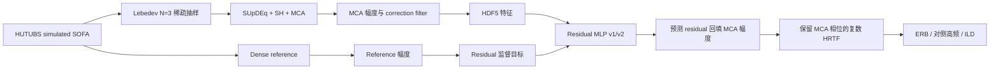

# MCA 残差学习 MLP v1/v2 技术与实验报告

> 项目：Magnitude-Corrected and Time-Aligned Interpolation（MCA）后的轻量残差学习  
> 数据集：HUTUBS simulated HRTF，96 个被试  
> 当前实验条件：Lebedev N=3 稀疏输入，Fliege N=29 幅度评估网格  
> 报告版本：2026-07-25  
> 状态：v1、v2 已完成训练、严格未见被试测试、复数 HRTF 回填和论文口径指标评估

## 摘要

本项目研究在传统 MCA HRTF 空间插值结果之上，使用轻量神经网络继续降低剩余的幅度插值误差。与从零预测完整 HRTF 不同，网络仅学习 MCA 与 dense reference 之间的对数幅度残差：

$$
r(e,\Omega,f)
=
20\log_{10}|H_{\mathrm{ref}}(e,\Omega,f)|
-
20\log_{10}|H_{\mathrm{MCA}}(e,\Omega,f)|.
$$

其中，$e$ 表示左右耳，$\Omega$ 表示空间方向，$f$ 表示频率。推理阶段将预测残差加回 MCA 幅度，并严格保留 MCA 相位：

$$
\widehat{H}(e,\Omega,f)
=
10^{\left(M_{\mathrm{MCA}}+\widehat r\right)/20}
\exp\left(j\angle H_{\mathrm{MCA}}\right).
$$

v1 的核心任务是验证 MCA 后的逐频点残差是否包含可跨被试学习的规律。模型采用 7 维逐频点特征、宽度 128、3 个残差块的 MLP，共 100,225 个可训练参数。它在 12 个严格未见 test 被试上将逐频点 residual MAE 从 MCA 的 2.6007 dB 降至 2.2172 dB，改善 14.75%。完成幅度回填后，全空间 ERB magnitude error、对侧 25° ERB error、对侧高频误差和 ILD MAE 分别改善 14.82%、16.24%、11.80% 和 12.73%。前三项均有 12/12 被试改善，但 ILD 只有 10/12 改善，pp33 和 pp81 出现退化。

v2 不增加网络参数，而是从 v1 最优模型初始化，改用双耳完整频谱 batch，并加入 ERB、对侧高频和 ILD 的可微代理损失。v2 在 test 集上的逐频点 residual MAE 进一步降至 2.1684 dB，较 MCA 改善 16.62%。严格 MATLAB 指标中，全空间 ERB、对侧 25° ERB、对侧高频和 ILD MAE 分别较 MCA 改善 23.82%、27.96%、12.63% 和 26.96%，四项均实现 12/12 被试改善。相对 v1，v2 又分别降低 10.57%、14.00%、0.94% 和 16.31%，说明指标感知训练的主要收益集中在 ERB 与双耳 ILD。

目前可以进入 CNN+MLP 阶段。现有 v2 数据采样器已经能提供同一被试、同一方向、双耳配对、完整 463 点频谱，非常适合让 1D CNN 建模局部频谱结构，再由 MLP 编码方向信息。不过，在正式宣称 CNN+MLP 的架构贡献前，应保留 v2 作为同损失、同划分、同训练预算的直接对照，并补做 v2 损失消融，避免把损失函数收益误归因于网络结构。

## 1. 研究背景与问题定义

### 1.1 MCA 基线

MCA 是 Magnitude-Corrected and Time-Aligned Interpolation 的缩写。本项目使用 SUpDEq 工具链完成：

1. SUpDEq 方向相关预处理与时间对齐；
2. 球谐插值；
3. MCA 幅度校正；
4. 在空间混叠频率附近及以上抑制传统插值的高频幅度偏差。

当前 MCA 配置为：

| 项目 | 设置 |
|---|---|
| 预处理 | `SUpDEq` |
| 插值方法 | `SH` |
| MCA | `mc = inf` |
| 幅度校正相位 | minimum phase |
| 校正限制 | 空间混叠频率以下限制并使用 `fadeDown` |
| FFT oversize | 4 |
| 采样率 | 44.1 kHz |

96 被试的传统 MCA 复现已经证明：MCA 能显著降低低阶稀疏采样下的对侧幅度与 ILD 误差，但仍存在可观察的高频和个体相关残差。因此，本项目不是替代 MCA，而是把 MCA 作为物理与信号处理先验，再通过小模型学习其剩余误差。

### 1.2 学习任务

令 dB 幅度为：

$$
M(e,\Omega,f)=20\log_{10}|H(e,\Omega,f)|.
$$

监督目标定义为：

$$
r_{\mathrm{target}}
=M_{\mathrm{ref}}-M_{\mathrm{MCA}}.
$$

网络预测：

$$
\widehat r=F_\theta(X).
$$

校正后的幅度为：

$$
M_{\mathrm{corrected}}
=M_{\mathrm{MCA}}+\widehat r.
$$

如果网络输出恒为 0，则系统退化为原 MCA。因此，“zero residual”是天然、严格且易解释的基线。

### 1.3 为什么先学习幅度残差

选择 log-magnitude residual，而不是直接生成复数 HRTF，主要基于以下考虑：

- MCA 已提供较可靠的时间对齐和相位结构，首阶段没有必要重新学习相位。
- dB 残差的尺度和听觉上的相对幅度差更一致。
- 网络仅拟合 MCA 未解决的部分，问题复杂度明显低于从零生成 HRTF。
- 输出可直接加回 MCA 幅度，重建公式明确，可执行相位不变和幅度恒等检查。
- 模型失效时可回退为 MCA，不会破坏完整传统处理链。

## 2. 需求说明

### 2.1 研究需求

本阶段需要回答五个问题：

1. MCA 后的剩余幅度误差是否具有跨被试可学习性？
2. 一个约 10 万参数的轻量 MLP 是否足以取得稳定增益？
3. 逐频点 MAE 的改善能否转化为论文相关的 auditory-band、对侧高频和 ILD 改善？
4. 逐频点独立训练为何可能改善幅度却损害部分被试的 ILD？
5. 双耳完整频谱和指标感知损失能否解决 v1 的失败案例？

### 2.2 功能需求

| 编号 | 功能需求 | 实现状态 |
|---|---|---|
| F1 | 从 96 个 HUTUBS simulated SOFA 生成 MCA、reference 和 residual | 已完成 |
| F2 | 按被试划分 train/validation/test，禁止同一被试跨集合 | 已完成 |
| F3 | 仅使用 train 被试计算归一化参数 | 已完成 |
| F4 | 训练轻量 residual MLP，并保存最佳 checkpoint | v1/v2 已完成 |
| F5 | 在完整 validation/test 数据上计算逐频点 MAE、RMSE | 已完成 |
| F6 | 将预测 residual 回填到 MCA 幅度并保持 MCA 相位 | 已完成 |
| F7 | 计算严格 ERB magnitude error、对侧高频误差和 ILD MAE | 已完成 |
| F8 | 输出 12 个 test 被试的逐人图和总览图 | 已完成 |
| F9 | 记录训练配置、结果、限制与下一步 | 已完成 |

### 2.3 非功能需求

- **无数据泄漏**：被试级独立划分；test 不参与归一化、训练、超参数调整和 checkpoint 选择。
- **可复现**：固定划分文件、随机种子、训练 history、validation/test JSON 和严格评估 CSV。
- **轻量化**：v1/v2 模型参数固定为 100,225，能在单张 8 GB 级显卡上训练。
- **内存可控**：不把约 1.10 GiB HDF5 数据整体载入内存，采用按被试、方向和频率读取。
- **可验证**：重建后检查相位保持误差与幅度回填恒等误差。
- **可退化**：预测残差为 0 时等价于 MCA。
- **指标一致**：训练代理损失与最终 MATLAB 严格指标必须明确区分。

### 2.4 验收标准

v1 的最低验收标准是：严格未见 test 被试上的逐频点 residual MAE 优于 zero-residual MCA，并且最终 ERB 或对侧高频指标有稳定改善。v2 的验收标准进一步要求：在不增加模型参数的情况下改善 v1 的 ERB 和 ILD 表现，并解决 v1 的主要 ILD 退化案例。

实际结果超过上述最低标准：

- v1 test residual MAE 改善 14.75%；
- v1 的三项幅度指标均 12/12 被试改善；
- v2 四项严格指标均 12/12 被试改善；
- v2 相对 v1 的全空间 ERB 与 ILD 分别再降低 10.57% 和 16.31%。

## 3. 数据集与实验协议

### 3.1 数据来源

| 项目 | 内容 |
|---|---|
| 数据集 | HUTUBS |
| 数据类型 | simulated HRIR/HRTF |
| 被试数 | 96 |
| 每被试原始方向数 | 1730 |
| 原始方向网格 | Lebedev N=35 |
| 双耳 | 左耳、右耳 |
| HRIR 长度 | 256 samples |
| 采样率 | 44.1 kHz |

本项目选择 simulated 数据，是为了与 MCA 复现实验中的规则网格和技术评估设置保持一致。它适合先验证算法机制，但不能替代 measured HRTF 或跨数据库泛化实验。

### 3.2 稀疏输入与目标网格

| 用途 | 网格 | 方向数 |
|---|---|---:|
| dense reference/source | Lebedev N=35 | 1730 |
| MCA 稀疏输入 | Lebedev N=3 | 26 |
| 训练与幅度评估 | Fliege N=29 | 900 |
| ILD 评估 | 水平面 0°–359° | 360 |

当前所有 MLP 结论仅对应 Lebedev N=3。它不能自动外推到 N=1、2、4、6 或任意非规则稀疏网格。

### 3.3 被试级数据划分

划分通过 MATLAB：

```matlab
rng(20260723, 'twister');
randperm(96);
```

固定为：

| 集合 | 被试数 | 用途 |
|---|---:|---|
| Train | 72 | 参数学习与归一化统计 |
| Validation | 12 | checkpoint 选择与训练监控 |
| Test | 12 | 最终独立评估 |

test 被试为：

```text
pp8, pp18, pp22, pp26, pp31, pp33,
pp45, pp47, pp59, pp70, pp73, pp81
```

完整划分见 [`subject_split_v1.csv`](../residual_learning/config/subject_split_v1.csv)。

### 3.4 缺失人体测量值

HUTUBS 公开人体测量数据中 pp18、pp79、pp92 缺少用于 Algazi 头半径计算的 `x1/x2/x3`。三者分别位于 test、train 和 validation。当前处理方式是使用其余 93 名有效被试的平均 Algazi 头半径：

```text
0.091021 m
```

这是一个已知实验偏差。后续如果获得完整元数据，应只重跑这三名被试，并做敏感性分析。

## 4. 数据处理

### 4.1 端到端流程



### 4.2 频率处理

原始 256 点 HRIR 使用 oversize 4，对应 1024 点频域表示。导出条件名义上是 50 Hz–20 kHz，但受 FFT 离散频率限制，实际选中：

| 项目 | 数值 |
|---|---:|
| 频点数 | 463 |
| 最低实际频率 | 86.1328 Hz |
| 最高实际频率 | 19982.8125 Hz |
| 频率特征 | 标准化的 $\log_{10}(f)$ |

最终严格 ERB 评估仍从重建后的复数 HRTF/HRIR 计算，范围为 50 Hz 到 Nyquist；20 kHz 以上未预测的频点保持原 MCA。

### 4.3 HDF5 数据结构

每名被试、每个稀疏阶数保存一个 HDF5，Python 中的主张量布局为：

```text
[ear=2, direction=900, frequency=463]
```

| 字段 | 形状或内容 | 单位 | 用途 |
|---|---|---|---|
| `/mca_logmag_db` | `[2,900,463]` | dB | 模型输入、MCA 基线 |
| `/reference_logmag_db` | `[2,900,463]` | dB | dense reference |
| `/correction_logmag_db` | `[2,900,463]` | dB | MCA correction 特征 |
| `/target_residual_db` | `[2,900,463]` | dB | `reference - MCA` |
| `/direction_features` | `[900,6]` | 混合 | azimuth、elevation、x、y、z、Fliege weight |
| `/frequency_hz` | `[463]` | Hz | 频率坐标 |

幅度下限统一为 -200 dB，避免对数零值。数据先写入 `.partial`，完成校验和元数据写入后再原子改名，从而支持断点续跑。

### 4.4 数据规模与完整性

| 项目 | 结果 |
|---|---:|
| 成功文件 | 96/96 |
| 单被试样本数 | 833,400 |
| 总样本数 | 80,006,400 |
| train 样本数 | 60,004,800 |
| validation 样本数 | 10,000,800 |
| test 样本数 | 10,000,800 |
| 数据总大小 | 1,179,616,094 bytes，约 1.10 GiB |

完整遍历校验结果：

- 0 个失败文件；
- 0 个残留 `.partial`；
- 数组尺寸一致；
- 所有数值有限；
- `reference - MCA = residual` 最大恒等误差为 0 dB；
- HDF5 内 split 属性计数严格为 72/12/12。

### 4.5 训练集归一化

所有均值和标准差只由 72 个 train 被试计算：

| 张量 | 均值 | 总体标准差 | 平均绝对值 | 范围 |
|---|---:|---:|---:|---:|
| MCA log-magnitude | 0.4367 dB | 9.3164 dB | 7.4731 dB | -83.10 至 26.14 dB |
| correction log-magnitude | 0.8184 dB | 2.6988 dB | 1.9160 dB | -15.02 至 21.46 dB |
| target residual | -0.0905 dB | 4.0625 dB | 2.5156 dB | -67.71 至 69.57 dB |

频率的 $\log_{10}(f)$ 均值/总体标准差为 3.874925/0.410294。统计文件见 [`training_statistics.json`](../residual_learning/data/hutubs_residual_v1_n03/training_statistics.json)。

### 4.6 模型输入特征

对每个耳别、方向和频点，输入向量为：

$$
X=
\left[
\widetilde M_{\mathrm{MCA}},
\widetilde M_{\mathrm{corr}},
x,y,z,
\widetilde{\log_{10}f},
e
\right],
$$

其中左耳 $e=-1$，右耳 $e=+1$。方位角和仰角没有直接送入网络，而是使用连续、无 0°/360° 跳变的单位向量 $x,y,z$。

目标 residual 也使用 train 统计量标准化：

$$
\widetilde r=\frac{r-\mu_r}{\sigma_r}.
$$

## 5. 模型选型

### 5.1 为什么首版选择 MLP

MLP 适合作为第一版模型，原因包括：

- 输入是固定长度的数值特征，不依赖图像或不规则图结构。
- 逐频点监督样本数量大，MLP 可快速验证残差是否可学习。
- 参数量和训练成本容易控制。
- 结构简单，便于确认数据、归一化、梯度和回填链路是否正确。
- 后续 CNN、图网络或 Transformer 都可与它做清晰对照。

MLP 的主要局限也很明确：每个频点独立预测，无法直接观察相邻频率的峰谷、谱包络和 notch 结构；v1 还把左右耳分开采样，因此损失无法直接约束双耳能量差。

### 5.2 备选模型及暂缓原因

| 模型 | 潜在优势 | 首阶段未采用原因 |
|---|---|---|
| 1D CNN | 建模局部频谱结构，适合固定 463 点频谱 | 需先建立可靠 MLP 基线 |
| RNN/TCN | 建模长频率上下文 | 频率不是时间序列；实现和训练成本更高 |
| Transformer | 全局频率依赖和条件融合 | 当前数据与参数预算下可能过度复杂 |
| 球面 CNN/图网络 | 显式建模方向邻域 | Fliege 网格和多阶网格需额外图结构 |
| 复数网络 | 联合幅度与相位 | 当前 MCA 相位已保留，风险和验证成本高 |

### 5.3 MLP 结构

v1 和 v2 使用完全相同的网络：

```text
Input(7)
  -> Linear(7, 128)
  -> SiLU
  -> 3 × ResidualBlock
       Linear(128, 128)
       SiLU
       Linear(128, 128)
       Add skip
       SiLU
  -> Linear(128, 1)
  -> normalized residual
```

参数分解：

| 组件 | 参数量 |
|---|---:|
| 输入层 `7 -> 128` | 1,024 |
| 单个残差块 | 33,024 |
| 3 个残差块 | 99,072 |
| 输出层 `128 -> 1` | 129 |
| **总计** | **100,225** |

选择 SiLU 是因为它平滑、对连续回归友好；残差连接使 3 个全连接块在保持轻量的同时更易优化。单输出表示一个位置的标准化 dB residual。
