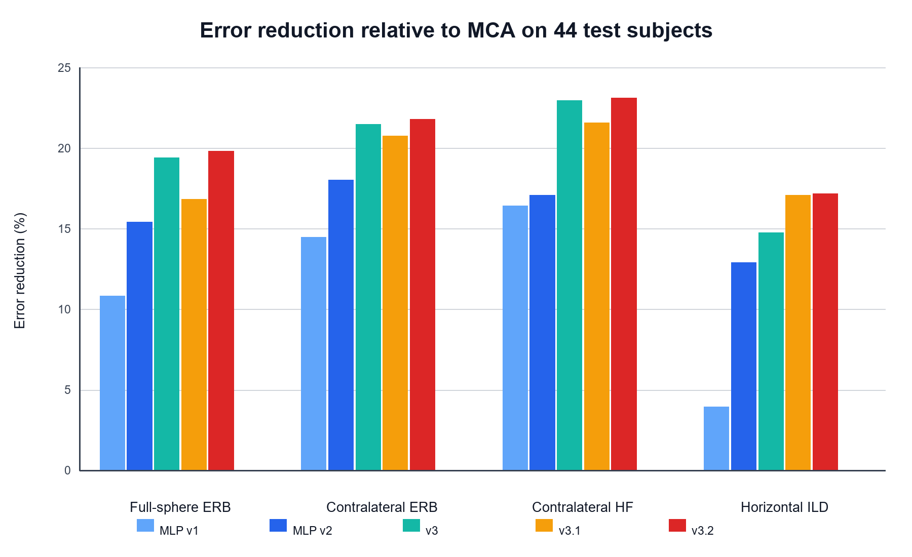
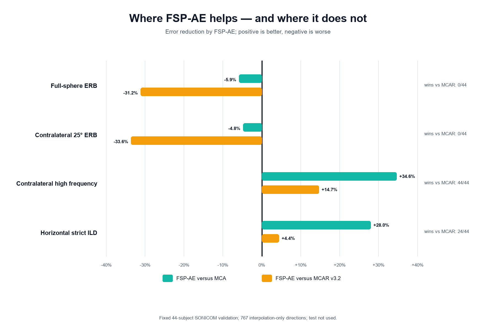

# MCAR 轻量 HRTF 残差学习项目阶段汇报

> 汇报日期：2026 年 8 月 10 日  
> 当前阶段：SONICOM Q26 主实验已完成，正在进行后续模型与损失函数消融  
> 核心结论：MLP+CNN v3.2 已形成稳定、可复现的论文主结果；继续增加训练预算有效，但近期结构和损失改动的边际收益较小。

## 一、项目概述

本项目研究稀疏采样条件下的个性化头相关传输函数（Head-Related Transfer Function，HRTF）重建。传统幅度校正与时间对齐插值（Magnitude-Corrected and Time-Aligned Interpolation，MCA）能够缓解空间混叠，但在对侧耳和高频区域仍存在明显的幅度误差。因此，本项目在 MCA 输出上学习对数幅度残差：

$$
r(f,\Omega,e)=\log|H_{\mathrm{ref}}(f,\Omega,e)|-\log|H_{\mathrm{MCA}}(f,\Omega,e)|,
$$

并将网络预测的残差回填到 MCA 幅度中。复数相位仍完全沿用 MCA，以控制模型规模并保持插值链路的可解释性。

当前主线已经从单纯的逐点 MLP，演进到“跨被试 MLP + 局部频谱 CNN + 双采样严格双耳约束”的 v3.2。主要目标不是替代 MCA，而是在保留其物理先验和时间对齐能力的基础上，进一步修正剩余的个体化频谱误差。

### 1.1 v1、v2、v3 与 v3.2 的模型框架

四个主要版本不是彼此独立的黑箱模型，而是在同一 residual 学习框架上的逐步受控扩展：


| 版本 | 模型结构 | 训练信息范围 | 主要损失或约束 | 主要研究问题 |
|---|---|---|---|---|
| v1 | 100,225 参数 Residual MLP | 单耳、方向和随机频点 | 逐频点 SmoothL1 | MCA 剩余误差能否被轻量网络学习？ |
| v2 | 与 v1 相同的 MLP | 双耳、同方向、完整 463 点频谱 | residual + ERB + 高频 + 频谱 ILD proxy | 感知目标能否改善最终声学指标？ |
| v3 | 冻结 v2 MLP + 74,402 参数局部频谱 CNN | 双耳完整频谱 + 连续方向条件 | v2 复合损失，CNN 只学习增量 | 显式频率上下文能否恢复谱峰、谱谷和 notch？ |
| v3.2 | 与 v3 相同，共 174,627 参数 | 全空间幅度 batch + 独立水平面 ILD batch | residual + ERB + 高频 + 严格 HRIR-ILD | 能否兼顾全空间幅度和水平面双耳能量？ |

#### v1：逐频点 Residual MLP

v1 将每个“耳朵—方向—频率点”视为一个低维回归样本。输入为 7 个特征：

1. MCA log-magnitude；
2. MCA correction-filter log-magnitude；
3. 方向单位向量 $x/y/z$；
4. $\log_{10}(f)$；
5. 耳别编码，左耳为 `-1`、右耳为 `+1`。

其中 MCA 幅度、correction 和 log-frequency 使用 train-only 均值与标准差进行标准化。网络结构为：

```text
7 维输入
  → Linear(7, 128) + SiLU
  → 3 × [Linear(128,128) → SiLU → Linear(128,128) + residual]
  → Linear(128, 1)
  → 归一化 log-magnitude residual
```

训练时每个 batch 随机选择一个被试、一个耳朵、64 个方向和 128 个频点，以 SmoothL1 学习逐频点 residual。v1 不显式观察相邻频点或另一只耳朵，其定位是验证“在 MCA 上继续学习残差”这条路线本身是否成立。

#### v2：同一 MLP 上的感知目标训练

v2 保持 v1 的输入、网络结构和参数量不变，并由 v1 checkpoint 初始化；变化集中在数据组织与损失函数。每个 batch 同时读取左右耳、32 个方向和全部 463 个频点，张量规模为 `[2, 32, 463]`，因此可以在训练时计算完整频带能量和双耳关系。

SONICOM 正式 v2 的复合目标包括：

$$
\mathcal L_{v2}=\mathcal L_{\mathrm{res}}
+0.75\mathcal L_{\mathrm{ERB}}
+0.25\mathcal L_{\mathrm{HF}}
+0.25\mathcal L_{\mathrm{ILD\ proxy}},
$$

其中 ERB 项约束听觉频带能量，高频项只关注对侧耳 $>10\,\mathrm{kHz}$，ILD proxy 由左右耳完整训练频谱的宽带能量差得到。v2 的意义在于隔离“训练目标”的作用：模型容量不变，若严格重建指标改善，增益主要来自双耳完整频谱采样和感知损失。

#### v3：冻结 MLP 后增加局部频谱 CNN

v3 保留并冻结 v2 的 100,225 个 MLP 参数。MLP 先对每个频点给出基础 residual，再把左右耳的 MCA 幅度、correction、v2 prediction 和 log-frequency 组织为 7 通道频谱，输入一维 CNN：

```text
逐频点特征 ──→ 冻结 v2 MLP ──→ base residual [方向, 2 耳, 463 频点]
                                  │
左右耳 MCA/correction/base residual + log-frequency
                                  ↓
Conv1d stem，48 channels，kernel=7
                                  ↓
4 个深度可分离膨胀 residual block，dilation=1/2/4/8
                                  ↑
方向 xyz → 两层方向编码器 → FiLM scale/shift
                                  ↓
2 通道 CNN delta
                                  ↓
最终 residual = v2 base residual + CNN delta
```

CNN 采用 reflection padding、GroupNorm 和 SiLU；方向不直接复制为频谱通道，而是通过 Feature-wise Linear Modulation（FiLM）调制每个频谱 block。完整理论感受野为 97 个频点，约覆盖 `4.18 kHz`。输出层零初始化，使训练起点与 v2 逐值一致，从而把增益更明确地归因于局部频率上下文。

#### v3.2：不扩模型，只改变采样与严格 ILD 目标

v3.2 与 v3 使用完全相同的 174,627 参数 MLP-CNN，仍冻结 MLP、只更新 74,402 个 CNN 参数。其核心变化是每一步使用两类独立方向样本：

- **全空间 batch**：32 个纯插值方向，用于 residual、ERB 和对侧高频损失；
- **水平面 batch**：32 个纯插值方向，用 MCA 相位、训练频带外复频谱和预测幅度即时重建 HRIR，计算严格的左右耳能量 ILD。

严格 ILD 定义为：

$$
\mathrm{ILD}(\Omega)=10\log_{10}
\frac{\sum_n h_L(\Omega,n)^2+\epsilon}
{\sum_n h_R(\Omega,n)^2+\epsilon}.
$$

SONICOM 正式 v3.2 使用 `ERB/HF/strict ILD = 0.75/0.25/0.75`。这一设计修复了 v3.1 只使用水平面方向微调导致的全空间幅度回退，使 v3.2 在不增加参数量的情况下形成较均衡的幅度与双耳性能。

### 1.2 横向基线的算法框架

横向比较同时包含传统插值、物理先验残差学习和端到端神经空间上采样。各方法接收相同的 SONICOM Q26 稀疏方向，但内部处理不同。

| 方法 | 算法或模型框架 | 是否学习 | 输出与相位/时间处理 |
|---|---|---:|---|
| SH only | 直接对 Q26 复数 HRTF 做三阶球谐函数插值，Tikhonov $\epsilon=0.01$ | 否 | 直接输出插值后的复数 HRTF |
| SUpDEq + SH | 先按刚性球头模型进行方向均衡和时间对齐，再做三阶 SH 插值，最后反均衡 | 否 | 输出方向均衡后的复数插值 HRTF |
| SUpDEq + Natural Neighbor | SUpDEq 预处理后，在球面 Voronoi 邻域内对相邻稀疏方向的复数 HRTF 加权 | 否 | 权重和为 1，之后执行目标方向反均衡 |
| SUpDEq + Barycentric | SUpDEq 预处理后，利用目标方向所在球面三角形三个顶点的重心权重进行复数插值 | 否 | 三顶点权重和为 1，之后执行目标方向反均衡 |
| MCA | SUpDEq + SH 后加入最小相位 magnitude-correction filter，并在空间混叠频率附近渐进限制校正 | 否 | 保留传统插值相位，重点修正高频幅度和 ILD |
| MCAR v1/v2/v3/v3.2 | 在 MCA 幅度上叠加网络预测的 log-magnitude residual | 是 | 训练频带内修正幅度，MCA 相位及频带外复频谱保持不变 |
| FSP-AE-Q26 | 频率/声源位置条件自编码器：Q26 幅度与 ITD 经 HyperLinear encoder 聚合为个体 prototype，再由目标方向和频率条件 decoder 生成 dense 幅度与 ITD | 是 | 由预测幅度构造 minimum-phase HRIR，再施加预测 ITD |

#### 传统插值基线

**SH only** 用来测量“仅依赖有限阶球谐展开”的误差上限。Q26 可支持三阶 SH；同一 Tikhonov 正则用于稳定欠定或病态频段，但它不显式处理 HRTF 随方向变化的到达时间和高频结构。

**SUpDEq + SH** 在插值前利用球头模型消除主要的方向相关时间延迟和频谱移动，使各方向 HRTF 更容易由低阶空间基展开；插值后再恢复目标方向的均衡响应。它检验 SUpDEq 预处理本身相对直接 SH 的价值。

**Natural Neighbor** 和 **Barycentric** 保留 SUpDEq 的方向均衡，但把 SH 插值替换为局部几何插值。Natural Neighbor 根据目标点插入球面 Voronoi 图后占用的邻域面积构造权重；Barycentric 根据目标射线与球面三角网格的交点计算三个顶点权重。两者都不使用 MCA magnitude correction，因此可以分离“局部插值器”和“幅度校正”的贡献。

**MCA** 在 SUpDEq + SH 的时间对齐与空间插值结果上进一步估计最小相位幅度校正滤波器。当前设置为 `mc=inf`，但启用空间混叠频率限制和 `fadeDown`，避免在低可信高频区域无约束放大。MCA 是所有 MCAR 网络共享的物理基底。

#### FSP-AE 神经横向基线

FSP-AE 不依赖 MCA。其输入为 26 个测量方向的双耳幅度、ITD、频率和三维声源位置。位置使用 16 组可训练 Fourier features，频率使用 8 组 Fourier features；两层 HyperLinear encoder 将各测量方向编码到 64 维隐空间，再对 26 个方向求均值得到个体 prototype。两层条件 decoder 根据目标方向和频率生成双耳幅度及 ITD。SONICOM 适配模型共 235,065 个参数，训练目标为：

$$
\mathcal L_{\mathrm{FSP-AE}}=\mathrm{LSD}+2500\times\mathrm{ITD\ L1}.
$$

其中 LSD 为 Log-Spectral Distance（对数谱距离）。该基线检验“从稀疏测量直接生成 dense HRTF”与“在 MCA 上学习 residual”两种范式的差异。

### 1.3 各模型与横向基线的测试方法

#### 统一公平评价协议

除下文单独说明的 FSP-AE 外，论文主横向 test 使用完全相同的输入、被试和指标：

1. 对固定 44 名 test 被试，仅向每种方法提供相同的 26 个 Q26 测量方向；
2. 在固定 793 方向参考网格上生成 HRTF，并排除 26 个输入方向，只评价 767 个纯插值方向；
3. SH、SUpDEq、NN、Barycentric 和 MCA 从同一 Q26 复数 HRTF 独立重建；
4. MCAR v1/v2/v3/v3.2 分别加载各自已锁定 checkpoint，在 MCA 上预测 463 个训练频点的 residual，随后保留 MCA 相位并补回训练频带外复频谱；
5. 所有方法统一转换到 HRIR，并由同一个 MATLAB 函数计算四项严格指标；
6. 先得到每名被试的误差，再报告 44 人均值、被试间标准差、中位数、逐被试胜出数和配对统计；不得把方向或频点当作独立被试扩大样本量。

四项测试方法如下：

| 指标 | 测试方法 |
|---|---|
| 全空间 ERB | 对左右耳重建 HRIR 与 reference 调用 `AKerbError`，在 50 Hz–Nyquist 范围计算 ERB-band 绝对误差；767 个方向按 solid-angle 权重汇总，再对双耳平均 |
| 对侧 25° ERB | 左耳取以方位角 270°、仰角 0° 为中心的 25° 大圆区域，右耳取 90° 中心区域；分别方向加权后对双耳平均 |
| 对侧高频 | 左/右耳分别取对侧半球，在 `10–20 kHz` 计算 log-magnitude 绝对误差；方向按 solid-angle 加权、频率等权 |
| 水平面严格 ILD | 从完整重建 HRIR 计算左右耳能量比，仅统计 72 个水平面纯插值方向，对 reference ILD 取 MAE |

#### 各基线的实际测试入口与质量控制

| 方法组 | 当前评价拆分 | 实际测试过程 | 关键质量控制 |
|---|---|---|---|
| SH only / SUpDEq + SH | 44 test | 对每名被试调用上游 `supdeq_interpHRTF`，固定三阶 SH、头半径 `0.09 m`、Tikhonov `0.01`、FFT oversize 4 | 输入/目标网格维度、split 属性、所有指标有限性检查 |
| SUpDEq + NN / Barycentric | 44 test | 预先在固定 Q26→793 网格上构造几何权重，再批量作用于每名被试的方向均衡复频谱 | 权重逐行和为 1；首名被试与上游原生入口逐值对照，最大复数误差分别为 `4.97e-16/4.58e-16` |
| MCA | 44 test | 使用与 residual 数据导出完全相同的 SUpDEq、SH、最小相位校正、空间混叠限制和 `fadeDown` 配置 | correction 恒等式、方向数、频率数、相位和 HRIR 重建有限性检查 |
| MCAR v1/v2/v3/v3.2 | 44 test | 各模型分别从锁定 checkpoint 生成 test residual，回填同一 MCA 后进入统一 MATLAB 严格评价 | test 需显式 `allow-test`；检查 checkpoint、split、样本数、MCA 相位误差和幅度回填恒等误差 |
| FSP-AE-Q26 | **44 validation** | 从 Q26 幅度与 ITD 编码个体 prototype，对 793 方向预测幅度/ITD，重建 minimum-phase + predicted-ITD HRIR，再评价 767 个纯插值方向 | 与官方实现的幅度、ITD、HRIR 逐值误差均为 0；频率网格最大误差为 0；`test_subject_count_read=0` |

需要强调：FSP-AE 当前采用与其他方法相同的四项指标和 767 方向口径，但其结果来自 **validation**，而传统基线与 MCAR v1–v3.2 的论文主横向表来自 **test**。因此可以讨论两种方法在 validation 上的互补性，但不能把 FSP-AE validation 数字直接并入 44 人 test 排名。

## 二、目前完成到什么程度

目前已完成以下工作：

1. 完成 MCA/SUpDEq 传统基线复现，并形成 HUTUBS 与 SONICOM 的统一重建和评价链路；
2. 完成 SONICOM Q26 稀疏网格设计、固定被试划分、MCA residual 数据导出与完整性检查；
3. 完成 MLP v1、感知损失 MLP v2、MLP+CNN v3、严格 ILD 微调 v3.1 和双采样 v3.2；
4. 完成 v3.2 的正式 validation、一次性论文 test、配对统计、论文表格和矢量图；
5. 完成 FSP-AE、SUpDEq + Natural Neighbor、SUpDEq + Barycentric 等横向基线；
6. 完成三随机种子稳定性、40 epoch 预算扩展及冻结 checkpoint 的追加 test 评价；
7. 完成 v3.2.1 联合微调、v3.3 全局 attention，以及 v3.4a/b/c 三种定向损失消融；
8. 当前训练、预测、MATLAB 严格重建、统计和图表输出均已形成可重复执行的配置化流程。

整体上，项目已由“方法能否跑通”进入“论文结论收敛与消融边界确认”阶段。

## 三、数据与实验协议

### 3.1 数据配置

| 项目 | 当前设置 |
|---|---:|
| 数据集 | SONICOM measured clean cohort |
| 被试总数 | 350 |
| 被试划分 | 262 train / 44 validation / 44 test |
| 稀疏输入方向 | Q26，共 26 个方向 |
| 完整参考方向 | 793 个方向 |
| 纯插值评价方向 | 767 个方向 |
| 单耳频点数 | 463 |
| 被试划分种子 | 20260731 |

Q26 网格保持左右对称，最小方向间夹角约为 $31.92^\circ$，覆盖半径约为 $33.11^\circ$。训练、validation 和 test 按被试严格隔离，避免同一被试跨集合造成数据泄漏。

### 3.2 严格评价指标

目前统一报告四项最终 HRTF 重建指标，数值均为平均绝对误差，越低越好：

- 全空间 ERB-band 幅度误差；
- 对侧 $25^\circ$ 区域 ERB-band 幅度误差；
- 对侧耳 $>10\,\mathrm{kHz}$ 高频幅度误差；
- 水平面严格 HRIR 能量 ILD 误差。

其中 ILD 由最终重建的 HRIR 能量计算，不使用简单的频谱代理量；方向汇总采用 SONICOM solid-angle 权重。预测幅度回填和相位恒等性也在 MATLAB 端进行断言检查。

## 四、论文主模型与正式 test 结果

论文主模型为 **MLP+CNN v3.2，epoch 6**。该模型冻结 MLP，只训练局部频谱 CNN，并使用两套方向采样：全空间方向负责幅度残差、ERB 和高频损失，水平面方向负责严格 HRIR-ILD 损失。模型总参数量为 174,627。

### 4.1 44 名 test 被试主结果

| 方法 | 全空间 ERB / dB | 对侧 25° ERB / dB | 对侧高频 / dB | 水平面 ILD / dB |
|---|---:|---:|---:|---:|
| MCA | 1.0822 | 1.7458 | 4.6986 | 0.8294 |
| MLP v1 | 0.9648 | 1.4932 | 3.9271 | 0.7967 |
| MLP v2 | 0.9154 | 1.4311 | 3.8951 | 0.7223 |
| MLP+CNN v3 | 0.8721 | 1.3708 | 3.6201 | 0.7070 |
| MLP+CNN v3.1 | 0.8999 | 1.3831 | 3.6841 | 0.6877 |
| **MLP+CNN v3.2** | **0.8678** | **1.3653** | **3.6119** | **0.6870** |
| v3.2 相对 MCA 改善 | **19.81%** | **21.79%** | **23.13%** | **17.17%** |

v3.2 相对正式 v3 的四项指标分别改善约 **0.49%、0.40%、0.23% 和 2.83%**。其主要价值是：在保持三项幅度指标继续改善的同时，修复 v3 在严格 ILD 上的不足，形成当前最均衡的单模型结果。



### 4.2 结果解释

- MLP v1/v2 已能学习稳定的跨被试残差先验；
- 局部频谱 CNN 是幅度指标进一步下降的主要来源，v3 相对 v2 的提升明显大于后续微调；
- v3.1 证明与最终 HRIR 口径对齐的严格 ILD 损失有效，但会牺牲一部分幅度指标；
- v3.2 的双采样策略较好地平衡了全空间幅度和水平面双耳线索，因此适合作为论文主方法。

## 五、训练预算与随机性检查

### 5.1 三随机种子稳定性

使用固定 validation sampler，对训练种子 `20260809/20260810/20260811` 分别运行 10 epoch。最佳 validation total loss 为 `0.671027 ± 0.000346`，相对标准差仅约 `0.052%`；ERB、高频和严格 ILD 的种子间标准差分别为 `0.000601/0.001387/0.001607 dB`。

这说明当前训练配方对随机种子较稳定，ILD 仍是四项指标中相对最敏感的一项。

### 5.2 40 epoch 预算扩展

选择稳定性诊断中表现最好的 seed `20260809`，在不访问 test 的条件下扩展到 40 epoch，最佳点位于 epoch 39。相对原 v3.2 epoch 6，validation 四项指标分别改善 **1.33%、1.37%、0.80% 和 4.62%**。

在 checkpoint 和对照规则预先冻结、且获得明确授权后，epoch 39 又进行了一次追加 test 评价：

| 冻结模型 | 全空间 ERB / dB | 对侧 25° ERB / dB | 对侧高频 / dB | 水平面 ILD / dB |
|---|---:|---:|---:|---:|
| 论文主模型：v3.2 epoch 6 | 0.8678 | 1.3653 | 3.6119 | 0.6870 |
| 追加候选：v3.2 epoch 39 | **0.8557** | **1.3500** | **3.5905** | **0.6603** |
| 相对 epoch 6 改善 | 1.40% | 1.12% | 0.59% | 3.89% |

这说明增加训练预算是目前最可靠的增益来源之一。但 epoch 39 是在原论文 test 已完成之后产生的追加候选，因此现阶段更适合作为“预算扩展补充结果”，不宜直接改写原有预注册主结论。

## 六、近期消融结果

以下实验均从 v3.2 seed `20260809` epoch 39 出发，只使用 train/validation，`test_subject_count_read=0`。表中括号为相对 epoch 39 baseline 的变化，正值表示误差降低。

| 方法 | 主要改动 | 全空间 ERB / dB | 对侧 25° ERB / dB | 对侧高频 / dB | 水平面 ILD / dB | 当前判断 |
|---|---|---:|---:|---:|---:|---|
| v3.2 epoch 39 | 统一起点 | 0.872882 | 1.364204 | 3.608567 | 0.596141 | baseline |
| v3.2.1 | 低学习率解冻 MLP | **0.872411** (+0.054%) | 1.364251 (-0.003%) | **3.607370** (+0.033%) | **0.592172** (+0.666%) | 稳定但收益很小 |
| v3.3 | 全局频谱 attention | 0.873159 (-0.032%) | 1.364686 (-0.035%) | 3.608384 (+0.005%) | 0.595707 (+0.073%) | 负结果架构消融 |
| v3.4a | 高频谱一/二阶差分 | 0.872618 (+0.030%) | 1.363347 (+0.063%) | 3.608472 (+0.003%) | 0.593248 (+0.485%) | 谱形状显著改善，主指标增益小 |
| v3.4b | 分频带 ILD | 0.872511 (+0.043%) | **1.360356** (+0.282%) | 3.608369 (+0.005%) | 0.593076 (+0.514%) | 当前最强定向 loss 消融 |
| v3.4c | 多尺度 notch-aware | 0.872650 (+0.027%) | 1.362914 (+0.095%) | 3.608108 (+0.013%) | 0.592944 (+0.536%) | notch 指标稳定改善，主指标增益小 |

这些消融给出三个较明确的认识：

1. **单纯扩大模型感受野不是当前瓶颈。** 冻结局部分支后加入全局 attention 没有带来有效增益，反而使两项 ERB 指标出现可重复的小幅退化。
2. **定向损失确实改变了对应的谱结构或双耳指标。** v3.4a 的一阶/二阶谱差分在 44/44 人上改善，v3.4b 的 35/35 个 ERB 频带聚合误差下降，v3.4c 的三个 notch 尺度也均在 44/44 人上改善。
3. **代理目标与最终主指标仍存在错位。** 尽管谱差分、band-ILD 和 notch-depth 本身显著改善，对侧高频平均幅度误差几乎不变，说明继续堆叠辅助损失的收益可能有限。

## 七、与 FSP-AE 和传统插值方法的关系

FSP-AE-Q26 已完成官方 checkpoint 等价检查、正式训练和 44 人 validation 严格评价。与 MCAR v3.2 相比，FSP-AE 的全空间 ERB 和对侧 ERB 分别回退约 **31.2% 和 33.6%**，但对侧高频和严格 ILD 分别改善约 **14.7% 和 4.4%**。



这表明两类方法具有明显互补性：MCAR 更擅长整体幅度与对侧区域重建，FSP-AE 更擅长高频细节与部分双耳线索。现阶段不宜声称某一方法全面优于另一方法，更合理的论文表述是“MCAR 在整体误差上占优，FSP-AE 提供高频与双耳线索的互补基线”。

## 八、目前可以形成的论文结论

1. 在 SONICOM Q26 稀疏采样条件下，MCA 上的轻量残差学习能够稳定降低未见被试的 HRTF 重建误差；
2. 局部频谱 CNN 能有效利用跨频率上下文，是相对逐点 MLP 的主要增益来源；
3. 与最终 HRIR 能量定义一致的严格 ILD 训练目标，比简单频谱代理更能改善最终双耳指标；
4. v3.2 的双采样训练在全空间幅度和水平面 ILD 之间取得了当前最好的单模型平衡；
5. 更长训练预算仍有价值，但后续结构和损失改动的边际收益已经明显收窄；
6. 当前证据支持“物理插值基线 + 轻量数据驱动残差修正”的路线，而不支持无限增加模型复杂度。

## 九、风险与尚未解决的问题

### 9.1 test 集已消费

原 v3.2 epoch 6 完成了一次正式论文 test；随后 epoch 39 在独立冻结协议和明确授权下又完成了一次追加 test。两次评价均保留了 checkpoint 哈希、参数冻结和运行记录，但该 test 拆分现已完全消费，不能再用于后续结构、损失权重或 checkpoint 选择。

因此，v3.2.1、v3.3 和 v3.4a/b/c 当前只能作为 validation 消融。若要提出新的主模型或新的无偏泛化结论，需要新的未见被试拆分或外部数据集。

### 9.2 最新收益接近评价噪声尺度

近期方法相对 epoch 39 的主指标改进多在 `0.01%–0.7%`。部分配对统计显著，但绝对效应很小。后续应同时报告绝对差值、逐被试改善比例和效应量，避免只用相对百分比放大结论。

### 9.3 外部泛化尚未完成

目前主结论集中在 SONICOM Q26。HUTUBS 已用于早期 MCA/MCAR 链路验证，但尚未形成与当前 SONICOM v3.2 完全一致的跨数据集外部验证。不同数据库在采样网格、频率范围和个体分布上的差异，仍是论文外部有效性的主要缺口。

### 9.4 工程版本需要收口

最新 v3.2.1-v3.4c 的源码、配置、测试和结果仍处于未提交工作区。当前已直接执行并通过 6 个相关回归脚本，覆盖双采样严格 ILD、联合 optimizer、全局 attention、谱差分、分频带 ILD 和 notch-aware loss；但在正式归档前仍需完成结果清单核对、Git 提交和可复现命令复查。

## 十、建议的下一阶段计划

### 优先级 1：冻结论文主叙事与实验口径

- 论文主模型继续使用预先锁定的 v3.2 epoch 6；
- epoch 39 作为训练预算扩展补充结果单独报告；
- v3.2.1-v3.4c 作为 validation-only 消融，不使用已消费 test 做排序；
- 主文突出 v1→v2→v3→v3.1→v3.2 的方法演进，近期细粒度 loss 实验放入消融或附录。

### 优先级 2：完成一次受控的组合损失实验

若仍需要补充方法实验，建议只进行一次低权重组合：将谱一阶/二阶差分、band-ILD 和 notch-aware 权重同时降为独立实验的一半，验证不同定向目标能否互补。整个实验保持 validation-only，并预先固定权重、训练预算和唯一选模规则，避免继续扩大搜索空间。

### 优先级 3：转向外部验证或新未见拆分

如果目标是增强论文说服力，外部泛化的优先级应高于继续追求小数点后三位的 validation 改善。可考虑：

- 将当前方法适配到 HUTUBS 或其他未参与当前选模的数据；
- 在新协议中重新冻结稀疏网格、归一化和评价频段；
- 只验证已确定的主方法和一到两个关键基线，不重新进行大规模超参数搜索。

### 优先级 4：整理可交付成果

- 固化配置、checkpoint 哈希、结果表和运行命令；
- 将最新代码、测试和精选结果形成一个可回溯提交；
- 在论文中统一区分 validation、正式 test 和追加冻结 test；
- 根据导师意见确定是否保留组合 loss 实验，以及 FSP-AE 结果放在主文还是附录。

## 十一、希望与导师确认的三个问题

1. 论文主结果是否继续严格保持为预注册的 v3.2 epoch 6，而将 epoch 39 作为预算扩展补充？
2. 下一阶段应优先做一次组合损失 validation 消融，还是直接转向跨数据库外部验证？
3. FSP-AE 的“高频/ILD 更优、整体 ERB 更差”是否作为方法互补性的重点讨论，还是仅作为横向基线放入附录？

## 十二、相关材料索引

- v3.2 正式 test 与论文结果：[`SONICOM_MLP_CNN_V32_FINAL_RESULTS.md`](SONICOM_MLP_CNN_V32_FINAL_RESULTS.md)
- FSP-AE 正式 validation：[`FSP_AE_Q26_VALIDATION_REPORT.md`](FSP_AE_Q26_VALIDATION_REPORT.md)
- 完整实验时间线：[`docs/EXPERIMENT_LOG.md`](../docs/EXPERIMENT_LOG.md)
- 项目入口与复现命令：[`README.md`](../README.md)
- v3.2 论文表格和图片：[`results/sonicom_mlp_cnn_q26_v32_paper/`](../results/sonicom_mlp_cnn_q26_v32_paper/)
- 最新消融结果：[`results/sonicom_mlp_cnn_q26_v321_joint_unfreeze_e10_strict_validation/`](../results/sonicom_mlp_cnn_q26_v321_joint_unfreeze_e10_strict_validation/)、[`v3.3`](../results/sonicom_mlp_cnn_q26_v33_global_attention_e10_strict_validation/)、[`v3.4a`](../results/sonicom_mlp_cnn_q26_v34a_spectral_diff_e10_strict_validation/)、[`v3.4b`](../results/sonicom_mlp_cnn_q26_v34b_band_ild_e10_strict_validation/)、[`v3.4c`](../results/sonicom_mlp_cnn_q26_v34c_notch_aware_e10_strict_validation/)
