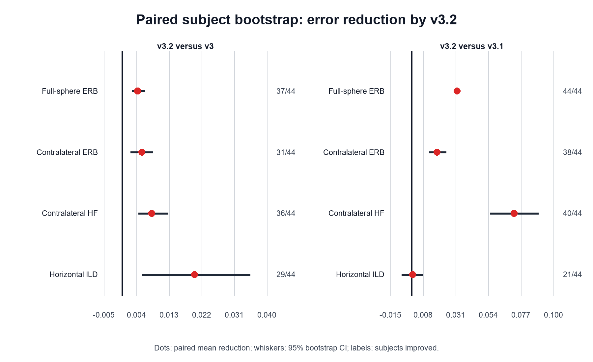
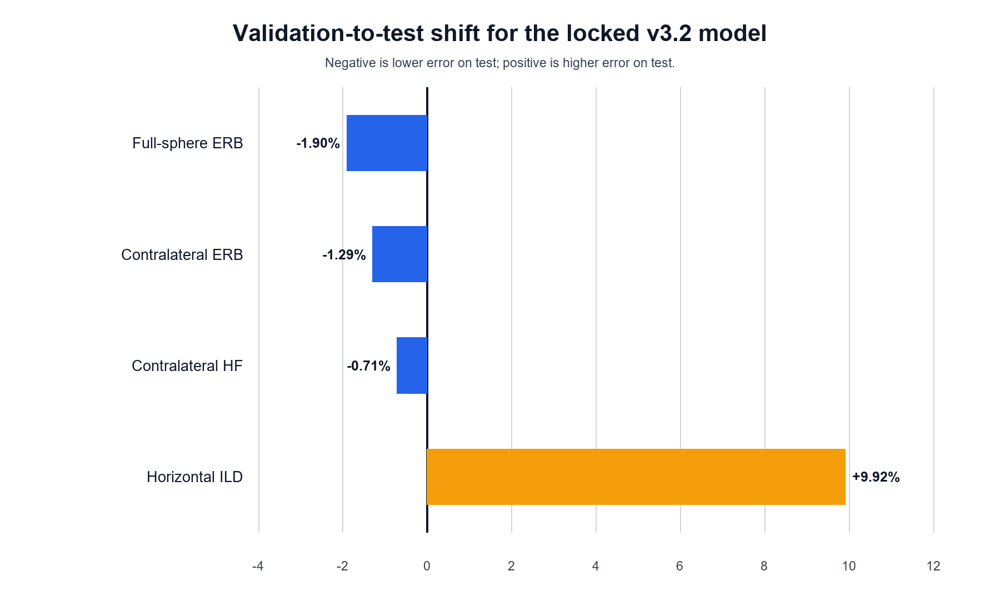

# SONICOM Q26 MLP+CNN v3.2 最终测试与论文结果报告

## 摘要

本报告总结 SONICOM Q26 固定划分上 MCA 残差学习方法的一次性最终测试。论文主模型 MLP+CNN v3.2 在查看 test 前已经锁定：以 v3 为初始化，冻结 MLP，训练频率 CNN；每一步分别使用全空间纯插值方向监督幅度目标、使用水平面纯插值方向监督严格 HRIR-ILD，损失权重为 `ERB/HF/ILD = 0.75/0.25/0.75`，最终 checkpoint 为 epoch 6。

44 名未见 test 被试上的全空间 ERB、对侧 25 度 ERB、对侧 `>10 kHz` 幅度误差和水平面严格 ILD MAE 分别为 `0.867805 / 1.365327 / 3.611854 / 0.686999 dB`。相对 MCA 分别改善 `19.81% / 21.79% / 23.13% / 17.17%`；相对正式 v3 分别改善 `0.493% / 0.400% / 0.227% / 2.830%`。配对 subject bootstrap 表明，v3.2 相对 v3 的四项平均误差降低的 95% 置信区间均大于零。v3.2 与 ILD 专用消融 v3.1 的水平面 ILD 均值仅相差 `0.000718 dB`，相应区间跨零，因此只能报告两者 ILD 相当；v3.2 的三项幅度误差则明确更低。综合四项指标，预声明的 v3.2 仍是最合适的单模型论文主方法。

## 1. 研究问题与最终假设

MCA 已经完成方向均衡、时间对齐和球谐插值，但仍存在受被试特征、空间方向与频率共同影响的幅度残差。网络学习目标为：

$$r(e,d,f)=\log |H_{\mathrm{ref}}(e,d,f)|-\log |H_{\mathrm{MCA}}(e,d,f)|.$$

预测 residual 被回填到 MCA 幅度，保留 MCA 相位和训练频带以外的 MCA 复频谱。最终假设包括：

1. MLP 能学习方向、耳别和频率条件下的平滑残差趋势；
2. 沿频率轴的 CNN 能进一步恢复局部谱峰、谱谷和高频结构；
3. 与最终重建一致的严格 HRIR-ILD 监督能改善双耳能量关系；
4. 全空间幅度采样与水平面 ILD 采样分离后，可以避免 v3.1 只监督水平面造成的全空间幅度回退。

## 2. 数据和防泄漏协议

实验使用 SONICOM 个体测量 HRTF，采用固定的 `262 train / 44 validation / 44 test` 被试级划分。稀疏输入是 26 个测量原生方向，目标网格包含 793 个方向；正式指标只统计其中 767 个非输入、纯插值方向。方向聚合使用 solid-angle 权重，防止高密度区域过度影响全空间均值。

开发阶段只允许访问 train 和 validation。v3.2 的架构、损失权重、训练预算、checkpoint 和主模型身份均在 test 导出前写入锁定配置。用户明确授权后，44 名 test 被试只解封一次；test 没有用于修改网络、损失、超参数、checkpoint 或主模型选择。最终协议见 `configs/experiments/sonicom_mlp_cnn_q26_v32_final_test.json`。

## 3. 方法演进与消融含义

| 方法 | 主要变化 | 在消融中的作用 |
|---|---|---|
| MCA | 不使用学习 residual | 传统插值基线 |
| MLP v1 | 逐频点 residual 回归 | 证明残差学习本身有效 |
| MLP v2 | 加入 ERB、高频与 ILD 感知代理 | 证明感知目标的价值 |
| MLP+CNN v3 | 在冻结 MLP 后加入频率 1D CNN | 证明局部频谱建模的价值 |
| MLP+CNN v3.1 | 仅水平面方向严格 HRIR-ILD 微调 | ILD 优先消融，同时暴露监督范围缩窄问题 |
| MLP+CNN v3.2 | 全空间幅度与水平面严格 ILD 双采样 | 单模型多目标折中，即论文主方法 |

v3.2 没有扩大参数量。它与 v3/v3.1 使用同一个 `174,627` 参数的 MLP-CNN，其中 MLP 的 `100,225` 个参数冻结，只更新 `74,402` 个 CNN 参数。其贡献应归因于训练采样与目标对齐，而不是更大的模型容量。

## 4. 重建和指标口径

设网络输出的对数幅度校正为 $\hat r$，重建幅度为：

$$|\hat H|=|H_{\mathrm{MCA}}|\exp(\hat r).$$

重建保留 MCA 相位，补回训练频带外频谱，构造共轭对称双边谱并执行 IFFT。严格 ILD 使用裁剪后 HRIR 的双耳能量：

$$\mathrm{ILD}(d)=10\log_{10}\frac{\sum_n h_L(d,n)^2+\epsilon}{\sum_n h_R(d,n)^2+\epsilon}.$$

最终报告四项越低越好的 subject-level MAE：

- 全空间 ERB magnitude error；
- 对侧中心 25 度区域 ERB magnitude error；
- 对侧中心 25 度区域 `10–20 kHz` 高频幅度误差；
- 72 个水平面纯插值方向的严格 HRIR 能量 ILD error。

## 5. 44 人最终 test 主结果

以下数值为 `mean ± subject standard deviation`，单位均为 dB。

| 方法 | 全空间 ERB | 对侧 ERB | 对侧高频 | 水平面 ILD |
|---|---:|---:|---:|---:|
| MCA | 1.082 ± 0.096 | 1.746 ± 0.155 | 4.699 ± 0.266 | 0.829 ± 0.158 |
| MLP v1 | 0.965 ± 0.181 | 1.493 ± 0.274 | 3.927 ± 0.399 | 0.797 ± 0.378 |
| MLP v2 | 0.915 ± 0.174 | 1.431 ± 0.204 | 3.895 ± 0.368 | 0.722 ± 0.301 |
| MLP+CNN v3 | 0.872 ± 0.167 | 1.371 ± 0.169 | 3.620 ± 0.280 | 0.707 ± 0.298 |
| MLP+CNN v3.1 | 0.900 ± 0.164 | 1.383 ± 0.181 | 3.684 ± 0.274 | 0.688 ± 0.271 |
| **MLP+CNN v3.2** | **0.868 ± 0.162** | **1.365 ± 0.167** | **3.612 ± 0.277** | **0.687 ± 0.274** |

v1 已降低 MCA 的幅度误差，说明 MCA 剩余误差中存在跨被试可学习结构。v2 进一步改善四项均值，尤其改善 ILD。加入频率 CNN 的 v3 对三个幅度指标带来最明显的第二阶段收益。v3.1 通过水平面严格 ILD 微调继续降低 ILD，但因幅度监督也被限制到水平面，三项全空间/对侧幅度出现回退。v3.2 的双采样恢复了全空间监督，在保持 v3.1 级别 ILD 的同时获得六种方法中最低的四项均值。


## 6. 配对统计与稳定性

统计以每名被试的“基线误差减去 v3.2 误差”为配对效应，正值表示 v3.2 更好。使用固定 seed `20260804` 的 100,000 次 subject bootstrap 估计均值的 95% 区间；同时给出未做多重比较校正的双侧 exact sign-test，后者只作为补充证据。

### 6.1 v3.2 相对正式 v3

| 指标 | 平均降低 (dB) | 95% bootstrap CI (dB) | 改善人数 | 未校正 sign-test p |
|---|---:|---:|---:|---:|
| 全空间 ERB | 0.00430 | [0.00276, 0.00630] | 37/44 | 5.30e-6 |
| 对侧 ERB | 0.00549 | [0.00243, 0.00859] | 31/44 | 0.00956 |
| 对侧高频 | 0.00823 | [0.00463, 0.01275] | 36/44 | 2.54e-5 |
| 水平面 ILD | 0.02001 | [0.00558, 0.03542] | 29/44 | 0.04877 |

四项区间均位于零以上。由于幅度效应的绝对量较小，论文应强调它是在 v3 已经大幅优于 MCA 的强基线上取得的稳定增益，而不应只放大百分比。

### 6.2 v3.2 相对 v3.1

v3.2 的三项幅度降低分别为 `0.03213 / 0.01781 / 0.07228 dB`，95% 区间均位于零以上，改善人数分别为 `44/44、38/44、40/44`。ILD 平均降低只有 `0.000718 dB`，95% 区间为 `[-0.00687, 0.00815] dB`，且仅 `21/44` 人改善。因此合规表述是“v3.2 保持了 v3.1 的 ILD 水平并恢复了幅度精度”，而不是“v3.2 的 ILD 显著优于 v3.1”。



## 7. Validation 到 test 的泛化

v3.2 validation 四项均值为 `0.884652 / 1.383174 / 3.637638 / 0.625015 dB`。test 的三项幅度误差分别低 `1.90% / 1.29% / 0.71%`，说明没有出现幅度泛化退化；水平面 ILD 则高 `9.92%`。这是固定被试 cohort 间的差异，不能通过 test 后调参消除。尽管存在该 shift，v3.2 在 test 上仍将 v3 的 ILD 降低 `2.83%`，因此方法间结论与 validation 方向一致。



## 8. 直观 HRTF 结果

44 人对侧 HRTF 总览包含 Reference、MCA、MLP v1、MLP v2、v3 和 v3.2 六条曲线。整体上，学习方法逐步把 MCA 曲线推向 reference；CNN 的主要可见贡献集中在复杂的高频谱峰和谱谷。P0339 等离群个体被完整保留，没有因可视化或统计需要排除。

总览图位于 `results/sonicom_mlp_cnn_q26_v32_final_test_strict/figures/test44_contralateral_hrtf_overview.png`。

## 9. 可用于论文的核心结论

推荐在摘要、结果和结论中分别使用以下层级的主张：

1. **相对传统基线**：v3.2 相对 MCA 将四项误差降低约 `17.17%–23.13%`，证明 MCA residual learning 有效。
2. **架构贡献**：v3 相对 v2 明显降低尤其是对侧高频误差，证明频率 CNN 能补充逐频点 MLP 对局部谱形建模的不足。
3. **训练策略贡献**：v3.2 相对 v3 的四项配对 bootstrap 区间均为正，并相对 v3.1 恢复三项幅度精度，证明双采样比仅水平面联合监督更均衡。
4. **审慎边界**：v3.2 与 v3.1 的 ILD 差异不明确；test ILD 相对 validation 存在 `9.92%` cohort shift；目前尚无主观听音实验，不能把物理指标改善直接等同于感知偏好改善。

## 10. 局限与后续工作

- 当前结论针对 SONICOM、Q26 稀疏网格、固定 MCA/Tikhonov 配置；对其他方向数、其他个体 HRTF 数据集和非测量方向网格的外部有效性仍需验证。
- test 已经消费，任何新架构或损失都必须使用新的未见拆分或外部数据选模与评估，不能继续以本 test 比较后选择“v3.3”。
- 当前严格 ILD 是水平面整体能量指标，后续可增加频带 ILD、ITD、定位模型指标和主观定位/外化实验。
- 论文最终版宜报告 bootstrap 区间并明确 sign-test 未做多重比较校正；如需要进行正式显著性检验，应预先确定主要终点并采用 Holm 等校正方法。

## 11. 复现论文成果包

生成器只读取已经发布的 test CSV/JSON，不读取 HDF5、SOFA、prediction 或 checkpoint，也不会训练或选模：

```powershell
C:\Users\27334\.cache\codex-runtimes\codex-primary-runtime\dependencies\python\python.exe `
  src/mcar/reporting/generate_sonicom_paper_assets.py
```

输出目录 `results/sonicom_mlp_cnn_q26_v32_paper/` 包含：

- 可编辑 SVG 和 300-dpi PNG 主结果图；
- 主结果、架构消融和配对统计 CSV；
- 可直接复制到论文的 booktabs LaTeX 表格；
- 记录来源、主模型和防泄漏状态的 `manifest.json`。

PNG 预览依赖 Pillow；没有 Pillow 时仍会正常生成 CSV、LaTeX 和 SVG。

## 12. 总结

一次性 test 结果支持预注册选择：v3.2 是当前最均衡的单模型成果。它在 44 名未见被试上取得四项最低均值，相对 MCA 有大幅改善，相对强 v3 基线仍有稳定配对收益，并避免 v3.1 为追求 ILD 而牺牲全空间幅度。论文中应把 v3.2 作为主方法、v3.1 作为训练范围消融，同时完整报告 ILD cohort shift 和 v3.1/v3.2 ILD 无明确差异。
