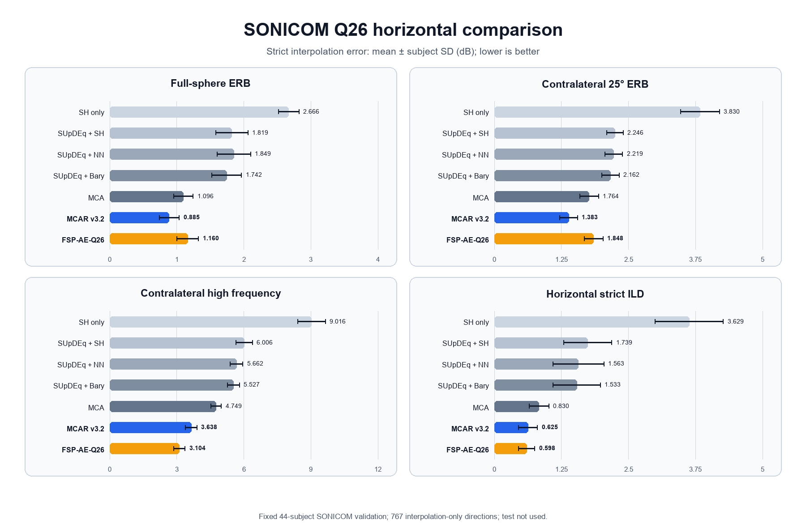
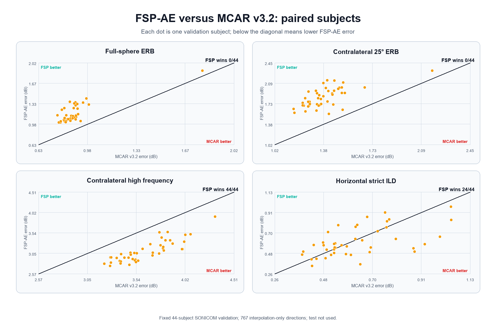

# SONICOM FSP-AE-Q26 正式 validation 结果

本目录保存 FSP-AE-Q26 adaptation 在固定 44 名 SONICOM validation 被试上的精选结果。
模型选择、推理和严格评价均未读取 test；`prediction_summary.json` 与
`training_summary.json` 中的 test 读取数均为 0。

## 锁定模型

- 配置：`configs/experiments/sonicom_fsp_ae_q26_formal_budget.json`
- checkpoint：`artifacts/training/sonicom_fsp_ae_q26_formal_budget_40/best.pt`（Git 忽略）
- 最佳 epoch：40
- validation LSD / ITD L1 / 复合损失：`2.994123 dB / 1.304956e-5 s / 3.026746`
- 训练用时：`972.423 s`；峰值 CUDA allocated memory：`526.671 MiB`

## 严格指标

均值 ± 被试标准差，单位均为 dB，越低越好：

| 方法 | 全空间 ERB | 对侧 25° ERB | 对侧高频 | 水平面严格 ILD |
|---|---:|---:|---:|---:|
| MCA | 1.096 ± 0.145 | 1.764 ± 0.177 | 4.749 ± 0.234 | 0.830 ± 0.181 |
| MCAR v3.2 | 0.885 ± 0.149 | 1.383 ± 0.165 | 3.638 ± 0.257 | 0.625 ± 0.175 |
| FSP-AE-Q26 | 1.160 ± 0.162 | 1.848 ± 0.175 | 3.104 ± 0.254 | 0.598 ± 0.153 |

FSP-AE 相对 MCA 的四项变化为 `-5.89% / -4.79% / +34.65% / +27.99%`；
相对 MCAR v3.2 为 `-31.16% / -33.60% / +14.68% / +4.37%`。逐被试相对
MCAR 的胜出数依次为 `0/44 / 0/44 / 44/44 / 24/44`。因此它不是 MCAR 的
全面替代，但为对侧高频与水平面 ILD 提供了有价值的互补横向基线。

## 直观对比图

七方法均值 ± 被试标准差：

FSP-AE 与 MCAR v3.2 的 44 人逐被试配对散点：

FSP-AE 相对 MCA/MCAR 的改善与回退：

## 文件

- `aggregate_metrics.csv`：方法 × 指标聚合结果
- `per_subject_metrics.csv`：44 人逐被试宽表
- `metric_long.csv`：长表
- `paper_comparison.csv`：可直接整理为论文表的均值与标准差
- `quality_checks.csv`：频率网格、参考 ILD 和纯插值方向检查
- `training_history.json` / `training_summary.json`：40 epoch 预算轨迹与训练摘要
- `prediction_summary.json`：44 人预测摘要
- `summary.json`：严格评价完整摘要
- `figures/`：三张高分辨率横向对比图及数据校验清单
